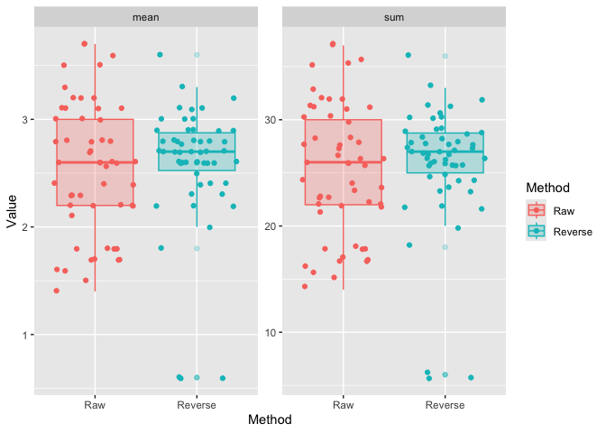
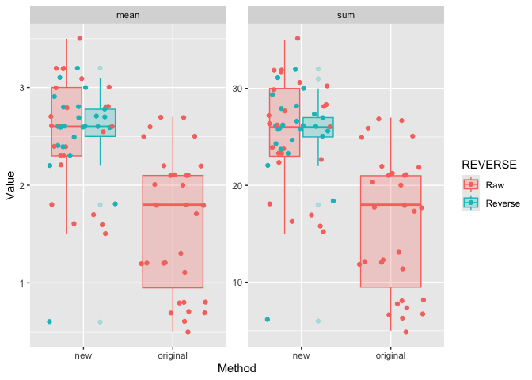

\_0_ccmhc_data_review_from_rfiles
================
2026-08-24

# 1. Setup & Data Ingestion

## 1.1 Libraries

``` r
library(dplyr)       # Data manipulation
library(stringr)     # String manipulation
library(tidyr)       # Data pivoting
library(readr)       # Reading data
library(kableExtra)  # HTML Table formatting
library(ggplot2)     # Visualizations
library(ggpubr)      # Publication-ready plots
library(rstatix)     # T-tests and effect sizes
library(broom)       # Tidy statistical outputs
library(forcats)     # Factor manipulation
library(effectsize)  # effect size & omega squared
```

## 1.2 Load Data

### 1.2.0 !! Updated Data File:

- **UPDATED DATA FILE** - SEFF_Updated…
  - Both Surveys are connected to a single participant ID (Pre and Post)
    and collated in one spreadsheet
  - Will separate each into its own table, for clarity/checks and file
    write out.
  - Rejoin and save data files for analysis scripts.
- **Structure**
  - Study_ID (Joined ID across pre and post, unique to participant)
  - Group Assignment (Control or Intervention)
  - Stress Scale: **PSS** - *Perceived Stress Scale* - 10 Questions
  - SEFF Scale: **EFF** - *Eearly Intervention Parent Self Efficacy* -
    14 Questions
  - Columns as Pre –\> Post

# NEW FILES FROM R CHECK

``` r
## raw_data in CSV format... means we get the numbers (and also some added data - rather than LABELS (strongly agree etc...))
# read RAWS
control.csv <- readr::read_csv("../_data/CONTROLPostMeasuresA_DATA_2026-08-24_1126.csv", col_names = TRUE)
pre.csv <- readr::read_csv("../_data/FamilyInfoAndPreMeas_DATA_2026-08-24_1122.csv", col_names = TRUE)
post.csv <- readr::read_csv("../_data/PostMeasuresAndSatis_DATA_2026-08-24_1123.csv", col_names = TRUE)
```

``` r
control.csv %>% 
  kable(caption="Raw Data: Control Group") %>% 
  kable_styling(bootstrap_options = c("striped", "hover"), full_width = F) %>%
  scroll_box(height = "400px", width = "100%")
```

<div style="border: 1px solid #ddd; padding: 0px; overflow-y: scroll; height:400px; overflow-x: scroll; width:100%; ">

<table class="table table-striped table-hover" style="color: black; width: auto !important; margin-left: auto; margin-right: auto;">

<caption>

Raw Data: Control Group
</caption>

<thead>

<tr>

<th style="text-align:right;position: sticky; top:0; background-color: #FFFFFF;">

record_id
</th>

<th style="text-align:left;position: sticky; top:0; background-color: #FFFFFF;">

redcap_survey_identifier
</th>

<th style="text-align:left;position: sticky; top:0; background-color: #FFFFFF;">

form_1_timestamp
</th>

<th style="text-align:right;position: sticky; top:0; background-color: #FFFFFF;">

participant_number
</th>

<th style="text-align:right;position: sticky; top:0; background-color: #FFFFFF;">

post_upset
</th>

<th style="text-align:right;position: sticky; top:0; background-color: #FFFFFF;">

post_control
</th>

<th style="text-align:right;position: sticky; top:0; background-color: #FFFFFF;">

post_stress
</th>

<th style="text-align:right;position: sticky; top:0; background-color: #FFFFFF;">

post_personal_problems
</th>

<th style="text-align:right;position: sticky; top:0; background-color: #FFFFFF;">

post_going_your_way
</th>

<th style="text-align:right;position: sticky; top:0; background-color: #FFFFFF;">

post_cope
</th>

<th style="text-align:right;position: sticky; top:0; background-color: #FFFFFF;">

post_irritation
</th>

<th style="text-align:right;position: sticky; top:0; background-color: #FFFFFF;">

post_on_top_of_things
</th>

<th style="text-align:right;position: sticky; top:0; background-color: #FFFFFF;">

post_anger
</th>

<th style="text-align:right;position: sticky; top:0; background-color: #FFFFFF;">

post_piling_up
</th>

<th style="text-align:right;position: sticky; top:0; background-color: #FFFFFF;">

child_problems
</th>

<th style="text-align:right;position: sticky; top:0; background-color: #FFFFFF;">

difference
</th>

<th style="text-align:right;position: sticky; top:0; background-color: #FFFFFF;">

therapists
</th>

<th style="text-align:right;position: sticky; top:0; background-color: #FFFFFF;">

difference_3
</th>

<th style="text-align:right;position: sticky; top:0; background-color: #FFFFFF;">

difference_4
</th>

<th style="text-align:right;position: sticky; top:0; background-color: #FFFFFF;">

difference_5
</th>

<th style="text-align:right;position: sticky; top:0; background-color: #FFFFFF;">

difference_6
</th>

<th style="text-align:right;position: sticky; top:0; background-color: #FFFFFF;">

difference_7
</th>

<th style="text-align:right;position: sticky; top:0; background-color: #FFFFFF;">

difference_8
</th>

<th style="text-align:right;position: sticky; top:0; background-color: #FFFFFF;">

difference_9
</th>

<th style="text-align:right;position: sticky; top:0; background-color: #FFFFFF;">

difference_10
</th>

<th style="text-align:right;position: sticky; top:0; background-color: #FFFFFF;">

difference_11
</th>

<th style="text-align:right;position: sticky; top:0; background-color: #FFFFFF;">

difference_12
</th>

<th style="text-align:right;position: sticky; top:0; background-color: #FFFFFF;">

difference_13
</th>

<th style="text-align:right;position: sticky; top:0; background-color: #FFFFFF;">

difference_14
</th>

<th style="text-align:right;position: sticky; top:0; background-color: #FFFFFF;">

difference_15
</th>

<th style="text-align:right;position: sticky; top:0; background-color: #FFFFFF;">

medical_appts
</th>

<th style="text-align:right;position: sticky; top:0; background-color: #FFFFFF;">

medical_appts_2
</th>

<th style="text-align:right;position: sticky; top:0; background-color: #FFFFFF;">

medical_appts_3
</th>

<th style="text-align:right;position: sticky; top:0; background-color: #FFFFFF;">

medical_appts_4
</th>

<th style="text-align:right;position: sticky; top:0; background-color: #FFFFFF;">

medical_appts_5
</th>

<th style="text-align:right;position: sticky; top:0; background-color: #FFFFFF;">

medical_appts_6
</th>

<th style="text-align:right;position: sticky; top:0; background-color: #FFFFFF;">

medical_appts_7
</th>

<th style="text-align:right;position: sticky; top:0; background-color: #FFFFFF;">

medical_appts_8
</th>

<th style="text-align:right;position: sticky; top:0; background-color: #FFFFFF;">

medical_appts_9
</th>

<th style="text-align:right;position: sticky; top:0; background-color: #FFFFFF;">

medical_appts_10
</th>

<th style="text-align:right;position: sticky; top:0; background-color: #FFFFFF;">

medical_appts_11
</th>

<th style="text-align:right;position: sticky; top:0; background-color: #FFFFFF;">

medical_appts_12
</th>

<th style="text-align:right;position: sticky; top:0; background-color: #FFFFFF;">

medical_appts_13
</th>

<th style="text-align:right;position: sticky; top:0; background-color: #FFFFFF;">

medical_appts_14
</th>

<th style="text-align:right;position: sticky; top:0; background-color: #FFFFFF;">

medical_appts_15
</th>

<th style="text-align:right;position: sticky; top:0; background-color: #FFFFFF;">

medical_appts_16
</th>

<th style="text-align:right;position: sticky; top:0; background-color: #FFFFFF;">

medical_appts_17
</th>

<th style="text-align:right;position: sticky; top:0; background-color: #FFFFFF;">

medical_appts_18
</th>

<th style="text-align:right;position: sticky; top:0; background-color: #FFFFFF;">

medical_appts_19
</th>

<th style="text-align:right;position: sticky; top:0; background-color: #FFFFFF;">

medical_appts_20
</th>

<th style="text-align:right;position: sticky; top:0; background-color: #FFFFFF;">

medical_appts_21
</th>

<th style="text-align:right;position: sticky; top:0; background-color: #FFFFFF;">

medical_appts_22
</th>

<th style="text-align:right;position: sticky; top:0; background-color: #FFFFFF;">

medical_appts_23
</th>

<th style="text-align:right;position: sticky; top:0; background-color: #FFFFFF;">

medical_appts_24
</th>

<th style="text-align:right;position: sticky; top:0; background-color: #FFFFFF;">

medical_appts_25
</th>

<th style="text-align:right;position: sticky; top:0; background-color: #FFFFFF;">

medical_appts_26
</th>

<th style="text-align:right;position: sticky; top:0; background-color: #FFFFFF;">

medical_appts_28
</th>

<th style="text-align:right;position: sticky; top:0; background-color: #FFFFFF;">

talk_to
</th>

<th style="text-align:right;position: sticky; top:0; background-color: #FFFFFF;">

talk_to_2
</th>

<th style="text-align:right;position: sticky; top:0; background-color: #FFFFFF;">

talk_to_3
</th>

<th style="text-align:right;position: sticky; top:0; background-color: #FFFFFF;">

talk_to_4
</th>

<th style="text-align:right;position: sticky; top:0; background-color: #FFFFFF;">

talk_to_5
</th>

<th style="text-align:right;position: sticky; top:0; background-color: #FFFFFF;">

talk_to_6
</th>

<th style="text-align:right;position: sticky; top:0; background-color: #FFFFFF;">

talk_to_7
</th>

<th style="text-align:right;position: sticky; top:0; background-color: #FFFFFF;">

talk_to_8
</th>

<th style="text-align:right;position: sticky; top:0; background-color: #FFFFFF;">

talk_to_9
</th>

<th style="text-align:right;position: sticky; top:0; background-color: #FFFFFF;">

talk_to_10
</th>

<th style="text-align:left;position: sticky; top:0; background-color: #FFFFFF;">

best_part
</th>

<th style="text-align:left;position: sticky; top:0; background-color: #FFFFFF;">

best_part_2
</th>

<th style="text-align:right;position: sticky; top:0; background-color: #FFFFFF;">

form_1_complete
</th>

</tr>

</thead>

<tbody>

<tr>

<td style="text-align:right;">

1
</td>

<td style="text-align:left;">

NA
</td>

<td style="text-align:left;">

2025-12-16 10:28:59
</td>

<td style="text-align:right;">

60
</td>

<td style="text-align:right;">

3
</td>

<td style="text-align:right;">

3
</td>

<td style="text-align:right;">

3
</td>

<td style="text-align:right;">

3
</td>

<td style="text-align:right;">

4
</td>

<td style="text-align:right;">

4
</td>

<td style="text-align:right;">

3
</td>

<td style="text-align:right;">

4
</td>

<td style="text-align:right;">

3
</td>

<td style="text-align:right;">

2
</td>

<td style="text-align:right;">

7
</td>

<td style="text-align:right;">

7
</td>

<td style="text-align:right;">

3
</td>

<td style="text-align:right;">

2
</td>

<td style="text-align:right;">

6
</td>

<td style="text-align:right;">

2
</td>

<td style="text-align:right;">

7
</td>

<td style="text-align:right;">

3
</td>

<td style="text-align:right;">

7
</td>

<td style="text-align:right;">

5
</td>

<td style="text-align:right;">

7
</td>

<td style="text-align:right;">

2
</td>

<td style="text-align:right;">

1
</td>

<td style="text-align:right;">

7
</td>

<td style="text-align:right;">

1
</td>

<td style="text-align:right;">

4
</td>

<td style="text-align:right;">

1
</td>

<td style="text-align:right;">

1
</td>

<td style="text-align:right;">

2
</td>

<td style="text-align:right;">

2
</td>

<td style="text-align:right;">

2
</td>

<td style="text-align:right;">

4
</td>

<td style="text-align:right;">

4
</td>

<td style="text-align:right;">

4
</td>

<td style="text-align:right;">

3
</td>

<td style="text-align:right;">

1
</td>

<td style="text-align:right;">

1
</td>

<td style="text-align:right;">

4
</td>

<td style="text-align:right;">

1
</td>

<td style="text-align:right;">

1
</td>

<td style="text-align:right;">

1
</td>

<td style="text-align:right;">

1
</td>

<td style="text-align:right;">

1
</td>

<td style="text-align:right;">

1
</td>

<td style="text-align:right;">

1
</td>

<td style="text-align:right;">

1
</td>

<td style="text-align:right;">

1
</td>

<td style="text-align:right;">

1
</td>

<td style="text-align:right;">

1
</td>

<td style="text-align:right;">

1
</td>

<td style="text-align:right;">

1
</td>

<td style="text-align:right;">

NA
</td>

<td style="text-align:right;">

2
</td>

<td style="text-align:right;">

5
</td>

<td style="text-align:right;">

5
</td>

<td style="text-align:right;">

5
</td>

<td style="text-align:right;">

4
</td>

<td style="text-align:right;">

5
</td>

<td style="text-align:right;">

5
</td>

<td style="text-align:right;">

5
</td>

<td style="text-align:right;">

5
</td>

<td style="text-align:right;">

1
</td>

<td style="text-align:right;">

1
</td>

<td style="text-align:left;">

Just giving me options and ways to help my son.
</td>

<td style="text-align:left;">

N/A
</td>

<td style="text-align:right;">

2
</td>

</tr>

<tr>

<td style="text-align:right;">

2
</td>

<td style="text-align:left;">

NA
</td>

<td style="text-align:left;">

2025-12-16 10:34:17
</td>

<td style="text-align:right;">

13
</td>

<td style="text-align:right;">

3
</td>

<td style="text-align:right;">

2
</td>

<td style="text-align:right;">

1
</td>

<td style="text-align:right;">

5
</td>

<td style="text-align:right;">

4
</td>

<td style="text-align:right;">

2
</td>

<td style="text-align:right;">

4
</td>

<td style="text-align:right;">

5
</td>

<td style="text-align:right;">

3
</td>

<td style="text-align:right;">

2
</td>

<td style="text-align:right;">

7
</td>

<td style="text-align:right;">

7
</td>

<td style="text-align:right;">

1
</td>

<td style="text-align:right;">

7
</td>

<td style="text-align:right;">

2
</td>

<td style="text-align:right;">

5
</td>

<td style="text-align:right;">

6
</td>

<td style="text-align:right;">

1
</td>

<td style="text-align:right;">

4
</td>

<td style="text-align:right;">

2
</td>

<td style="text-align:right;">

7
</td>

<td style="text-align:right;">

1
</td>

<td style="text-align:right;">

1
</td>

<td style="text-align:right;">

7
</td>

<td style="text-align:right;">

2
</td>

<td style="text-align:right;">

4
</td>

<td style="text-align:right;">

2
</td>

<td style="text-align:right;">

4
</td>

<td style="text-align:right;">

3
</td>

<td style="text-align:right;">

2
</td>

<td style="text-align:right;">

1
</td>

<td style="text-align:right;">

1
</td>

<td style="text-align:right;">

2
</td>

<td style="text-align:right;">

1
</td>

<td style="text-align:right;">

1
</td>

<td style="text-align:right;">

1
</td>

<td style="text-align:right;">

1
</td>

<td style="text-align:right;">

2
</td>

<td style="text-align:right;">

3
</td>

<td style="text-align:right;">

2
</td>

<td style="text-align:right;">

2
</td>

<td style="text-align:right;">

1
</td>

<td style="text-align:right;">

1
</td>

<td style="text-align:right;">

3
</td>

<td style="text-align:right;">

2
</td>

<td style="text-align:right;">

2
</td>

<td style="text-align:right;">

2
</td>

<td style="text-align:right;">

2
</td>

<td style="text-align:right;">

2
</td>

<td style="text-align:right;">

1
</td>

<td style="text-align:right;">

1
</td>

<td style="text-align:right;">

1
</td>

<td style="text-align:right;">

1
</td>

<td style="text-align:right;">

5
</td>

<td style="text-align:right;">

5
</td>

<td style="text-align:right;">

5
</td>

<td style="text-align:right;">

3
</td>

<td style="text-align:right;">

4
</td>

<td style="text-align:right;">

5
</td>

<td style="text-align:right;">

5
</td>

<td style="text-align:right;">

5
</td>

<td style="text-align:right;">

3
</td>

<td style="text-align:right;">

4
</td>

<td style="text-align:left;">

Just being able to better understand what’s going on with my baby
</td>

<td style="text-align:left;">

N/A
</td>

<td style="text-align:right;">

2
</td>

</tr>

<tr>

<td style="text-align:right;">

3
</td>

<td style="text-align:left;">

NA
</td>

<td style="text-align:left;">

2025-12-16 10:34:56
</td>

<td style="text-align:right;">

12
</td>

<td style="text-align:right;">

4
</td>

<td style="text-align:right;">

3
</td>

<td style="text-align:right;">

3
</td>

<td style="text-align:right;">

3
</td>

<td style="text-align:right;">

3
</td>

<td style="text-align:right;">

3
</td>

<td style="text-align:right;">

3
</td>

<td style="text-align:right;">

3
</td>

<td style="text-align:right;">

3
</td>

<td style="text-align:right;">

3
</td>

<td style="text-align:right;">

6
</td>

<td style="text-align:right;">

6
</td>

<td style="text-align:right;">

5
</td>

<td style="text-align:right;">

6
</td>

<td style="text-align:right;">

5
</td>

<td style="text-align:right;">

6
</td>

<td style="text-align:right;">

6
</td>

<td style="text-align:right;">

6
</td>

<td style="text-align:right;">

6
</td>

<td style="text-align:right;">

6
</td>

<td style="text-align:right;">

6
</td>

<td style="text-align:right;">

4
</td>

<td style="text-align:right;">

2
</td>

<td style="text-align:right;">

5
</td>

<td style="text-align:right;">

3
</td>

<td style="text-align:right;">

4
</td>

<td style="text-align:right;">

5
</td>

<td style="text-align:right;">

5
</td>

<td style="text-align:right;">

5
</td>

<td style="text-align:right;">

5
</td>

<td style="text-align:right;">

5
</td>

<td style="text-align:right;">

5
</td>

<td style="text-align:right;">

5
</td>

<td style="text-align:right;">

5
</td>

<td style="text-align:right;">

5
</td>

<td style="text-align:right;">

5
</td>

<td style="text-align:right;">

5
</td>

<td style="text-align:right;">

5
</td>

<td style="text-align:right;">

5
</td>

<td style="text-align:right;">

5
</td>

<td style="text-align:right;">

5
</td>

<td style="text-align:right;">

5
</td>

<td style="text-align:right;">

5
</td>

<td style="text-align:right;">

5
</td>

<td style="text-align:right;">

5
</td>

<td style="text-align:right;">

5
</td>

<td style="text-align:right;">

5
</td>

<td style="text-align:right;">

5
</td>

<td style="text-align:right;">

5
</td>

<td style="text-align:right;">

5
</td>

<td style="text-align:right;">

5
</td>

<td style="text-align:right;">

5
</td>

<td style="text-align:right;">

5
</td>

<td style="text-align:right;">

6
</td>

<td style="text-align:right;">

6
</td>

<td style="text-align:right;">

6
</td>

<td style="text-align:right;">

6
</td>

<td style="text-align:right;">

6
</td>

<td style="text-align:right;">

6
</td>

<td style="text-align:right;">

6
</td>

<td style="text-align:right;">

6
</td>

<td style="text-align:right;">

6
</td>

<td style="text-align:right;">

6
</td>

<td style="text-align:left;">

N/A
</td>

<td style="text-align:left;">

Not sure
</td>

<td style="text-align:right;">

2
</td>

</tr>

<tr>

<td style="text-align:right;">

4
</td>

<td style="text-align:left;">

NA
</td>

<td style="text-align:left;">

2025-12-16 11:05:57
</td>

<td style="text-align:right;">

11
</td>

<td style="text-align:right;">

3
</td>

<td style="text-align:right;">

3
</td>

<td style="text-align:right;">

3
</td>

<td style="text-align:right;">

3
</td>

<td style="text-align:right;">

3
</td>

<td style="text-align:right;">

3
</td>

<td style="text-align:right;">

4
</td>

<td style="text-align:right;">

3
</td>

<td style="text-align:right;">

3
</td>

<td style="text-align:right;">

3
</td>

<td style="text-align:right;">

6
</td>

<td style="text-align:right;">

6
</td>

<td style="text-align:right;">

3
</td>

<td style="text-align:right;">

7
</td>

<td style="text-align:right;">

2
</td>

<td style="text-align:right;">

3
</td>

<td style="text-align:right;">

7
</td>

<td style="text-align:right;">

4
</td>

<td style="text-align:right;">

5
</td>

<td style="text-align:right;">

4
</td>

<td style="text-align:right;">

7
</td>

<td style="text-align:right;">

3
</td>

<td style="text-align:right;">

2
</td>

<td style="text-align:right;">

7
</td>

<td style="text-align:right;">

5
</td>

<td style="text-align:right;">

2
</td>

<td style="text-align:right;">

2
</td>

<td style="text-align:right;">

2
</td>

<td style="text-align:right;">

2
</td>

<td style="text-align:right;">

2
</td>

<td style="text-align:right;">

2
</td>

<td style="text-align:right;">

2
</td>

<td style="text-align:right;">

2
</td>

<td style="text-align:right;">

1
</td>

<td style="text-align:right;">

2
</td>

<td style="text-align:right;">

1
</td>

<td style="text-align:right;">

1
</td>

<td style="text-align:right;">

2
</td>

<td style="text-align:right;">

3
</td>

<td style="text-align:right;">

2
</td>

<td style="text-align:right;">

1
</td>

<td style="text-align:right;">

2
</td>

<td style="text-align:right;">

1
</td>

<td style="text-align:right;">

2
</td>

<td style="text-align:right;">

2
</td>

<td style="text-align:right;">

2
</td>

<td style="text-align:right;">

1
</td>

<td style="text-align:right;">

3
</td>

<td style="text-align:right;">

4
</td>

<td style="text-align:right;">

1
</td>

<td style="text-align:right;">

1
</td>

<td style="text-align:right;">

1
</td>

<td style="text-align:right;">

2
</td>

<td style="text-align:right;">

3
</td>

<td style="text-align:right;">

4
</td>

<td style="text-align:right;">

3
</td>

<td style="text-align:right;">

2
</td>

<td style="text-align:right;">

3
</td>

<td style="text-align:right;">

4
</td>

<td style="text-align:right;">

4
</td>

<td style="text-align:right;">

3
</td>

<td style="text-align:right;">

1
</td>

<td style="text-align:right;">

3
</td>

<td style="text-align:left;">

idk
</td>

<td style="text-align:left;">

idk
</td>

<td style="text-align:right;">

2
</td>

</tr>

<tr>

<td style="text-align:right;">

5
</td>

<td style="text-align:left;">

NA
</td>

<td style="text-align:left;">

2025-12-17 10:47:48
</td>

<td style="text-align:right;">

9
</td>

<td style="text-align:right;">

3
</td>

<td style="text-align:right;">

3
</td>

<td style="text-align:right;">

4
</td>

<td style="text-align:right;">

4
</td>

<td style="text-align:right;">

3
</td>

<td style="text-align:right;">

1
</td>

<td style="text-align:right;">

3
</td>

<td style="text-align:right;">

4
</td>

<td style="text-align:right;">

3
</td>

<td style="text-align:right;">

1
</td>

<td style="text-align:right;">

7
</td>

<td style="text-align:right;">

5
</td>

<td style="text-align:right;">

1
</td>

<td style="text-align:right;">

7
</td>

<td style="text-align:right;">

2
</td>

<td style="text-align:right;">

4
</td>

<td style="text-align:right;">

6
</td>

<td style="text-align:right;">

5
</td>

<td style="text-align:right;">

4
</td>

<td style="text-align:right;">

2
</td>

<td style="text-align:right;">

6
</td>

<td style="text-align:right;">

6
</td>

<td style="text-align:right;">

1
</td>

<td style="text-align:right;">

7
</td>

<td style="text-align:right;">

3
</td>

<td style="text-align:right;">

3
</td>

<td style="text-align:right;">

3
</td>

<td style="text-align:right;">

2
</td>

<td style="text-align:right;">

1
</td>

<td style="text-align:right;">

2
</td>

<td style="text-align:right;">

4
</td>

<td style="text-align:right;">

2
</td>

<td style="text-align:right;">

3
</td>

<td style="text-align:right;">

2
</td>

<td style="text-align:right;">

2
</td>

<td style="text-align:right;">

2
</td>

<td style="text-align:right;">

2
</td>

<td style="text-align:right;">

2
</td>

<td style="text-align:right;">

3
</td>

<td style="text-align:right;">

2
</td>

<td style="text-align:right;">

2
</td>

<td style="text-align:right;">

3
</td>

<td style="text-align:right;">

2
</td>

<td style="text-align:right;">

4
</td>

<td style="text-align:right;">

2
</td>

<td style="text-align:right;">

2
</td>

<td style="text-align:right;">

3
</td>

<td style="text-align:right;">

3
</td>

<td style="text-align:right;">

3
</td>

<td style="text-align:right;">

3
</td>

<td style="text-align:right;">

3
</td>

<td style="text-align:right;">

3
</td>

<td style="text-align:right;">

3
</td>

<td style="text-align:right;">

5
</td>

<td style="text-align:right;">

5
</td>

<td style="text-align:right;">

4
</td>

<td style="text-align:right;">

5
</td>

<td style="text-align:right;">

3
</td>

<td style="text-align:right;">

5
</td>

<td style="text-align:right;">

2
</td>

<td style="text-align:right;">

5
</td>

<td style="text-align:right;">

1
</td>

<td style="text-align:right;">

4
</td>

<td style="text-align:left;">

She was personable and acknowledged she ad a child with special needs so
she was relatable.
</td>

<td style="text-align:left;">

Nothing personal towards the family navigator but there is truly a gap
in services. I really wised I got more information on respite care.
</td>

<td style="text-align:right;">

2
</td>

</tr>

<tr>

<td style="text-align:right;">

6
</td>

<td style="text-align:left;">

NA
</td>

<td style="text-align:left;">

2025-12-27 18:37:18
</td>

<td style="text-align:right;">

NA
</td>

<td style="text-align:right;">

3
</td>

<td style="text-align:right;">

2
</td>

<td style="text-align:right;">

3
</td>

<td style="text-align:right;">

4
</td>

<td style="text-align:right;">

3
</td>

<td style="text-align:right;">

2
</td>

<td style="text-align:right;">

2
</td>

<td style="text-align:right;">

NA
</td>

<td style="text-align:right;">

2
</td>

<td style="text-align:right;">

2
</td>

<td style="text-align:right;">

6
</td>

<td style="text-align:right;">

6
</td>

<td style="text-align:right;">

1
</td>

<td style="text-align:right;">

7
</td>

<td style="text-align:right;">

7
</td>

<td style="text-align:right;">

1
</td>

<td style="text-align:right;">

7
</td>

<td style="text-align:right;">

6
</td>

<td style="text-align:right;">

6
</td>

<td style="text-align:right;">

2
</td>

<td style="text-align:right;">

7
</td>

<td style="text-align:right;">

5
</td>

<td style="text-align:right;">

2
</td>

<td style="text-align:right;">

7
</td>

<td style="text-align:right;">

4
</td>

<td style="text-align:right;">

1
</td>

<td style="text-align:right;">

1
</td>

<td style="text-align:right;">

1
</td>

<td style="text-align:right;">

1
</td>

<td style="text-align:right;">

5
</td>

<td style="text-align:right;">

5
</td>

<td style="text-align:right;">

5
</td>

<td style="text-align:right;">

5
</td>

<td style="text-align:right;">

5
</td>

<td style="text-align:right;">

5
</td>

<td style="text-align:right;">

5
</td>

<td style="text-align:right;">

5
</td>

<td style="text-align:right;">

5
</td>

<td style="text-align:right;">

5
</td>

<td style="text-align:right;">

5
</td>

<td style="text-align:right;">

5
</td>

<td style="text-align:right;">

5
</td>

<td style="text-align:right;">

5
</td>

<td style="text-align:right;">

5
</td>

<td style="text-align:right;">

5
</td>

<td style="text-align:right;">

5
</td>

<td style="text-align:right;">

5
</td>

<td style="text-align:right;">

5
</td>

<td style="text-align:right;">

5
</td>

<td style="text-align:right;">

5
</td>

<td style="text-align:right;">

5
</td>

<td style="text-align:right;">

5
</td>

<td style="text-align:right;">

5
</td>

<td style="text-align:right;">

6
</td>

<td style="text-align:right;">

6
</td>

<td style="text-align:right;">

6
</td>

<td style="text-align:right;">

6
</td>

<td style="text-align:right;">

6
</td>

<td style="text-align:right;">

6
</td>

<td style="text-align:right;">

6
</td>

<td style="text-align:right;">

6
</td>

<td style="text-align:right;">

6
</td>

<td style="text-align:right;">

6
</td>

<td style="text-align:left;">

NA
</td>

<td style="text-align:left;">

NA
</td>

<td style="text-align:right;">

2
</td>

</tr>

</tbody>

</table>

</div>

``` r
pre.csv %>% 
  kable(caption="Raw Data: Intervention - PRETEST") %>% 
  kable_styling(bootstrap_options = c("striped", "hover"), full_width = F) %>%
  scroll_box(height = "400px", width = "100%")
```

<div style="border: 1px solid #ddd; padding: 0px; overflow-y: scroll; height:400px; overflow-x: scroll; width:100%; ">

<table class="table table-striped table-hover" style="color: black; width: auto !important; margin-left: auto; margin-right: auto;">

<caption>

Raw Data: Intervention - PRETEST
</caption>

<thead>

<tr>

<th style="text-align:right;position: sticky; top:0; background-color: #FFFFFF;">

record_id
</th>

<th style="text-align:left;position: sticky; top:0; background-color: #FFFFFF;">

pre_perceived_stress_timestamp
</th>

<th style="text-align:right;position: sticky; top:0; background-color: #FFFFFF;">

promis_sc001
</th>

<th style="text-align:right;position: sticky; top:0; background-color: #FFFFFF;">

promis_sc002
</th>

<th style="text-align:right;position: sticky; top:0; background-color: #FFFFFF;">

promis_sc003
</th>

<th style="text-align:right;position: sticky; top:0; background-color: #FFFFFF;">

promis_sc006_r
</th>

<th style="text-align:right;position: sticky; top:0; background-color: #FFFFFF;">

promis_sc007_r
</th>

<th style="text-align:right;position: sticky; top:0; background-color: #FFFFFF;">

promis_sc008
</th>

<th style="text-align:right;position: sticky; top:0; background-color: #FFFFFF;">

promis_sc009_r
</th>

<th style="text-align:right;position: sticky; top:0; background-color: #FFFFFF;">

promis_sc010_r
</th>

<th style="text-align:right;position: sticky; top:0; background-color: #FFFFFF;">

promis_sc011
</th>

<th style="text-align:right;position: sticky; top:0; background-color: #FFFFFF;">

promis_sc014
</th>

<th style="text-align:right;position: sticky; top:0; background-color: #FFFFFF;">

pre_perceived_stress_complete
</th>

<th style="text-align:left;position: sticky; top:0; background-color: #FFFFFF;">

pre_parent_self_efficacy_timestamp
</th>

<th style="text-align:right;position: sticky; top:0; background-color: #FFFFFF;">

sickchild
</th>

<th style="text-align:right;position: sticky; top:0; background-color: #FFFFFF;">

improvement
</th>

<th style="text-align:right;position: sticky; top:0; background-color: #FFFFFF;">

development
</th>

<th style="text-align:right;position: sticky; top:0; background-color: #FFFFFF;">

difficulty
</th>

<th style="text-align:right;position: sticky; top:0; background-color: #FFFFFF;">

progress
</th>

<th style="text-align:right;position: sticky; top:0; background-color: #FFFFFF;">

confidence
</th>

<th style="text-align:right;position: sticky; top:0; background-color: #FFFFFF;">

confidence_2
</th>

<th style="text-align:right;position: sticky; top:0; background-color: #FFFFFF;">

confidence_3
</th>

<th style="text-align:right;position: sticky; top:0; background-color: #FFFFFF;">

confidence_4
</th>

<th style="text-align:right;position: sticky; top:0; background-color: #FFFFFF;">

confidence_5
</th>

<th style="text-align:right;position: sticky; top:0; background-color: #FFFFFF;">

confidence_6
</th>

<th style="text-align:right;position: sticky; top:0; background-color: #FFFFFF;">

confidence_7
</th>

<th style="text-align:right;position: sticky; top:0; background-color: #FFFFFF;">

confidence_8
</th>

<th style="text-align:right;position: sticky; top:0; background-color: #FFFFFF;">

confidence_9
</th>

<th style="text-align:right;position: sticky; top:0; background-color: #FFFFFF;">

confidence_10
</th>

<th style="text-align:right;position: sticky; top:0; background-color: #FFFFFF;">

confidence_11
</th>

<th style="text-align:right;position: sticky; top:0; background-color: #FFFFFF;">

pre_parent_self_efficacy_complete
</th>

<th style="text-align:left;position: sticky; top:0; background-color: #FFFFFF;">

family_info_timestamp
</th>

<th style="text-align:right;position: sticky; top:0; background-color: #FFFFFF;">

caregiverrelation
</th>

<th style="text-align:left;position: sticky; top:0; background-color: #FFFFFF;">

otherrelation
</th>

<th style="text-align:right;position: sticky; top:0; background-color: #FFFFFF;">

ei
</th>

<th style="text-align:right;position: sticky; top:0; background-color: #FFFFFF;">

privatetherapy\_\_\_1
</th>

<th style="text-align:right;position: sticky; top:0; background-color: #FFFFFF;">

privatetherapy\_\_\_2
</th>

<th style="text-align:right;position: sticky; top:0; background-color: #FFFFFF;">

privatetherapy\_\_\_3
</th>

<th style="text-align:right;position: sticky; top:0; background-color: #FFFFFF;">

privatetherapy\_\_\_4
</th>

<th style="text-align:right;position: sticky; top:0; background-color: #FFFFFF;">

privatetherapy\_\_\_5
</th>

<th style="text-align:right;position: sticky; top:0; background-color: #FFFFFF;">

privatetherapy\_\_\_6
</th>

<th style="text-align:right;position: sticky; top:0; background-color: #FFFFFF;">

privatetherapy\_\_\_7
</th>

<th style="text-align:right;position: sticky; top:0; background-color: #FFFFFF;">

privatetherapy\_\_\_8
</th>

<th style="text-align:right;position: sticky; top:0; background-color: #FFFFFF;">

privatetherapy\_\_\_9
</th>

<th style="text-align:right;position: sticky; top:0; background-color: #FFFFFF;">

privatetherapy\_\_\_10
</th>

<th style="text-align:right;position: sticky; top:0; background-color: #FFFFFF;">

privatetherapy\_\_\_11
</th>

<th style="text-align:left;position: sticky; top:0; background-color: #FFFFFF;">

othertherapy
</th>

<th style="text-align:right;position: sticky; top:0; background-color: #FFFFFF;">

caregivers
</th>

<th style="text-align:right;position: sticky; top:0; background-color: #FFFFFF;">

children
</th>

<th style="text-align:right;position: sticky; top:0; background-color: #FFFFFF;">

autismdx
</th>

<th style="text-align:right;position: sticky; top:0; background-color: #FFFFFF;">

diagnosislocation
</th>

<th style="text-align:left;position: sticky; top:0; background-color: #FFFFFF;">

othertherapy_2
</th>

<th style="text-align:right;position: sticky; top:0; background-color: #FFFFFF;">

family_info_complete
</th>

</tr>

</thead>

<tbody>

<tr>

<td style="text-align:right;">

7
</td>

<td style="text-align:left;">

2024-12-20 11:50:37
</td>

<td style="text-align:right;">

3
</td>

<td style="text-align:right;">

3
</td>

<td style="text-align:right;">

3
</td>

<td style="text-align:right;">

2
</td>

<td style="text-align:right;">

2
</td>

<td style="text-align:right;">

2
</td>

<td style="text-align:right;">

2
</td>

<td style="text-align:right;">

2
</td>

<td style="text-align:right;">

2
</td>

<td style="text-align:right;">

2
</td>

<td style="text-align:right;">

2
</td>

<td style="text-align:left;">

2024-12-20 11:54:42
</td>

<td style="text-align:right;">

NA
</td>

<td style="text-align:right;">

1
</td>

<td style="text-align:right;">

NA
</td>

<td style="text-align:right;">

NA
</td>

<td style="text-align:right;">

6
</td>

<td style="text-align:right;">

6
</td>

<td style="text-align:right;">

NA
</td>

<td style="text-align:right;">

NA
</td>

<td style="text-align:right;">

NA
</td>

<td style="text-align:right;">

NA
</td>

<td style="text-align:right;">

NA
</td>

<td style="text-align:right;">

NA
</td>

<td style="text-align:right;">

NA
</td>

<td style="text-align:right;">

NA
</td>

<td style="text-align:right;">

NA
</td>

<td style="text-align:right;">

NA
</td>

<td style="text-align:right;">

2
</td>

<td style="text-align:left;">

2024-12-20 11:55:57
</td>

<td style="text-align:right;">

1
</td>

<td style="text-align:left;">

NA
</td>

<td style="text-align:right;">

2
</td>

<td style="text-align:right;">

1
</td>

<td style="text-align:right;">

0
</td>

<td style="text-align:right;">

0
</td>

<td style="text-align:right;">

1
</td>

<td style="text-align:right;">

0
</td>

<td style="text-align:right;">

0
</td>

<td style="text-align:right;">

0
</td>

<td style="text-align:right;">

0
</td>

<td style="text-align:right;">

0
</td>

<td style="text-align:right;">

0
</td>

<td style="text-align:right;">

0
</td>

<td style="text-align:left;">

NA
</td>

<td style="text-align:right;">

2
</td>

<td style="text-align:right;">

2
</td>

<td style="text-align:right;">

1
</td>

<td style="text-align:right;">

1
</td>

<td style="text-align:left;">

NA
</td>

<td style="text-align:right;">

2
</td>

</tr>

<tr>

<td style="text-align:right;">

9
</td>

<td style="text-align:left;">

2024-12-20 14:48:02
</td>

<td style="text-align:right;">

3
</td>

<td style="text-align:right;">

3
</td>

<td style="text-align:right;">

4
</td>

<td style="text-align:right;">

3
</td>

<td style="text-align:right;">

3
</td>

<td style="text-align:right;">

3
</td>

<td style="text-align:right;">

4
</td>

<td style="text-align:right;">

3
</td>

<td style="text-align:right;">

3
</td>

<td style="text-align:right;">

3
</td>

<td style="text-align:right;">

2
</td>

<td style="text-align:left;">

2024-12-20 14:50:07
</td>

<td style="text-align:right;">

NA
</td>

<td style="text-align:right;">

7
</td>

<td style="text-align:right;">

NA
</td>

<td style="text-align:right;">

NA
</td>

<td style="text-align:right;">

6
</td>

<td style="text-align:right;">

5
</td>

<td style="text-align:right;">

NA
</td>

<td style="text-align:right;">

NA
</td>

<td style="text-align:right;">

NA
</td>

<td style="text-align:right;">

NA
</td>

<td style="text-align:right;">

NA
</td>

<td style="text-align:right;">

NA
</td>

<td style="text-align:right;">

NA
</td>

<td style="text-align:right;">

NA
</td>

<td style="text-align:right;">

NA
</td>

<td style="text-align:right;">

NA
</td>

<td style="text-align:right;">

2
</td>

<td style="text-align:left;">

2024-12-20 14:51:14
</td>

<td style="text-align:right;">

1
</td>

<td style="text-align:left;">

NA
</td>

<td style="text-align:right;">

1
</td>

<td style="text-align:right;">

1
</td>

<td style="text-align:right;">

1
</td>

<td style="text-align:right;">

0
</td>

<td style="text-align:right;">

1
</td>

<td style="text-align:right;">

0
</td>

<td style="text-align:right;">

0
</td>

<td style="text-align:right;">

0
</td>

<td style="text-align:right;">

0
</td>

<td style="text-align:right;">

0
</td>

<td style="text-align:right;">

0
</td>

<td style="text-align:right;">

0
</td>

<td style="text-align:left;">

NA
</td>

<td style="text-align:right;">

1
</td>

<td style="text-align:right;">

2
</td>

<td style="text-align:right;">

1
</td>

<td style="text-align:right;">

1
</td>

<td style="text-align:left;">

NA
</td>

<td style="text-align:right;">

2
</td>

</tr>

<tr>

<td style="text-align:right;">

10
</td>

<td style="text-align:left;">

2024-12-20 16:53:55
</td>

<td style="text-align:right;">

3
</td>

<td style="text-align:right;">

3
</td>

<td style="text-align:right;">

3
</td>

<td style="text-align:right;">

2
</td>

<td style="text-align:right;">

3
</td>

<td style="text-align:right;">

4
</td>

<td style="text-align:right;">

2
</td>

<td style="text-align:right;">

2
</td>

<td style="text-align:right;">

4
</td>

<td style="text-align:right;">

4
</td>

<td style="text-align:right;">

2
</td>

<td style="text-align:left;">

2024-12-20 16:57:08
</td>

<td style="text-align:right;">

NA
</td>

<td style="text-align:right;">

7
</td>

<td style="text-align:right;">

NA
</td>

<td style="text-align:right;">

NA
</td>

<td style="text-align:right;">

4
</td>

<td style="text-align:right;">

2
</td>

<td style="text-align:right;">

NA
</td>

<td style="text-align:right;">

NA
</td>

<td style="text-align:right;">

NA
</td>

<td style="text-align:right;">

NA
</td>

<td style="text-align:right;">

NA
</td>

<td style="text-align:right;">

NA
</td>

<td style="text-align:right;">

NA
</td>

<td style="text-align:right;">

NA
</td>

<td style="text-align:right;">

NA
</td>

<td style="text-align:right;">

NA
</td>

<td style="text-align:right;">

2
</td>

<td style="text-align:left;">

2024-12-20 16:58:12
</td>

<td style="text-align:right;">

1
</td>

<td style="text-align:left;">

NA
</td>

<td style="text-align:right;">

1
</td>

<td style="text-align:right;">

1
</td>

<td style="text-align:right;">

1
</td>

<td style="text-align:right;">

0
</td>

<td style="text-align:right;">

0
</td>

<td style="text-align:right;">

0
</td>

<td style="text-align:right;">

0
</td>

<td style="text-align:right;">

0
</td>

<td style="text-align:right;">

0
</td>

<td style="text-align:right;">

0
</td>

<td style="text-align:right;">

0
</td>

<td style="text-align:right;">

0
</td>

<td style="text-align:left;">

NA
</td>

<td style="text-align:right;">

1
</td>

<td style="text-align:right;">

1
</td>

<td style="text-align:right;">

1
</td>

<td style="text-align:right;">

3
</td>

<td style="text-align:left;">

N/A
</td>

<td style="text-align:right;">

2
</td>

</tr>

<tr>

<td style="text-align:right;">

11
</td>

<td style="text-align:left;">

2025-01-02 12:43:00
</td>

<td style="text-align:right;">

3
</td>

<td style="text-align:right;">

4
</td>

<td style="text-align:right;">

5
</td>

<td style="text-align:right;">

2
</td>

<td style="text-align:right;">

3
</td>

<td style="text-align:right;">

3
</td>

<td style="text-align:right;">

3
</td>

<td style="text-align:right;">

2
</td>

<td style="text-align:right;">

3
</td>

<td style="text-align:right;">

3
</td>

<td style="text-align:right;">

2
</td>

<td style="text-align:left;">

2025-01-02 13:00:21
</td>

<td style="text-align:right;">

NA
</td>

<td style="text-align:right;">

6
</td>

<td style="text-align:right;">

NA
</td>

<td style="text-align:right;">

NA
</td>

<td style="text-align:right;">

1
</td>

<td style="text-align:right;">

2
</td>

<td style="text-align:right;">

NA
</td>

<td style="text-align:right;">

NA
</td>

<td style="text-align:right;">

NA
</td>

<td style="text-align:right;">

NA
</td>

<td style="text-align:right;">

NA
</td>

<td style="text-align:right;">

NA
</td>

<td style="text-align:right;">

NA
</td>

<td style="text-align:right;">

NA
</td>

<td style="text-align:right;">

NA
</td>

<td style="text-align:right;">

NA
</td>

<td style="text-align:right;">

2
</td>

<td style="text-align:left;">

2025-01-02 13:03:12
</td>

<td style="text-align:right;">

1
</td>

<td style="text-align:left;">

NA
</td>

<td style="text-align:right;">

2
</td>

<td style="text-align:right;">

1
</td>

<td style="text-align:right;">

1
</td>

<td style="text-align:right;">

0
</td>

<td style="text-align:right;">

0
</td>

<td style="text-align:right;">

0
</td>

<td style="text-align:right;">

0
</td>

<td style="text-align:right;">

0
</td>

<td style="text-align:right;">

0
</td>

<td style="text-align:right;">

0
</td>

<td style="text-align:right;">

0
</td>

<td style="text-align:right;">

1
</td>

<td style="text-align:left;">

Every Child Succeeds
</td>

<td style="text-align:right;">

0
</td>

<td style="text-align:right;">

2
</td>

<td style="text-align:right;">

2
</td>

<td style="text-align:right;">

1
</td>

<td style="text-align:left;">

NA
</td>

<td style="text-align:right;">

2
</td>

</tr>

<tr>

<td style="text-align:right;">

12
</td>

<td style="text-align:left;">

2025-01-23 21:47:37
</td>

<td style="text-align:right;">

3
</td>

<td style="text-align:right;">

1
</td>

<td style="text-align:right;">

3
</td>

<td style="text-align:right;">

2
</td>

<td style="text-align:right;">

2
</td>

<td style="text-align:right;">

1
</td>

<td style="text-align:right;">

2
</td>

<td style="text-align:right;">

2
</td>

<td style="text-align:right;">

3
</td>

<td style="text-align:right;">

3
</td>

<td style="text-align:right;">

2
</td>

<td style="text-align:left;">

2025-01-23 21:59:31
</td>

<td style="text-align:right;">

6
</td>

<td style="text-align:right;">

6
</td>

<td style="text-align:right;">

2
</td>

<td style="text-align:right;">

6
</td>

<td style="text-align:right;">

6
</td>

<td style="text-align:right;">

2
</td>

<td style="text-align:right;">

6
</td>

<td style="text-align:right;">

2
</td>

<td style="text-align:right;">

6
</td>

<td style="text-align:right;">

2
</td>

<td style="text-align:right;">

6
</td>

<td style="text-align:right;">

2
</td>

<td style="text-align:right;">

2
</td>

<td style="text-align:right;">

6
</td>

<td style="text-align:right;">

2
</td>

<td style="text-align:right;">

2
</td>

<td style="text-align:right;">

2
</td>

<td style="text-align:left;">

2025-01-23 22:01:58
</td>

<td style="text-align:right;">

3
</td>

<td style="text-align:left;">

NA
</td>

<td style="text-align:right;">

1
</td>

<td style="text-align:right;">

1
</td>

<td style="text-align:right;">

0
</td>

<td style="text-align:right;">

1
</td>

<td style="text-align:right;">

0
</td>

<td style="text-align:right;">

0
</td>

<td style="text-align:right;">

0
</td>

<td style="text-align:right;">

0
</td>

<td style="text-align:right;">

0
</td>

<td style="text-align:right;">

0
</td>

<td style="text-align:right;">

0
</td>

<td style="text-align:right;">

0
</td>

<td style="text-align:left;">

NA
</td>

<td style="text-align:right;">

1
</td>

<td style="text-align:right;">

1
</td>

<td style="text-align:right;">

1
</td>

<td style="text-align:right;">

1
</td>

<td style="text-align:left;">

NA
</td>

<td style="text-align:right;">

2
</td>

</tr>

<tr>

<td style="text-align:right;">

13
</td>

<td style="text-align:left;">

2025-01-24 12:32:43
</td>

<td style="text-align:right;">

3
</td>

<td style="text-align:right;">

2
</td>

<td style="text-align:right;">

3
</td>

<td style="text-align:right;">

2
</td>

<td style="text-align:right;">

3
</td>

<td style="text-align:right;">

2
</td>

<td style="text-align:right;">

2
</td>

<td style="text-align:right;">

3
</td>

<td style="text-align:right;">

1
</td>

<td style="text-align:right;">

2
</td>

<td style="text-align:right;">

2
</td>

<td style="text-align:left;">

2025-01-24 12:36:22
</td>

<td style="text-align:right;">

5
</td>

<td style="text-align:right;">

7
</td>

<td style="text-align:right;">

1
</td>

<td style="text-align:right;">

7
</td>

<td style="text-align:right;">

2
</td>

<td style="text-align:right;">

1
</td>

<td style="text-align:right;">

6
</td>

<td style="text-align:right;">

4
</td>

<td style="text-align:right;">

7
</td>

<td style="text-align:right;">

1
</td>

<td style="text-align:right;">

7
</td>

<td style="text-align:right;">

3
</td>

<td style="text-align:right;">

1
</td>

<td style="text-align:right;">

7
</td>

<td style="text-align:right;">

1
</td>

<td style="text-align:right;">

1
</td>

<td style="text-align:right;">

2
</td>

<td style="text-align:left;">

2025-01-24 12:37:17
</td>

<td style="text-align:right;">

1
</td>

<td style="text-align:left;">

NA
</td>

<td style="text-align:right;">

2
</td>

<td style="text-align:right;">

1
</td>

<td style="text-align:right;">

0
</td>

<td style="text-align:right;">

0
</td>

<td style="text-align:right;">

0
</td>

<td style="text-align:right;">

0
</td>

<td style="text-align:right;">

0
</td>

<td style="text-align:right;">

0
</td>

<td style="text-align:right;">

0
</td>

<td style="text-align:right;">

0
</td>

<td style="text-align:right;">

0
</td>

<td style="text-align:right;">

0
</td>

<td style="text-align:left;">

NA
</td>

<td style="text-align:right;">

2
</td>

<td style="text-align:right;">

1
</td>

<td style="text-align:right;">

1
</td>

<td style="text-align:right;">

1
</td>

<td style="text-align:left;">

NA
</td>

<td style="text-align:right;">

2
</td>

</tr>

<tr>

<td style="text-align:right;">

14
</td>

<td style="text-align:left;">

2025-01-24 14:20:11
</td>

<td style="text-align:right;">

3
</td>

<td style="text-align:right;">

2
</td>

<td style="text-align:right;">

3
</td>

<td style="text-align:right;">

3
</td>

<td style="text-align:right;">

4
</td>

<td style="text-align:right;">

3
</td>

<td style="text-align:right;">

2
</td>

<td style="text-align:right;">

3
</td>

<td style="text-align:right;">

2
</td>

<td style="text-align:right;">

3
</td>

<td style="text-align:right;">

2
</td>

<td style="text-align:left;">

2025-01-24 14:23:21
</td>

<td style="text-align:right;">

7
</td>

<td style="text-align:right;">

7
</td>

<td style="text-align:right;">

5
</td>

<td style="text-align:right;">

7
</td>

<td style="text-align:right;">

5
</td>

<td style="text-align:right;">

4
</td>

<td style="text-align:right;">

7
</td>

<td style="text-align:right;">

2
</td>

<td style="text-align:right;">

4
</td>

<td style="text-align:right;">

5
</td>

<td style="text-align:right;">

7
</td>

<td style="text-align:right;">

2
</td>

<td style="text-align:right;">

1
</td>

<td style="text-align:right;">

7
</td>

<td style="text-align:right;">

2
</td>

<td style="text-align:right;">

4
</td>

<td style="text-align:right;">

2
</td>

<td style="text-align:left;">

2025-01-24 14:24:19
</td>

<td style="text-align:right;">

1
</td>

<td style="text-align:left;">

NA
</td>

<td style="text-align:right;">

1
</td>

<td style="text-align:right;">

1
</td>

<td style="text-align:right;">

1
</td>

<td style="text-align:right;">

0
</td>

<td style="text-align:right;">

0
</td>

<td style="text-align:right;">

0
</td>

<td style="text-align:right;">

0
</td>

<td style="text-align:right;">

0
</td>

<td style="text-align:right;">

0
</td>

<td style="text-align:right;">

0
</td>

<td style="text-align:right;">

0
</td>

<td style="text-align:right;">

0
</td>

<td style="text-align:left;">

NA
</td>

<td style="text-align:right;">

0
</td>

<td style="text-align:right;">

1
</td>

<td style="text-align:right;">

1
</td>

<td style="text-align:right;">

1
</td>

<td style="text-align:left;">

NA
</td>

<td style="text-align:right;">

2
</td>

</tr>

<tr>

<td style="text-align:right;">

15
</td>

<td style="text-align:left;">

2025-01-24 14:24:13
</td>

<td style="text-align:right;">

3
</td>

<td style="text-align:right;">

3
</td>

<td style="text-align:right;">

4
</td>

<td style="text-align:right;">

3
</td>

<td style="text-align:right;">

3
</td>

<td style="text-align:right;">

3
</td>

<td style="text-align:right;">

3
</td>

<td style="text-align:right;">

3
</td>

<td style="text-align:right;">

3
</td>

<td style="text-align:right;">

3
</td>

<td style="text-align:right;">

2
</td>

<td style="text-align:left;">

2025-01-24 14:30:36
</td>

<td style="text-align:right;">

7
</td>

<td style="text-align:right;">

6
</td>

<td style="text-align:right;">

2
</td>

<td style="text-align:right;">

7
</td>

<td style="text-align:right;">

3
</td>

<td style="text-align:right;">

2
</td>

<td style="text-align:right;">

7
</td>

<td style="text-align:right;">

4
</td>

<td style="text-align:right;">

6
</td>

<td style="text-align:right;">

4
</td>

<td style="text-align:right;">

6
</td>

<td style="text-align:right;">

5
</td>

<td style="text-align:right;">

2
</td>

<td style="text-align:right;">

6
</td>

<td style="text-align:right;">

2
</td>

<td style="text-align:right;">

4
</td>

<td style="text-align:right;">

2
</td>

<td style="text-align:left;">

2025-01-24 14:31:17
</td>

<td style="text-align:right;">

1
</td>

<td style="text-align:left;">

NA
</td>

<td style="text-align:right;">

1
</td>

<td style="text-align:right;">

1
</td>

<td style="text-align:right;">

1
</td>

<td style="text-align:right;">

0
</td>

<td style="text-align:right;">

0
</td>

<td style="text-align:right;">

0
</td>

<td style="text-align:right;">

0
</td>

<td style="text-align:right;">

0
</td>

<td style="text-align:right;">

0
</td>

<td style="text-align:right;">

0
</td>

<td style="text-align:right;">

0
</td>

<td style="text-align:right;">

0
</td>

<td style="text-align:left;">

NA
</td>

<td style="text-align:right;">

2
</td>

<td style="text-align:right;">

1
</td>

<td style="text-align:right;">

1
</td>

<td style="text-align:right;">

NA
</td>

<td style="text-align:left;">

NA
</td>

<td style="text-align:right;">

2
</td>

</tr>

<tr>

<td style="text-align:right;">

16
</td>

<td style="text-align:left;">

2025-02-04 11:11:25
</td>

<td style="text-align:right;">

2
</td>

<td style="text-align:right;">

2
</td>

<td style="text-align:right;">

4
</td>

<td style="text-align:right;">

2
</td>

<td style="text-align:right;">

5
</td>

<td style="text-align:right;">

4
</td>

<td style="text-align:right;">

2
</td>

<td style="text-align:right;">

4
</td>

<td style="text-align:right;">

2
</td>

<td style="text-align:right;">

5
</td>

<td style="text-align:right;">

2
</td>

<td style="text-align:left;">

2025-02-04 11:13:18
</td>

<td style="text-align:right;">

6
</td>

<td style="text-align:right;">

6
</td>

<td style="text-align:right;">

4
</td>

<td style="text-align:right;">

5
</td>

<td style="text-align:right;">

4
</td>

<td style="text-align:right;">

3
</td>

<td style="text-align:right;">

6
</td>

<td style="text-align:right;">

3
</td>

<td style="text-align:right;">

5
</td>

<td style="text-align:right;">

2
</td>

<td style="text-align:right;">

3
</td>

<td style="text-align:right;">

6
</td>

<td style="text-align:right;">

6
</td>

<td style="text-align:right;">

2
</td>

<td style="text-align:right;">

7
</td>

<td style="text-align:right;">

3
</td>

<td style="text-align:right;">

2
</td>

<td style="text-align:left;">

2025-02-04 11:14:13
</td>

<td style="text-align:right;">

1
</td>

<td style="text-align:left;">

NA
</td>

<td style="text-align:right;">

1
</td>

<td style="text-align:right;">

0
</td>

<td style="text-align:right;">

0
</td>

<td style="text-align:right;">

0
</td>

<td style="text-align:right;">

1
</td>

<td style="text-align:right;">

0
</td>

<td style="text-align:right;">

0
</td>

<td style="text-align:right;">

0
</td>

<td style="text-align:right;">

0
</td>

<td style="text-align:right;">

0
</td>

<td style="text-align:right;">

0
</td>

<td style="text-align:right;">

0
</td>

<td style="text-align:left;">

NA
</td>

<td style="text-align:right;">

0
</td>

<td style="text-align:right;">

2
</td>

<td style="text-align:right;">

1
</td>

<td style="text-align:right;">

1
</td>

<td style="text-align:left;">

NA
</td>

<td style="text-align:right;">

2
</td>

</tr>

<tr>

<td style="text-align:right;">

17
</td>

<td style="text-align:left;">

2025-02-19 11:57:11
</td>

<td style="text-align:right;">

3
</td>

<td style="text-align:right;">

2
</td>

<td style="text-align:right;">

3
</td>

<td style="text-align:right;">

2
</td>

<td style="text-align:right;">

2
</td>

<td style="text-align:right;">

1
</td>

<td style="text-align:right;">

2
</td>

<td style="text-align:right;">

3
</td>

<td style="text-align:right;">

3
</td>

<td style="text-align:right;">

3
</td>

<td style="text-align:right;">

2
</td>

<td style="text-align:left;">

NA
</td>

<td style="text-align:right;">

NA
</td>

<td style="text-align:right;">

NA
</td>

<td style="text-align:right;">

NA
</td>

<td style="text-align:right;">

NA
</td>

<td style="text-align:right;">

NA
</td>

<td style="text-align:right;">

NA
</td>

<td style="text-align:right;">

NA
</td>

<td style="text-align:right;">

NA
</td>

<td style="text-align:right;">

NA
</td>

<td style="text-align:right;">

NA
</td>

<td style="text-align:right;">

NA
</td>

<td style="text-align:right;">

NA
</td>

<td style="text-align:right;">

NA
</td>

<td style="text-align:right;">

NA
</td>

<td style="text-align:right;">

NA
</td>

<td style="text-align:right;">

NA
</td>

<td style="text-align:right;">

0
</td>

<td style="text-align:left;">

NA
</td>

<td style="text-align:right;">

NA
</td>

<td style="text-align:left;">

NA
</td>

<td style="text-align:right;">

NA
</td>

<td style="text-align:right;">

0
</td>

<td style="text-align:right;">

0
</td>

<td style="text-align:right;">

0
</td>

<td style="text-align:right;">

0
</td>

<td style="text-align:right;">

0
</td>

<td style="text-align:right;">

0
</td>

<td style="text-align:right;">

0
</td>

<td style="text-align:right;">

0
</td>

<td style="text-align:right;">

0
</td>

<td style="text-align:right;">

0
</td>

<td style="text-align:right;">

0
</td>

<td style="text-align:left;">

NA
</td>

<td style="text-align:right;">

NA
</td>

<td style="text-align:right;">

NA
</td>

<td style="text-align:right;">

NA
</td>

<td style="text-align:right;">

NA
</td>

<td style="text-align:left;">

NA
</td>

<td style="text-align:right;">

0
</td>

</tr>

<tr>

<td style="text-align:right;">

18
</td>

<td style="text-align:left;">

2025-02-20 14:11:30
</td>

<td style="text-align:right;">

2
</td>

<td style="text-align:right;">

2
</td>

<td style="text-align:right;">

3
</td>

<td style="text-align:right;">

2
</td>

<td style="text-align:right;">

2
</td>

<td style="text-align:right;">

2
</td>

<td style="text-align:right;">

2
</td>

<td style="text-align:right;">

3
</td>

<td style="text-align:right;">

2
</td>

<td style="text-align:right;">

2
</td>

<td style="text-align:right;">

2
</td>

<td style="text-align:left;">

2025-02-20 14:15:26
</td>

<td style="text-align:right;">

7
</td>

<td style="text-align:right;">

6
</td>

<td style="text-align:right;">

1
</td>

<td style="text-align:right;">

7
</td>

<td style="text-align:right;">

4
</td>

<td style="text-align:right;">

6
</td>

<td style="text-align:right;">

7
</td>

<td style="text-align:right;">

3
</td>

<td style="text-align:right;">

4
</td>

<td style="text-align:right;">

4
</td>

<td style="text-align:right;">

7
</td>

<td style="text-align:right;">

5
</td>

<td style="text-align:right;">

2
</td>

<td style="text-align:right;">

6
</td>

<td style="text-align:right;">

2
</td>

<td style="text-align:right;">

2
</td>

<td style="text-align:right;">

2
</td>

<td style="text-align:left;">

2025-02-20 14:17:27
</td>

<td style="text-align:right;">

1
</td>

<td style="text-align:left;">

NA
</td>

<td style="text-align:right;">

1
</td>

<td style="text-align:right;">

0
</td>

<td style="text-align:right;">

0
</td>

<td style="text-align:right;">

0
</td>

<td style="text-align:right;">

0
</td>

<td style="text-align:right;">

0
</td>

<td style="text-align:right;">

1
</td>

<td style="text-align:right;">

1
</td>

<td style="text-align:right;">

1
</td>

<td style="text-align:right;">

0
</td>

<td style="text-align:right;">

0
</td>

<td style="text-align:right;">

0
</td>

<td style="text-align:left;">

NA
</td>

<td style="text-align:right;">

1
</td>

<td style="text-align:right;">

2
</td>

<td style="text-align:right;">

1
</td>

<td style="text-align:right;">

NA
</td>

<td style="text-align:left;">

NA
</td>

<td style="text-align:right;">

2
</td>

</tr>

<tr>

<td style="text-align:right;">

19
</td>

<td style="text-align:left;">

2025-02-21 10:05:14
</td>

<td style="text-align:right;">

3
</td>

<td style="text-align:right;">

3
</td>

<td style="text-align:right;">

3
</td>

<td style="text-align:right;">

1
</td>

<td style="text-align:right;">

2
</td>

<td style="text-align:right;">

2
</td>

<td style="text-align:right;">

1
</td>

<td style="text-align:right;">

1
</td>

<td style="text-align:right;">

2
</td>

<td style="text-align:right;">

3
</td>

<td style="text-align:right;">

2
</td>

<td style="text-align:left;">

2025-02-21 10:08:28
</td>

<td style="text-align:right;">

7
</td>

<td style="text-align:right;">

6
</td>

<td style="text-align:right;">

5
</td>

<td style="text-align:right;">

7
</td>

<td style="text-align:right;">

4
</td>

<td style="text-align:right;">

4
</td>

<td style="text-align:right;">

7
</td>

<td style="text-align:right;">

3
</td>

<td style="text-align:right;">

6
</td>

<td style="text-align:right;">

7
</td>

<td style="text-align:right;">

7
</td>

<td style="text-align:right;">

1
</td>

<td style="text-align:right;">

2
</td>

<td style="text-align:right;">

7
</td>

<td style="text-align:right;">

2
</td>

<td style="text-align:right;">

4
</td>

<td style="text-align:right;">

2
</td>

<td style="text-align:left;">

2025-02-21 10:09:26
</td>

<td style="text-align:right;">

1
</td>

<td style="text-align:left;">

NA
</td>

<td style="text-align:right;">

1
</td>

<td style="text-align:right;">

1
</td>

<td style="text-align:right;">

0
</td>

<td style="text-align:right;">

0
</td>

<td style="text-align:right;">

0
</td>

<td style="text-align:right;">

0
</td>

<td style="text-align:right;">

0
</td>

<td style="text-align:right;">

1
</td>

<td style="text-align:right;">

0
</td>

<td style="text-align:right;">

0
</td>

<td style="text-align:right;">

0
</td>

<td style="text-align:right;">

0
</td>

<td style="text-align:left;">

NA
</td>

<td style="text-align:right;">

2
</td>

<td style="text-align:right;">

1
</td>

<td style="text-align:right;">

1
</td>

<td style="text-align:right;">

NA
</td>

<td style="text-align:left;">

NA
</td>

<td style="text-align:right;">

2
</td>

</tr>

<tr>

<td style="text-align:right;">

20
</td>

<td style="text-align:left;">

2025-02-21 10:15:48
</td>

<td style="text-align:right;">

1
</td>

<td style="text-align:right;">

1
</td>

<td style="text-align:right;">

1
</td>

<td style="text-align:right;">

5
</td>

<td style="text-align:right;">

5
</td>

<td style="text-align:right;">

1
</td>

<td style="text-align:right;">

5
</td>

<td style="text-align:right;">

5
</td>

<td style="text-align:right;">

1
</td>

<td style="text-align:right;">

1
</td>

<td style="text-align:right;">

2
</td>

<td style="text-align:left;">

NA
</td>

<td style="text-align:right;">

NA
</td>

<td style="text-align:right;">

NA
</td>

<td style="text-align:right;">

NA
</td>

<td style="text-align:right;">

NA
</td>

<td style="text-align:right;">

NA
</td>

<td style="text-align:right;">

NA
</td>

<td style="text-align:right;">

NA
</td>

<td style="text-align:right;">

NA
</td>

<td style="text-align:right;">

NA
</td>

<td style="text-align:right;">

NA
</td>

<td style="text-align:right;">

NA
</td>

<td style="text-align:right;">

NA
</td>

<td style="text-align:right;">

NA
</td>

<td style="text-align:right;">

NA
</td>

<td style="text-align:right;">

NA
</td>

<td style="text-align:right;">

NA
</td>

<td style="text-align:right;">

0
</td>

<td style="text-align:left;">

NA
</td>

<td style="text-align:right;">

NA
</td>

<td style="text-align:left;">

NA
</td>

<td style="text-align:right;">

NA
</td>

<td style="text-align:right;">

0
</td>

<td style="text-align:right;">

0
</td>

<td style="text-align:right;">

0
</td>

<td style="text-align:right;">

0
</td>

<td style="text-align:right;">

0
</td>

<td style="text-align:right;">

0
</td>

<td style="text-align:right;">

0
</td>

<td style="text-align:right;">

0
</td>

<td style="text-align:right;">

0
</td>

<td style="text-align:right;">

0
</td>

<td style="text-align:right;">

0
</td>

<td style="text-align:left;">

NA
</td>

<td style="text-align:right;">

NA
</td>

<td style="text-align:right;">

NA
</td>

<td style="text-align:right;">

NA
</td>

<td style="text-align:right;">

NA
</td>

<td style="text-align:left;">

NA
</td>

<td style="text-align:right;">

0
</td>

</tr>

<tr>

<td style="text-align:right;">

21
</td>

<td style="text-align:left;">

2025-02-22 14:25:26
</td>

<td style="text-align:right;">

3
</td>

<td style="text-align:right;">

3
</td>

<td style="text-align:right;">

4
</td>

<td style="text-align:right;">

3
</td>

<td style="text-align:right;">

3
</td>

<td style="text-align:right;">

3
</td>

<td style="text-align:right;">

3
</td>

<td style="text-align:right;">

2
</td>

<td style="text-align:right;">

3
</td>

<td style="text-align:right;">

4
</td>

<td style="text-align:right;">

2
</td>

<td style="text-align:left;">

2025-02-22 14:28:44
</td>

<td style="text-align:right;">

5
</td>

<td style="text-align:right;">

6
</td>

<td style="text-align:right;">

2
</td>

<td style="text-align:right;">

5
</td>

<td style="text-align:right;">

2
</td>

<td style="text-align:right;">

4
</td>

<td style="text-align:right;">

7
</td>

<td style="text-align:right;">

5
</td>

<td style="text-align:right;">

4
</td>

<td style="text-align:right;">

3
</td>

<td style="text-align:right;">

6
</td>

<td style="text-align:right;">

3
</td>

<td style="text-align:right;">

2
</td>

<td style="text-align:right;">

7
</td>

<td style="text-align:right;">

3
</td>

<td style="text-align:right;">

3
</td>

<td style="text-align:right;">

2
</td>

<td style="text-align:left;">

2025-02-22 14:30:36
</td>

<td style="text-align:right;">

1
</td>

<td style="text-align:left;">

NA
</td>

<td style="text-align:right;">

2
</td>

<td style="text-align:right;">

0
</td>

<td style="text-align:right;">

0
</td>

<td style="text-align:right;">

0
</td>

<td style="text-align:right;">

0
</td>

<td style="text-align:right;">

0
</td>

<td style="text-align:right;">

1
</td>

<td style="text-align:right;">

1
</td>

<td style="text-align:right;">

1
</td>

<td style="text-align:right;">

0
</td>

<td style="text-align:right;">

0
</td>

<td style="text-align:right;">

0
</td>

<td style="text-align:left;">

NA
</td>

<td style="text-align:right;">

1
</td>

<td style="text-align:right;">

2
</td>

<td style="text-align:right;">

2
</td>

<td style="text-align:right;">

1
</td>

<td style="text-align:left;">

NA
</td>

<td style="text-align:right;">

2
</td>

</tr>

<tr>

<td style="text-align:right;">

22
</td>

<td style="text-align:left;">

2025-03-10 19:41:03
</td>

<td style="text-align:right;">

2
</td>

<td style="text-align:right;">

2
</td>

<td style="text-align:right;">

3
</td>

<td style="text-align:right;">

2
</td>

<td style="text-align:right;">

3
</td>

<td style="text-align:right;">

2
</td>

<td style="text-align:right;">

4
</td>

<td style="text-align:right;">

2
</td>

<td style="text-align:right;">

2
</td>

<td style="text-align:right;">

2
</td>

<td style="text-align:right;">

2
</td>

<td style="text-align:left;">

2025-03-10 19:43:50
</td>

<td style="text-align:right;">

7
</td>

<td style="text-align:right;">

7
</td>

<td style="text-align:right;">

2
</td>

<td style="text-align:right;">

6
</td>

<td style="text-align:right;">

5
</td>

<td style="text-align:right;">

4
</td>

<td style="text-align:right;">

7
</td>

<td style="text-align:right;">

1
</td>

<td style="text-align:right;">

7
</td>

<td style="text-align:right;">

4
</td>

<td style="text-align:right;">

7
</td>

<td style="text-align:right;">

2
</td>

<td style="text-align:right;">

2
</td>

<td style="text-align:right;">

6
</td>

<td style="text-align:right;">

1
</td>

<td style="text-align:right;">

2
</td>

<td style="text-align:right;">

2
</td>

<td style="text-align:left;">

2025-03-10 19:44:59
</td>

<td style="text-align:right;">

1
</td>

<td style="text-align:left;">

NA
</td>

<td style="text-align:right;">

2
</td>

<td style="text-align:right;">

1
</td>

<td style="text-align:right;">

1
</td>

<td style="text-align:right;">

0
</td>

<td style="text-align:right;">

1
</td>

<td style="text-align:right;">

0
</td>

<td style="text-align:right;">

0
</td>

<td style="text-align:right;">

0
</td>

<td style="text-align:right;">

0
</td>

<td style="text-align:right;">

0
</td>

<td style="text-align:right;">

0
</td>

<td style="text-align:right;">

0
</td>

<td style="text-align:left;">

NA
</td>

<td style="text-align:right;">

2
</td>

<td style="text-align:right;">

4
</td>

<td style="text-align:right;">

1
</td>

<td style="text-align:right;">

1
</td>

<td style="text-align:left;">

NA
</td>

<td style="text-align:right;">

2
</td>

</tr>

<tr>

<td style="text-align:right;">

23
</td>

<td style="text-align:left;">

2025-03-12 00:07:19
</td>

<td style="text-align:right;">

3
</td>

<td style="text-align:right;">

2
</td>

<td style="text-align:right;">

3
</td>

<td style="text-align:right;">

1
</td>

<td style="text-align:right;">

2
</td>

<td style="text-align:right;">

2
</td>

<td style="text-align:right;">

1
</td>

<td style="text-align:right;">

2
</td>

<td style="text-align:right;">

3
</td>

<td style="text-align:right;">

3
</td>

<td style="text-align:right;">

2
</td>

<td style="text-align:left;">

2025-03-12 00:10:41
</td>

<td style="text-align:right;">

6
</td>

<td style="text-align:right;">

6
</td>

<td style="text-align:right;">

2
</td>

<td style="text-align:right;">

7
</td>

<td style="text-align:right;">

2
</td>

<td style="text-align:right;">

3
</td>

<td style="text-align:right;">

7
</td>

<td style="text-align:right;">

7
</td>

<td style="text-align:right;">

6
</td>

<td style="text-align:right;">

4
</td>

<td style="text-align:right;">

6
</td>

<td style="text-align:right;">

2
</td>

<td style="text-align:right;">

1
</td>

<td style="text-align:right;">

7
</td>

<td style="text-align:right;">

5
</td>

<td style="text-align:right;">

3
</td>

<td style="text-align:right;">

2
</td>

<td style="text-align:left;">

2025-03-12 00:11:29
</td>

<td style="text-align:right;">

1
</td>

<td style="text-align:left;">

NA
</td>

<td style="text-align:right;">

1
</td>

<td style="text-align:right;">

1
</td>

<td style="text-align:right;">

1
</td>

<td style="text-align:right;">

0
</td>

<td style="text-align:right;">

0
</td>

<td style="text-align:right;">

0
</td>

<td style="text-align:right;">

0
</td>

<td style="text-align:right;">

0
</td>

<td style="text-align:right;">

0
</td>

<td style="text-align:right;">

0
</td>

<td style="text-align:right;">

0
</td>

<td style="text-align:right;">

0
</td>

<td style="text-align:left;">

NA
</td>

<td style="text-align:right;">

1
</td>

<td style="text-align:right;">

1
</td>

<td style="text-align:right;">

1
</td>

<td style="text-align:right;">

NA
</td>

<td style="text-align:left;">

NA
</td>

<td style="text-align:right;">

2
</td>

</tr>

<tr>

<td style="text-align:right;">

24
</td>

<td style="text-align:left;">

2025-03-15 18:09:54
</td>

<td style="text-align:right;">

2
</td>

<td style="text-align:right;">

4
</td>

<td style="text-align:right;">

4
</td>

<td style="text-align:right;">

1
</td>

<td style="text-align:right;">

5
</td>

<td style="text-align:right;">

3
</td>

<td style="text-align:right;">

1
</td>

<td style="text-align:right;">

4
</td>

<td style="text-align:right;">

2
</td>

<td style="text-align:right;">

4
</td>

<td style="text-align:right;">

2
</td>

<td style="text-align:left;">

2025-03-15 18:13:08
</td>

<td style="text-align:right;">

7
</td>

<td style="text-align:right;">

6
</td>

<td style="text-align:right;">

1
</td>

<td style="text-align:right;">

7
</td>

<td style="text-align:right;">

1
</td>

<td style="text-align:right;">

2
</td>

<td style="text-align:right;">

7
</td>

<td style="text-align:right;">

4
</td>

<td style="text-align:right;">

2
</td>

<td style="text-align:right;">

4
</td>

<td style="text-align:right;">

7
</td>

<td style="text-align:right;">

7
</td>

<td style="text-align:right;">

1
</td>

<td style="text-align:right;">

4
</td>

<td style="text-align:right;">

1
</td>

<td style="text-align:right;">

1
</td>

<td style="text-align:right;">

2
</td>

<td style="text-align:left;">

2025-03-15 18:14:14
</td>

<td style="text-align:right;">

1
</td>

<td style="text-align:left;">

NA
</td>

<td style="text-align:right;">

2
</td>

<td style="text-align:right;">

0
</td>

<td style="text-align:right;">

0
</td>

<td style="text-align:right;">

0
</td>

<td style="text-align:right;">

0
</td>

<td style="text-align:right;">

0
</td>

<td style="text-align:right;">

0
</td>

<td style="text-align:right;">

0
</td>

<td style="text-align:right;">

0
</td>

<td style="text-align:right;">

0
</td>

<td style="text-align:right;">

0
</td>

<td style="text-align:right;">

0
</td>

<td style="text-align:left;">

NA
</td>

<td style="text-align:right;">

2
</td>

<td style="text-align:right;">

5
</td>

<td style="text-align:right;">

1
</td>

<td style="text-align:right;">

NA
</td>

<td style="text-align:left;">

NA
</td>

<td style="text-align:right;">

2
</td>

</tr>

<tr>

<td style="text-align:right;">

25
</td>

<td style="text-align:left;">

2025-03-18 12:24:18
</td>

<td style="text-align:right;">

1
</td>

<td style="text-align:right;">

1
</td>

<td style="text-align:right;">

3
</td>

<td style="text-align:right;">

1
</td>

<td style="text-align:right;">

3
</td>

<td style="text-align:right;">

2
</td>

<td style="text-align:right;">

4
</td>

<td style="text-align:right;">

2
</td>

<td style="text-align:right;">

2
</td>

<td style="text-align:right;">

3
</td>

<td style="text-align:right;">

2
</td>

<td style="text-align:left;">

2025-03-18 12:27:24
</td>

<td style="text-align:right;">

7
</td>

<td style="text-align:right;">

7
</td>

<td style="text-align:right;">

3
</td>

<td style="text-align:right;">

6
</td>

<td style="text-align:right;">

3
</td>

<td style="text-align:right;">

4
</td>

<td style="text-align:right;">

4
</td>

<td style="text-align:right;">

3
</td>

<td style="text-align:right;">

5
</td>

<td style="text-align:right;">

2
</td>

<td style="text-align:right;">

6
</td>

<td style="text-align:right;">

1
</td>

<td style="text-align:right;">

1
</td>

<td style="text-align:right;">

6
</td>

<td style="text-align:right;">

2
</td>

<td style="text-align:right;">

4
</td>

<td style="text-align:right;">

2
</td>

<td style="text-align:left;">

2025-03-18 12:28:20
</td>

<td style="text-align:right;">

1
</td>

<td style="text-align:left;">

NA
</td>

<td style="text-align:right;">

2
</td>

<td style="text-align:right;">

0
</td>

<td style="text-align:right;">

0
</td>

<td style="text-align:right;">

0
</td>

<td style="text-align:right;">

0
</td>

<td style="text-align:right;">

0
</td>

<td style="text-align:right;">

0
</td>

<td style="text-align:right;">

1
</td>

<td style="text-align:right;">

0
</td>

<td style="text-align:right;">

0
</td>

<td style="text-align:right;">

0
</td>

<td style="text-align:right;">

0
</td>

<td style="text-align:left;">

NA
</td>

<td style="text-align:right;">

0
</td>

<td style="text-align:right;">

4
</td>

<td style="text-align:right;">

1
</td>

<td style="text-align:right;">

1
</td>

<td style="text-align:left;">

NA
</td>

<td style="text-align:right;">

2
</td>

</tr>

<tr>

<td style="text-align:right;">

26
</td>

<td style="text-align:left;">

2025-03-20 12:35:18
</td>

<td style="text-align:right;">

3
</td>

<td style="text-align:right;">

3
</td>

<td style="text-align:right;">

4
</td>

<td style="text-align:right;">

1
</td>

<td style="text-align:right;">

3
</td>

<td style="text-align:right;">

3
</td>

<td style="text-align:right;">

2
</td>

<td style="text-align:right;">

3
</td>

<td style="text-align:right;">

3
</td>

<td style="text-align:right;">

3
</td>

<td style="text-align:right;">

2
</td>

<td style="text-align:left;">

2025-03-20 12:46:53
</td>

<td style="text-align:right;">

6
</td>

<td style="text-align:right;">

6
</td>

<td style="text-align:right;">

2
</td>

<td style="text-align:right;">

4
</td>

<td style="text-align:right;">

3
</td>

<td style="text-align:right;">

3
</td>

<td style="text-align:right;">

7
</td>

<td style="text-align:right;">

4
</td>

<td style="text-align:right;">

5
</td>

<td style="text-align:right;">

3
</td>

<td style="text-align:right;">

6
</td>

<td style="text-align:right;">

4
</td>

<td style="text-align:right;">

2
</td>

<td style="text-align:right;">

7
</td>

<td style="text-align:right;">

2
</td>

<td style="text-align:right;">

2
</td>

<td style="text-align:right;">

2
</td>

<td style="text-align:left;">

2025-03-20 12:48:27
</td>

<td style="text-align:right;">

1
</td>

<td style="text-align:left;">

NA
</td>

<td style="text-align:right;">

2
</td>

<td style="text-align:right;">

1
</td>

<td style="text-align:right;">

0
</td>

<td style="text-align:right;">

0
</td>

<td style="text-align:right;">

0
</td>

<td style="text-align:right;">

0
</td>

<td style="text-align:right;">

0
</td>

<td style="text-align:right;">

0
</td>

<td style="text-align:right;">

0
</td>

<td style="text-align:right;">

0
</td>

<td style="text-align:right;">

0
</td>

<td style="text-align:right;">

0
</td>

<td style="text-align:left;">

NA
</td>

<td style="text-align:right;">

1
</td>

<td style="text-align:right;">

2
</td>

<td style="text-align:right;">

1
</td>

<td style="text-align:right;">

NA
</td>

<td style="text-align:left;">

NA
</td>

<td style="text-align:right;">

2
</td>

</tr>

<tr>

<td style="text-align:right;">

27
</td>

<td style="text-align:left;">

2025-04-04 10:29:25
</td>

<td style="text-align:right;">

1
</td>

<td style="text-align:right;">

2
</td>

<td style="text-align:right;">

2
</td>

<td style="text-align:right;">

1
</td>

<td style="text-align:right;">

1
</td>

<td style="text-align:right;">

1
</td>

<td style="text-align:right;">

1
</td>

<td style="text-align:right;">

1
</td>

<td style="text-align:right;">

2
</td>

<td style="text-align:right;">

2
</td>

<td style="text-align:right;">

2
</td>

<td style="text-align:left;">

NA
</td>

<td style="text-align:right;">

NA
</td>

<td style="text-align:right;">

NA
</td>

<td style="text-align:right;">

NA
</td>

<td style="text-align:right;">

NA
</td>

<td style="text-align:right;">

NA
</td>

<td style="text-align:right;">

NA
</td>

<td style="text-align:right;">

NA
</td>

<td style="text-align:right;">

NA
</td>

<td style="text-align:right;">

NA
</td>

<td style="text-align:right;">

NA
</td>

<td style="text-align:right;">

NA
</td>

<td style="text-align:right;">

NA
</td>

<td style="text-align:right;">

NA
</td>

<td style="text-align:right;">

NA
</td>

<td style="text-align:right;">

NA
</td>

<td style="text-align:right;">

NA
</td>

<td style="text-align:right;">

0
</td>

<td style="text-align:left;">

NA
</td>

<td style="text-align:right;">

NA
</td>

<td style="text-align:left;">

NA
</td>

<td style="text-align:right;">

NA
</td>

<td style="text-align:right;">

0
</td>

<td style="text-align:right;">

0
</td>

<td style="text-align:right;">

0
</td>

<td style="text-align:right;">

0
</td>

<td style="text-align:right;">

0
</td>

<td style="text-align:right;">

0
</td>

<td style="text-align:right;">

0
</td>

<td style="text-align:right;">

0
</td>

<td style="text-align:right;">

0
</td>

<td style="text-align:right;">

0
</td>

<td style="text-align:right;">

0
</td>

<td style="text-align:left;">

NA
</td>

<td style="text-align:right;">

NA
</td>

<td style="text-align:right;">

NA
</td>

<td style="text-align:right;">

NA
</td>

<td style="text-align:right;">

NA
</td>

<td style="text-align:left;">

NA
</td>

<td style="text-align:right;">

0
</td>

</tr>

<tr>

<td style="text-align:right;">

28
</td>

<td style="text-align:left;">

2025-04-04 10:38:03
</td>

<td style="text-align:right;">

1
</td>

<td style="text-align:right;">

1
</td>

<td style="text-align:right;">

3
</td>

<td style="text-align:right;">

1
</td>

<td style="text-align:right;">

2
</td>

<td style="text-align:right;">

2
</td>

<td style="text-align:right;">

1
</td>

<td style="text-align:right;">

1
</td>

<td style="text-align:right;">

2
</td>

<td style="text-align:right;">

1
</td>

<td style="text-align:right;">

2
</td>

<td style="text-align:left;">

2025-04-04 10:40:32
</td>

<td style="text-align:right;">

7
</td>

<td style="text-align:right;">

7
</td>

<td style="text-align:right;">

1
</td>

<td style="text-align:right;">

7
</td>

<td style="text-align:right;">

1
</td>

<td style="text-align:right;">

1
</td>

<td style="text-align:right;">

7
</td>

<td style="text-align:right;">

6
</td>

<td style="text-align:right;">

6
</td>

<td style="text-align:right;">

1
</td>

<td style="text-align:right;">

7
</td>

<td style="text-align:right;">

3
</td>

<td style="text-align:right;">

1
</td>

<td style="text-align:right;">

7
</td>

<td style="text-align:right;">

2
</td>

<td style="text-align:right;">

1
</td>

<td style="text-align:right;">

2
</td>

<td style="text-align:left;">

2025-04-04 10:41:41
</td>

<td style="text-align:right;">

1
</td>

<td style="text-align:left;">

NA
</td>

<td style="text-align:right;">

1
</td>

<td style="text-align:right;">

1
</td>

<td style="text-align:right;">

1
</td>

<td style="text-align:right;">

0
</td>

<td style="text-align:right;">

1
</td>

<td style="text-align:right;">

0
</td>

<td style="text-align:right;">

0
</td>

<td style="text-align:right;">

0
</td>

<td style="text-align:right;">

0
</td>

<td style="text-align:right;">

0
</td>

<td style="text-align:right;">

0
</td>

<td style="text-align:right;">

0
</td>

<td style="text-align:left;">

NA
</td>

<td style="text-align:right;">

1
</td>

<td style="text-align:right;">

3
</td>

<td style="text-align:right;">

1
</td>

<td style="text-align:right;">

3
</td>

<td style="text-align:left;">

No others
</td>

<td style="text-align:right;">

2
</td>

</tr>

<tr>

<td style="text-align:right;">

29
</td>

<td style="text-align:left;">

2025-04-10 16:55:35
</td>

<td style="text-align:right;">

3
</td>

<td style="text-align:right;">

2
</td>

<td style="text-align:right;">

3
</td>

<td style="text-align:right;">

2
</td>

<td style="text-align:right;">

2
</td>

<td style="text-align:right;">

2
</td>

<td style="text-align:right;">

2
</td>

<td style="text-align:right;">

2
</td>

<td style="text-align:right;">

3
</td>

<td style="text-align:right;">

2
</td>

<td style="text-align:right;">

2
</td>

<td style="text-align:left;">

2025-04-10 17:07:01
</td>

<td style="text-align:right;">

6
</td>

<td style="text-align:right;">

7
</td>

<td style="text-align:right;">

1
</td>

<td style="text-align:right;">

7
</td>

<td style="text-align:right;">

5
</td>

<td style="text-align:right;">

6
</td>

<td style="text-align:right;">

7
</td>

<td style="text-align:right;">

3
</td>

<td style="text-align:right;">

4
</td>

<td style="text-align:right;">

2
</td>

<td style="text-align:right;">

6
</td>

<td style="text-align:right;">

2
</td>

<td style="text-align:right;">

1
</td>

<td style="text-align:right;">

6
</td>

<td style="text-align:right;">

1
</td>

<td style="text-align:right;">

2
</td>

<td style="text-align:right;">

2
</td>

<td style="text-align:left;">

2025-04-10 17:08:44
</td>

<td style="text-align:right;">

1
</td>

<td style="text-align:left;">

NA
</td>

<td style="text-align:right;">

2
</td>

<td style="text-align:right;">

1
</td>

<td style="text-align:right;">

1
</td>

<td style="text-align:right;">

0
</td>

<td style="text-align:right;">

0
</td>

<td style="text-align:right;">

0
</td>

<td style="text-align:right;">

1
</td>

<td style="text-align:right;">

1
</td>

<td style="text-align:right;">

0
</td>

<td style="text-align:right;">

1
</td>

<td style="text-align:right;">

0
</td>

<td style="text-align:right;">

0
</td>

<td style="text-align:left;">

NA
</td>

<td style="text-align:right;">

1
</td>

<td style="text-align:right;">

7
</td>

<td style="text-align:right;">

1
</td>

<td style="text-align:right;">

NA
</td>

<td style="text-align:left;">

NA
</td>

<td style="text-align:right;">

2
</td>

</tr>

<tr>

<td style="text-align:right;">

30
</td>

<td style="text-align:left;">

2025-04-16 21:33:38
</td>

<td style="text-align:right;">

1
</td>

<td style="text-align:right;">

1
</td>

<td style="text-align:right;">

1
</td>

<td style="text-align:right;">

1
</td>

<td style="text-align:right;">

1
</td>

<td style="text-align:right;">

4
</td>

<td style="text-align:right;">

1
</td>

<td style="text-align:right;">

2
</td>

<td style="text-align:right;">

3
</td>

<td style="text-align:right;">

3
</td>

<td style="text-align:right;">

2
</td>

<td style="text-align:left;">

2025-04-16 21:36:48
</td>

<td style="text-align:right;">

6
</td>

<td style="text-align:right;">

7
</td>

<td style="text-align:right;">

2
</td>

<td style="text-align:right;">

7
</td>

<td style="text-align:right;">

2
</td>

<td style="text-align:right;">

6
</td>

<td style="text-align:right;">

7
</td>

<td style="text-align:right;">

8
</td>

<td style="text-align:right;">

6
</td>

<td style="text-align:right;">

2
</td>

<td style="text-align:right;">

6
</td>

<td style="text-align:right;">

1
</td>

<td style="text-align:right;">

1
</td>

<td style="text-align:right;">

6
</td>

<td style="text-align:right;">

2
</td>

<td style="text-align:right;">

2
</td>

<td style="text-align:right;">

2
</td>

<td style="text-align:left;">

2025-04-16 21:39:32
</td>

<td style="text-align:right;">

1
</td>

<td style="text-align:left;">

NA
</td>

<td style="text-align:right;">

2
</td>

<td style="text-align:right;">

1
</td>

<td style="text-align:right;">

1
</td>

<td style="text-align:right;">

1
</td>

<td style="text-align:right;">

1
</td>

<td style="text-align:right;">

0
</td>

<td style="text-align:right;">

0
</td>

<td style="text-align:right;">

0
</td>

<td style="text-align:right;">

0
</td>

<td style="text-align:right;">

0
</td>

<td style="text-align:right;">

0
</td>

<td style="text-align:right;">

0
</td>

<td style="text-align:left;">

NA
</td>

<td style="text-align:right;">

1
</td>

<td style="text-align:right;">

7
</td>

<td style="text-align:right;">

1
</td>

<td style="text-align:right;">

NA
</td>

<td style="text-align:left;">

NA
</td>

<td style="text-align:right;">

2
</td>

</tr>

<tr>

<td style="text-align:right;">

31
</td>

<td style="text-align:left;">

2025-04-18 16:39:37
</td>

<td style="text-align:right;">

1
</td>

<td style="text-align:right;">

1
</td>

<td style="text-align:right;">

2
</td>

<td style="text-align:right;">

2
</td>

<td style="text-align:right;">

2
</td>

<td style="text-align:right;">

2
</td>

<td style="text-align:right;">

2
</td>

<td style="text-align:right;">

2
</td>

<td style="text-align:right;">

2
</td>

<td style="text-align:right;">

2
</td>

<td style="text-align:right;">

2
</td>

<td style="text-align:left;">

2025-04-18 16:42:35
</td>

<td style="text-align:right;">

7
</td>

<td style="text-align:right;">

7
</td>

<td style="text-align:right;">

2
</td>

<td style="text-align:right;">

7
</td>

<td style="text-align:right;">

3
</td>

<td style="text-align:right;">

5
</td>

<td style="text-align:right;">

7
</td>

<td style="text-align:right;">

2
</td>

<td style="text-align:right;">

6
</td>

<td style="text-align:right;">

2
</td>

<td style="text-align:right;">

5
</td>

<td style="text-align:right;">

1
</td>

<td style="text-align:right;">

2
</td>

<td style="text-align:right;">

6
</td>

<td style="text-align:right;">

2
</td>

<td style="text-align:right;">

2
</td>

<td style="text-align:right;">

2
</td>

<td style="text-align:left;">

2025-04-18 16:44:15
</td>

<td style="text-align:right;">

1
</td>

<td style="text-align:left;">

NA
</td>

<td style="text-align:right;">

2
</td>

<td style="text-align:right;">

1
</td>

<td style="text-align:right;">

1
</td>

<td style="text-align:right;">

0
</td>

<td style="text-align:right;">

1
</td>

<td style="text-align:right;">

0
</td>

<td style="text-align:right;">

0
</td>

<td style="text-align:right;">

0
</td>

<td style="text-align:right;">

0
</td>

<td style="text-align:right;">

0
</td>

<td style="text-align:right;">

0
</td>

<td style="text-align:right;">

0
</td>

<td style="text-align:left;">

NA
</td>

<td style="text-align:right;">

1
</td>

<td style="text-align:right;">

7
</td>

<td style="text-align:right;">

1
</td>

<td style="text-align:right;">

NA
</td>

<td style="text-align:left;">

NA
</td>

<td style="text-align:right;">

2
</td>

</tr>

<tr>

<td style="text-align:right;">

32
</td>

<td style="text-align:left;">

2025-04-21 13:03:00
</td>

<td style="text-align:right;">

3
</td>

<td style="text-align:right;">

3
</td>

<td style="text-align:right;">

5
</td>

<td style="text-align:right;">

3
</td>

<td style="text-align:right;">

4
</td>

<td style="text-align:right;">

4
</td>

<td style="text-align:right;">

3
</td>

<td style="text-align:right;">

3
</td>

<td style="text-align:right;">

3
</td>

<td style="text-align:right;">

4
</td>

<td style="text-align:right;">

2
</td>

<td style="text-align:left;">

2025-04-21 13:06:33
</td>

<td style="text-align:right;">

7
</td>

<td style="text-align:right;">

7
</td>

<td style="text-align:right;">

2
</td>

<td style="text-align:right;">

7
</td>

<td style="text-align:right;">

2
</td>

<td style="text-align:right;">

2
</td>

<td style="text-align:right;">

6
</td>

<td style="text-align:right;">

7
</td>

<td style="text-align:right;">

7
</td>

<td style="text-align:right;">

5
</td>

<td style="text-align:right;">

5
</td>

<td style="text-align:right;">

1
</td>

<td style="text-align:right;">

1
</td>

<td style="text-align:right;">

7
</td>

<td style="text-align:right;">

5
</td>

<td style="text-align:right;">

4
</td>

<td style="text-align:right;">

2
</td>

<td style="text-align:left;">

2025-04-21 13:07:40
</td>

<td style="text-align:right;">

1
</td>

<td style="text-align:left;">

NA
</td>

<td style="text-align:right;">

1
</td>

<td style="text-align:right;">

0
</td>

<td style="text-align:right;">

1
</td>

<td style="text-align:right;">

0
</td>

<td style="text-align:right;">

0
</td>

<td style="text-align:right;">

0
</td>

<td style="text-align:right;">

0
</td>

<td style="text-align:right;">

0
</td>

<td style="text-align:right;">

0
</td>

<td style="text-align:right;">

0
</td>

<td style="text-align:right;">

0
</td>

<td style="text-align:right;">

1
</td>

<td style="text-align:left;">

Help me grow
</td>

<td style="text-align:right;">

1
</td>

<td style="text-align:right;">

4
</td>

<td style="text-align:right;">

1
</td>

<td style="text-align:right;">

3
</td>

<td style="text-align:left;">

N/A
</td>

<td style="text-align:right;">

2
</td>

</tr>

<tr>

<td style="text-align:right;">

33
</td>

<td style="text-align:left;">

2025-04-21 23:19:56
</td>

<td style="text-align:right;">

3
</td>

<td style="text-align:right;">

3
</td>

<td style="text-align:right;">

4
</td>

<td style="text-align:right;">

2
</td>

<td style="text-align:right;">

2
</td>

<td style="text-align:right;">

3
</td>

<td style="text-align:right;">

2
</td>

<td style="text-align:right;">

3
</td>

<td style="text-align:right;">

3
</td>

<td style="text-align:right;">

3
</td>

<td style="text-align:right;">

2
</td>

<td style="text-align:left;">

2025-04-21 23:23:28
</td>

<td style="text-align:right;">

5
</td>

<td style="text-align:right;">

5
</td>

<td style="text-align:right;">

2
</td>

<td style="text-align:right;">

6
</td>

<td style="text-align:right;">

2
</td>

<td style="text-align:right;">

4
</td>

<td style="text-align:right;">

6
</td>

<td style="text-align:right;">

2
</td>

<td style="text-align:right;">

2
</td>

<td style="text-align:right;">

4
</td>

<td style="text-align:right;">

6
</td>

<td style="text-align:right;">

5
</td>

<td style="text-align:right;">

2
</td>

<td style="text-align:right;">

5
</td>

<td style="text-align:right;">

2
</td>

<td style="text-align:right;">

2
</td>

<td style="text-align:right;">

2
</td>

<td style="text-align:left;">

2025-04-21 23:24:32
</td>

<td style="text-align:right;">

1
</td>

<td style="text-align:left;">

NA
</td>

<td style="text-align:right;">

1
</td>

<td style="text-align:right;">

0
</td>

<td style="text-align:right;">

0
</td>

<td style="text-align:right;">

0
</td>

<td style="text-align:right;">

0
</td>

<td style="text-align:right;">

0
</td>

<td style="text-align:right;">

1
</td>

<td style="text-align:right;">

1
</td>

<td style="text-align:right;">

0
</td>

<td style="text-align:right;">

0
</td>

<td style="text-align:right;">

0
</td>

<td style="text-align:right;">

1
</td>

<td style="text-align:left;">

Intervention specialist through school
</td>

<td style="text-align:right;">

2
</td>

<td style="text-align:right;">

2
</td>

<td style="text-align:right;">

1
</td>

<td style="text-align:right;">

NA
</td>

<td style="text-align:left;">

NA
</td>

<td style="text-align:right;">

2
</td>

</tr>

<tr>

<td style="text-align:right;">

34
</td>

<td style="text-align:left;">

2025-04-22 11:42:34
</td>

<td style="text-align:right;">

4
</td>

<td style="text-align:right;">

5
</td>

<td style="text-align:right;">

4
</td>

<td style="text-align:right;">

3
</td>

<td style="text-align:right;">

3
</td>

<td style="text-align:right;">

3
</td>

<td style="text-align:right;">

3
</td>

<td style="text-align:right;">

3
</td>

<td style="text-align:right;">

4
</td>

<td style="text-align:right;">

5
</td>

<td style="text-align:right;">

2
</td>

<td style="text-align:left;">

2025-04-22 11:47:11
</td>

<td style="text-align:right;">

7
</td>

<td style="text-align:right;">

7
</td>

<td style="text-align:right;">

4
</td>

<td style="text-align:right;">

6
</td>

<td style="text-align:right;">

4
</td>

<td style="text-align:right;">

2
</td>

<td style="text-align:right;">

7
</td>

<td style="text-align:right;">

1
</td>

<td style="text-align:right;">

6
</td>

<td style="text-align:right;">

4
</td>

<td style="text-align:right;">

6
</td>

<td style="text-align:right;">

1
</td>

<td style="text-align:right;">

7
</td>

<td style="text-align:right;">

6
</td>

<td style="text-align:right;">

1
</td>

<td style="text-align:right;">

8
</td>

<td style="text-align:right;">

2
</td>

<td style="text-align:left;">

2025-04-22 11:48:05
</td>

<td style="text-align:right;">

1
</td>

<td style="text-align:left;">

NA
</td>

<td style="text-align:right;">

2
</td>

<td style="text-align:right;">

1
</td>

<td style="text-align:right;">

1
</td>

<td style="text-align:right;">

0
</td>

<td style="text-align:right;">

0
</td>

<td style="text-align:right;">

0
</td>

<td style="text-align:right;">

0
</td>

<td style="text-align:right;">

0
</td>

<td style="text-align:right;">

0
</td>

<td style="text-align:right;">

0
</td>

<td style="text-align:right;">

0
</td>

<td style="text-align:right;">

0
</td>

<td style="text-align:left;">

NA
</td>

<td style="text-align:right;">

2
</td>

<td style="text-align:right;">

4
</td>

<td style="text-align:right;">

1
</td>

<td style="text-align:right;">

NA
</td>

<td style="text-align:left;">

NA
</td>

<td style="text-align:right;">

2
</td>

</tr>

<tr>

<td style="text-align:right;">

35
</td>

<td style="text-align:left;">

2025-04-26 00:26:49
</td>

<td style="text-align:right;">

2
</td>

<td style="text-align:right;">

2
</td>

<td style="text-align:right;">

3
</td>

<td style="text-align:right;">

1
</td>

<td style="text-align:right;">

2
</td>

<td style="text-align:right;">

1
</td>

<td style="text-align:right;">

1
</td>

<td style="text-align:right;">

1
</td>

<td style="text-align:right;">

2
</td>

<td style="text-align:right;">

2
</td>

<td style="text-align:right;">

2
</td>

<td style="text-align:left;">

2025-04-26 00:32:17
</td>

<td style="text-align:right;">

6
</td>

<td style="text-align:right;">

5
</td>

<td style="text-align:right;">

2
</td>

<td style="text-align:right;">

6
</td>

<td style="text-align:right;">

3
</td>

<td style="text-align:right;">

4
</td>

<td style="text-align:right;">

6
</td>

<td style="text-align:right;">

3
</td>

<td style="text-align:right;">

4
</td>

<td style="text-align:right;">

2
</td>

<td style="text-align:right;">

6
</td>

<td style="text-align:right;">

6
</td>

<td style="text-align:right;">

3
</td>

<td style="text-align:right;">

5
</td>

<td style="text-align:right;">

5
</td>

<td style="text-align:right;">

2
</td>

<td style="text-align:right;">

2
</td>

<td style="text-align:left;">

2025-04-26 00:33:45
</td>

<td style="text-align:right;">

1
</td>

<td style="text-align:left;">

NA
</td>

<td style="text-align:right;">

2
</td>

<td style="text-align:right;">

0
</td>

<td style="text-align:right;">

0
</td>

<td style="text-align:right;">

0
</td>

<td style="text-align:right;">

0
</td>

<td style="text-align:right;">

0
</td>

<td style="text-align:right;">

0
</td>

<td style="text-align:right;">

0
</td>

<td style="text-align:right;">

0
</td>

<td style="text-align:right;">

0
</td>

<td style="text-align:right;">

0
</td>

<td style="text-align:right;">

0
</td>

<td style="text-align:left;">

NA
</td>

<td style="text-align:right;">

2
</td>

<td style="text-align:right;">

4
</td>

<td style="text-align:right;">

1
</td>

<td style="text-align:right;">

NA
</td>

<td style="text-align:left;">

NA
</td>

<td style="text-align:right;">

2
</td>

</tr>

<tr>

<td style="text-align:right;">

36
</td>

<td style="text-align:left;">

2025-04-29 14:54:18
</td>

<td style="text-align:right;">

3
</td>

<td style="text-align:right;">

3
</td>

<td style="text-align:right;">

2
</td>

<td style="text-align:right;">

2
</td>

<td style="text-align:right;">

3
</td>

<td style="text-align:right;">

2
</td>

<td style="text-align:right;">

2
</td>

<td style="text-align:right;">

3
</td>

<td style="text-align:right;">

3
</td>

<td style="text-align:right;">

3
</td>

<td style="text-align:right;">

2
</td>

<td style="text-align:left;">

2025-04-29 14:58:33
</td>

<td style="text-align:right;">

6
</td>

<td style="text-align:right;">

6
</td>

<td style="text-align:right;">

5
</td>

<td style="text-align:right;">

6
</td>

<td style="text-align:right;">

4
</td>

<td style="text-align:right;">

3
</td>

<td style="text-align:right;">

6
</td>

<td style="text-align:right;">

5
</td>

<td style="text-align:right;">

5
</td>

<td style="text-align:right;">

6
</td>

<td style="text-align:right;">

5
</td>

<td style="text-align:right;">

6
</td>

<td style="text-align:right;">

2
</td>

<td style="text-align:right;">

6
</td>

<td style="text-align:right;">

3
</td>

<td style="text-align:right;">

3
</td>

<td style="text-align:right;">

2
</td>

<td style="text-align:left;">

2025-04-29 15:01:30
</td>

<td style="text-align:right;">

2
</td>

<td style="text-align:left;">

NA
</td>

<td style="text-align:right;">

2
</td>

<td style="text-align:right;">

1
</td>

<td style="text-align:right;">

1
</td>

<td style="text-align:right;">

0
</td>

<td style="text-align:right;">

0
</td>

<td style="text-align:right;">

0
</td>

<td style="text-align:right;">

0
</td>

<td style="text-align:right;">

0
</td>

<td style="text-align:right;">

0
</td>

<td style="text-align:right;">

0
</td>

<td style="text-align:right;">

0
</td>

<td style="text-align:right;">

0
</td>

<td style="text-align:left;">

NA
</td>

<td style="text-align:right;">

2
</td>

<td style="text-align:right;">

1
</td>

<td style="text-align:right;">

1
</td>

<td style="text-align:right;">

1
</td>

<td style="text-align:left;">

NA
</td>

<td style="text-align:right;">

2
</td>

</tr>

<tr>

<td style="text-align:right;">

37
</td>

<td style="text-align:left;">

2025-05-01 13:09:09
</td>

<td style="text-align:right;">

4
</td>

<td style="text-align:right;">

3
</td>

<td style="text-align:right;">

4
</td>

<td style="text-align:right;">

2
</td>

<td style="text-align:right;">

4
</td>

<td style="text-align:right;">

3
</td>

<td style="text-align:right;">

4
</td>

<td style="text-align:right;">

3
</td>

<td style="text-align:right;">

4
</td>

<td style="text-align:right;">

4
</td>

<td style="text-align:right;">

2
</td>

<td style="text-align:left;">

2025-05-01 13:12:42
</td>

<td style="text-align:right;">

6
</td>

<td style="text-align:right;">

6
</td>

<td style="text-align:right;">

2
</td>

<td style="text-align:right;">

6
</td>

<td style="text-align:right;">

5
</td>

<td style="text-align:right;">

2
</td>

<td style="text-align:right;">

6
</td>

<td style="text-align:right;">

2
</td>

<td style="text-align:right;">

2
</td>

<td style="text-align:right;">

5
</td>

<td style="text-align:right;">

6
</td>

<td style="text-align:right;">

6
</td>

<td style="text-align:right;">

2
</td>

<td style="text-align:right;">

7
</td>

<td style="text-align:right;">

2
</td>

<td style="text-align:right;">

2
</td>

<td style="text-align:right;">

2
</td>

<td style="text-align:left;">

2025-05-01 13:13:44
</td>

<td style="text-align:right;">

1
</td>

<td style="text-align:left;">

NA
</td>

<td style="text-align:right;">

2
</td>

<td style="text-align:right;">

0
</td>

<td style="text-align:right;">

0
</td>

<td style="text-align:right;">

0
</td>

<td style="text-align:right;">

0
</td>

<td style="text-align:right;">

0
</td>

<td style="text-align:right;">

1
</td>

<td style="text-align:right;">

1
</td>

<td style="text-align:right;">

0
</td>

<td style="text-align:right;">

0
</td>

<td style="text-align:right;">

0
</td>

<td style="text-align:right;">

0
</td>

<td style="text-align:left;">

NA
</td>

<td style="text-align:right;">

2
</td>

<td style="text-align:right;">

2
</td>

<td style="text-align:right;">

1
</td>

<td style="text-align:right;">

NA
</td>

<td style="text-align:left;">

NA
</td>

<td style="text-align:right;">

2
</td>

</tr>

<tr>

<td style="text-align:right;">

38
</td>

<td style="text-align:left;">

2025-05-13 16:44:36
</td>

<td style="text-align:right;">

2
</td>

<td style="text-align:right;">

3
</td>

<td style="text-align:right;">

4
</td>

<td style="text-align:right;">

1
</td>

<td style="text-align:right;">

3
</td>

<td style="text-align:right;">

3
</td>

<td style="text-align:right;">

3
</td>

<td style="text-align:right;">

3
</td>

<td style="text-align:right;">

3
</td>

<td style="text-align:right;">

3
</td>

<td style="text-align:right;">

2
</td>

<td style="text-align:left;">

NA
</td>

<td style="text-align:right;">

NA
</td>

<td style="text-align:right;">

NA
</td>

<td style="text-align:right;">

NA
</td>

<td style="text-align:right;">

NA
</td>

<td style="text-align:right;">

NA
</td>

<td style="text-align:right;">

NA
</td>

<td style="text-align:right;">

NA
</td>

<td style="text-align:right;">

NA
</td>

<td style="text-align:right;">

NA
</td>

<td style="text-align:right;">

NA
</td>

<td style="text-align:right;">

NA
</td>

<td style="text-align:right;">

NA
</td>

<td style="text-align:right;">

NA
</td>

<td style="text-align:right;">

NA
</td>

<td style="text-align:right;">

NA
</td>

<td style="text-align:right;">

NA
</td>

<td style="text-align:right;">

0
</td>

<td style="text-align:left;">

NA
</td>

<td style="text-align:right;">

NA
</td>

<td style="text-align:left;">

NA
</td>

<td style="text-align:right;">

NA
</td>

<td style="text-align:right;">

0
</td>

<td style="text-align:right;">

0
</td>

<td style="text-align:right;">

0
</td>

<td style="text-align:right;">

0
</td>

<td style="text-align:right;">

0
</td>

<td style="text-align:right;">

0
</td>

<td style="text-align:right;">

0
</td>

<td style="text-align:right;">

0
</td>

<td style="text-align:right;">

0
</td>

<td style="text-align:right;">

0
</td>

<td style="text-align:right;">

0
</td>

<td style="text-align:left;">

NA
</td>

<td style="text-align:right;">

NA
</td>

<td style="text-align:right;">

NA
</td>

<td style="text-align:right;">

NA
</td>

<td style="text-align:right;">

NA
</td>

<td style="text-align:left;">

NA
</td>

<td style="text-align:right;">

0
</td>

</tr>

<tr>

<td style="text-align:right;">

39
</td>

<td style="text-align:left;">

2025-05-13 23:29:55
</td>

<td style="text-align:right;">

2
</td>

<td style="text-align:right;">

3
</td>

<td style="text-align:right;">

3
</td>

<td style="text-align:right;">

2
</td>

<td style="text-align:right;">

3
</td>

<td style="text-align:right;">

3
</td>

<td style="text-align:right;">

3
</td>

<td style="text-align:right;">

2
</td>

<td style="text-align:right;">

3
</td>

<td style="text-align:right;">

3
</td>

<td style="text-align:right;">

2
</td>

<td style="text-align:left;">

2025-05-13 23:35:26
</td>

<td style="text-align:right;">

5
</td>

<td style="text-align:right;">

7
</td>

<td style="text-align:right;">

1
</td>

<td style="text-align:right;">

7
</td>

<td style="text-align:right;">

3
</td>

<td style="text-align:right;">

5
</td>

<td style="text-align:right;">

7
</td>

<td style="text-align:right;">

1
</td>

<td style="text-align:right;">

5
</td>

<td style="text-align:right;">

1
</td>

<td style="text-align:right;">

6
</td>

<td style="text-align:right;">

4
</td>

<td style="text-align:right;">

1
</td>

<td style="text-align:right;">

7
</td>

<td style="text-align:right;">

1
</td>

<td style="text-align:right;">

4
</td>

<td style="text-align:right;">

2
</td>

<td style="text-align:left;">

2025-05-13 23:36:56
</td>

<td style="text-align:right;">

1
</td>

<td style="text-align:left;">

NA
</td>

<td style="text-align:right;">

2
</td>

<td style="text-align:right;">

1
</td>

<td style="text-align:right;">

1
</td>

<td style="text-align:right;">

0
</td>

<td style="text-align:right;">

0
</td>

<td style="text-align:right;">

0
</td>

<td style="text-align:right;">

0
</td>

<td style="text-align:right;">

0
</td>

<td style="text-align:right;">

0
</td>

<td style="text-align:right;">

0
</td>

<td style="text-align:right;">

0
</td>

<td style="text-align:right;">

0
</td>

<td style="text-align:left;">

NA
</td>

<td style="text-align:right;">

1
</td>

<td style="text-align:right;">

2
</td>

<td style="text-align:right;">

1
</td>

<td style="text-align:right;">

NA
</td>

<td style="text-align:left;">

NA
</td>

<td style="text-align:right;">

2
</td>

</tr>

<tr>

<td style="text-align:right;">

40
</td>

<td style="text-align:left;">

2025-05-14 22:35:25
</td>

<td style="text-align:right;">

3
</td>

<td style="text-align:right;">

1
</td>

<td style="text-align:right;">

3
</td>

<td style="text-align:right;">

1
</td>

<td style="text-align:right;">

2
</td>

<td style="text-align:right;">

1
</td>

<td style="text-align:right;">

1
</td>

<td style="text-align:right;">

1
</td>

<td style="text-align:right;">

3
</td>

<td style="text-align:right;">

1
</td>

<td style="text-align:right;">

2
</td>

<td style="text-align:left;">

2025-05-14 22:39:08
</td>

<td style="text-align:right;">

7
</td>

<td style="text-align:right;">

6
</td>

<td style="text-align:right;">

2
</td>

<td style="text-align:right;">

6
</td>

<td style="text-align:right;">

3
</td>

<td style="text-align:right;">

1
</td>

<td style="text-align:right;">

7
</td>

<td style="text-align:right;">

3
</td>

<td style="text-align:right;">

6
</td>

<td style="text-align:right;">

6
</td>

<td style="text-align:right;">

7
</td>

<td style="text-align:right;">

1
</td>

<td style="text-align:right;">

1
</td>

<td style="text-align:right;">

7
</td>

<td style="text-align:right;">

1
</td>

<td style="text-align:right;">

2
</td>

<td style="text-align:right;">

2
</td>

<td style="text-align:left;">

2025-05-14 22:40:35
</td>

<td style="text-align:right;">

1
</td>

<td style="text-align:left;">

NA
</td>

<td style="text-align:right;">

2
</td>

<td style="text-align:right;">

0
</td>

<td style="text-align:right;">

1
</td>

<td style="text-align:right;">

0
</td>

<td style="text-align:right;">

0
</td>

<td style="text-align:right;">

0
</td>

<td style="text-align:right;">

0
</td>

<td style="text-align:right;">

1
</td>

<td style="text-align:right;">

0
</td>

<td style="text-align:right;">

0
</td>

<td style="text-align:right;">

0
</td>

<td style="text-align:right;">

0
</td>

<td style="text-align:left;">

NA
</td>

<td style="text-align:right;">

1
</td>

<td style="text-align:right;">

3
</td>

<td style="text-align:right;">

1
</td>

<td style="text-align:right;">

1
</td>

<td style="text-align:left;">

NA
</td>

<td style="text-align:right;">

2
</td>

</tr>

<tr>

<td style="text-align:right;">

41
</td>

<td style="text-align:left;">

2025-06-04 18:58:48
</td>

<td style="text-align:right;">

2
</td>

<td style="text-align:right;">

1
</td>

<td style="text-align:right;">

3
</td>

<td style="text-align:right;">

4
</td>

<td style="text-align:right;">

2
</td>

<td style="text-align:right;">

2
</td>

<td style="text-align:right;">

3
</td>

<td style="text-align:right;">

3
</td>

<td style="text-align:right;">

2
</td>

<td style="text-align:right;">

2
</td>

<td style="text-align:right;">

2
</td>

<td style="text-align:left;">

2025-06-04 19:01:46
</td>

<td style="text-align:right;">

7
</td>

<td style="text-align:right;">

7
</td>

<td style="text-align:right;">

3
</td>

<td style="text-align:right;">

6
</td>

<td style="text-align:right;">

1
</td>

<td style="text-align:right;">

5
</td>

<td style="text-align:right;">

7
</td>

<td style="text-align:right;">

3
</td>

<td style="text-align:right;">

5
</td>

<td style="text-align:right;">

2
</td>

<td style="text-align:right;">

7
</td>

<td style="text-align:right;">

2
</td>

<td style="text-align:right;">

2
</td>

<td style="text-align:right;">

7
</td>

<td style="text-align:right;">

2
</td>

<td style="text-align:right;">

1
</td>

<td style="text-align:right;">

2
</td>

<td style="text-align:left;">

NA
</td>

<td style="text-align:right;">

NA
</td>

<td style="text-align:left;">

NA
</td>

<td style="text-align:right;">

NA
</td>

<td style="text-align:right;">

0
</td>

<td style="text-align:right;">

0
</td>

<td style="text-align:right;">

0
</td>

<td style="text-align:right;">

0
</td>

<td style="text-align:right;">

0
</td>

<td style="text-align:right;">

0
</td>

<td style="text-align:right;">

0
</td>

<td style="text-align:right;">

0
</td>

<td style="text-align:right;">

0
</td>

<td style="text-align:right;">

0
</td>

<td style="text-align:right;">

0
</td>

<td style="text-align:left;">

NA
</td>

<td style="text-align:right;">

NA
</td>

<td style="text-align:right;">

NA
</td>

<td style="text-align:right;">

NA
</td>

<td style="text-align:right;">

NA
</td>

<td style="text-align:left;">

NA
</td>

<td style="text-align:right;">

0
</td>

</tr>

<tr>

<td style="text-align:right;">

42
</td>

<td style="text-align:left;">

\[not completed\]
</td>

<td style="text-align:right;">

2
</td>

<td style="text-align:right;">

3
</td>

<td style="text-align:right;">

4
</td>

<td style="text-align:right;">

1
</td>

<td style="text-align:right;">

2
</td>

<td style="text-align:right;">

NA
</td>

<td style="text-align:right;">

3
</td>

<td style="text-align:right;">

3
</td>

<td style="text-align:right;">

3
</td>

<td style="text-align:right;">

2
</td>

<td style="text-align:right;">

0
</td>

<td style="text-align:left;">

NA
</td>

<td style="text-align:right;">

NA
</td>

<td style="text-align:right;">

NA
</td>

<td style="text-align:right;">

NA
</td>

<td style="text-align:right;">

NA
</td>

<td style="text-align:right;">

NA
</td>

<td style="text-align:right;">

NA
</td>

<td style="text-align:right;">

NA
</td>

<td style="text-align:right;">

NA
</td>

<td style="text-align:right;">

NA
</td>

<td style="text-align:right;">

NA
</td>

<td style="text-align:right;">

NA
</td>

<td style="text-align:right;">

NA
</td>

<td style="text-align:right;">

NA
</td>

<td style="text-align:right;">

NA
</td>

<td style="text-align:right;">

NA
</td>

<td style="text-align:right;">

NA
</td>

<td style="text-align:right;">

0
</td>

<td style="text-align:left;">

NA
</td>

<td style="text-align:right;">

NA
</td>

<td style="text-align:left;">

NA
</td>

<td style="text-align:right;">

NA
</td>

<td style="text-align:right;">

0
</td>

<td style="text-align:right;">

0
</td>

<td style="text-align:right;">

0
</td>

<td style="text-align:right;">

0
</td>

<td style="text-align:right;">

0
</td>

<td style="text-align:right;">

0
</td>

<td style="text-align:right;">

0
</td>

<td style="text-align:right;">

0
</td>

<td style="text-align:right;">

0
</td>

<td style="text-align:right;">

0
</td>

<td style="text-align:right;">

0
</td>

<td style="text-align:left;">

NA
</td>

<td style="text-align:right;">

NA
</td>

<td style="text-align:right;">

NA
</td>

<td style="text-align:right;">

NA
</td>

<td style="text-align:right;">

NA
</td>

<td style="text-align:left;">

NA
</td>

<td style="text-align:right;">

0
</td>

</tr>

<tr>

<td style="text-align:right;">

43
</td>

<td style="text-align:left;">

2025-06-11 16:33:47
</td>

<td style="text-align:right;">

2
</td>

<td style="text-align:right;">

2
</td>

<td style="text-align:right;">

3
</td>

<td style="text-align:right;">

1
</td>

<td style="text-align:right;">

2
</td>

<td style="text-align:right;">

3
</td>

<td style="text-align:right;">

3
</td>

<td style="text-align:right;">

1
</td>

<td style="text-align:right;">

3
</td>

<td style="text-align:right;">

2
</td>

<td style="text-align:right;">

2
</td>

<td style="text-align:left;">

2025-06-11 16:38:03
</td>

<td style="text-align:right;">

7
</td>

<td style="text-align:right;">

7
</td>

<td style="text-align:right;">

5
</td>

<td style="text-align:right;">

7
</td>

<td style="text-align:right;">

3
</td>

<td style="text-align:right;">

4
</td>

<td style="text-align:right;">

7
</td>

<td style="text-align:right;">

7
</td>

<td style="text-align:right;">

4
</td>

<td style="text-align:right;">

1
</td>

<td style="text-align:right;">

7
</td>

<td style="text-align:right;">

4
</td>

<td style="text-align:right;">

1
</td>

<td style="text-align:right;">

7
</td>

<td style="text-align:right;">

2
</td>

<td style="text-align:right;">

6
</td>

<td style="text-align:right;">

2
</td>

<td style="text-align:left;">

2025-06-11 16:39:26
</td>

<td style="text-align:right;">

1
</td>

<td style="text-align:left;">

NA
</td>

<td style="text-align:right;">

2
</td>

<td style="text-align:right;">

0
</td>

<td style="text-align:right;">

1
</td>

<td style="text-align:right;">

0
</td>

<td style="text-align:right;">

0
</td>

<td style="text-align:right;">

0
</td>

<td style="text-align:right;">

0
</td>

<td style="text-align:right;">

0
</td>

<td style="text-align:right;">

0
</td>

<td style="text-align:right;">

0
</td>

<td style="text-align:right;">

0
</td>

<td style="text-align:right;">

0
</td>

<td style="text-align:left;">

NA
</td>

<td style="text-align:right;">

2
</td>

<td style="text-align:right;">

2
</td>

<td style="text-align:right;">

1
</td>

<td style="text-align:right;">

1
</td>

<td style="text-align:left;">

NA
</td>

<td style="text-align:right;">

2
</td>

</tr>

<tr>

<td style="text-align:right;">

44
</td>

<td style="text-align:left;">

2025-06-23 15:41:09
</td>

<td style="text-align:right;">

3
</td>

<td style="text-align:right;">

3
</td>

<td style="text-align:right;">

4
</td>

<td style="text-align:right;">

3
</td>

<td style="text-align:right;">

4
</td>

<td style="text-align:right;">

3
</td>

<td style="text-align:right;">

2
</td>

<td style="text-align:right;">

3
</td>

<td style="text-align:right;">

2
</td>

<td style="text-align:right;">

3
</td>

<td style="text-align:right;">

2
</td>

<td style="text-align:left;">

2025-06-23 15:44:00
</td>

<td style="text-align:right;">

5
</td>

<td style="text-align:right;">

4
</td>

<td style="text-align:right;">

3
</td>

<td style="text-align:right;">

4
</td>

<td style="text-align:right;">

3
</td>

<td style="text-align:right;">

6
</td>

<td style="text-align:right;">

6
</td>

<td style="text-align:right;">

2
</td>

<td style="text-align:right;">

4
</td>

<td style="text-align:right;">

7
</td>

<td style="text-align:right;">

6
</td>

<td style="text-align:right;">

6
</td>

<td style="text-align:right;">

2
</td>

<td style="text-align:right;">

6
</td>

<td style="text-align:right;">

2
</td>

<td style="text-align:right;">

2
</td>

<td style="text-align:right;">

2
</td>

<td style="text-align:left;">

2025-06-23 15:45:25
</td>

<td style="text-align:right;">

1
</td>

<td style="text-align:left;">

NA
</td>

<td style="text-align:right;">

1
</td>

<td style="text-align:right;">

1
</td>

<td style="text-align:right;">

1
</td>

<td style="text-align:right;">

0
</td>

<td style="text-align:right;">

1
</td>

<td style="text-align:right;">

0
</td>

<td style="text-align:right;">

0
</td>

<td style="text-align:right;">

0
</td>

<td style="text-align:right;">

0
</td>

<td style="text-align:right;">

0
</td>

<td style="text-align:right;">

0
</td>

<td style="text-align:right;">

1
</td>

<td style="text-align:left;">

have appointments sceduled
</td>

<td style="text-align:right;">

1
</td>

<td style="text-align:right;">

4
</td>

<td style="text-align:right;">

1
</td>

<td style="text-align:right;">

NA
</td>

<td style="text-align:left;">

NA
</td>

<td style="text-align:right;">

2
</td>

</tr>

<tr>

<td style="text-align:right;">

45
</td>

<td style="text-align:left;">

2025-07-08 20:55:43
</td>

<td style="text-align:right;">

1
</td>

<td style="text-align:right;">

1
</td>

<td style="text-align:right;">

3
</td>

<td style="text-align:right;">

5
</td>

<td style="text-align:right;">

2
</td>

<td style="text-align:right;">

1
</td>

<td style="text-align:right;">

5
</td>

<td style="text-align:right;">

2
</td>

<td style="text-align:right;">

3
</td>

<td style="text-align:right;">

3
</td>

<td style="text-align:right;">

2
</td>

<td style="text-align:left;">

2025-07-08 21:01:38
</td>

<td style="text-align:right;">

7
</td>

<td style="text-align:right;">

6
</td>

<td style="text-align:right;">

2
</td>

<td style="text-align:right;">

6
</td>

<td style="text-align:right;">

2
</td>

<td style="text-align:right;">

2
</td>

<td style="text-align:right;">

6
</td>

<td style="text-align:right;">

1
</td>

<td style="text-align:right;">

5
</td>

<td style="text-align:right;">

3
</td>

<td style="text-align:right;">

5
</td>

<td style="text-align:right;">

1
</td>

<td style="text-align:right;">

2
</td>

<td style="text-align:right;">

7
</td>

<td style="text-align:right;">

1
</td>

<td style="text-align:right;">

4
</td>

<td style="text-align:right;">

2
</td>

<td style="text-align:left;">

2025-07-08 21:03:59
</td>

<td style="text-align:right;">

1
</td>

<td style="text-align:left;">

NA
</td>

<td style="text-align:right;">

1
</td>

<td style="text-align:right;">

1
</td>

<td style="text-align:right;">

1
</td>

<td style="text-align:right;">

0
</td>

<td style="text-align:right;">

1
</td>

<td style="text-align:right;">

0
</td>

<td style="text-align:right;">

0
</td>

<td style="text-align:right;">

0
</td>

<td style="text-align:right;">

0
</td>

<td style="text-align:right;">

0
</td>

<td style="text-align:right;">

0
</td>

<td style="text-align:right;">

0
</td>

<td style="text-align:left;">

NA
</td>

<td style="text-align:right;">

1
</td>

<td style="text-align:right;">

1
</td>

<td style="text-align:right;">

1
</td>

<td style="text-align:right;">

1
</td>

<td style="text-align:left;">

NA
</td>

<td style="text-align:right;">

2
</td>

</tr>

<tr>

<td style="text-align:right;">

46
</td>

<td style="text-align:left;">

2025-07-14 12:07:35
</td>

<td style="text-align:right;">

4
</td>

<td style="text-align:right;">

3
</td>

<td style="text-align:right;">

5
</td>

<td style="text-align:right;">

3
</td>

<td style="text-align:right;">

3
</td>

<td style="text-align:right;">

3
</td>

<td style="text-align:right;">

4
</td>

<td style="text-align:right;">

5
</td>

<td style="text-align:right;">

3
</td>

<td style="text-align:right;">

4
</td>

<td style="text-align:right;">

2
</td>

<td style="text-align:left;">

2025-07-14 12:09:59
</td>

<td style="text-align:right;">

7
</td>

<td style="text-align:right;">

5
</td>

<td style="text-align:right;">

1
</td>

<td style="text-align:right;">

5
</td>

<td style="text-align:right;">

1
</td>

<td style="text-align:right;">

5
</td>

<td style="text-align:right;">

7
</td>

<td style="text-align:right;">

7
</td>

<td style="text-align:right;">

3
</td>

<td style="text-align:right;">

1
</td>

<td style="text-align:right;">

6
</td>

<td style="text-align:right;">

7
</td>

<td style="text-align:right;">

2
</td>

<td style="text-align:right;">

7
</td>

<td style="text-align:right;">

6
</td>

<td style="text-align:right;">

1
</td>

<td style="text-align:right;">

2
</td>

<td style="text-align:left;">

2025-07-14 12:11:07
</td>

<td style="text-align:right;">

1
</td>

<td style="text-align:left;">

NA
</td>

<td style="text-align:right;">

2
</td>

<td style="text-align:right;">

1
</td>

<td style="text-align:right;">

0
</td>

<td style="text-align:right;">

0
</td>

<td style="text-align:right;">

0
</td>

<td style="text-align:right;">

0
</td>

<td style="text-align:right;">

0
</td>

<td style="text-align:right;">

0
</td>

<td style="text-align:right;">

0
</td>

<td style="text-align:right;">

0
</td>

<td style="text-align:right;">

0
</td>

<td style="text-align:right;">

0
</td>

<td style="text-align:left;">

NA
</td>

<td style="text-align:right;">

2
</td>

<td style="text-align:right;">

1
</td>

<td style="text-align:right;">

1
</td>

<td style="text-align:right;">

1
</td>

<td style="text-align:left;">

NA
</td>

<td style="text-align:right;">

2
</td>

</tr>

<tr>

<td style="text-align:right;">

47
</td>

<td style="text-align:left;">

2025-07-14 13:33:21
</td>

<td style="text-align:right;">

2
</td>

<td style="text-align:right;">

1
</td>

<td style="text-align:right;">

3
</td>

<td style="text-align:right;">

2
</td>

<td style="text-align:right;">

2
</td>

<td style="text-align:right;">

1
</td>

<td style="text-align:right;">

1
</td>

<td style="text-align:right;">

2
</td>

<td style="text-align:right;">

1
</td>

<td style="text-align:right;">

2
</td>

<td style="text-align:right;">

2
</td>

<td style="text-align:left;">

2025-07-14 13:35:44
</td>

<td style="text-align:right;">

6
</td>

<td style="text-align:right;">

6
</td>

<td style="text-align:right;">

5
</td>

<td style="text-align:right;">

4
</td>

<td style="text-align:right;">

7
</td>

<td style="text-align:right;">

2
</td>

<td style="text-align:right;">

7
</td>

<td style="text-align:right;">

2
</td>

<td style="text-align:right;">

5
</td>

<td style="text-align:right;">

4
</td>

<td style="text-align:right;">

6
</td>

<td style="text-align:right;">

5
</td>

<td style="text-align:right;">

2
</td>

<td style="text-align:right;">

7
</td>

<td style="text-align:right;">

2
</td>

<td style="text-align:right;">

3
</td>

<td style="text-align:right;">

2
</td>

<td style="text-align:left;">

2025-07-14 13:37:10
</td>

<td style="text-align:right;">

1
</td>

<td style="text-align:left;">

NA
</td>

<td style="text-align:right;">

1
</td>

<td style="text-align:right;">

0
</td>

<td style="text-align:right;">

0
</td>

<td style="text-align:right;">

0
</td>

<td style="text-align:right;">

0
</td>

<td style="text-align:right;">

0
</td>

<td style="text-align:right;">

0
</td>

<td style="text-align:right;">

0
</td>

<td style="text-align:right;">

0
</td>

<td style="text-align:right;">

0
</td>

<td style="text-align:right;">

0
</td>

<td style="text-align:right;">

1
</td>

<td style="text-align:left;">

None at the moment
</td>

<td style="text-align:right;">

2
</td>

<td style="text-align:right;">

2
</td>

<td style="text-align:right;">

1
</td>

<td style="text-align:right;">

1
</td>

<td style="text-align:left;">

NA
</td>

<td style="text-align:right;">

2
</td>

</tr>

<tr>

<td style="text-align:right;">

48
</td>

<td style="text-align:left;">

2025-07-15 20:04:57
</td>

<td style="text-align:right;">

4
</td>

<td style="text-align:right;">

4
</td>

<td style="text-align:right;">

4
</td>

<td style="text-align:right;">

3
</td>

<td style="text-align:right;">

3
</td>

<td style="text-align:right;">

3
</td>

<td style="text-align:right;">

3
</td>

<td style="text-align:right;">

3
</td>

<td style="text-align:right;">

3
</td>

<td style="text-align:right;">

3
</td>

<td style="text-align:right;">

2
</td>

<td style="text-align:left;">

2025-07-15 20:08:19
</td>

<td style="text-align:right;">

3
</td>

<td style="text-align:right;">

3
</td>

<td style="text-align:right;">

2
</td>

<td style="text-align:right;">

2
</td>

<td style="text-align:right;">

2
</td>

<td style="text-align:right;">

6
</td>

<td style="text-align:right;">

6
</td>

<td style="text-align:right;">

6
</td>

<td style="text-align:right;">

2
</td>

<td style="text-align:right;">

2
</td>

<td style="text-align:right;">

5
</td>

<td style="text-align:right;">

6
</td>

<td style="text-align:right;">

5
</td>

<td style="text-align:right;">

2
</td>

<td style="text-align:right;">

5
</td>

<td style="text-align:right;">

2
</td>

<td style="text-align:right;">

2
</td>

<td style="text-align:left;">

2025-07-15 20:11:24
</td>

<td style="text-align:right;">

1
</td>

<td style="text-align:left;">

NA
</td>

<td style="text-align:right;">

1
</td>

<td style="text-align:right;">

1
</td>

<td style="text-align:right;">

0
</td>

<td style="text-align:right;">

0
</td>

<td style="text-align:right;">

0
</td>

<td style="text-align:right;">

0
</td>

<td style="text-align:right;">

0
</td>

<td style="text-align:right;">

0
</td>

<td style="text-align:right;">

0
</td>

<td style="text-align:right;">

0
</td>

<td style="text-align:right;">

0
</td>

<td style="text-align:right;">

0
</td>

<td style="text-align:left;">

NA
</td>

<td style="text-align:right;">

0
</td>

<td style="text-align:right;">

2
</td>

<td style="text-align:right;">

0
</td>

<td style="text-align:right;">

NA
</td>

<td style="text-align:left;">

NA
</td>

<td style="text-align:right;">

2
</td>

</tr>

<tr>

<td style="text-align:right;">

49
</td>

<td style="text-align:left;">

2025-09-15 12:33:22
</td>

<td style="text-align:right;">

4
</td>

<td style="text-align:right;">

3
</td>

<td style="text-align:right;">

5
</td>

<td style="text-align:right;">

3
</td>

<td style="text-align:right;">

3
</td>

<td style="text-align:right;">

4
</td>

<td style="text-align:right;">

3
</td>

<td style="text-align:right;">

1
</td>

<td style="text-align:right;">

5
</td>

<td style="text-align:right;">

5
</td>

<td style="text-align:right;">

2
</td>

<td style="text-align:left;">

2025-09-15 12:37:46
</td>

<td style="text-align:right;">

7
</td>

<td style="text-align:right;">

7
</td>

<td style="text-align:right;">

1
</td>

<td style="text-align:right;">

7
</td>

<td style="text-align:right;">

1
</td>

<td style="text-align:right;">

2
</td>

<td style="text-align:right;">

1
</td>

<td style="text-align:right;">

1
</td>

<td style="text-align:right;">

7
</td>

<td style="text-align:right;">

1
</td>

<td style="text-align:right;">

6
</td>

<td style="text-align:right;">

4
</td>

<td style="text-align:right;">

1
</td>

<td style="text-align:right;">

7
</td>

<td style="text-align:right;">

1
</td>

<td style="text-align:right;">

1
</td>

<td style="text-align:right;">

2
</td>

<td style="text-align:left;">

2025-09-15 12:38:34
</td>

<td style="text-align:right;">

1
</td>

<td style="text-align:left;">

NA
</td>

<td style="text-align:right;">

2
</td>

<td style="text-align:right;">

0
</td>

<td style="text-align:right;">

0
</td>

<td style="text-align:right;">

0
</td>

<td style="text-align:right;">

0
</td>

<td style="text-align:right;">

0
</td>

<td style="text-align:right;">

0
</td>

<td style="text-align:right;">

0
</td>

<td style="text-align:right;">

0
</td>

<td style="text-align:right;">

0
</td>

<td style="text-align:right;">

0
</td>

<td style="text-align:right;">

0
</td>

<td style="text-align:left;">

NA
</td>

<td style="text-align:right;">

1
</td>

<td style="text-align:right;">

0
</td>

<td style="text-align:right;">

1
</td>

<td style="text-align:right;">

1
</td>

<td style="text-align:left;">

NA
</td>

<td style="text-align:right;">

2
</td>

</tr>

<tr>

<td style="text-align:right;">

50
</td>

<td style="text-align:left;">

2025-09-24 13:17:03
</td>

<td style="text-align:right;">

3
</td>

<td style="text-align:right;">

3
</td>

<td style="text-align:right;">

4
</td>

<td style="text-align:right;">

3
</td>

<td style="text-align:right;">

4
</td>

<td style="text-align:right;">

3
</td>

<td style="text-align:right;">

3
</td>

<td style="text-align:right;">

3
</td>

<td style="text-align:right;">

3
</td>

<td style="text-align:right;">

3
</td>

<td style="text-align:right;">

2
</td>

<td style="text-align:left;">

2025-09-24 13:20:07
</td>

<td style="text-align:right;">

7
</td>

<td style="text-align:right;">

5
</td>

<td style="text-align:right;">

3
</td>

<td style="text-align:right;">

6
</td>

<td style="text-align:right;">

4
</td>

<td style="text-align:right;">

3
</td>

<td style="text-align:right;">

6
</td>

<td style="text-align:right;">

6
</td>

<td style="text-align:right;">

4
</td>

<td style="text-align:right;">

4
</td>

<td style="text-align:right;">

4
</td>

<td style="text-align:right;">

7
</td>

<td style="text-align:right;">

3
</td>

<td style="text-align:right;">

5
</td>

<td style="text-align:right;">

3
</td>

<td style="text-align:right;">

3
</td>

<td style="text-align:right;">

2
</td>

<td style="text-align:left;">

2025-09-24 13:21:13
</td>

<td style="text-align:right;">

6
</td>

<td style="text-align:left;">

NA
</td>

<td style="text-align:right;">

1
</td>

<td style="text-align:right;">

1
</td>

<td style="text-align:right;">

1
</td>

<td style="text-align:right;">

0
</td>

<td style="text-align:right;">

0
</td>

<td style="text-align:right;">

0
</td>

<td style="text-align:right;">

0
</td>

<td style="text-align:right;">

0
</td>

<td style="text-align:right;">

0
</td>

<td style="text-align:right;">

0
</td>

<td style="text-align:right;">

0
</td>

<td style="text-align:right;">

0
</td>

<td style="text-align:left;">

NA
</td>

<td style="text-align:right;">

1
</td>

<td style="text-align:right;">

1
</td>

<td style="text-align:right;">

1
</td>

<td style="text-align:right;">

3
</td>

<td style="text-align:left;">

N/A
</td>

<td style="text-align:right;">

2
</td>

</tr>

<tr>

<td style="text-align:right;">

51
</td>

<td style="text-align:left;">

2025-10-07 16:16:51
</td>

<td style="text-align:right;">

1
</td>

<td style="text-align:right;">

2
</td>

<td style="text-align:right;">

3
</td>

<td style="text-align:right;">

1
</td>

<td style="text-align:right;">

2
</td>

<td style="text-align:right;">

1
</td>

<td style="text-align:right;">

2
</td>

<td style="text-align:right;">

1
</td>

<td style="text-align:right;">

2
</td>

<td style="text-align:right;">

1
</td>

<td style="text-align:right;">

2
</td>

<td style="text-align:left;">

2025-10-07 16:20:22
</td>

<td style="text-align:right;">

7
</td>

<td style="text-align:right;">

6
</td>

<td style="text-align:right;">

1
</td>

<td style="text-align:right;">

7
</td>

<td style="text-align:right;">

1
</td>

<td style="text-align:right;">

1
</td>

<td style="text-align:right;">

7
</td>

<td style="text-align:right;">

7
</td>

<td style="text-align:right;">

3
</td>

<td style="text-align:right;">

4
</td>

<td style="text-align:right;">

7
</td>

<td style="text-align:right;">

3
</td>

<td style="text-align:right;">

3
</td>

<td style="text-align:right;">

7
</td>

<td style="text-align:right;">

2
</td>

<td style="text-align:right;">

3
</td>

<td style="text-align:right;">

2
</td>

<td style="text-align:left;">

2025-10-07 16:21:38
</td>

<td style="text-align:right;">

1
</td>

<td style="text-align:left;">

NA
</td>

<td style="text-align:right;">

2
</td>

<td style="text-align:right;">

0
</td>

<td style="text-align:right;">

0
</td>

<td style="text-align:right;">

0
</td>

<td style="text-align:right;">

0
</td>

<td style="text-align:right;">

0
</td>

<td style="text-align:right;">

0
</td>

<td style="text-align:right;">

0
</td>

<td style="text-align:right;">

0
</td>

<td style="text-align:right;">

0
</td>

<td style="text-align:right;">

0
</td>

<td style="text-align:right;">

0
</td>

<td style="text-align:left;">

NA
</td>

<td style="text-align:right;">

1
</td>

<td style="text-align:right;">

1
</td>

<td style="text-align:right;">

1
</td>

<td style="text-align:right;">

1
</td>

<td style="text-align:left;">

NA
</td>

<td style="text-align:right;">

2
</td>

</tr>

<tr>

<td style="text-align:right;">

52
</td>

<td style="text-align:left;">

2025-11-10 17:13:12
</td>

<td style="text-align:right;">

3
</td>

<td style="text-align:right;">

3
</td>

<td style="text-align:right;">

4
</td>

<td style="text-align:right;">

3
</td>

<td style="text-align:right;">

2
</td>

<td style="text-align:right;">

3
</td>

<td style="text-align:right;">

2
</td>

<td style="text-align:right;">

3
</td>

<td style="text-align:right;">

4
</td>

<td style="text-align:right;">

4
</td>

<td style="text-align:right;">

2
</td>

<td style="text-align:left;">

2025-11-10 17:17:08
</td>

<td style="text-align:right;">

6
</td>

<td style="text-align:right;">

5
</td>

<td style="text-align:right;">

3
</td>

<td style="text-align:right;">

6
</td>

<td style="text-align:right;">

2
</td>

<td style="text-align:right;">

3
</td>

<td style="text-align:right;">

7
</td>

<td style="text-align:right;">

5
</td>

<td style="text-align:right;">

3
</td>

<td style="text-align:right;">

2
</td>

<td style="text-align:right;">

6
</td>

<td style="text-align:right;">

5
</td>

<td style="text-align:right;">

1
</td>

<td style="text-align:right;">

6
</td>

<td style="text-align:right;">

5
</td>

<td style="text-align:right;">

2
</td>

<td style="text-align:right;">

2
</td>

<td style="text-align:left;">

2025-11-10 17:19:28
</td>

<td style="text-align:right;">

1
</td>

<td style="text-align:left;">

NA
</td>

<td style="text-align:right;">

2
</td>

<td style="text-align:right;">

0
</td>

<td style="text-align:right;">

0
</td>

<td style="text-align:right;">

0
</td>

<td style="text-align:right;">

1
</td>

<td style="text-align:right;">

0
</td>

<td style="text-align:right;">

0
</td>

<td style="text-align:right;">

0
</td>

<td style="text-align:right;">

0
</td>

<td style="text-align:right;">

0
</td>

<td style="text-align:right;">

0
</td>

<td style="text-align:right;">

0
</td>

<td style="text-align:left;">

NA
</td>

<td style="text-align:right;">

1
</td>

<td style="text-align:right;">

3
</td>

<td style="text-align:right;">

1
</td>

<td style="text-align:right;">

1
</td>

<td style="text-align:left;">

NA
</td>

<td style="text-align:right;">

2
</td>

</tr>

<tr>

<td style="text-align:right;">

53
</td>

<td style="text-align:left;">

2025-11-10 17:28:38
</td>

<td style="text-align:right;">

3
</td>

<td style="text-align:right;">

2
</td>

<td style="text-align:right;">

2
</td>

<td style="text-align:right;">

1
</td>

<td style="text-align:right;">

2
</td>

<td style="text-align:right;">

1
</td>

<td style="text-align:right;">

1
</td>

<td style="text-align:right;">

1
</td>

<td style="text-align:right;">

1
</td>

<td style="text-align:right;">

2
</td>

<td style="text-align:right;">

2
</td>

<td style="text-align:left;">

NA
</td>

<td style="text-align:right;">

NA
</td>

<td style="text-align:right;">

NA
</td>

<td style="text-align:right;">

NA
</td>

<td style="text-align:right;">

NA
</td>

<td style="text-align:right;">

NA
</td>

<td style="text-align:right;">

NA
</td>

<td style="text-align:right;">

NA
</td>

<td style="text-align:right;">

NA
</td>

<td style="text-align:right;">

NA
</td>

<td style="text-align:right;">

NA
</td>

<td style="text-align:right;">

NA
</td>

<td style="text-align:right;">

NA
</td>

<td style="text-align:right;">

NA
</td>

<td style="text-align:right;">

NA
</td>

<td style="text-align:right;">

NA
</td>

<td style="text-align:right;">

NA
</td>

<td style="text-align:right;">

0
</td>

<td style="text-align:left;">

NA
</td>

<td style="text-align:right;">

NA
</td>

<td style="text-align:left;">

NA
</td>

<td style="text-align:right;">

NA
</td>

<td style="text-align:right;">

0
</td>

<td style="text-align:right;">

0
</td>

<td style="text-align:right;">

0
</td>

<td style="text-align:right;">

0
</td>

<td style="text-align:right;">

0
</td>

<td style="text-align:right;">

0
</td>

<td style="text-align:right;">

0
</td>

<td style="text-align:right;">

0
</td>

<td style="text-align:right;">

0
</td>

<td style="text-align:right;">

0
</td>

<td style="text-align:right;">

0
</td>

<td style="text-align:left;">

NA
</td>

<td style="text-align:right;">

NA
</td>

<td style="text-align:right;">

NA
</td>

<td style="text-align:right;">

NA
</td>

<td style="text-align:right;">

NA
</td>

<td style="text-align:left;">

NA
</td>

<td style="text-align:right;">

0
</td>

</tr>

<tr>

<td style="text-align:right;">

54
</td>

<td style="text-align:left;">

2025-11-11 11:34:14
</td>

<td style="text-align:right;">

3
</td>

<td style="text-align:right;">

2
</td>

<td style="text-align:right;">

2
</td>

<td style="text-align:right;">

1
</td>

<td style="text-align:right;">

1
</td>

<td style="text-align:right;">

2
</td>

<td style="text-align:right;">

2
</td>

<td style="text-align:right;">

1
</td>

<td style="text-align:right;">

2
</td>

<td style="text-align:right;">

2
</td>

<td style="text-align:right;">

2
</td>

<td style="text-align:left;">

2025-11-11 11:41:30
</td>

<td style="text-align:right;">

7
</td>

<td style="text-align:right;">

7
</td>

<td style="text-align:right;">

5
</td>

<td style="text-align:right;">

7
</td>

<td style="text-align:right;">

5
</td>

<td style="text-align:right;">

4
</td>

<td style="text-align:right;">

7
</td>

<td style="text-align:right;">

2
</td>

<td style="text-align:right;">

6
</td>

<td style="text-align:right;">

7
</td>

<td style="text-align:right;">

6
</td>

<td style="text-align:right;">

5
</td>

<td style="text-align:right;">

2
</td>

<td style="text-align:right;">

6
</td>

<td style="text-align:right;">

5
</td>

<td style="text-align:right;">

5
</td>

<td style="text-align:right;">

2
</td>

<td style="text-align:left;">

2025-11-11 11:44:00
</td>

<td style="text-align:right;">

1
</td>

<td style="text-align:left;">

NA
</td>

<td style="text-align:right;">

3
</td>

<td style="text-align:right;">

0
</td>

<td style="text-align:right;">

0
</td>

<td style="text-align:right;">

0
</td>

<td style="text-align:right;">

0
</td>

<td style="text-align:right;">

0
</td>

<td style="text-align:right;">

0
</td>

<td style="text-align:right;">

0
</td>

<td style="text-align:right;">

0
</td>

<td style="text-align:right;">

0
</td>

<td style="text-align:right;">

0
</td>

<td style="text-align:right;">

0
</td>

<td style="text-align:left;">

NA
</td>

<td style="text-align:right;">

1
</td>

<td style="text-align:right;">

6
</td>

<td style="text-align:right;">

2
</td>

<td style="text-align:right;">

1
</td>

<td style="text-align:left;">

NA
</td>

<td style="text-align:right;">

2
</td>

</tr>

<tr>

<td style="text-align:right;">

55
</td>

<td style="text-align:left;">

2025-11-12 13:29:01
</td>

<td style="text-align:right;">

2
</td>

<td style="text-align:right;">

2
</td>

<td style="text-align:right;">

3
</td>

<td style="text-align:right;">

1
</td>

<td style="text-align:right;">

1
</td>

<td style="text-align:right;">

2
</td>

<td style="text-align:right;">

1
</td>

<td style="text-align:right;">

1
</td>

<td style="text-align:right;">

2
</td>

<td style="text-align:right;">

2
</td>

<td style="text-align:right;">

2
</td>

<td style="text-align:left;">

NA
</td>

<td style="text-align:right;">

NA
</td>

<td style="text-align:right;">

NA
</td>

<td style="text-align:right;">

NA
</td>

<td style="text-align:right;">

NA
</td>

<td style="text-align:right;">

NA
</td>

<td style="text-align:right;">

NA
</td>

<td style="text-align:right;">

NA
</td>

<td style="text-align:right;">

NA
</td>

<td style="text-align:right;">

NA
</td>

<td style="text-align:right;">

NA
</td>

<td style="text-align:right;">

NA
</td>

<td style="text-align:right;">

NA
</td>

<td style="text-align:right;">

NA
</td>

<td style="text-align:right;">

NA
</td>

<td style="text-align:right;">

NA
</td>

<td style="text-align:right;">

NA
</td>

<td style="text-align:right;">

0
</td>

<td style="text-align:left;">

NA
</td>

<td style="text-align:right;">

NA
</td>

<td style="text-align:left;">

NA
</td>

<td style="text-align:right;">

NA
</td>

<td style="text-align:right;">

0
</td>

<td style="text-align:right;">

0
</td>

<td style="text-align:right;">

0
</td>

<td style="text-align:right;">

0
</td>

<td style="text-align:right;">

0
</td>

<td style="text-align:right;">

0
</td>

<td style="text-align:right;">

0
</td>

<td style="text-align:right;">

0
</td>

<td style="text-align:right;">

0
</td>

<td style="text-align:right;">

0
</td>

<td style="text-align:right;">

0
</td>

<td style="text-align:left;">

NA
</td>

<td style="text-align:right;">

NA
</td>

<td style="text-align:right;">

NA
</td>

<td style="text-align:right;">

NA
</td>

<td style="text-align:right;">

NA
</td>

<td style="text-align:left;">

NA
</td>

<td style="text-align:right;">

0
</td>

</tr>

<tr>

<td style="text-align:right;">

56
</td>

<td style="text-align:left;">

2025-11-12 13:58:05
</td>

<td style="text-align:right;">

1
</td>

<td style="text-align:right;">

1
</td>

<td style="text-align:right;">

1
</td>

<td style="text-align:right;">

5
</td>

<td style="text-align:right;">

5
</td>

<td style="text-align:right;">

1
</td>

<td style="text-align:right;">

5
</td>

<td style="text-align:right;">

5
</td>

<td style="text-align:right;">

1
</td>

<td style="text-align:right;">

1
</td>

<td style="text-align:right;">

2
</td>

<td style="text-align:left;">

NA
</td>

<td style="text-align:right;">

NA
</td>

<td style="text-align:right;">

NA
</td>

<td style="text-align:right;">

NA
</td>

<td style="text-align:right;">

NA
</td>

<td style="text-align:right;">

NA
</td>

<td style="text-align:right;">

NA
</td>

<td style="text-align:right;">

NA
</td>

<td style="text-align:right;">

NA
</td>

<td style="text-align:right;">

NA
</td>

<td style="text-align:right;">

NA
</td>

<td style="text-align:right;">

NA
</td>

<td style="text-align:right;">

NA
</td>

<td style="text-align:right;">

NA
</td>

<td style="text-align:right;">

NA
</td>

<td style="text-align:right;">

NA
</td>

<td style="text-align:right;">

NA
</td>

<td style="text-align:right;">

0
</td>

<td style="text-align:left;">

NA
</td>

<td style="text-align:right;">

NA
</td>

<td style="text-align:left;">

NA
</td>

<td style="text-align:right;">

NA
</td>

<td style="text-align:right;">

0
</td>

<td style="text-align:right;">

0
</td>

<td style="text-align:right;">

0
</td>

<td style="text-align:right;">

0
</td>

<td style="text-align:right;">

0
</td>

<td style="text-align:right;">

0
</td>

<td style="text-align:right;">

0
</td>

<td style="text-align:right;">

0
</td>

<td style="text-align:right;">

0
</td>

<td style="text-align:right;">

0
</td>

<td style="text-align:right;">

0
</td>

<td style="text-align:left;">

NA
</td>

<td style="text-align:right;">

NA
</td>

<td style="text-align:right;">

NA
</td>

<td style="text-align:right;">

NA
</td>

<td style="text-align:right;">

NA
</td>

<td style="text-align:left;">

NA
</td>

<td style="text-align:right;">

0
</td>

</tr>

<tr>

<td style="text-align:right;">

57
</td>

<td style="text-align:left;">

2025-11-12 13:59:05
</td>

<td style="text-align:right;">

1
</td>

<td style="text-align:right;">

1
</td>

<td style="text-align:right;">

1
</td>

<td style="text-align:right;">

5
</td>

<td style="text-align:right;">

5
</td>

<td style="text-align:right;">

1
</td>

<td style="text-align:right;">

5
</td>

<td style="text-align:right;">

5
</td>

<td style="text-align:right;">

1
</td>

<td style="text-align:right;">

1
</td>

<td style="text-align:right;">

2
</td>

<td style="text-align:left;">

NA
</td>

<td style="text-align:right;">

NA
</td>

<td style="text-align:right;">

NA
</td>

<td style="text-align:right;">

NA
</td>

<td style="text-align:right;">

NA
</td>

<td style="text-align:right;">

NA
</td>

<td style="text-align:right;">

NA
</td>

<td style="text-align:right;">

NA
</td>

<td style="text-align:right;">

NA
</td>

<td style="text-align:right;">

NA
</td>

<td style="text-align:right;">

NA
</td>

<td style="text-align:right;">

NA
</td>

<td style="text-align:right;">

NA
</td>

<td style="text-align:right;">

NA
</td>

<td style="text-align:right;">

NA
</td>

<td style="text-align:right;">

NA
</td>

<td style="text-align:right;">

NA
</td>

<td style="text-align:right;">

0
</td>

<td style="text-align:left;">

NA
</td>

<td style="text-align:right;">

NA
</td>

<td style="text-align:left;">

NA
</td>

<td style="text-align:right;">

NA
</td>

<td style="text-align:right;">

0
</td>

<td style="text-align:right;">

0
</td>

<td style="text-align:right;">

0
</td>

<td style="text-align:right;">

0
</td>

<td style="text-align:right;">

0
</td>

<td style="text-align:right;">

0
</td>

<td style="text-align:right;">

0
</td>

<td style="text-align:right;">

0
</td>

<td style="text-align:right;">

0
</td>

<td style="text-align:right;">

0
</td>

<td style="text-align:right;">

0
</td>

<td style="text-align:left;">

NA
</td>

<td style="text-align:right;">

NA
</td>

<td style="text-align:right;">

NA
</td>

<td style="text-align:right;">

NA
</td>

<td style="text-align:right;">

NA
</td>

<td style="text-align:left;">

NA
</td>

<td style="text-align:right;">

0
</td>

</tr>

<tr>

<td style="text-align:right;">

58
</td>

<td style="text-align:left;">

2025-11-12 14:06:08
</td>

<td style="text-align:right;">

2
</td>

<td style="text-align:right;">

2
</td>

<td style="text-align:right;">

2
</td>

<td style="text-align:right;">

1
</td>

<td style="text-align:right;">

2
</td>

<td style="text-align:right;">

3
</td>

<td style="text-align:right;">

1
</td>

<td style="text-align:right;">

1
</td>

<td style="text-align:right;">

2
</td>

<td style="text-align:right;">

2
</td>

<td style="text-align:right;">

2
</td>

<td style="text-align:left;">

2025-11-12 14:08:17
</td>

<td style="text-align:right;">

7
</td>

<td style="text-align:right;">

7
</td>

<td style="text-align:right;">

2
</td>

<td style="text-align:right;">

7
</td>

<td style="text-align:right;">

2
</td>

<td style="text-align:right;">

6
</td>

<td style="text-align:right;">

7
</td>

<td style="text-align:right;">

4
</td>

<td style="text-align:right;">

7
</td>

<td style="text-align:right;">

2
</td>

<td style="text-align:right;">

7
</td>

<td style="text-align:right;">

1
</td>

<td style="text-align:right;">

1
</td>

<td style="text-align:right;">

7
</td>

<td style="text-align:right;">

2
</td>

<td style="text-align:right;">

4
</td>

<td style="text-align:right;">

2
</td>

<td style="text-align:left;">

2025-11-12 14:09:48
</td>

<td style="text-align:right;">

1
</td>

<td style="text-align:left;">

NA
</td>

<td style="text-align:right;">

2
</td>

<td style="text-align:right;">

0
</td>

<td style="text-align:right;">

0
</td>

<td style="text-align:right;">

0
</td>

<td style="text-align:right;">

0
</td>

<td style="text-align:right;">

0
</td>

<td style="text-align:right;">

0
</td>

<td style="text-align:right;">

0
</td>

<td style="text-align:right;">

0
</td>

<td style="text-align:right;">

0
</td>

<td style="text-align:right;">

0
</td>

<td style="text-align:right;">

1
</td>

<td style="text-align:left;">

Her therapy hasn’t started yet but she has appointments lined up
</td>

<td style="text-align:right;">

1
</td>

<td style="text-align:right;">

3
</td>

<td style="text-align:right;">

1
</td>

<td style="text-align:right;">

1
</td>

<td style="text-align:left;">

NA
</td>

<td style="text-align:right;">

2
</td>

</tr>

<tr>

<td style="text-align:right;">

59
</td>

<td style="text-align:left;">

2025-11-14 14:14:10
</td>

<td style="text-align:right;">

3
</td>

<td style="text-align:right;">

3
</td>

<td style="text-align:right;">

4
</td>

<td style="text-align:right;">

2
</td>

<td style="text-align:right;">

3
</td>

<td style="text-align:right;">

2
</td>

<td style="text-align:right;">

2
</td>

<td style="text-align:right;">

2
</td>

<td style="text-align:right;">

3
</td>

<td style="text-align:right;">

2
</td>

<td style="text-align:right;">

2
</td>

<td style="text-align:left;">

2025-11-14 14:19:40
</td>

<td style="text-align:right;">

7
</td>

<td style="text-align:right;">

7
</td>

<td style="text-align:right;">

1
</td>

<td style="text-align:right;">

7
</td>

<td style="text-align:right;">

4
</td>

<td style="text-align:right;">

1
</td>

<td style="text-align:right;">

7
</td>

<td style="text-align:right;">

5
</td>

<td style="text-align:right;">

4
</td>

<td style="text-align:right;">

1
</td>

<td style="text-align:right;">

7
</td>

<td style="text-align:right;">

5
</td>

<td style="text-align:right;">

3
</td>

<td style="text-align:right;">

7
</td>

<td style="text-align:right;">

6
</td>

<td style="text-align:right;">

1
</td>

<td style="text-align:right;">

2
</td>

<td style="text-align:left;">

2025-11-14 14:21:00
</td>

<td style="text-align:right;">

1
</td>

<td style="text-align:left;">

NA
</td>

<td style="text-align:right;">

2
</td>

<td style="text-align:right;">

1
</td>

<td style="text-align:right;">

0
</td>

<td style="text-align:right;">

0
</td>

<td style="text-align:right;">

1
</td>

<td style="text-align:right;">

0
</td>

<td style="text-align:right;">

0
</td>

<td style="text-align:right;">

0
</td>

<td style="text-align:right;">

0
</td>

<td style="text-align:right;">

0
</td>

<td style="text-align:right;">

0
</td>

<td style="text-align:right;">

0
</td>

<td style="text-align:left;">

NA
</td>

<td style="text-align:right;">

1
</td>

<td style="text-align:right;">

1
</td>

<td style="text-align:right;">

1
</td>

<td style="text-align:right;">

NA
</td>

<td style="text-align:left;">

NA
</td>

<td style="text-align:right;">

2
</td>

</tr>

<tr>

<td style="text-align:right;">

60
</td>

<td style="text-align:left;">

2025-12-17 05:01:30
</td>

<td style="text-align:right;">

3
</td>

<td style="text-align:right;">

4
</td>

<td style="text-align:right;">

4
</td>

<td style="text-align:right;">

2
</td>

<td style="text-align:right;">

3
</td>

<td style="text-align:right;">

2
</td>

<td style="text-align:right;">

3
</td>

<td style="text-align:right;">

3
</td>

<td style="text-align:right;">

2
</td>

<td style="text-align:right;">

2
</td>

<td style="text-align:right;">

2
</td>

<td style="text-align:left;">

2025-12-17 05:04:01
</td>

<td style="text-align:right;">

6
</td>

<td style="text-align:right;">

6
</td>

<td style="text-align:right;">

3
</td>

<td style="text-align:right;">

6
</td>

<td style="text-align:right;">

2
</td>

<td style="text-align:right;">

2
</td>

<td style="text-align:right;">

6
</td>

<td style="text-align:right;">

5
</td>

<td style="text-align:right;">

5
</td>

<td style="text-align:right;">

2
</td>

<td style="text-align:right;">

6
</td>

<td style="text-align:right;">

2
</td>

<td style="text-align:right;">

2
</td>

<td style="text-align:right;">

6
</td>

<td style="text-align:right;">

2
</td>

<td style="text-align:right;">

2
</td>

<td style="text-align:right;">

2
</td>

<td style="text-align:left;">

NA
</td>

<td style="text-align:right;">

NA
</td>

<td style="text-align:left;">

NA
</td>

<td style="text-align:right;">

NA
</td>

<td style="text-align:right;">

0
</td>

<td style="text-align:right;">

0
</td>

<td style="text-align:right;">

0
</td>

<td style="text-align:right;">

0
</td>

<td style="text-align:right;">

0
</td>

<td style="text-align:right;">

0
</td>

<td style="text-align:right;">

0
</td>

<td style="text-align:right;">

0
</td>

<td style="text-align:right;">

0
</td>

<td style="text-align:right;">

0
</td>

<td style="text-align:right;">

0
</td>

<td style="text-align:left;">

NA
</td>

<td style="text-align:right;">

NA
</td>

<td style="text-align:right;">

NA
</td>

<td style="text-align:right;">

NA
</td>

<td style="text-align:right;">

NA
</td>

<td style="text-align:left;">

NA
</td>

<td style="text-align:right;">

0
</td>

</tr>

<tr>

<td style="text-align:right;">

61
</td>

<td style="text-align:left;">

2025-12-17 10:37:25
</td>

<td style="text-align:right;">

3
</td>

<td style="text-align:right;">

3
</td>

<td style="text-align:right;">

4
</td>

<td style="text-align:right;">

2
</td>

<td style="text-align:right;">

2
</td>

<td style="text-align:right;">

3
</td>

<td style="text-align:right;">

3
</td>

<td style="text-align:right;">

3
</td>

<td style="text-align:right;">

3
</td>

<td style="text-align:right;">

1
</td>

<td style="text-align:right;">

2
</td>

<td style="text-align:left;">

NA
</td>

<td style="text-align:right;">

NA
</td>

<td style="text-align:right;">

NA
</td>

<td style="text-align:right;">

NA
</td>

<td style="text-align:right;">

NA
</td>

<td style="text-align:right;">

NA
</td>

<td style="text-align:right;">

NA
</td>

<td style="text-align:right;">

NA
</td>

<td style="text-align:right;">

NA
</td>

<td style="text-align:right;">

NA
</td>

<td style="text-align:right;">

NA
</td>

<td style="text-align:right;">

NA
</td>

<td style="text-align:right;">

NA
</td>

<td style="text-align:right;">

NA
</td>

<td style="text-align:right;">

NA
</td>

<td style="text-align:right;">

NA
</td>

<td style="text-align:right;">

NA
</td>

<td style="text-align:right;">

0
</td>

<td style="text-align:left;">

NA
</td>

<td style="text-align:right;">

NA
</td>

<td style="text-align:left;">

NA
</td>

<td style="text-align:right;">

NA
</td>

<td style="text-align:right;">

0
</td>

<td style="text-align:right;">

0
</td>

<td style="text-align:right;">

0
</td>

<td style="text-align:right;">

0
</td>

<td style="text-align:right;">

0
</td>

<td style="text-align:right;">

0
</td>

<td style="text-align:right;">

0
</td>

<td style="text-align:right;">

0
</td>

<td style="text-align:right;">

0
</td>

<td style="text-align:right;">

0
</td>

<td style="text-align:right;">

0
</td>

<td style="text-align:left;">

NA
</td>

<td style="text-align:right;">

NA
</td>

<td style="text-align:right;">

NA
</td>

<td style="text-align:right;">

NA
</td>

<td style="text-align:right;">

NA
</td>

<td style="text-align:left;">

NA
</td>

<td style="text-align:right;">

0
</td>

</tr>

</tbody>

</table>

</div>

``` r
pre.PSS.sel <- pre.csv %>% 
  select("StudyID" = record_id,
            #"Group_Assignment" = "Intervention",
            contains("promis"))

pre.PSS.sel %>% 
  kable(caption="Raw Data: Intervention - PRETEST") %>% 
  kable_styling(bootstrap_options = c("striped", "hover"), full_width = F) %>%
  scroll_box(height = "400px", width = "100%")
```

<div style="border: 1px solid #ddd; padding: 0px; overflow-y: scroll; height:400px; overflow-x: scroll; width:100%; ">

<table class="table table-striped table-hover" style="color: black; width: auto !important; margin-left: auto; margin-right: auto;">

<caption>

Raw Data: Intervention - PRETEST
</caption>

<thead>

<tr>

<th style="text-align:right;position: sticky; top:0; background-color: #FFFFFF;">

StudyID
</th>

<th style="text-align:right;position: sticky; top:0; background-color: #FFFFFF;">

promis_sc001
</th>

<th style="text-align:right;position: sticky; top:0; background-color: #FFFFFF;">

promis_sc002
</th>

<th style="text-align:right;position: sticky; top:0; background-color: #FFFFFF;">

promis_sc003
</th>

<th style="text-align:right;position: sticky; top:0; background-color: #FFFFFF;">

promis_sc006_r
</th>

<th style="text-align:right;position: sticky; top:0; background-color: #FFFFFF;">

promis_sc007_r
</th>

<th style="text-align:right;position: sticky; top:0; background-color: #FFFFFF;">

promis_sc008
</th>

<th style="text-align:right;position: sticky; top:0; background-color: #FFFFFF;">

promis_sc009_r
</th>

<th style="text-align:right;position: sticky; top:0; background-color: #FFFFFF;">

promis_sc010_r
</th>

<th style="text-align:right;position: sticky; top:0; background-color: #FFFFFF;">

promis_sc011
</th>

<th style="text-align:right;position: sticky; top:0; background-color: #FFFFFF;">

promis_sc014
</th>

</tr>

</thead>

<tbody>

<tr>

<td style="text-align:right;">

7
</td>

<td style="text-align:right;">

3
</td>

<td style="text-align:right;">

3
</td>

<td style="text-align:right;">

3
</td>

<td style="text-align:right;">

2
</td>

<td style="text-align:right;">

2
</td>

<td style="text-align:right;">

2
</td>

<td style="text-align:right;">

2
</td>

<td style="text-align:right;">

2
</td>

<td style="text-align:right;">

2
</td>

<td style="text-align:right;">

2
</td>

</tr>

<tr>

<td style="text-align:right;">

9
</td>

<td style="text-align:right;">

3
</td>

<td style="text-align:right;">

3
</td>

<td style="text-align:right;">

4
</td>

<td style="text-align:right;">

3
</td>

<td style="text-align:right;">

3
</td>

<td style="text-align:right;">

3
</td>

<td style="text-align:right;">

4
</td>

<td style="text-align:right;">

3
</td>

<td style="text-align:right;">

3
</td>

<td style="text-align:right;">

3
</td>

</tr>

<tr>

<td style="text-align:right;">

10
</td>

<td style="text-align:right;">

3
</td>

<td style="text-align:right;">

3
</td>

<td style="text-align:right;">

3
</td>

<td style="text-align:right;">

2
</td>

<td style="text-align:right;">

3
</td>

<td style="text-align:right;">

4
</td>

<td style="text-align:right;">

2
</td>

<td style="text-align:right;">

2
</td>

<td style="text-align:right;">

4
</td>

<td style="text-align:right;">

4
</td>

</tr>

<tr>

<td style="text-align:right;">

11
</td>

<td style="text-align:right;">

3
</td>

<td style="text-align:right;">

4
</td>

<td style="text-align:right;">

5
</td>

<td style="text-align:right;">

2
</td>

<td style="text-align:right;">

3
</td>

<td style="text-align:right;">

3
</td>

<td style="text-align:right;">

3
</td>

<td style="text-align:right;">

2
</td>

<td style="text-align:right;">

3
</td>

<td style="text-align:right;">

3
</td>

</tr>

<tr>

<td style="text-align:right;">

12
</td>

<td style="text-align:right;">

3
</td>

<td style="text-align:right;">

1
</td>

<td style="text-align:right;">

3
</td>

<td style="text-align:right;">

2
</td>

<td style="text-align:right;">

2
</td>

<td style="text-align:right;">

1
</td>

<td style="text-align:right;">

2
</td>

<td style="text-align:right;">

2
</td>

<td style="text-align:right;">

3
</td>

<td style="text-align:right;">

3
</td>

</tr>

<tr>

<td style="text-align:right;">

13
</td>

<td style="text-align:right;">

3
</td>

<td style="text-align:right;">

2
</td>

<td style="text-align:right;">

3
</td>

<td style="text-align:right;">

2
</td>

<td style="text-align:right;">

3
</td>

<td style="text-align:right;">

2
</td>

<td style="text-align:right;">

2
</td>

<td style="text-align:right;">

3
</td>

<td style="text-align:right;">

1
</td>

<td style="text-align:right;">

2
</td>

</tr>

<tr>

<td style="text-align:right;">

14
</td>

<td style="text-align:right;">

3
</td>

<td style="text-align:right;">

2
</td>

<td style="text-align:right;">

3
</td>

<td style="text-align:right;">

3
</td>

<td style="text-align:right;">

4
</td>

<td style="text-align:right;">

3
</td>

<td style="text-align:right;">

2
</td>

<td style="text-align:right;">

3
</td>

<td style="text-align:right;">

2
</td>

<td style="text-align:right;">

3
</td>

</tr>

<tr>

<td style="text-align:right;">

15
</td>

<td style="text-align:right;">

3
</td>

<td style="text-align:right;">

3
</td>

<td style="text-align:right;">

4
</td>

<td style="text-align:right;">

3
</td>

<td style="text-align:right;">

3
</td>

<td style="text-align:right;">

3
</td>

<td style="text-align:right;">

3
</td>

<td style="text-align:right;">

3
</td>

<td style="text-align:right;">

3
</td>

<td style="text-align:right;">

3
</td>

</tr>

<tr>

<td style="text-align:right;">

16
</td>

<td style="text-align:right;">

2
</td>

<td style="text-align:right;">

2
</td>

<td style="text-align:right;">

4
</td>

<td style="text-align:right;">

2
</td>

<td style="text-align:right;">

5
</td>

<td style="text-align:right;">

4
</td>

<td style="text-align:right;">

2
</td>

<td style="text-align:right;">

4
</td>

<td style="text-align:right;">

2
</td>

<td style="text-align:right;">

5
</td>

</tr>

<tr>

<td style="text-align:right;">

17
</td>

<td style="text-align:right;">

3
</td>

<td style="text-align:right;">

2
</td>

<td style="text-align:right;">

3
</td>

<td style="text-align:right;">

2
</td>

<td style="text-align:right;">

2
</td>

<td style="text-align:right;">

1
</td>

<td style="text-align:right;">

2
</td>

<td style="text-align:right;">

3
</td>

<td style="text-align:right;">

3
</td>

<td style="text-align:right;">

3
</td>

</tr>

<tr>

<td style="text-align:right;">

18
</td>

<td style="text-align:right;">

2
</td>

<td style="text-align:right;">

2
</td>

<td style="text-align:right;">

3
</td>

<td style="text-align:right;">

2
</td>

<td style="text-align:right;">

2
</td>

<td style="text-align:right;">

2
</td>

<td style="text-align:right;">

2
</td>

<td style="text-align:right;">

3
</td>

<td style="text-align:right;">

2
</td>

<td style="text-align:right;">

2
</td>

</tr>

<tr>

<td style="text-align:right;">

19
</td>

<td style="text-align:right;">

3
</td>

<td style="text-align:right;">

3
</td>

<td style="text-align:right;">

3
</td>

<td style="text-align:right;">

1
</td>

<td style="text-align:right;">

2
</td>

<td style="text-align:right;">

2
</td>

<td style="text-align:right;">

1
</td>

<td style="text-align:right;">

1
</td>

<td style="text-align:right;">

2
</td>

<td style="text-align:right;">

3
</td>

</tr>

<tr>

<td style="text-align:right;">

20
</td>

<td style="text-align:right;">

1
</td>

<td style="text-align:right;">

1
</td>

<td style="text-align:right;">

1
</td>

<td style="text-align:right;">

5
</td>

<td style="text-align:right;">

5
</td>

<td style="text-align:right;">

1
</td>

<td style="text-align:right;">

5
</td>

<td style="text-align:right;">

5
</td>

<td style="text-align:right;">

1
</td>

<td style="text-align:right;">

1
</td>

</tr>

<tr>

<td style="text-align:right;">

21
</td>

<td style="text-align:right;">

3
</td>

<td style="text-align:right;">

3
</td>

<td style="text-align:right;">

4
</td>

<td style="text-align:right;">

3
</td>

<td style="text-align:right;">

3
</td>

<td style="text-align:right;">

3
</td>

<td style="text-align:right;">

3
</td>

<td style="text-align:right;">

2
</td>

<td style="text-align:right;">

3
</td>

<td style="text-align:right;">

4
</td>

</tr>

<tr>

<td style="text-align:right;">

22
</td>

<td style="text-align:right;">

2
</td>

<td style="text-align:right;">

2
</td>

<td style="text-align:right;">

3
</td>

<td style="text-align:right;">

2
</td>

<td style="text-align:right;">

3
</td>

<td style="text-align:right;">

2
</td>

<td style="text-align:right;">

4
</td>

<td style="text-align:right;">

2
</td>

<td style="text-align:right;">

2
</td>

<td style="text-align:right;">

2
</td>

</tr>

<tr>

<td style="text-align:right;">

23
</td>

<td style="text-align:right;">

3
</td>

<td style="text-align:right;">

2
</td>

<td style="text-align:right;">

3
</td>

<td style="text-align:right;">

1
</td>

<td style="text-align:right;">

2
</td>

<td style="text-align:right;">

2
</td>

<td style="text-align:right;">

1
</td>

<td style="text-align:right;">

2
</td>

<td style="text-align:right;">

3
</td>

<td style="text-align:right;">

3
</td>

</tr>

<tr>

<td style="text-align:right;">

24
</td>

<td style="text-align:right;">

2
</td>

<td style="text-align:right;">

4
</td>

<td style="text-align:right;">

4
</td>

<td style="text-align:right;">

1
</td>

<td style="text-align:right;">

5
</td>

<td style="text-align:right;">

3
</td>

<td style="text-align:right;">

1
</td>

<td style="text-align:right;">

4
</td>

<td style="text-align:right;">

2
</td>

<td style="text-align:right;">

4
</td>

</tr>

<tr>

<td style="text-align:right;">

25
</td>

<td style="text-align:right;">

1
</td>

<td style="text-align:right;">

1
</td>

<td style="text-align:right;">

3
</td>

<td style="text-align:right;">

1
</td>

<td style="text-align:right;">

3
</td>

<td style="text-align:right;">

2
</td>

<td style="text-align:right;">

4
</td>

<td style="text-align:right;">

2
</td>

<td style="text-align:right;">

2
</td>

<td style="text-align:right;">

3
</td>

</tr>

<tr>

<td style="text-align:right;">

26
</td>

<td style="text-align:right;">

3
</td>

<td style="text-align:right;">

3
</td>

<td style="text-align:right;">

4
</td>

<td style="text-align:right;">

1
</td>

<td style="text-align:right;">

3
</td>

<td style="text-align:right;">

3
</td>

<td style="text-align:right;">

2
</td>

<td style="text-align:right;">

3
</td>

<td style="text-align:right;">

3
</td>

<td style="text-align:right;">

3
</td>

</tr>

<tr>

<td style="text-align:right;">

27
</td>

<td style="text-align:right;">

1
</td>

<td style="text-align:right;">

2
</td>

<td style="text-align:right;">

2
</td>

<td style="text-align:right;">

1
</td>

<td style="text-align:right;">

1
</td>

<td style="text-align:right;">

1
</td>

<td style="text-align:right;">

1
</td>

<td style="text-align:right;">

1
</td>

<td style="text-align:right;">

2
</td>

<td style="text-align:right;">

2
</td>

</tr>

<tr>

<td style="text-align:right;">

28
</td>

<td style="text-align:right;">

1
</td>

<td style="text-align:right;">

1
</td>

<td style="text-align:right;">

3
</td>

<td style="text-align:right;">

1
</td>

<td style="text-align:right;">

2
</td>

<td style="text-align:right;">

2
</td>

<td style="text-align:right;">

1
</td>

<td style="text-align:right;">

1
</td>

<td style="text-align:right;">

2
</td>

<td style="text-align:right;">

1
</td>

</tr>

<tr>

<td style="text-align:right;">

29
</td>

<td style="text-align:right;">

3
</td>

<td style="text-align:right;">

2
</td>

<td style="text-align:right;">

3
</td>

<td style="text-align:right;">

2
</td>

<td style="text-align:right;">

2
</td>

<td style="text-align:right;">

2
</td>

<td style="text-align:right;">

2
</td>

<td style="text-align:right;">

2
</td>

<td style="text-align:right;">

3
</td>

<td style="text-align:right;">

2
</td>

</tr>

<tr>

<td style="text-align:right;">

30
</td>

<td style="text-align:right;">

1
</td>

<td style="text-align:right;">

1
</td>

<td style="text-align:right;">

1
</td>

<td style="text-align:right;">

1
</td>

<td style="text-align:right;">

1
</td>

<td style="text-align:right;">

4
</td>

<td style="text-align:right;">

1
</td>

<td style="text-align:right;">

2
</td>

<td style="text-align:right;">

3
</td>

<td style="text-align:right;">

3
</td>

</tr>

<tr>

<td style="text-align:right;">

31
</td>

<td style="text-align:right;">

1
</td>

<td style="text-align:right;">

1
</td>

<td style="text-align:right;">

2
</td>

<td style="text-align:right;">

2
</td>

<td style="text-align:right;">

2
</td>

<td style="text-align:right;">

2
</td>

<td style="text-align:right;">

2
</td>

<td style="text-align:right;">

2
</td>

<td style="text-align:right;">

2
</td>

<td style="text-align:right;">

2
</td>

</tr>

<tr>

<td style="text-align:right;">

32
</td>

<td style="text-align:right;">

3
</td>

<td style="text-align:right;">

3
</td>

<td style="text-align:right;">

5
</td>

<td style="text-align:right;">

3
</td>

<td style="text-align:right;">

4
</td>

<td style="text-align:right;">

4
</td>

<td style="text-align:right;">

3
</td>

<td style="text-align:right;">

3
</td>

<td style="text-align:right;">

3
</td>

<td style="text-align:right;">

4
</td>

</tr>

<tr>

<td style="text-align:right;">

33
</td>

<td style="text-align:right;">

3
</td>

<td style="text-align:right;">

3
</td>

<td style="text-align:right;">

4
</td>

<td style="text-align:right;">

2
</td>

<td style="text-align:right;">

2
</td>

<td style="text-align:right;">

3
</td>

<td style="text-align:right;">

2
</td>

<td style="text-align:right;">

3
</td>

<td style="text-align:right;">

3
</td>

<td style="text-align:right;">

3
</td>

</tr>

<tr>

<td style="text-align:right;">

34
</td>

<td style="text-align:right;">

4
</td>

<td style="text-align:right;">

5
</td>

<td style="text-align:right;">

4
</td>

<td style="text-align:right;">

3
</td>

<td style="text-align:right;">

3
</td>

<td style="text-align:right;">

3
</td>

<td style="text-align:right;">

3
</td>

<td style="text-align:right;">

3
</td>

<td style="text-align:right;">

4
</td>

<td style="text-align:right;">

5
</td>

</tr>

<tr>

<td style="text-align:right;">

35
</td>

<td style="text-align:right;">

2
</td>

<td style="text-align:right;">

2
</td>

<td style="text-align:right;">

3
</td>

<td style="text-align:right;">

1
</td>

<td style="text-align:right;">

2
</td>

<td style="text-align:right;">

1
</td>

<td style="text-align:right;">

1
</td>

<td style="text-align:right;">

1
</td>

<td style="text-align:right;">

2
</td>

<td style="text-align:right;">

2
</td>

</tr>

<tr>

<td style="text-align:right;">

36
</td>

<td style="text-align:right;">

3
</td>

<td style="text-align:right;">

3
</td>

<td style="text-align:right;">

2
</td>

<td style="text-align:right;">

2
</td>

<td style="text-align:right;">

3
</td>

<td style="text-align:right;">

2
</td>

<td style="text-align:right;">

2
</td>

<td style="text-align:right;">

3
</td>

<td style="text-align:right;">

3
</td>

<td style="text-align:right;">

3
</td>

</tr>

<tr>

<td style="text-align:right;">

37
</td>

<td style="text-align:right;">

4
</td>

<td style="text-align:right;">

3
</td>

<td style="text-align:right;">

4
</td>

<td style="text-align:right;">

2
</td>

<td style="text-align:right;">

4
</td>

<td style="text-align:right;">

3
</td>

<td style="text-align:right;">

4
</td>

<td style="text-align:right;">

3
</td>

<td style="text-align:right;">

4
</td>

<td style="text-align:right;">

4
</td>

</tr>

<tr>

<td style="text-align:right;">

38
</td>

<td style="text-align:right;">

2
</td>

<td style="text-align:right;">

3
</td>

<td style="text-align:right;">

4
</td>

<td style="text-align:right;">

1
</td>

<td style="text-align:right;">

3
</td>

<td style="text-align:right;">

3
</td>

<td style="text-align:right;">

3
</td>

<td style="text-align:right;">

3
</td>

<td style="text-align:right;">

3
</td>

<td style="text-align:right;">

3
</td>

</tr>

<tr>

<td style="text-align:right;">

39
</td>

<td style="text-align:right;">

2
</td>

<td style="text-align:right;">

3
</td>

<td style="text-align:right;">

3
</td>

<td style="text-align:right;">

2
</td>

<td style="text-align:right;">

3
</td>

<td style="text-align:right;">

3
</td>

<td style="text-align:right;">

3
</td>

<td style="text-align:right;">

2
</td>

<td style="text-align:right;">

3
</td>

<td style="text-align:right;">

3
</td>

</tr>

<tr>

<td style="text-align:right;">

40
</td>

<td style="text-align:right;">

3
</td>

<td style="text-align:right;">

1
</td>

<td style="text-align:right;">

3
</td>

<td style="text-align:right;">

1
</td>

<td style="text-align:right;">

2
</td>

<td style="text-align:right;">

1
</td>

<td style="text-align:right;">

1
</td>

<td style="text-align:right;">

1
</td>

<td style="text-align:right;">

3
</td>

<td style="text-align:right;">

1
</td>

</tr>

<tr>

<td style="text-align:right;">

41
</td>

<td style="text-align:right;">

2
</td>

<td style="text-align:right;">

1
</td>

<td style="text-align:right;">

3
</td>

<td style="text-align:right;">

4
</td>

<td style="text-align:right;">

2
</td>

<td style="text-align:right;">

2
</td>

<td style="text-align:right;">

3
</td>

<td style="text-align:right;">

3
</td>

<td style="text-align:right;">

2
</td>

<td style="text-align:right;">

2
</td>

</tr>

<tr>

<td style="text-align:right;">

42
</td>

<td style="text-align:right;">

2
</td>

<td style="text-align:right;">

3
</td>

<td style="text-align:right;">

4
</td>

<td style="text-align:right;">

1
</td>

<td style="text-align:right;">

2
</td>

<td style="text-align:right;">

NA
</td>

<td style="text-align:right;">

3
</td>

<td style="text-align:right;">

3
</td>

<td style="text-align:right;">

3
</td>

<td style="text-align:right;">

2
</td>

</tr>

<tr>

<td style="text-align:right;">

43
</td>

<td style="text-align:right;">

2
</td>

<td style="text-align:right;">

2
</td>

<td style="text-align:right;">

3
</td>

<td style="text-align:right;">

1
</td>

<td style="text-align:right;">

2
</td>

<td style="text-align:right;">

3
</td>

<td style="text-align:right;">

3
</td>

<td style="text-align:right;">

1
</td>

<td style="text-align:right;">

3
</td>

<td style="text-align:right;">

2
</td>

</tr>

<tr>

<td style="text-align:right;">

44
</td>

<td style="text-align:right;">

3
</td>

<td style="text-align:right;">

3
</td>

<td style="text-align:right;">

4
</td>

<td style="text-align:right;">

3
</td>

<td style="text-align:right;">

4
</td>

<td style="text-align:right;">

3
</td>

<td style="text-align:right;">

2
</td>

<td style="text-align:right;">

3
</td>

<td style="text-align:right;">

2
</td>

<td style="text-align:right;">

3
</td>

</tr>

<tr>

<td style="text-align:right;">

45
</td>

<td style="text-align:right;">

1
</td>

<td style="text-align:right;">

1
</td>

<td style="text-align:right;">

3
</td>

<td style="text-align:right;">

5
</td>

<td style="text-align:right;">

2
</td>

<td style="text-align:right;">

1
</td>

<td style="text-align:right;">

5
</td>

<td style="text-align:right;">

2
</td>

<td style="text-align:right;">

3
</td>

<td style="text-align:right;">

3
</td>

</tr>

<tr>

<td style="text-align:right;">

46
</td>

<td style="text-align:right;">

4
</td>

<td style="text-align:right;">

3
</td>

<td style="text-align:right;">

5
</td>

<td style="text-align:right;">

3
</td>

<td style="text-align:right;">

3
</td>

<td style="text-align:right;">

3
</td>

<td style="text-align:right;">

4
</td>

<td style="text-align:right;">

5
</td>

<td style="text-align:right;">

3
</td>

<td style="text-align:right;">

4
</td>

</tr>

<tr>

<td style="text-align:right;">

47
</td>

<td style="text-align:right;">

2
</td>

<td style="text-align:right;">

1
</td>

<td style="text-align:right;">

3
</td>

<td style="text-align:right;">

2
</td>

<td style="text-align:right;">

2
</td>

<td style="text-align:right;">

1
</td>

<td style="text-align:right;">

1
</td>

<td style="text-align:right;">

2
</td>

<td style="text-align:right;">

1
</td>

<td style="text-align:right;">

2
</td>

</tr>

<tr>

<td style="text-align:right;">

48
</td>

<td style="text-align:right;">

4
</td>

<td style="text-align:right;">

4
</td>

<td style="text-align:right;">

4
</td>

<td style="text-align:right;">

3
</td>

<td style="text-align:right;">

3
</td>

<td style="text-align:right;">

3
</td>

<td style="text-align:right;">

3
</td>

<td style="text-align:right;">

3
</td>

<td style="text-align:right;">

3
</td>

<td style="text-align:right;">

3
</td>

</tr>

<tr>

<td style="text-align:right;">

49
</td>

<td style="text-align:right;">

4
</td>

<td style="text-align:right;">

3
</td>

<td style="text-align:right;">

5
</td>

<td style="text-align:right;">

3
</td>

<td style="text-align:right;">

3
</td>

<td style="text-align:right;">

4
</td>

<td style="text-align:right;">

3
</td>

<td style="text-align:right;">

1
</td>

<td style="text-align:right;">

5
</td>

<td style="text-align:right;">

5
</td>

</tr>

<tr>

<td style="text-align:right;">

50
</td>

<td style="text-align:right;">

3
</td>

<td style="text-align:right;">

3
</td>

<td style="text-align:right;">

4
</td>

<td style="text-align:right;">

3
</td>

<td style="text-align:right;">

4
</td>

<td style="text-align:right;">

3
</td>

<td style="text-align:right;">

3
</td>

<td style="text-align:right;">

3
</td>

<td style="text-align:right;">

3
</td>

<td style="text-align:right;">

3
</td>

</tr>

<tr>

<td style="text-align:right;">

51
</td>

<td style="text-align:right;">

1
</td>

<td style="text-align:right;">

2
</td>

<td style="text-align:right;">

3
</td>

<td style="text-align:right;">

1
</td>

<td style="text-align:right;">

2
</td>

<td style="text-align:right;">

1
</td>

<td style="text-align:right;">

2
</td>

<td style="text-align:right;">

1
</td>

<td style="text-align:right;">

2
</td>

<td style="text-align:right;">

1
</td>

</tr>

<tr>

<td style="text-align:right;">

52
</td>

<td style="text-align:right;">

3
</td>

<td style="text-align:right;">

3
</td>

<td style="text-align:right;">

4
</td>

<td style="text-align:right;">

3
</td>

<td style="text-align:right;">

2
</td>

<td style="text-align:right;">

3
</td>

<td style="text-align:right;">

2
</td>

<td style="text-align:right;">

3
</td>

<td style="text-align:right;">

4
</td>

<td style="text-align:right;">

4
</td>

</tr>

<tr>

<td style="text-align:right;">

53
</td>

<td style="text-align:right;">

3
</td>

<td style="text-align:right;">

2
</td>

<td style="text-align:right;">

2
</td>

<td style="text-align:right;">

1
</td>

<td style="text-align:right;">

2
</td>

<td style="text-align:right;">

1
</td>

<td style="text-align:right;">

1
</td>

<td style="text-align:right;">

1
</td>

<td style="text-align:right;">

1
</td>

<td style="text-align:right;">

2
</td>

</tr>

<tr>

<td style="text-align:right;">

54
</td>

<td style="text-align:right;">

3
</td>

<td style="text-align:right;">

2
</td>

<td style="text-align:right;">

2
</td>

<td style="text-align:right;">

1
</td>

<td style="text-align:right;">

1
</td>

<td style="text-align:right;">

2
</td>

<td style="text-align:right;">

2
</td>

<td style="text-align:right;">

1
</td>

<td style="text-align:right;">

2
</td>

<td style="text-align:right;">

2
</td>

</tr>

<tr>

<td style="text-align:right;">

55
</td>

<td style="text-align:right;">

2
</td>

<td style="text-align:right;">

2
</td>

<td style="text-align:right;">

3
</td>

<td style="text-align:right;">

1
</td>

<td style="text-align:right;">

1
</td>

<td style="text-align:right;">

2
</td>

<td style="text-align:right;">

1
</td>

<td style="text-align:right;">

1
</td>

<td style="text-align:right;">

2
</td>

<td style="text-align:right;">

2
</td>

</tr>

<tr>

<td style="text-align:right;">

56
</td>

<td style="text-align:right;">

1
</td>

<td style="text-align:right;">

1
</td>

<td style="text-align:right;">

1
</td>

<td style="text-align:right;">

5
</td>

<td style="text-align:right;">

5
</td>

<td style="text-align:right;">

1
</td>

<td style="text-align:right;">

5
</td>

<td style="text-align:right;">

5
</td>

<td style="text-align:right;">

1
</td>

<td style="text-align:right;">

1
</td>

</tr>

<tr>

<td style="text-align:right;">

57
</td>

<td style="text-align:right;">

1
</td>

<td style="text-align:right;">

1
</td>

<td style="text-align:right;">

1
</td>

<td style="text-align:right;">

5
</td>

<td style="text-align:right;">

5
</td>

<td style="text-align:right;">

1
</td>

<td style="text-align:right;">

5
</td>

<td style="text-align:right;">

5
</td>

<td style="text-align:right;">

1
</td>

<td style="text-align:right;">

1
</td>

</tr>

<tr>

<td style="text-align:right;">

58
</td>

<td style="text-align:right;">

2
</td>

<td style="text-align:right;">

2
</td>

<td style="text-align:right;">

2
</td>

<td style="text-align:right;">

1
</td>

<td style="text-align:right;">

2
</td>

<td style="text-align:right;">

3
</td>

<td style="text-align:right;">

1
</td>

<td style="text-align:right;">

1
</td>

<td style="text-align:right;">

2
</td>

<td style="text-align:right;">

2
</td>

</tr>

<tr>

<td style="text-align:right;">

59
</td>

<td style="text-align:right;">

3
</td>

<td style="text-align:right;">

3
</td>

<td style="text-align:right;">

4
</td>

<td style="text-align:right;">

2
</td>

<td style="text-align:right;">

3
</td>

<td style="text-align:right;">

2
</td>

<td style="text-align:right;">

2
</td>

<td style="text-align:right;">

2
</td>

<td style="text-align:right;">

3
</td>

<td style="text-align:right;">

2
</td>

</tr>

<tr>

<td style="text-align:right;">

60
</td>

<td style="text-align:right;">

3
</td>

<td style="text-align:right;">

4
</td>

<td style="text-align:right;">

4
</td>

<td style="text-align:right;">

2
</td>

<td style="text-align:right;">

3
</td>

<td style="text-align:right;">

2
</td>

<td style="text-align:right;">

3
</td>

<td style="text-align:right;">

3
</td>

<td style="text-align:right;">

2
</td>

<td style="text-align:right;">

2
</td>

</tr>

<tr>

<td style="text-align:right;">

61
</td>

<td style="text-align:right;">

3
</td>

<td style="text-align:right;">

3
</td>

<td style="text-align:right;">

4
</td>

<td style="text-align:right;">

2
</td>

<td style="text-align:right;">

2
</td>

<td style="text-align:right;">

3
</td>

<td style="text-align:right;">

3
</td>

<td style="text-align:right;">

3
</td>

<td style="text-align:right;">

3
</td>

<td style="text-align:right;">

1
</td>

</tr>

</tbody>

</table>

</div>

## Big Question: Are these numbers already reversed?

- And because we were exporting LABELS (Agree, Strongly Disagree) etc…
  did that NOT, or ALREADY do the reversing….???

``` r
pre.PSS.mut <- pre.PSS.sel %>% 
  mutate(
    # CALC WITHOUT REVERSE 
    "PSS_RAW.sum" = rowSums(select(., 2:11), na.rm=TRUE),
    "PSS_RAW.mean" = rowMeans(select(.,2:11), na.rm=TRUE))

pre.PSS.REV.mut <- pre.PSS.sel %>%
  mutate(
    across(ends_with("_r"), ~ 5 - .)) %>% 
  mutate(
    "PSS_REV.sum" = rowSums(select(.,2:11), na.rm=TRUE),
    "PSS_REV.mean" = rowMeans(select(.,2:11), na.rm=TRUE)
    )

together <- cbind(
  pre.PSS.mut %>% select(StudyID, contains(c(".sum",".mean"))),
  pre.PSS.REV.mut %>% select(contains(c(".sum",".mean")))
  )

together %>% 
  kable(caption="BOTH METHODS") %>% 
  kable_styling(bootstrap_options = c("striped", "hover"), full_width = F) %>%
  scroll_box(height = "400px", width = "100%")
```

<div style="border: 1px solid #ddd; padding: 0px; overflow-y: scroll; height:400px; overflow-x: scroll; width:100%; ">

<table class="table table-striped table-hover" style="color: black; width: auto !important; margin-left: auto; margin-right: auto;">

<caption>

BOTH METHODS
</caption>

<thead>

<tr>

<th style="text-align:right;position: sticky; top:0; background-color: #FFFFFF;">

StudyID
</th>

<th style="text-align:right;position: sticky; top:0; background-color: #FFFFFF;">

PSS_RAW.sum
</th>

<th style="text-align:right;position: sticky; top:0; background-color: #FFFFFF;">

PSS_RAW.mean
</th>

<th style="text-align:right;position: sticky; top:0; background-color: #FFFFFF;">

PSS_REV.sum
</th>

<th style="text-align:right;position: sticky; top:0; background-color: #FFFFFF;">

PSS_REV.mean
</th>

</tr>

</thead>

<tbody>

<tr>

<td style="text-align:right;">

7
</td>

<td style="text-align:right;">

23
</td>

<td style="text-align:right;">

2.30
</td>

<td style="text-align:right;">

27
</td>

<td style="text-align:right;">

2.70
</td>

</tr>

<tr>

<td style="text-align:right;">

9
</td>

<td style="text-align:right;">

32
</td>

<td style="text-align:right;">

3.20
</td>

<td style="text-align:right;">

26
</td>

<td style="text-align:right;">

2.60
</td>

</tr>

<tr>

<td style="text-align:right;">

10
</td>

<td style="text-align:right;">

30
</td>

<td style="text-align:right;">

3.00
</td>

<td style="text-align:right;">

32
</td>

<td style="text-align:right;">

3.20
</td>

</tr>

<tr>

<td style="text-align:right;">

11
</td>

<td style="text-align:right;">

31
</td>

<td style="text-align:right;">

3.10
</td>

<td style="text-align:right;">

31
</td>

<td style="text-align:right;">

3.10
</td>

</tr>

<tr>

<td style="text-align:right;">

12
</td>

<td style="text-align:right;">

22
</td>

<td style="text-align:right;">

2.20
</td>

<td style="text-align:right;">

26
</td>

<td style="text-align:right;">

2.60
</td>

</tr>

<tr>

<td style="text-align:right;">

13
</td>

<td style="text-align:right;">

23
</td>

<td style="text-align:right;">

2.30
</td>

<td style="text-align:right;">

23
</td>

<td style="text-align:right;">

2.30
</td>

</tr>

<tr>

<td style="text-align:right;">

14
</td>

<td style="text-align:right;">

28
</td>

<td style="text-align:right;">

2.80
</td>

<td style="text-align:right;">

24
</td>

<td style="text-align:right;">

2.40
</td>

</tr>

<tr>

<td style="text-align:right;">

15
</td>

<td style="text-align:right;">

31
</td>

<td style="text-align:right;">

3.10
</td>

<td style="text-align:right;">

27
</td>

<td style="text-align:right;">

2.70
</td>

</tr>

<tr>

<td style="text-align:right;">

16
</td>

<td style="text-align:right;">

32
</td>

<td style="text-align:right;">

3.20
</td>

<td style="text-align:right;">

26
</td>

<td style="text-align:right;">

2.60
</td>

</tr>

<tr>

<td style="text-align:right;">

17
</td>

<td style="text-align:right;">

24
</td>

<td style="text-align:right;">

2.40
</td>

<td style="text-align:right;">

26
</td>

<td style="text-align:right;">

2.60
</td>

</tr>

<tr>

<td style="text-align:right;">

18
</td>

<td style="text-align:right;">

22
</td>

<td style="text-align:right;">

2.20
</td>

<td style="text-align:right;">

24
</td>

<td style="text-align:right;">

2.40
</td>

</tr>

<tr>

<td style="text-align:right;">

19
</td>

<td style="text-align:right;">

21
</td>

<td style="text-align:right;">

2.10
</td>

<td style="text-align:right;">

31
</td>

<td style="text-align:right;">

3.10
</td>

</tr>

<tr>

<td style="text-align:right;">

20
</td>

<td style="text-align:right;">

26
</td>

<td style="text-align:right;">

2.60
</td>

<td style="text-align:right;">

6
</td>

<td style="text-align:right;">

0.60
</td>

</tr>

<tr>

<td style="text-align:right;">

21
</td>

<td style="text-align:right;">

31
</td>

<td style="text-align:right;">

3.10
</td>

<td style="text-align:right;">

29
</td>

<td style="text-align:right;">

2.90
</td>

</tr>

<tr>

<td style="text-align:right;">

22
</td>

<td style="text-align:right;">

24
</td>

<td style="text-align:right;">

2.40
</td>

<td style="text-align:right;">

22
</td>

<td style="text-align:right;">

2.20
</td>

</tr>

<tr>

<td style="text-align:right;">

23
</td>

<td style="text-align:right;">

22
</td>

<td style="text-align:right;">

2.20
</td>

<td style="text-align:right;">

30
</td>

<td style="text-align:right;">

3.00
</td>

</tr>

<tr>

<td style="text-align:right;">

24
</td>

<td style="text-align:right;">

30
</td>

<td style="text-align:right;">

3.00
</td>

<td style="text-align:right;">

28
</td>

<td style="text-align:right;">

2.80
</td>

</tr>

<tr>

<td style="text-align:right;">

25
</td>

<td style="text-align:right;">

22
</td>

<td style="text-align:right;">

2.20
</td>

<td style="text-align:right;">

22
</td>

<td style="text-align:right;">

2.20
</td>

</tr>

<tr>

<td style="text-align:right;">

26
</td>

<td style="text-align:right;">

28
</td>

<td style="text-align:right;">

2.80
</td>

<td style="text-align:right;">

30
</td>

<td style="text-align:right;">

3.00
</td>

</tr>

<tr>

<td style="text-align:right;">

27
</td>

<td style="text-align:right;">

14
</td>

<td style="text-align:right;">

1.40
</td>

<td style="text-align:right;">

26
</td>

<td style="text-align:right;">

2.60
</td>

</tr>

<tr>

<td style="text-align:right;">

28
</td>

<td style="text-align:right;">

15
</td>

<td style="text-align:right;">

1.50
</td>

<td style="text-align:right;">

25
</td>

<td style="text-align:right;">

2.50
</td>

</tr>

<tr>

<td style="text-align:right;">

29
</td>

<td style="text-align:right;">

23
</td>

<td style="text-align:right;">

2.30
</td>

<td style="text-align:right;">

27
</td>

<td style="text-align:right;">

2.70
</td>

</tr>

<tr>

<td style="text-align:right;">

30
</td>

<td style="text-align:right;">

18
</td>

<td style="text-align:right;">

1.80
</td>

<td style="text-align:right;">

28
</td>

<td style="text-align:right;">

2.80
</td>

</tr>

<tr>

<td style="text-align:right;">

31
</td>

<td style="text-align:right;">

18
</td>

<td style="text-align:right;">

1.80
</td>

<td style="text-align:right;">

22
</td>

<td style="text-align:right;">

2.20
</td>

</tr>

<tr>

<td style="text-align:right;">

32
</td>

<td style="text-align:right;">

35
</td>

<td style="text-align:right;">

3.50
</td>

<td style="text-align:right;">

29
</td>

<td style="text-align:right;">

2.90
</td>

</tr>

<tr>

<td style="text-align:right;">

33
</td>

<td style="text-align:right;">

28
</td>

<td style="text-align:right;">

2.80
</td>

<td style="text-align:right;">

30
</td>

<td style="text-align:right;">

3.00
</td>

</tr>

<tr>

<td style="text-align:right;">

34
</td>

<td style="text-align:right;">

37
</td>

<td style="text-align:right;">

3.70
</td>

<td style="text-align:right;">

33
</td>

<td style="text-align:right;">

3.30
</td>

</tr>

<tr>

<td style="text-align:right;">

35
</td>

<td style="text-align:right;">

17
</td>

<td style="text-align:right;">

1.70
</td>

<td style="text-align:right;">

27
</td>

<td style="text-align:right;">

2.70
</td>

</tr>

<tr>

<td style="text-align:right;">

36
</td>

<td style="text-align:right;">

26
</td>

<td style="text-align:right;">

2.60
</td>

<td style="text-align:right;">

26
</td>

<td style="text-align:right;">

2.60
</td>

</tr>

<tr>

<td style="text-align:right;">

37
</td>

<td style="text-align:right;">

35
</td>

<td style="text-align:right;">

3.50
</td>

<td style="text-align:right;">

29
</td>

<td style="text-align:right;">

2.90
</td>

</tr>

<tr>

<td style="text-align:right;">

38
</td>

<td style="text-align:right;">

28
</td>

<td style="text-align:right;">

2.80
</td>

<td style="text-align:right;">

28
</td>

<td style="text-align:right;">

2.80
</td>

</tr>

<tr>

<td style="text-align:right;">

39
</td>

<td style="text-align:right;">

27
</td>

<td style="text-align:right;">

2.70
</td>

<td style="text-align:right;">

27
</td>

<td style="text-align:right;">

2.70
</td>

</tr>

<tr>

<td style="text-align:right;">

40
</td>

<td style="text-align:right;">

17
</td>

<td style="text-align:right;">

1.70
</td>

<td style="text-align:right;">

27
</td>

<td style="text-align:right;">

2.70
</td>

</tr>

<tr>

<td style="text-align:right;">

41
</td>

<td style="text-align:right;">

24
</td>

<td style="text-align:right;">

2.40
</td>

<td style="text-align:right;">

20
</td>

<td style="text-align:right;">

2.00
</td>

</tr>

<tr>

<td style="text-align:right;">

42
</td>

<td style="text-align:right;">

23
</td>

<td style="text-align:right;">

2.56
</td>

<td style="text-align:right;">

25
</td>

<td style="text-align:right;">

2.78
</td>

</tr>

<tr>

<td style="text-align:right;">

43
</td>

<td style="text-align:right;">

22
</td>

<td style="text-align:right;">

2.20
</td>

<td style="text-align:right;">

28
</td>

<td style="text-align:right;">

2.80
</td>

</tr>

<tr>

<td style="text-align:right;">

44
</td>

<td style="text-align:right;">

30
</td>

<td style="text-align:right;">

3.00
</td>

<td style="text-align:right;">

26
</td>

<td style="text-align:right;">

2.60
</td>

</tr>

<tr>

<td style="text-align:right;">

45
</td>

<td style="text-align:right;">

26
</td>

<td style="text-align:right;">

2.60
</td>

<td style="text-align:right;">

18
</td>

<td style="text-align:right;">

1.80
</td>

</tr>

<tr>

<td style="text-align:right;">

46
</td>

<td style="text-align:right;">

37
</td>

<td style="text-align:right;">

3.70
</td>

<td style="text-align:right;">

27
</td>

<td style="text-align:right;">

2.70
</td>

</tr>

<tr>

<td style="text-align:right;">

47
</td>

<td style="text-align:right;">

17
</td>

<td style="text-align:right;">

1.70
</td>

<td style="text-align:right;">

23
</td>

<td style="text-align:right;">

2.30
</td>

</tr>

<tr>

<td style="text-align:right;">

48
</td>

<td style="text-align:right;">

33
</td>

<td style="text-align:right;">

3.30
</td>

<td style="text-align:right;">

29
</td>

<td style="text-align:right;">

2.90
</td>

</tr>

<tr>

<td style="text-align:right;">

49
</td>

<td style="text-align:right;">

36
</td>

<td style="text-align:right;">

3.60
</td>

<td style="text-align:right;">

36
</td>

<td style="text-align:right;">

3.60
</td>

</tr>

<tr>

<td style="text-align:right;">

50
</td>

<td style="text-align:right;">

32
</td>

<td style="text-align:right;">

3.20
</td>

<td style="text-align:right;">

26
</td>

<td style="text-align:right;">

2.60
</td>

</tr>

<tr>

<td style="text-align:right;">

51
</td>

<td style="text-align:right;">

16
</td>

<td style="text-align:right;">

1.60
</td>

<td style="text-align:right;">

24
</td>

<td style="text-align:right;">

2.40
</td>

</tr>

<tr>

<td style="text-align:right;">

52
</td>

<td style="text-align:right;">

31
</td>

<td style="text-align:right;">

3.10
</td>

<td style="text-align:right;">

31
</td>

<td style="text-align:right;">

3.10
</td>

</tr>

<tr>

<td style="text-align:right;">

53
</td>

<td style="text-align:right;">

16
</td>

<td style="text-align:right;">

1.60
</td>

<td style="text-align:right;">

26
</td>

<td style="text-align:right;">

2.60
</td>

</tr>

<tr>

<td style="text-align:right;">

54
</td>

<td style="text-align:right;">

18
</td>

<td style="text-align:right;">

1.80
</td>

<td style="text-align:right;">

28
</td>

<td style="text-align:right;">

2.80
</td>

</tr>

<tr>

<td style="text-align:right;">

55
</td>

<td style="text-align:right;">

17
</td>

<td style="text-align:right;">

1.70
</td>

<td style="text-align:right;">

29
</td>

<td style="text-align:right;">

2.90
</td>

</tr>

<tr>

<td style="text-align:right;">

56
</td>

<td style="text-align:right;">

26
</td>

<td style="text-align:right;">

2.60
</td>

<td style="text-align:right;">

6
</td>

<td style="text-align:right;">

0.60
</td>

</tr>

<tr>

<td style="text-align:right;">

57
</td>

<td style="text-align:right;">

26
</td>

<td style="text-align:right;">

2.60
</td>

<td style="text-align:right;">

6
</td>

<td style="text-align:right;">

0.60
</td>

</tr>

<tr>

<td style="text-align:right;">

58
</td>

<td style="text-align:right;">

18
</td>

<td style="text-align:right;">

1.80
</td>

<td style="text-align:right;">

28
</td>

<td style="text-align:right;">

2.80
</td>

</tr>

<tr>

<td style="text-align:right;">

59
</td>

<td style="text-align:right;">

26
</td>

<td style="text-align:right;">

2.60
</td>

<td style="text-align:right;">

28
</td>

<td style="text-align:right;">

2.80
</td>

</tr>

<tr>

<td style="text-align:right;">

60
</td>

<td style="text-align:right;">

28
</td>

<td style="text-align:right;">

2.80
</td>

<td style="text-align:right;">

26
</td>

<td style="text-align:right;">

2.60
</td>

</tr>

<tr>

<td style="text-align:right;">

61
</td>

<td style="text-align:right;">

27
</td>

<td style="text-align:right;">

2.70
</td>

<td style="text-align:right;">

27
</td>

<td style="text-align:right;">

2.70
</td>

</tr>

</tbody>

</table>

</div>

``` r
together.long <- 
together %>% 
  pivot_longer(-1, names_to = "Data_Method", values_to = "Value") %>% 
  mutate("Method" = ifelse(str_detect(Data_Method, "REV"), "Reverse", "Raw"),
"Calculation" = ifelse(str_detect(Data_Method, "sum"), "sum", "mean"))
```

``` r
together.long %>% 
  ggplot(aes(x=Method, y = Value, color = Method, fill = Method))+
  geom_boxplot(alpha = .25)+
  geom_jitter()+
  facet_wrap(~Calculation, scales = "free")
```

<!-- --> \### CTA THOUGHT: - This
looks like I should be using the **RAW** column output; (if going from
RAW data) e.g. - **RED CAP ALREADY REVERSES THE QUESTIONS** (They are
tagged as reverse coded) - Comparing this to the other data BELOW::

## From previous data wrangling…

- StudyID is REDCAP ID!!!
- Not 100% I trust that

``` r
analytic.files <- readRDS("../_output/analytic_files_scored_surveys.Rds")
PSS.scored <- analytic.files$PSS.Scored

check_joined <- left_join(
  x = PSS.scored %>% select(StudyID, "PRE_Stress.sum" = PRE_Stress.Total, "PRE_Stress.mean" = PRE_Stress.Mean),
  y = together,
  by = "StudyID"
)

check_joined.m <- check_joined %>% pivot_longer(-1, names_to = "Data_Method", values_to = "Value") %>% 
  mutate("Method" = ifelse(str_detect(Data_Method, "PRE"), "original", "new"),
         "REVERSE" = ifelse(str_detect(Data_Method, "REV"), "Reverse", "Raw"),
         "Calculation" = ifelse(str_detect(Data_Method, "sum"), "sum", "mean"))

check_joined.m %>% 
  filter(!is.na(Value)) %>% 
  kable(caption="Comparing Output from REDCAP") %>% 
  kable_styling(bootstrap_options = c("striped", "hover"), full_width = F) %>%
  scroll_box(height = "400px", width = "100%")
```

<div style="border: 1px solid #ddd; padding: 0px; overflow-y: scroll; height:400px; overflow-x: scroll; width:100%; ">

<table class="table table-striped table-hover" style="color: black; width: auto !important; margin-left: auto; margin-right: auto;">

<caption>

Comparing Output from REDCAP
</caption>

<thead>

<tr>

<th style="text-align:right;position: sticky; top:0; background-color: #FFFFFF;">

StudyID
</th>

<th style="text-align:left;position: sticky; top:0; background-color: #FFFFFF;">

Data_Method
</th>

<th style="text-align:right;position: sticky; top:0; background-color: #FFFFFF;">

Value
</th>

<th style="text-align:left;position: sticky; top:0; background-color: #FFFFFF;">

Method
</th>

<th style="text-align:left;position: sticky; top:0; background-color: #FFFFFF;">

REVERSE
</th>

<th style="text-align:left;position: sticky; top:0; background-color: #FFFFFF;">

Calculation
</th>

</tr>

</thead>

<tbody>

<tr>

<td style="text-align:right;">

1
</td>

<td style="text-align:left;">

PRE_Stress.sum
</td>

<td style="text-align:right;">

21.00
</td>

<td style="text-align:left;">

original
</td>

<td style="text-align:left;">

Raw
</td>

<td style="text-align:left;">

sum
</td>

</tr>

<tr>

<td style="text-align:right;">

1
</td>

<td style="text-align:left;">

PRE_Stress.mean
</td>

<td style="text-align:right;">

2.10
</td>

<td style="text-align:left;">

original
</td>

<td style="text-align:left;">

Raw
</td>

<td style="text-align:left;">

mean
</td>

</tr>

<tr>

<td style="text-align:right;">

2
</td>

<td style="text-align:left;">

PRE_Stress.sum
</td>

<td style="text-align:right;">

20.00
</td>

<td style="text-align:left;">

original
</td>

<td style="text-align:left;">

Raw
</td>

<td style="text-align:left;">

sum
</td>

</tr>

<tr>

<td style="text-align:right;">

2
</td>

<td style="text-align:left;">

PRE_Stress.mean
</td>

<td style="text-align:right;">

2.00
</td>

<td style="text-align:left;">

original
</td>

<td style="text-align:left;">

Raw
</td>

<td style="text-align:left;">

mean
</td>

</tr>

<tr>

<td style="text-align:right;">

3
</td>

<td style="text-align:left;">

PRE_Stress.sum
</td>

<td style="text-align:right;">

22.00
</td>

<td style="text-align:left;">

original
</td>

<td style="text-align:left;">

Raw
</td>

<td style="text-align:left;">

sum
</td>

</tr>

<tr>

<td style="text-align:right;">

3
</td>

<td style="text-align:left;">

PRE_Stress.mean
</td>

<td style="text-align:right;">

2.20
</td>

<td style="text-align:left;">

original
</td>

<td style="text-align:left;">

Raw
</td>

<td style="text-align:left;">

mean
</td>

</tr>

<tr>

<td style="text-align:right;">

4
</td>

<td style="text-align:left;">

PRE_Stress.sum
</td>

<td style="text-align:right;">

13.00
</td>

<td style="text-align:left;">

original
</td>

<td style="text-align:left;">

Raw
</td>

<td style="text-align:left;">

sum
</td>

</tr>

<tr>

<td style="text-align:right;">

4
</td>

<td style="text-align:left;">

PRE_Stress.mean
</td>

<td style="text-align:right;">

1.30
</td>

<td style="text-align:left;">

original
</td>

<td style="text-align:left;">

Raw
</td>

<td style="text-align:left;">

mean
</td>

</tr>

<tr>

<td style="text-align:right;">

6
</td>

<td style="text-align:left;">

PRE_Stress.sum
</td>

<td style="text-align:right;">

12.00
</td>

<td style="text-align:left;">

original
</td>

<td style="text-align:left;">

Raw
</td>

<td style="text-align:left;">

sum
</td>

</tr>

<tr>

<td style="text-align:right;">

6
</td>

<td style="text-align:left;">

PRE_Stress.mean
</td>

<td style="text-align:right;">

1.20
</td>

<td style="text-align:left;">

original
</td>

<td style="text-align:left;">

Raw
</td>

<td style="text-align:left;">

mean
</td>

</tr>

<tr>

<td style="text-align:right;">

7
</td>

<td style="text-align:left;">

PRE_Stress.sum
</td>

<td style="text-align:right;">

21.00
</td>

<td style="text-align:left;">

original
</td>

<td style="text-align:left;">

Raw
</td>

<td style="text-align:left;">

sum
</td>

</tr>

<tr>

<td style="text-align:right;">

7
</td>

<td style="text-align:left;">

PRE_Stress.mean
</td>

<td style="text-align:right;">

2.10
</td>

<td style="text-align:left;">

original
</td>

<td style="text-align:left;">

Raw
</td>

<td style="text-align:left;">

mean
</td>

</tr>

<tr>

<td style="text-align:right;">

7
</td>

<td style="text-align:left;">

PSS_RAW.sum
</td>

<td style="text-align:right;">

23.00
</td>

<td style="text-align:left;">

new
</td>

<td style="text-align:left;">

Raw
</td>

<td style="text-align:left;">

sum
</td>

</tr>

<tr>

<td style="text-align:right;">

7
</td>

<td style="text-align:left;">

PSS_RAW.mean
</td>

<td style="text-align:right;">

2.30
</td>

<td style="text-align:left;">

new
</td>

<td style="text-align:left;">

Raw
</td>

<td style="text-align:left;">

mean
</td>

</tr>

<tr>

<td style="text-align:right;">

7
</td>

<td style="text-align:left;">

PSS_REV.sum
</td>

<td style="text-align:right;">

27.00
</td>

<td style="text-align:left;">

new
</td>

<td style="text-align:left;">

Reverse
</td>

<td style="text-align:left;">

sum
</td>

</tr>

<tr>

<td style="text-align:right;">

7
</td>

<td style="text-align:left;">

PSS_REV.mean
</td>

<td style="text-align:right;">

2.70
</td>

<td style="text-align:left;">

new
</td>

<td style="text-align:left;">

Reverse
</td>

<td style="text-align:left;">

mean
</td>

</tr>

<tr>

<td style="text-align:right;">

8
</td>

<td style="text-align:left;">

PRE_Stress.sum
</td>

<td style="text-align:right;">

18.00
</td>

<td style="text-align:left;">

original
</td>

<td style="text-align:left;">

Raw
</td>

<td style="text-align:left;">

sum
</td>

</tr>

<tr>

<td style="text-align:right;">

8
</td>

<td style="text-align:left;">

PRE_Stress.mean
</td>

<td style="text-align:right;">

1.80
</td>

<td style="text-align:left;">

original
</td>

<td style="text-align:left;">

Raw
</td>

<td style="text-align:left;">

mean
</td>

</tr>

<tr>

<td style="text-align:right;">

9
</td>

<td style="text-align:left;">

PRE_Stress.sum
</td>

<td style="text-align:right;">

6.00
</td>

<td style="text-align:left;">

original
</td>

<td style="text-align:left;">

Raw
</td>

<td style="text-align:left;">

sum
</td>

</tr>

<tr>

<td style="text-align:right;">

9
</td>

<td style="text-align:left;">

PRE_Stress.mean
</td>

<td style="text-align:right;">

0.60
</td>

<td style="text-align:left;">

original
</td>

<td style="text-align:left;">

Raw
</td>

<td style="text-align:left;">

mean
</td>

</tr>

<tr>

<td style="text-align:right;">

9
</td>

<td style="text-align:left;">

PSS_RAW.sum
</td>

<td style="text-align:right;">

32.00
</td>

<td style="text-align:left;">

new
</td>

<td style="text-align:left;">

Raw
</td>

<td style="text-align:left;">

sum
</td>

</tr>

<tr>

<td style="text-align:right;">

9
</td>

<td style="text-align:left;">

PSS_RAW.mean
</td>

<td style="text-align:right;">

3.20
</td>

<td style="text-align:left;">

new
</td>

<td style="text-align:left;">

Raw
</td>

<td style="text-align:left;">

mean
</td>

</tr>

<tr>

<td style="text-align:right;">

9
</td>

<td style="text-align:left;">

PSS_REV.sum
</td>

<td style="text-align:right;">

26.00
</td>

<td style="text-align:left;">

new
</td>

<td style="text-align:left;">

Reverse
</td>

<td style="text-align:left;">

sum
</td>

</tr>

<tr>

<td style="text-align:right;">

9
</td>

<td style="text-align:left;">

PSS_REV.mean
</td>

<td style="text-align:right;">

2.60
</td>

<td style="text-align:left;">

new
</td>

<td style="text-align:left;">

Reverse
</td>

<td style="text-align:left;">

mean
</td>

</tr>

<tr>

<td style="text-align:right;">

10
</td>

<td style="text-align:left;">

PRE_Stress.sum
</td>

<td style="text-align:right;">

22.00
</td>

<td style="text-align:left;">

original
</td>

<td style="text-align:left;">

Raw
</td>

<td style="text-align:left;">

sum
</td>

</tr>

<tr>

<td style="text-align:right;">

10
</td>

<td style="text-align:left;">

PRE_Stress.mean
</td>

<td style="text-align:right;">

2.20
</td>

<td style="text-align:left;">

original
</td>

<td style="text-align:left;">

Raw
</td>

<td style="text-align:left;">

mean
</td>

</tr>

<tr>

<td style="text-align:right;">

10
</td>

<td style="text-align:left;">

PSS_RAW.sum
</td>

<td style="text-align:right;">

30.00
</td>

<td style="text-align:left;">

new
</td>

<td style="text-align:left;">

Raw
</td>

<td style="text-align:left;">

sum
</td>

</tr>

<tr>

<td style="text-align:right;">

10
</td>

<td style="text-align:left;">

PSS_RAW.mean
</td>

<td style="text-align:right;">

3.00
</td>

<td style="text-align:left;">

new
</td>

<td style="text-align:left;">

Raw
</td>

<td style="text-align:left;">

mean
</td>

</tr>

<tr>

<td style="text-align:right;">

10
</td>

<td style="text-align:left;">

PSS_REV.sum
</td>

<td style="text-align:right;">

32.00
</td>

<td style="text-align:left;">

new
</td>

<td style="text-align:left;">

Reverse
</td>

<td style="text-align:left;">

sum
</td>

</tr>

<tr>

<td style="text-align:right;">

10
</td>

<td style="text-align:left;">

PSS_REV.mean
</td>

<td style="text-align:right;">

3.20
</td>

<td style="text-align:left;">

new
</td>

<td style="text-align:left;">

Reverse
</td>

<td style="text-align:left;">

mean
</td>

</tr>

<tr>

<td style="text-align:right;">

11
</td>

<td style="text-align:left;">

PRE_Stress.sum
</td>

<td style="text-align:right;">

21.00
</td>

<td style="text-align:left;">

original
</td>

<td style="text-align:left;">

Raw
</td>

<td style="text-align:left;">

sum
</td>

</tr>

<tr>

<td style="text-align:right;">

11
</td>

<td style="text-align:left;">

PRE_Stress.mean
</td>

<td style="text-align:right;">

2.10
</td>

<td style="text-align:left;">

original
</td>

<td style="text-align:left;">

Raw
</td>

<td style="text-align:left;">

mean
</td>

</tr>

<tr>

<td style="text-align:right;">

11
</td>

<td style="text-align:left;">

PSS_RAW.sum
</td>

<td style="text-align:right;">

31.00
</td>

<td style="text-align:left;">

new
</td>

<td style="text-align:left;">

Raw
</td>

<td style="text-align:left;">

sum
</td>

</tr>

<tr>

<td style="text-align:right;">

11
</td>

<td style="text-align:left;">

PSS_RAW.mean
</td>

<td style="text-align:right;">

3.10
</td>

<td style="text-align:left;">

new
</td>

<td style="text-align:left;">

Raw
</td>

<td style="text-align:left;">

mean
</td>

</tr>

<tr>

<td style="text-align:right;">

11
</td>

<td style="text-align:left;">

PSS_REV.sum
</td>

<td style="text-align:right;">

31.00
</td>

<td style="text-align:left;">

new
</td>

<td style="text-align:left;">

Reverse
</td>

<td style="text-align:left;">

sum
</td>

</tr>

<tr>

<td style="text-align:right;">

11
</td>

<td style="text-align:left;">

PSS_REV.mean
</td>

<td style="text-align:right;">

3.10
</td>

<td style="text-align:left;">

new
</td>

<td style="text-align:left;">

Reverse
</td>

<td style="text-align:left;">

mean
</td>

</tr>

<tr>

<td style="text-align:right;">

12
</td>

<td style="text-align:left;">

PRE_Stress.sum
</td>

<td style="text-align:right;">

8.00
</td>

<td style="text-align:left;">

original
</td>

<td style="text-align:left;">

Raw
</td>

<td style="text-align:left;">

sum
</td>

</tr>

<tr>

<td style="text-align:right;">

12
</td>

<td style="text-align:left;">

PRE_Stress.mean
</td>

<td style="text-align:right;">

0.80
</td>

<td style="text-align:left;">

original
</td>

<td style="text-align:left;">

Raw
</td>

<td style="text-align:left;">

mean
</td>

</tr>

<tr>

<td style="text-align:right;">

12
</td>

<td style="text-align:left;">

PSS_RAW.sum
</td>

<td style="text-align:right;">

22.00
</td>

<td style="text-align:left;">

new
</td>

<td style="text-align:left;">

Raw
</td>

<td style="text-align:left;">

sum
</td>

</tr>

<tr>

<td style="text-align:right;">

12
</td>

<td style="text-align:left;">

PSS_RAW.mean
</td>

<td style="text-align:right;">

2.20
</td>

<td style="text-align:left;">

new
</td>

<td style="text-align:left;">

Raw
</td>

<td style="text-align:left;">

mean
</td>

</tr>

<tr>

<td style="text-align:right;">

12
</td>

<td style="text-align:left;">

PSS_REV.sum
</td>

<td style="text-align:right;">

26.00
</td>

<td style="text-align:left;">

new
</td>

<td style="text-align:left;">

Reverse
</td>

<td style="text-align:left;">

sum
</td>

</tr>

<tr>

<td style="text-align:right;">

12
</td>

<td style="text-align:left;">

PSS_REV.mean
</td>

<td style="text-align:right;">

2.60
</td>

<td style="text-align:left;">

new
</td>

<td style="text-align:left;">

Reverse
</td>

<td style="text-align:left;">

mean
</td>

</tr>

<tr>

<td style="text-align:right;">

13
</td>

<td style="text-align:left;">

PRE_Stress.sum
</td>

<td style="text-align:right;">

8.00
</td>

<td style="text-align:left;">

original
</td>

<td style="text-align:left;">

Raw
</td>

<td style="text-align:left;">

sum
</td>

</tr>

<tr>

<td style="text-align:right;">

13
</td>

<td style="text-align:left;">

PRE_Stress.mean
</td>

<td style="text-align:right;">

0.80
</td>

<td style="text-align:left;">

original
</td>

<td style="text-align:left;">

Raw
</td>

<td style="text-align:left;">

mean
</td>

</tr>

<tr>

<td style="text-align:right;">

13
</td>

<td style="text-align:left;">

PSS_RAW.sum
</td>

<td style="text-align:right;">

23.00
</td>

<td style="text-align:left;">

new
</td>

<td style="text-align:left;">

Raw
</td>

<td style="text-align:left;">

sum
</td>

</tr>

<tr>

<td style="text-align:right;">

13
</td>

<td style="text-align:left;">

PSS_RAW.mean
</td>

<td style="text-align:right;">

2.30
</td>

<td style="text-align:left;">

new
</td>

<td style="text-align:left;">

Raw
</td>

<td style="text-align:left;">

mean
</td>

</tr>

<tr>

<td style="text-align:right;">

13
</td>

<td style="text-align:left;">

PSS_REV.sum
</td>

<td style="text-align:right;">

23.00
</td>

<td style="text-align:left;">

new
</td>

<td style="text-align:left;">

Reverse
</td>

<td style="text-align:left;">

sum
</td>

</tr>

<tr>

<td style="text-align:right;">

13
</td>

<td style="text-align:left;">

PSS_REV.mean
</td>

<td style="text-align:right;">

2.30
</td>

<td style="text-align:left;">

new
</td>

<td style="text-align:left;">

Reverse
</td>

<td style="text-align:left;">

mean
</td>

</tr>

<tr>

<td style="text-align:right;">

14
</td>

<td style="text-align:left;">

PRE_Stress.sum
</td>

<td style="text-align:right;">

11.00
</td>

<td style="text-align:left;">

original
</td>

<td style="text-align:left;">

Raw
</td>

<td style="text-align:left;">

sum
</td>

</tr>

<tr>

<td style="text-align:right;">

14
</td>

<td style="text-align:left;">

PRE_Stress.mean
</td>

<td style="text-align:right;">

1.10
</td>

<td style="text-align:left;">

original
</td>

<td style="text-align:left;">

Raw
</td>

<td style="text-align:left;">

mean
</td>

</tr>

<tr>

<td style="text-align:right;">

14
</td>

<td style="text-align:left;">

PSS_RAW.sum
</td>

<td style="text-align:right;">

28.00
</td>

<td style="text-align:left;">

new
</td>

<td style="text-align:left;">

Raw
</td>

<td style="text-align:left;">

sum
</td>

</tr>

<tr>

<td style="text-align:right;">

14
</td>

<td style="text-align:left;">

PSS_RAW.mean
</td>

<td style="text-align:right;">

2.80
</td>

<td style="text-align:left;">

new
</td>

<td style="text-align:left;">

Raw
</td>

<td style="text-align:left;">

mean
</td>

</tr>

<tr>

<td style="text-align:right;">

14
</td>

<td style="text-align:left;">

PSS_REV.sum
</td>

<td style="text-align:right;">

24.00
</td>

<td style="text-align:left;">

new
</td>

<td style="text-align:left;">

Reverse
</td>

<td style="text-align:left;">

sum
</td>

</tr>

<tr>

<td style="text-align:right;">

14
</td>

<td style="text-align:left;">

PSS_REV.mean
</td>

<td style="text-align:right;">

2.40
</td>

<td style="text-align:left;">

new
</td>

<td style="text-align:left;">

Reverse
</td>

<td style="text-align:left;">

mean
</td>

</tr>

<tr>

<td style="text-align:right;">

16
</td>

<td style="text-align:left;">

PRE_Stress.sum
</td>

<td style="text-align:right;">

12.00
</td>

<td style="text-align:left;">

original
</td>

<td style="text-align:left;">

Raw
</td>

<td style="text-align:left;">

sum
</td>

</tr>

<tr>

<td style="text-align:right;">

16
</td>

<td style="text-align:left;">

PRE_Stress.mean
</td>

<td style="text-align:right;">

1.20
</td>

<td style="text-align:left;">

original
</td>

<td style="text-align:left;">

Raw
</td>

<td style="text-align:left;">

mean
</td>

</tr>

<tr>

<td style="text-align:right;">

16
</td>

<td style="text-align:left;">

PSS_RAW.sum
</td>

<td style="text-align:right;">

32.00
</td>

<td style="text-align:left;">

new
</td>

<td style="text-align:left;">

Raw
</td>

<td style="text-align:left;">

sum
</td>

</tr>

<tr>

<td style="text-align:right;">

16
</td>

<td style="text-align:left;">

PSS_RAW.mean
</td>

<td style="text-align:right;">

3.20
</td>

<td style="text-align:left;">

new
</td>

<td style="text-align:left;">

Raw
</td>

<td style="text-align:left;">

mean
</td>

</tr>

<tr>

<td style="text-align:right;">

16
</td>

<td style="text-align:left;">

PSS_REV.sum
</td>

<td style="text-align:right;">

26.00
</td>

<td style="text-align:left;">

new
</td>

<td style="text-align:left;">

Reverse
</td>

<td style="text-align:left;">

sum
</td>

</tr>

<tr>

<td style="text-align:right;">

16
</td>

<td style="text-align:left;">

PSS_REV.mean
</td>

<td style="text-align:right;">

2.60
</td>

<td style="text-align:left;">

new
</td>

<td style="text-align:left;">

Reverse
</td>

<td style="text-align:left;">

mean
</td>

</tr>

<tr>

<td style="text-align:right;">

17
</td>

<td style="text-align:left;">

PRE_Stress.sum
</td>

<td style="text-align:right;">

21.00
</td>

<td style="text-align:left;">

original
</td>

<td style="text-align:left;">

Raw
</td>

<td style="text-align:left;">

sum
</td>

</tr>

<tr>

<td style="text-align:right;">

17
</td>

<td style="text-align:left;">

PRE_Stress.mean
</td>

<td style="text-align:right;">

2.10
</td>

<td style="text-align:left;">

original
</td>

<td style="text-align:left;">

Raw
</td>

<td style="text-align:left;">

mean
</td>

</tr>

<tr>

<td style="text-align:right;">

17
</td>

<td style="text-align:left;">

PSS_RAW.sum
</td>

<td style="text-align:right;">

24.00
</td>

<td style="text-align:left;">

new
</td>

<td style="text-align:left;">

Raw
</td>

<td style="text-align:left;">

sum
</td>

</tr>

<tr>

<td style="text-align:right;">

17
</td>

<td style="text-align:left;">

PSS_RAW.mean
</td>

<td style="text-align:right;">

2.40
</td>

<td style="text-align:left;">

new
</td>

<td style="text-align:left;">

Raw
</td>

<td style="text-align:left;">

mean
</td>

</tr>

<tr>

<td style="text-align:right;">

17
</td>

<td style="text-align:left;">

PSS_REV.sum
</td>

<td style="text-align:right;">

26.00
</td>

<td style="text-align:left;">

new
</td>

<td style="text-align:left;">

Reverse
</td>

<td style="text-align:left;">

sum
</td>

</tr>

<tr>

<td style="text-align:right;">

17
</td>

<td style="text-align:left;">

PSS_REV.mean
</td>

<td style="text-align:right;">

2.60
</td>

<td style="text-align:left;">

new
</td>

<td style="text-align:left;">

Reverse
</td>

<td style="text-align:left;">

mean
</td>

</tr>

<tr>

<td style="text-align:right;">

22
</td>

<td style="text-align:left;">

PRE_Stress.sum
</td>

<td style="text-align:right;">

12.00
</td>

<td style="text-align:left;">

original
</td>

<td style="text-align:left;">

Raw
</td>

<td style="text-align:left;">

sum
</td>

</tr>

<tr>

<td style="text-align:right;">

22
</td>

<td style="text-align:left;">

PRE_Stress.mean
</td>

<td style="text-align:right;">

1.20
</td>

<td style="text-align:left;">

original
</td>

<td style="text-align:left;">

Raw
</td>

<td style="text-align:left;">

mean
</td>

</tr>

<tr>

<td style="text-align:right;">

22
</td>

<td style="text-align:left;">

PSS_RAW.sum
</td>

<td style="text-align:right;">

24.00
</td>

<td style="text-align:left;">

new
</td>

<td style="text-align:left;">

Raw
</td>

<td style="text-align:left;">

sum
</td>

</tr>

<tr>

<td style="text-align:right;">

22
</td>

<td style="text-align:left;">

PSS_RAW.mean
</td>

<td style="text-align:right;">

2.40
</td>

<td style="text-align:left;">

new
</td>

<td style="text-align:left;">

Raw
</td>

<td style="text-align:left;">

mean
</td>

</tr>

<tr>

<td style="text-align:right;">

22
</td>

<td style="text-align:left;">

PSS_REV.sum
</td>

<td style="text-align:right;">

22.00
</td>

<td style="text-align:left;">

new
</td>

<td style="text-align:left;">

Reverse
</td>

<td style="text-align:left;">

sum
</td>

</tr>

<tr>

<td style="text-align:right;">

22
</td>

<td style="text-align:left;">

PSS_REV.mean
</td>

<td style="text-align:right;">

2.20
</td>

<td style="text-align:left;">

new
</td>

<td style="text-align:left;">

Reverse
</td>

<td style="text-align:left;">

mean
</td>

</tr>

<tr>

<td style="text-align:right;">

26
</td>

<td style="text-align:left;">

PRE_Stress.sum
</td>

<td style="text-align:right;">

12.00
</td>

<td style="text-align:left;">

original
</td>

<td style="text-align:left;">

Raw
</td>

<td style="text-align:left;">

sum
</td>

</tr>

<tr>

<td style="text-align:right;">

26
</td>

<td style="text-align:left;">

PRE_Stress.mean
</td>

<td style="text-align:right;">

1.20
</td>

<td style="text-align:left;">

original
</td>

<td style="text-align:left;">

Raw
</td>

<td style="text-align:left;">

mean
</td>

</tr>

<tr>

<td style="text-align:right;">

26
</td>

<td style="text-align:left;">

PSS_RAW.sum
</td>

<td style="text-align:right;">

28.00
</td>

<td style="text-align:left;">

new
</td>

<td style="text-align:left;">

Raw
</td>

<td style="text-align:left;">

sum
</td>

</tr>

<tr>

<td style="text-align:right;">

26
</td>

<td style="text-align:left;">

PSS_RAW.mean
</td>

<td style="text-align:right;">

2.80
</td>

<td style="text-align:left;">

new
</td>

<td style="text-align:left;">

Raw
</td>

<td style="text-align:left;">

mean
</td>

</tr>

<tr>

<td style="text-align:right;">

26
</td>

<td style="text-align:left;">

PSS_REV.sum
</td>

<td style="text-align:right;">

30.00
</td>

<td style="text-align:left;">

new
</td>

<td style="text-align:left;">

Reverse
</td>

<td style="text-align:left;">

sum
</td>

</tr>

<tr>

<td style="text-align:right;">

26
</td>

<td style="text-align:left;">

PSS_REV.mean
</td>

<td style="text-align:right;">

3.00
</td>

<td style="text-align:left;">

new
</td>

<td style="text-align:left;">

Reverse
</td>

<td style="text-align:left;">

mean
</td>

</tr>

<tr>

<td style="text-align:right;">

28
</td>

<td style="text-align:left;">

PRE_Stress.sum
</td>

<td style="text-align:right;">

18.00
</td>

<td style="text-align:left;">

original
</td>

<td style="text-align:left;">

Raw
</td>

<td style="text-align:left;">

sum
</td>

</tr>

<tr>

<td style="text-align:right;">

28
</td>

<td style="text-align:left;">

PRE_Stress.mean
</td>

<td style="text-align:right;">

1.80
</td>

<td style="text-align:left;">

original
</td>

<td style="text-align:left;">

Raw
</td>

<td style="text-align:left;">

mean
</td>

</tr>

<tr>

<td style="text-align:right;">

28
</td>

<td style="text-align:left;">

PSS_RAW.sum
</td>

<td style="text-align:right;">

15.00
</td>

<td style="text-align:left;">

new
</td>

<td style="text-align:left;">

Raw
</td>

<td style="text-align:left;">

sum
</td>

</tr>

<tr>

<td style="text-align:right;">

28
</td>

<td style="text-align:left;">

PSS_RAW.mean
</td>

<td style="text-align:right;">

1.50
</td>

<td style="text-align:left;">

new
</td>

<td style="text-align:left;">

Raw
</td>

<td style="text-align:left;">

mean
</td>

</tr>

<tr>

<td style="text-align:right;">

28
</td>

<td style="text-align:left;">

PSS_REV.sum
</td>

<td style="text-align:right;">

25.00
</td>

<td style="text-align:left;">

new
</td>

<td style="text-align:left;">

Reverse
</td>

<td style="text-align:left;">

sum
</td>

</tr>

<tr>

<td style="text-align:right;">

28
</td>

<td style="text-align:left;">

PSS_REV.mean
</td>

<td style="text-align:right;">

2.50
</td>

<td style="text-align:left;">

new
</td>

<td style="text-align:left;">

Reverse
</td>

<td style="text-align:left;">

mean
</td>

</tr>

<tr>

<td style="text-align:right;">

32
</td>

<td style="text-align:left;">

PRE_Stress.sum
</td>

<td style="text-align:right;">

5.00
</td>

<td style="text-align:left;">

original
</td>

<td style="text-align:left;">

Raw
</td>

<td style="text-align:left;">

sum
</td>

</tr>

<tr>

<td style="text-align:right;">

32
</td>

<td style="text-align:left;">

PRE_Stress.mean
</td>

<td style="text-align:right;">

0.50
</td>

<td style="text-align:left;">

original
</td>

<td style="text-align:left;">

Raw
</td>

<td style="text-align:left;">

mean
</td>

</tr>

<tr>

<td style="text-align:right;">

32
</td>

<td style="text-align:left;">

PSS_RAW.sum
</td>

<td style="text-align:right;">

35.00
</td>

<td style="text-align:left;">

new
</td>

<td style="text-align:left;">

Raw
</td>

<td style="text-align:left;">

sum
</td>

</tr>

<tr>

<td style="text-align:right;">

32
</td>

<td style="text-align:left;">

PSS_RAW.mean
</td>

<td style="text-align:right;">

3.50
</td>

<td style="text-align:left;">

new
</td>

<td style="text-align:left;">

Raw
</td>

<td style="text-align:left;">

mean
</td>

</tr>

<tr>

<td style="text-align:right;">

32
</td>

<td style="text-align:left;">

PSS_REV.sum
</td>

<td style="text-align:right;">

29.00
</td>

<td style="text-align:left;">

new
</td>

<td style="text-align:left;">

Reverse
</td>

<td style="text-align:left;">

sum
</td>

</tr>

<tr>

<td style="text-align:right;">

32
</td>

<td style="text-align:left;">

PSS_REV.mean
</td>

<td style="text-align:right;">

2.90
</td>

<td style="text-align:left;">

new
</td>

<td style="text-align:left;">

Reverse
</td>

<td style="text-align:left;">

mean
</td>

</tr>

<tr>

<td style="text-align:right;">

39
</td>

<td style="text-align:left;">

PRE_Stress.sum
</td>

<td style="text-align:right;">

8.00
</td>

<td style="text-align:left;">

original
</td>

<td style="text-align:left;">

Raw
</td>

<td style="text-align:left;">

sum
</td>

</tr>

<tr>

<td style="text-align:right;">

39
</td>

<td style="text-align:left;">

PRE_Stress.mean
</td>

<td style="text-align:right;">

0.80
</td>

<td style="text-align:left;">

original
</td>

<td style="text-align:left;">

Raw
</td>

<td style="text-align:left;">

mean
</td>

</tr>

<tr>

<td style="text-align:right;">

39
</td>

<td style="text-align:left;">

PSS_RAW.sum
</td>

<td style="text-align:right;">

27.00
</td>

<td style="text-align:left;">

new
</td>

<td style="text-align:left;">

Raw
</td>

<td style="text-align:left;">

sum
</td>

</tr>

<tr>

<td style="text-align:right;">

39
</td>

<td style="text-align:left;">

PSS_RAW.mean
</td>

<td style="text-align:right;">

2.70
</td>

<td style="text-align:left;">

new
</td>

<td style="text-align:left;">

Raw
</td>

<td style="text-align:left;">

mean
</td>

</tr>

<tr>

<td style="text-align:right;">

39
</td>

<td style="text-align:left;">

PSS_REV.sum
</td>

<td style="text-align:right;">

27.00
</td>

<td style="text-align:left;">

new
</td>

<td style="text-align:left;">

Reverse
</td>

<td style="text-align:left;">

sum
</td>

</tr>

<tr>

<td style="text-align:right;">

39
</td>

<td style="text-align:left;">

PSS_REV.mean
</td>

<td style="text-align:right;">

2.70
</td>

<td style="text-align:left;">

new
</td>

<td style="text-align:left;">

Reverse
</td>

<td style="text-align:left;">

mean
</td>

</tr>

<tr>

<td style="text-align:right;">

40
</td>

<td style="text-align:left;">

PRE_Stress.sum
</td>

<td style="text-align:right;">

18.00
</td>

<td style="text-align:left;">

original
</td>

<td style="text-align:left;">

Raw
</td>

<td style="text-align:left;">

sum
</td>

</tr>

<tr>

<td style="text-align:right;">

40
</td>

<td style="text-align:left;">

PRE_Stress.mean
</td>

<td style="text-align:right;">

1.80
</td>

<td style="text-align:left;">

original
</td>

<td style="text-align:left;">

Raw
</td>

<td style="text-align:left;">

mean
</td>

</tr>

<tr>

<td style="text-align:right;">

40
</td>

<td style="text-align:left;">

PSS_RAW.sum
</td>

<td style="text-align:right;">

17.00
</td>

<td style="text-align:left;">

new
</td>

<td style="text-align:left;">

Raw
</td>

<td style="text-align:left;">

sum
</td>

</tr>

<tr>

<td style="text-align:right;">

40
</td>

<td style="text-align:left;">

PSS_RAW.mean
</td>

<td style="text-align:right;">

1.70
</td>

<td style="text-align:left;">

new
</td>

<td style="text-align:left;">

Raw
</td>

<td style="text-align:left;">

mean
</td>

</tr>

<tr>

<td style="text-align:right;">

40
</td>

<td style="text-align:left;">

PSS_REV.sum
</td>

<td style="text-align:right;">

27.00
</td>

<td style="text-align:left;">

new
</td>

<td style="text-align:left;">

Reverse
</td>

<td style="text-align:left;">

sum
</td>

</tr>

<tr>

<td style="text-align:right;">

40
</td>

<td style="text-align:left;">

PSS_REV.mean
</td>

<td style="text-align:right;">

2.70
</td>

<td style="text-align:left;">

new
</td>

<td style="text-align:left;">

Reverse
</td>

<td style="text-align:left;">

mean
</td>

</tr>

<tr>

<td style="text-align:right;">

42
</td>

<td style="text-align:left;">

PRE_Stress.sum
</td>

<td style="text-align:right;">

27.00
</td>

<td style="text-align:left;">

original
</td>

<td style="text-align:left;">

Raw
</td>

<td style="text-align:left;">

sum
</td>

</tr>

<tr>

<td style="text-align:right;">

42
</td>

<td style="text-align:left;">

PRE_Stress.mean
</td>

<td style="text-align:right;">

2.70
</td>

<td style="text-align:left;">

original
</td>

<td style="text-align:left;">

Raw
</td>

<td style="text-align:left;">

mean
</td>

</tr>

<tr>

<td style="text-align:right;">

42
</td>

<td style="text-align:left;">

PSS_RAW.sum
</td>

<td style="text-align:right;">

23.00
</td>

<td style="text-align:left;">

new
</td>

<td style="text-align:left;">

Raw
</td>

<td style="text-align:left;">

sum
</td>

</tr>

<tr>

<td style="text-align:right;">

42
</td>

<td style="text-align:left;">

PSS_RAW.mean
</td>

<td style="text-align:right;">

2.56
</td>

<td style="text-align:left;">

new
</td>

<td style="text-align:left;">

Raw
</td>

<td style="text-align:left;">

mean
</td>

</tr>

<tr>

<td style="text-align:right;">

42
</td>

<td style="text-align:left;">

PSS_REV.sum
</td>

<td style="text-align:right;">

25.00
</td>

<td style="text-align:left;">

new
</td>

<td style="text-align:left;">

Reverse
</td>

<td style="text-align:left;">

sum
</td>

</tr>

<tr>

<td style="text-align:right;">

42
</td>

<td style="text-align:left;">

PSS_REV.mean
</td>

<td style="text-align:right;">

2.78
</td>

<td style="text-align:left;">

new
</td>

<td style="text-align:left;">

Reverse
</td>

<td style="text-align:left;">

mean
</td>

</tr>

<tr>

<td style="text-align:right;">

44
</td>

<td style="text-align:left;">

PRE_Stress.sum
</td>

<td style="text-align:right;">

25.00
</td>

<td style="text-align:left;">

original
</td>

<td style="text-align:left;">

Raw
</td>

<td style="text-align:left;">

sum
</td>

</tr>

<tr>

<td style="text-align:right;">

44
</td>

<td style="text-align:left;">

PRE_Stress.mean
</td>

<td style="text-align:right;">

2.50
</td>

<td style="text-align:left;">

original
</td>

<td style="text-align:left;">

Raw
</td>

<td style="text-align:left;">

mean
</td>

</tr>

<tr>

<td style="text-align:right;">

44
</td>

<td style="text-align:left;">

PSS_RAW.sum
</td>

<td style="text-align:right;">

30.00
</td>

<td style="text-align:left;">

new
</td>

<td style="text-align:left;">

Raw
</td>

<td style="text-align:left;">

sum
</td>

</tr>

<tr>

<td style="text-align:right;">

44
</td>

<td style="text-align:left;">

PSS_RAW.mean
</td>

<td style="text-align:right;">

3.00
</td>

<td style="text-align:left;">

new
</td>

<td style="text-align:left;">

Raw
</td>

<td style="text-align:left;">

mean
</td>

</tr>

<tr>

<td style="text-align:right;">

44
</td>

<td style="text-align:left;">

PSS_REV.sum
</td>

<td style="text-align:right;">

26.00
</td>

<td style="text-align:left;">

new
</td>

<td style="text-align:left;">

Reverse
</td>

<td style="text-align:left;">

sum
</td>

</tr>

<tr>

<td style="text-align:right;">

44
</td>

<td style="text-align:left;">

PSS_REV.mean
</td>

<td style="text-align:right;">

2.60
</td>

<td style="text-align:left;">

new
</td>

<td style="text-align:left;">

Reverse
</td>

<td style="text-align:left;">

mean
</td>

</tr>

<tr>

<td style="text-align:right;">

45
</td>

<td style="text-align:left;">

PRE_Stress.sum
</td>

<td style="text-align:right;">

7.00
</td>

<td style="text-align:left;">

original
</td>

<td style="text-align:left;">

Raw
</td>

<td style="text-align:left;">

sum
</td>

</tr>

<tr>

<td style="text-align:right;">

45
</td>

<td style="text-align:left;">

PRE_Stress.mean
</td>

<td style="text-align:right;">

0.70
</td>

<td style="text-align:left;">

original
</td>

<td style="text-align:left;">

Raw
</td>

<td style="text-align:left;">

mean
</td>

</tr>

<tr>

<td style="text-align:right;">

45
</td>

<td style="text-align:left;">

PSS_RAW.sum
</td>

<td style="text-align:right;">

26.00
</td>

<td style="text-align:left;">

new
</td>

<td style="text-align:left;">

Raw
</td>

<td style="text-align:left;">

sum
</td>

</tr>

<tr>

<td style="text-align:right;">

45
</td>

<td style="text-align:left;">

PSS_RAW.mean
</td>

<td style="text-align:right;">

2.60
</td>

<td style="text-align:left;">

new
</td>

<td style="text-align:left;">

Raw
</td>

<td style="text-align:left;">

mean
</td>

</tr>

<tr>

<td style="text-align:right;">

45
</td>

<td style="text-align:left;">

PSS_REV.sum
</td>

<td style="text-align:right;">

18.00
</td>

<td style="text-align:left;">

new
</td>

<td style="text-align:left;">

Reverse
</td>

<td style="text-align:left;">

sum
</td>

</tr>

<tr>

<td style="text-align:right;">

45
</td>

<td style="text-align:left;">

PSS_REV.mean
</td>

<td style="text-align:right;">

1.80
</td>

<td style="text-align:left;">

new
</td>

<td style="text-align:left;">

Reverse
</td>

<td style="text-align:left;">

mean
</td>

</tr>

<tr>

<td style="text-align:right;">

50
</td>

<td style="text-align:left;">

PRE_Stress.sum
</td>

<td style="text-align:right;">

25.00
</td>

<td style="text-align:left;">

original
</td>

<td style="text-align:left;">

Raw
</td>

<td style="text-align:left;">

sum
</td>

</tr>

<tr>

<td style="text-align:right;">

50
</td>

<td style="text-align:left;">

PRE_Stress.mean
</td>

<td style="text-align:right;">

2.50
</td>

<td style="text-align:left;">

original
</td>

<td style="text-align:left;">

Raw
</td>

<td style="text-align:left;">

mean
</td>

</tr>

<tr>

<td style="text-align:right;">

50
</td>

<td style="text-align:left;">

PSS_RAW.sum
</td>

<td style="text-align:right;">

32.00
</td>

<td style="text-align:left;">

new
</td>

<td style="text-align:left;">

Raw
</td>

<td style="text-align:left;">

sum
</td>

</tr>

<tr>

<td style="text-align:right;">

50
</td>

<td style="text-align:left;">

PSS_RAW.mean
</td>

<td style="text-align:right;">

3.20
</td>

<td style="text-align:left;">

new
</td>

<td style="text-align:left;">

Raw
</td>

<td style="text-align:left;">

mean
</td>

</tr>

<tr>

<td style="text-align:right;">

50
</td>

<td style="text-align:left;">

PSS_REV.sum
</td>

<td style="text-align:right;">

26.00
</td>

<td style="text-align:left;">

new
</td>

<td style="text-align:left;">

Reverse
</td>

<td style="text-align:left;">

sum
</td>

</tr>

<tr>

<td style="text-align:right;">

50
</td>

<td style="text-align:left;">

PSS_REV.mean
</td>

<td style="text-align:right;">

2.60
</td>

<td style="text-align:left;">

new
</td>

<td style="text-align:left;">

Reverse
</td>

<td style="text-align:left;">

mean
</td>

</tr>

<tr>

<td style="text-align:right;">

51
</td>

<td style="text-align:left;">

PRE_Stress.sum
</td>

<td style="text-align:right;">

17.00
</td>

<td style="text-align:left;">

original
</td>

<td style="text-align:left;">

Raw
</td>

<td style="text-align:left;">

sum
</td>

</tr>

<tr>

<td style="text-align:right;">

51
</td>

<td style="text-align:left;">

PRE_Stress.mean
</td>

<td style="text-align:right;">

1.70
</td>

<td style="text-align:left;">

original
</td>

<td style="text-align:left;">

Raw
</td>

<td style="text-align:left;">

mean
</td>

</tr>

<tr>

<td style="text-align:right;">

51
</td>

<td style="text-align:left;">

PSS_RAW.sum
</td>

<td style="text-align:right;">

16.00
</td>

<td style="text-align:left;">

new
</td>

<td style="text-align:left;">

Raw
</td>

<td style="text-align:left;">

sum
</td>

</tr>

<tr>

<td style="text-align:right;">

51
</td>

<td style="text-align:left;">

PSS_RAW.mean
</td>

<td style="text-align:right;">

1.60
</td>

<td style="text-align:left;">

new
</td>

<td style="text-align:left;">

Raw
</td>

<td style="text-align:left;">

mean
</td>

</tr>

<tr>

<td style="text-align:right;">

51
</td>

<td style="text-align:left;">

PSS_REV.sum
</td>

<td style="text-align:right;">

24.00
</td>

<td style="text-align:left;">

new
</td>

<td style="text-align:left;">

Reverse
</td>

<td style="text-align:left;">

sum
</td>

</tr>

<tr>

<td style="text-align:right;">

51
</td>

<td style="text-align:left;">

PSS_REV.mean
</td>

<td style="text-align:right;">

2.40
</td>

<td style="text-align:left;">

new
</td>

<td style="text-align:left;">

Reverse
</td>

<td style="text-align:left;">

mean
</td>

</tr>

<tr>

<td style="text-align:right;">

53
</td>

<td style="text-align:left;">

PRE_Stress.sum
</td>

<td style="text-align:right;">

7.00
</td>

<td style="text-align:left;">

original
</td>

<td style="text-align:left;">

Raw
</td>

<td style="text-align:left;">

sum
</td>

</tr>

<tr>

<td style="text-align:right;">

53
</td>

<td style="text-align:left;">

PRE_Stress.mean
</td>

<td style="text-align:right;">

0.70
</td>

<td style="text-align:left;">

original
</td>

<td style="text-align:left;">

Raw
</td>

<td style="text-align:left;">

mean
</td>

</tr>

<tr>

<td style="text-align:right;">

53
</td>

<td style="text-align:left;">

PSS_RAW.sum
</td>

<td style="text-align:right;">

16.00
</td>

<td style="text-align:left;">

new
</td>

<td style="text-align:left;">

Raw
</td>

<td style="text-align:left;">

sum
</td>

</tr>

<tr>

<td style="text-align:right;">

53
</td>

<td style="text-align:left;">

PSS_RAW.mean
</td>

<td style="text-align:right;">

1.60
</td>

<td style="text-align:left;">

new
</td>

<td style="text-align:left;">

Raw
</td>

<td style="text-align:left;">

mean
</td>

</tr>

<tr>

<td style="text-align:right;">

53
</td>

<td style="text-align:left;">

PSS_REV.sum
</td>

<td style="text-align:right;">

26.00
</td>

<td style="text-align:left;">

new
</td>

<td style="text-align:left;">

Reverse
</td>

<td style="text-align:left;">

sum
</td>

</tr>

<tr>

<td style="text-align:right;">

53
</td>

<td style="text-align:left;">

PSS_REV.mean
</td>

<td style="text-align:right;">

2.60
</td>

<td style="text-align:left;">

new
</td>

<td style="text-align:left;">

Reverse
</td>

<td style="text-align:left;">

mean
</td>

</tr>

<tr>

<td style="text-align:right;">

56
</td>

<td style="text-align:left;">

PRE_Stress.sum
</td>

<td style="text-align:right;">

20.00
</td>

<td style="text-align:left;">

original
</td>

<td style="text-align:left;">

Raw
</td>

<td style="text-align:left;">

sum
</td>

</tr>

<tr>

<td style="text-align:right;">

56
</td>

<td style="text-align:left;">

PRE_Stress.mean
</td>

<td style="text-align:right;">

2.00
</td>

<td style="text-align:left;">

original
</td>

<td style="text-align:left;">

Raw
</td>

<td style="text-align:left;">

mean
</td>

</tr>

<tr>

<td style="text-align:right;">

56
</td>

<td style="text-align:left;">

PSS_RAW.sum
</td>

<td style="text-align:right;">

26.00
</td>

<td style="text-align:left;">

new
</td>

<td style="text-align:left;">

Raw
</td>

<td style="text-align:left;">

sum
</td>

</tr>

<tr>

<td style="text-align:right;">

56
</td>

<td style="text-align:left;">

PSS_RAW.mean
</td>

<td style="text-align:right;">

2.60
</td>

<td style="text-align:left;">

new
</td>

<td style="text-align:left;">

Raw
</td>

<td style="text-align:left;">

mean
</td>

</tr>

<tr>

<td style="text-align:right;">

56
</td>

<td style="text-align:left;">

PSS_REV.sum
</td>

<td style="text-align:right;">

6.00
</td>

<td style="text-align:left;">

new
</td>

<td style="text-align:left;">

Reverse
</td>

<td style="text-align:left;">

sum
</td>

</tr>

<tr>

<td style="text-align:right;">

56
</td>

<td style="text-align:left;">

PSS_REV.mean
</td>

<td style="text-align:right;">

0.60
</td>

<td style="text-align:left;">

new
</td>

<td style="text-align:left;">

Reverse
</td>

<td style="text-align:left;">

mean
</td>

</tr>

<tr>

<td style="text-align:right;">

58
</td>

<td style="text-align:left;">

PRE_Stress.sum
</td>

<td style="text-align:right;">

27.00
</td>

<td style="text-align:left;">

original
</td>

<td style="text-align:left;">

Raw
</td>

<td style="text-align:left;">

sum
</td>

</tr>

<tr>

<td style="text-align:right;">

58
</td>

<td style="text-align:left;">

PRE_Stress.mean
</td>

<td style="text-align:right;">

2.70
</td>

<td style="text-align:left;">

original
</td>

<td style="text-align:left;">

Raw
</td>

<td style="text-align:left;">

mean
</td>

</tr>

<tr>

<td style="text-align:right;">

58
</td>

<td style="text-align:left;">

PSS_RAW.sum
</td>

<td style="text-align:right;">

18.00
</td>

<td style="text-align:left;">

new
</td>

<td style="text-align:left;">

Raw
</td>

<td style="text-align:left;">

sum
</td>

</tr>

<tr>

<td style="text-align:right;">

58
</td>

<td style="text-align:left;">

PSS_RAW.mean
</td>

<td style="text-align:right;">

1.80
</td>

<td style="text-align:left;">

new
</td>

<td style="text-align:left;">

Raw
</td>

<td style="text-align:left;">

mean
</td>

</tr>

<tr>

<td style="text-align:right;">

58
</td>

<td style="text-align:left;">

PSS_REV.sum
</td>

<td style="text-align:right;">

28.00
</td>

<td style="text-align:left;">

new
</td>

<td style="text-align:left;">

Reverse
</td>

<td style="text-align:left;">

sum
</td>

</tr>

<tr>

<td style="text-align:right;">

58
</td>

<td style="text-align:left;">

PSS_REV.mean
</td>

<td style="text-align:right;">

2.80
</td>

<td style="text-align:left;">

new
</td>

<td style="text-align:left;">

Reverse
</td>

<td style="text-align:left;">

mean
</td>

</tr>

<tr>

<td style="text-align:right;">

59
</td>

<td style="text-align:left;">

PRE_Stress.sum
</td>

<td style="text-align:right;">

7.00
</td>

<td style="text-align:left;">

original
</td>

<td style="text-align:left;">

Raw
</td>

<td style="text-align:left;">

sum
</td>

</tr>

<tr>

<td style="text-align:right;">

59
</td>

<td style="text-align:left;">

PRE_Stress.mean
</td>

<td style="text-align:right;">

0.70
</td>

<td style="text-align:left;">

original
</td>

<td style="text-align:left;">

Raw
</td>

<td style="text-align:left;">

mean
</td>

</tr>

<tr>

<td style="text-align:right;">

59
</td>

<td style="text-align:left;">

PSS_RAW.sum
</td>

<td style="text-align:right;">

26.00
</td>

<td style="text-align:left;">

new
</td>

<td style="text-align:left;">

Raw
</td>

<td style="text-align:left;">

sum
</td>

</tr>

<tr>

<td style="text-align:right;">

59
</td>

<td style="text-align:left;">

PSS_RAW.mean
</td>

<td style="text-align:right;">

2.60
</td>

<td style="text-align:left;">

new
</td>

<td style="text-align:left;">

Raw
</td>

<td style="text-align:left;">

mean
</td>

</tr>

<tr>

<td style="text-align:right;">

59
</td>

<td style="text-align:left;">

PSS_REV.sum
</td>

<td style="text-align:right;">

28.00
</td>

<td style="text-align:left;">

new
</td>

<td style="text-align:left;">

Reverse
</td>

<td style="text-align:left;">

sum
</td>

</tr>

<tr>

<td style="text-align:right;">

59
</td>

<td style="text-align:left;">

PSS_REV.mean
</td>

<td style="text-align:right;">

2.80
</td>

<td style="text-align:left;">

new
</td>

<td style="text-align:left;">

Reverse
</td>

<td style="text-align:left;">

mean
</td>

</tr>

<tr>

<td style="text-align:right;">

60
</td>

<td style="text-align:left;">

PRE_Stress.sum
</td>

<td style="text-align:right;">

26.00
</td>

<td style="text-align:left;">

original
</td>

<td style="text-align:left;">

Raw
</td>

<td style="text-align:left;">

sum
</td>

</tr>

<tr>

<td style="text-align:right;">

60
</td>

<td style="text-align:left;">

PRE_Stress.mean
</td>

<td style="text-align:right;">

2.60
</td>

<td style="text-align:left;">

original
</td>

<td style="text-align:left;">

Raw
</td>

<td style="text-align:left;">

mean
</td>

</tr>

<tr>

<td style="text-align:right;">

60
</td>

<td style="text-align:left;">

PSS_RAW.sum
</td>

<td style="text-align:right;">

28.00
</td>

<td style="text-align:left;">

new
</td>

<td style="text-align:left;">

Raw
</td>

<td style="text-align:left;">

sum
</td>

</tr>

<tr>

<td style="text-align:right;">

60
</td>

<td style="text-align:left;">

PSS_RAW.mean
</td>

<td style="text-align:right;">

2.80
</td>

<td style="text-align:left;">

new
</td>

<td style="text-align:left;">

Raw
</td>

<td style="text-align:left;">

mean
</td>

</tr>

<tr>

<td style="text-align:right;">

60
</td>

<td style="text-align:left;">

PSS_REV.sum
</td>

<td style="text-align:right;">

26.00
</td>

<td style="text-align:left;">

new
</td>

<td style="text-align:left;">

Reverse
</td>

<td style="text-align:left;">

sum
</td>

</tr>

<tr>

<td style="text-align:right;">

60
</td>

<td style="text-align:left;">

PSS_REV.mean
</td>

<td style="text-align:right;">

2.60
</td>

<td style="text-align:left;">

new
</td>

<td style="text-align:left;">

Reverse
</td>

<td style="text-align:left;">

mean
</td>

</tr>

</tbody>

</table>

</div>

``` r
check_joined.m %>% 
  ggplot(aes(x=Method, y = Value, color = REVERSE, fill = REVERSE))+
  geom_boxplot(alpha = .25)+
  geom_jitter()+
  facet_wrap(~Calculation, scales = "free")
```

<!-- -->

### ——-

## Other Data from CSV

``` r
pre.EFF.sel <- pre.csv %>% 
  select("StudyID" = record_id,
            #"Group_Assignment" = "Intervention",
            sickchild:pre_parent_self_efficacy_complete) %>% 
  rename_with(~paste0("EFF_Q", 1:16, "_", .), .cols = 2:17)

pre.EFF.sel %>% kable(caption="PRE SURVEY - RAW Output from REDCAP") %>% 
  kable_styling(bootstrap_options = c("striped", "hover"), full_width = F) %>%
  scroll_box(height = "400px", width = "100%")
```

<div style="border: 1px solid #ddd; padding: 0px; overflow-y: scroll; height:400px; overflow-x: scroll; width:100%; ">

<table class="table table-striped table-hover" style="color: black; width: auto !important; margin-left: auto; margin-right: auto;">

<caption>

PRE SURVEY - RAW Output from REDCAP
</caption>

<thead>

<tr>

<th style="text-align:right;position: sticky; top:0; background-color: #FFFFFF;">

StudyID
</th>

<th style="text-align:right;position: sticky; top:0; background-color: #FFFFFF;">

EFF_Q1_sickchild
</th>

<th style="text-align:right;position: sticky; top:0; background-color: #FFFFFF;">

EFF_Q2_improvement
</th>

<th style="text-align:right;position: sticky; top:0; background-color: #FFFFFF;">

EFF_Q3_development
</th>

<th style="text-align:right;position: sticky; top:0; background-color: #FFFFFF;">

EFF_Q4_difficulty
</th>

<th style="text-align:right;position: sticky; top:0; background-color: #FFFFFF;">

EFF_Q5_progress
</th>

<th style="text-align:right;position: sticky; top:0; background-color: #FFFFFF;">

EFF_Q6_confidence
</th>

<th style="text-align:right;position: sticky; top:0; background-color: #FFFFFF;">

EFF_Q7_confidence_2
</th>

<th style="text-align:right;position: sticky; top:0; background-color: #FFFFFF;">

EFF_Q8_confidence_3
</th>

<th style="text-align:right;position: sticky; top:0; background-color: #FFFFFF;">

EFF_Q9_confidence_4
</th>

<th style="text-align:right;position: sticky; top:0; background-color: #FFFFFF;">

EFF_Q10_confidence_5
</th>

<th style="text-align:right;position: sticky; top:0; background-color: #FFFFFF;">

EFF_Q11_confidence_6
</th>

<th style="text-align:right;position: sticky; top:0; background-color: #FFFFFF;">

EFF_Q12_confidence_7
</th>

<th style="text-align:right;position: sticky; top:0; background-color: #FFFFFF;">

EFF_Q13_confidence_8
</th>

<th style="text-align:right;position: sticky; top:0; background-color: #FFFFFF;">

EFF_Q14_confidence_9
</th>

<th style="text-align:right;position: sticky; top:0; background-color: #FFFFFF;">

EFF_Q15_confidence_10
</th>

<th style="text-align:right;position: sticky; top:0; background-color: #FFFFFF;">

EFF_Q16_confidence_11
</th>

<th style="text-align:right;position: sticky; top:0; background-color: #FFFFFF;">

pre_parent_self_efficacy_complete
</th>

</tr>

</thead>

<tbody>

<tr>

<td style="text-align:right;">

7
</td>

<td style="text-align:right;">

NA
</td>

<td style="text-align:right;">

1
</td>

<td style="text-align:right;">

NA
</td>

<td style="text-align:right;">

NA
</td>

<td style="text-align:right;">

6
</td>

<td style="text-align:right;">

6
</td>

<td style="text-align:right;">

NA
</td>

<td style="text-align:right;">

NA
</td>

<td style="text-align:right;">

NA
</td>

<td style="text-align:right;">

NA
</td>

<td style="text-align:right;">

NA
</td>

<td style="text-align:right;">

NA
</td>

<td style="text-align:right;">

NA
</td>

<td style="text-align:right;">

NA
</td>

<td style="text-align:right;">

NA
</td>

<td style="text-align:right;">

NA
</td>

<td style="text-align:right;">

2
</td>

</tr>

<tr>

<td style="text-align:right;">

9
</td>

<td style="text-align:right;">

NA
</td>

<td style="text-align:right;">

7
</td>

<td style="text-align:right;">

NA
</td>

<td style="text-align:right;">

NA
</td>

<td style="text-align:right;">

6
</td>

<td style="text-align:right;">

5
</td>

<td style="text-align:right;">

NA
</td>

<td style="text-align:right;">

NA
</td>

<td style="text-align:right;">

NA
</td>

<td style="text-align:right;">

NA
</td>

<td style="text-align:right;">

NA
</td>

<td style="text-align:right;">

NA
</td>

<td style="text-align:right;">

NA
</td>

<td style="text-align:right;">

NA
</td>

<td style="text-align:right;">

NA
</td>

<td style="text-align:right;">

NA
</td>

<td style="text-align:right;">

2
</td>

</tr>

<tr>

<td style="text-align:right;">

10
</td>

<td style="text-align:right;">

NA
</td>

<td style="text-align:right;">

7
</td>

<td style="text-align:right;">

NA
</td>

<td style="text-align:right;">

NA
</td>

<td style="text-align:right;">

4
</td>

<td style="text-align:right;">

2
</td>

<td style="text-align:right;">

NA
</td>

<td style="text-align:right;">

NA
</td>

<td style="text-align:right;">

NA
</td>

<td style="text-align:right;">

NA
</td>

<td style="text-align:right;">

NA
</td>

<td style="text-align:right;">

NA
</td>

<td style="text-align:right;">

NA
</td>

<td style="text-align:right;">

NA
</td>

<td style="text-align:right;">

NA
</td>

<td style="text-align:right;">

NA
</td>

<td style="text-align:right;">

2
</td>

</tr>

<tr>

<td style="text-align:right;">

11
</td>

<td style="text-align:right;">

NA
</td>

<td style="text-align:right;">

6
</td>

<td style="text-align:right;">

NA
</td>

<td style="text-align:right;">

NA
</td>

<td style="text-align:right;">

1
</td>

<td style="text-align:right;">

2
</td>

<td style="text-align:right;">

NA
</td>

<td style="text-align:right;">

NA
</td>

<td style="text-align:right;">

NA
</td>

<td style="text-align:right;">

NA
</td>

<td style="text-align:right;">

NA
</td>

<td style="text-align:right;">

NA
</td>

<td style="text-align:right;">

NA
</td>

<td style="text-align:right;">

NA
</td>

<td style="text-align:right;">

NA
</td>

<td style="text-align:right;">

NA
</td>

<td style="text-align:right;">

2
</td>

</tr>

<tr>

<td style="text-align:right;">

12
</td>

<td style="text-align:right;">

6
</td>

<td style="text-align:right;">

6
</td>

<td style="text-align:right;">

2
</td>

<td style="text-align:right;">

6
</td>

<td style="text-align:right;">

6
</td>

<td style="text-align:right;">

2
</td>

<td style="text-align:right;">

6
</td>

<td style="text-align:right;">

2
</td>

<td style="text-align:right;">

6
</td>

<td style="text-align:right;">

2
</td>

<td style="text-align:right;">

6
</td>

<td style="text-align:right;">

2
</td>

<td style="text-align:right;">

2
</td>

<td style="text-align:right;">

6
</td>

<td style="text-align:right;">

2
</td>

<td style="text-align:right;">

2
</td>

<td style="text-align:right;">

2
</td>

</tr>

<tr>

<td style="text-align:right;">

13
</td>

<td style="text-align:right;">

5
</td>

<td style="text-align:right;">

7
</td>

<td style="text-align:right;">

1
</td>

<td style="text-align:right;">

7
</td>

<td style="text-align:right;">

2
</td>

<td style="text-align:right;">

1
</td>

<td style="text-align:right;">

6
</td>

<td style="text-align:right;">

4
</td>

<td style="text-align:right;">

7
</td>

<td style="text-align:right;">

1
</td>

<td style="text-align:right;">

7
</td>

<td style="text-align:right;">

3
</td>

<td style="text-align:right;">

1
</td>

<td style="text-align:right;">

7
</td>

<td style="text-align:right;">

1
</td>

<td style="text-align:right;">

1
</td>

<td style="text-align:right;">

2
</td>

</tr>

<tr>

<td style="text-align:right;">

14
</td>

<td style="text-align:right;">

7
</td>

<td style="text-align:right;">

7
</td>

<td style="text-align:right;">

5
</td>

<td style="text-align:right;">

7
</td>

<td style="text-align:right;">

5
</td>

<td style="text-align:right;">

4
</td>

<td style="text-align:right;">

7
</td>

<td style="text-align:right;">

2
</td>

<td style="text-align:right;">

4
</td>

<td style="text-align:right;">

5
</td>

<td style="text-align:right;">

7
</td>

<td style="text-align:right;">

2
</td>

<td style="text-align:right;">

1
</td>

<td style="text-align:right;">

7
</td>

<td style="text-align:right;">

2
</td>

<td style="text-align:right;">

4
</td>

<td style="text-align:right;">

2
</td>

</tr>

<tr>

<td style="text-align:right;">

15
</td>

<td style="text-align:right;">

7
</td>

<td style="text-align:right;">

6
</td>

<td style="text-align:right;">

2
</td>

<td style="text-align:right;">

7
</td>

<td style="text-align:right;">

3
</td>

<td style="text-align:right;">

2
</td>

<td style="text-align:right;">

7
</td>

<td style="text-align:right;">

4
</td>

<td style="text-align:right;">

6
</td>

<td style="text-align:right;">

4
</td>

<td style="text-align:right;">

6
</td>

<td style="text-align:right;">

5
</td>

<td style="text-align:right;">

2
</td>

<td style="text-align:right;">

6
</td>

<td style="text-align:right;">

2
</td>

<td style="text-align:right;">

4
</td>

<td style="text-align:right;">

2
</td>

</tr>

<tr>

<td style="text-align:right;">

16
</td>

<td style="text-align:right;">

6
</td>

<td style="text-align:right;">

6
</td>

<td style="text-align:right;">

4
</td>

<td style="text-align:right;">

5
</td>

<td style="text-align:right;">

4
</td>

<td style="text-align:right;">

3
</td>

<td style="text-align:right;">

6
</td>

<td style="text-align:right;">

3
</td>

<td style="text-align:right;">

5
</td>

<td style="text-align:right;">

2
</td>

<td style="text-align:right;">

3
</td>

<td style="text-align:right;">

6
</td>

<td style="text-align:right;">

6
</td>

<td style="text-align:right;">

2
</td>

<td style="text-align:right;">

7
</td>

<td style="text-align:right;">

3
</td>

<td style="text-align:right;">

2
</td>

</tr>

<tr>

<td style="text-align:right;">

17
</td>

<td style="text-align:right;">

NA
</td>

<td style="text-align:right;">

NA
</td>

<td style="text-align:right;">

NA
</td>

<td style="text-align:right;">

NA
</td>

<td style="text-align:right;">

NA
</td>

<td style="text-align:right;">

NA
</td>

<td style="text-align:right;">

NA
</td>

<td style="text-align:right;">

NA
</td>

<td style="text-align:right;">

NA
</td>

<td style="text-align:right;">

NA
</td>

<td style="text-align:right;">

NA
</td>

<td style="text-align:right;">

NA
</td>

<td style="text-align:right;">

NA
</td>

<td style="text-align:right;">

NA
</td>

<td style="text-align:right;">

NA
</td>

<td style="text-align:right;">

NA
</td>

<td style="text-align:right;">

0
</td>

</tr>

<tr>

<td style="text-align:right;">

18
</td>

<td style="text-align:right;">

7
</td>

<td style="text-align:right;">

6
</td>

<td style="text-align:right;">

1
</td>

<td style="text-align:right;">

7
</td>

<td style="text-align:right;">

4
</td>

<td style="text-align:right;">

6
</td>

<td style="text-align:right;">

7
</td>

<td style="text-align:right;">

3
</td>

<td style="text-align:right;">

4
</td>

<td style="text-align:right;">

4
</td>

<td style="text-align:right;">

7
</td>

<td style="text-align:right;">

5
</td>

<td style="text-align:right;">

2
</td>

<td style="text-align:right;">

6
</td>

<td style="text-align:right;">

2
</td>

<td style="text-align:right;">

2
</td>

<td style="text-align:right;">

2
</td>

</tr>

<tr>

<td style="text-align:right;">

19
</td>

<td style="text-align:right;">

7
</td>

<td style="text-align:right;">

6
</td>

<td style="text-align:right;">

5
</td>

<td style="text-align:right;">

7
</td>

<td style="text-align:right;">

4
</td>

<td style="text-align:right;">

4
</td>

<td style="text-align:right;">

7
</td>

<td style="text-align:right;">

3
</td>

<td style="text-align:right;">

6
</td>

<td style="text-align:right;">

7
</td>

<td style="text-align:right;">

7
</td>

<td style="text-align:right;">

1
</td>

<td style="text-align:right;">

2
</td>

<td style="text-align:right;">

7
</td>

<td style="text-align:right;">

2
</td>

<td style="text-align:right;">

4
</td>

<td style="text-align:right;">

2
</td>

</tr>

<tr>

<td style="text-align:right;">

20
</td>

<td style="text-align:right;">

NA
</td>

<td style="text-align:right;">

NA
</td>

<td style="text-align:right;">

NA
</td>

<td style="text-align:right;">

NA
</td>

<td style="text-align:right;">

NA
</td>

<td style="text-align:right;">

NA
</td>

<td style="text-align:right;">

NA
</td>

<td style="text-align:right;">

NA
</td>

<td style="text-align:right;">

NA
</td>

<td style="text-align:right;">

NA
</td>

<td style="text-align:right;">

NA
</td>

<td style="text-align:right;">

NA
</td>

<td style="text-align:right;">

NA
</td>

<td style="text-align:right;">

NA
</td>

<td style="text-align:right;">

NA
</td>

<td style="text-align:right;">

NA
</td>

<td style="text-align:right;">

0
</td>

</tr>

<tr>

<td style="text-align:right;">

21
</td>

<td style="text-align:right;">

5
</td>

<td style="text-align:right;">

6
</td>

<td style="text-align:right;">

2
</td>

<td style="text-align:right;">

5
</td>

<td style="text-align:right;">

2
</td>

<td style="text-align:right;">

4
</td>

<td style="text-align:right;">

7
</td>

<td style="text-align:right;">

5
</td>

<td style="text-align:right;">

4
</td>

<td style="text-align:right;">

3
</td>

<td style="text-align:right;">

6
</td>

<td style="text-align:right;">

3
</td>

<td style="text-align:right;">

2
</td>

<td style="text-align:right;">

7
</td>

<td style="text-align:right;">

3
</td>

<td style="text-align:right;">

3
</td>

<td style="text-align:right;">

2
</td>

</tr>

<tr>

<td style="text-align:right;">

22
</td>

<td style="text-align:right;">

7
</td>

<td style="text-align:right;">

7
</td>

<td style="text-align:right;">

2
</td>

<td style="text-align:right;">

6
</td>

<td style="text-align:right;">

5
</td>

<td style="text-align:right;">

4
</td>

<td style="text-align:right;">

7
</td>

<td style="text-align:right;">

1
</td>

<td style="text-align:right;">

7
</td>

<td style="text-align:right;">

4
</td>

<td style="text-align:right;">

7
</td>

<td style="text-align:right;">

2
</td>

<td style="text-align:right;">

2
</td>

<td style="text-align:right;">

6
</td>

<td style="text-align:right;">

1
</td>

<td style="text-align:right;">

2
</td>

<td style="text-align:right;">

2
</td>

</tr>

<tr>

<td style="text-align:right;">

23
</td>

<td style="text-align:right;">

6
</td>

<td style="text-align:right;">

6
</td>

<td style="text-align:right;">

2
</td>

<td style="text-align:right;">

7
</td>

<td style="text-align:right;">

2
</td>

<td style="text-align:right;">

3
</td>

<td style="text-align:right;">

7
</td>

<td style="text-align:right;">

7
</td>

<td style="text-align:right;">

6
</td>

<td style="text-align:right;">

4
</td>

<td style="text-align:right;">

6
</td>

<td style="text-align:right;">

2
</td>

<td style="text-align:right;">

1
</td>

<td style="text-align:right;">

7
</td>

<td style="text-align:right;">

5
</td>

<td style="text-align:right;">

3
</td>

<td style="text-align:right;">

2
</td>

</tr>

<tr>

<td style="text-align:right;">

24
</td>

<td style="text-align:right;">

7
</td>

<td style="text-align:right;">

6
</td>

<td style="text-align:right;">

1
</td>

<td style="text-align:right;">

7
</td>

<td style="text-align:right;">

1
</td>

<td style="text-align:right;">

2
</td>

<td style="text-align:right;">

7
</td>

<td style="text-align:right;">

4
</td>

<td style="text-align:right;">

2
</td>

<td style="text-align:right;">

4
</td>

<td style="text-align:right;">

7
</td>

<td style="text-align:right;">

7
</td>

<td style="text-align:right;">

1
</td>

<td style="text-align:right;">

4
</td>

<td style="text-align:right;">

1
</td>

<td style="text-align:right;">

1
</td>

<td style="text-align:right;">

2
</td>

</tr>

<tr>

<td style="text-align:right;">

25
</td>

<td style="text-align:right;">

7
</td>

<td style="text-align:right;">

7
</td>

<td style="text-align:right;">

3
</td>

<td style="text-align:right;">

6
</td>

<td style="text-align:right;">

3
</td>

<td style="text-align:right;">

4
</td>

<td style="text-align:right;">

4
</td>

<td style="text-align:right;">

3
</td>

<td style="text-align:right;">

5
</td>

<td style="text-align:right;">

2
</td>

<td style="text-align:right;">

6
</td>

<td style="text-align:right;">

1
</td>

<td style="text-align:right;">

1
</td>

<td style="text-align:right;">

6
</td>

<td style="text-align:right;">

2
</td>

<td style="text-align:right;">

4
</td>

<td style="text-align:right;">

2
</td>

</tr>

<tr>

<td style="text-align:right;">

26
</td>

<td style="text-align:right;">

6
</td>

<td style="text-align:right;">

6
</td>

<td style="text-align:right;">

2
</td>

<td style="text-align:right;">

4
</td>

<td style="text-align:right;">

3
</td>

<td style="text-align:right;">

3
</td>

<td style="text-align:right;">

7
</td>

<td style="text-align:right;">

4
</td>

<td style="text-align:right;">

5
</td>

<td style="text-align:right;">

3
</td>

<td style="text-align:right;">

6
</td>

<td style="text-align:right;">

4
</td>

<td style="text-align:right;">

2
</td>

<td style="text-align:right;">

7
</td>

<td style="text-align:right;">

2
</td>

<td style="text-align:right;">

2
</td>

<td style="text-align:right;">

2
</td>

</tr>

<tr>

<td style="text-align:right;">

27
</td>

<td style="text-align:right;">

NA
</td>

<td style="text-align:right;">

NA
</td>

<td style="text-align:right;">

NA
</td>

<td style="text-align:right;">

NA
</td>

<td style="text-align:right;">

NA
</td>

<td style="text-align:right;">

NA
</td>

<td style="text-align:right;">

NA
</td>

<td style="text-align:right;">

NA
</td>

<td style="text-align:right;">

NA
</td>

<td style="text-align:right;">

NA
</td>

<td style="text-align:right;">

NA
</td>

<td style="text-align:right;">

NA
</td>

<td style="text-align:right;">

NA
</td>

<td style="text-align:right;">

NA
</td>

<td style="text-align:right;">

NA
</td>

<td style="text-align:right;">

NA
</td>

<td style="text-align:right;">

0
</td>

</tr>

<tr>

<td style="text-align:right;">

28
</td>

<td style="text-align:right;">

7
</td>

<td style="text-align:right;">

7
</td>

<td style="text-align:right;">

1
</td>

<td style="text-align:right;">

7
</td>

<td style="text-align:right;">

1
</td>

<td style="text-align:right;">

1
</td>

<td style="text-align:right;">

7
</td>

<td style="text-align:right;">

6
</td>

<td style="text-align:right;">

6
</td>

<td style="text-align:right;">

1
</td>

<td style="text-align:right;">

7
</td>

<td style="text-align:right;">

3
</td>

<td style="text-align:right;">

1
</td>

<td style="text-align:right;">

7
</td>

<td style="text-align:right;">

2
</td>

<td style="text-align:right;">

1
</td>

<td style="text-align:right;">

2
</td>

</tr>

<tr>

<td style="text-align:right;">

29
</td>

<td style="text-align:right;">

6
</td>

<td style="text-align:right;">

7
</td>

<td style="text-align:right;">

1
</td>

<td style="text-align:right;">

7
</td>

<td style="text-align:right;">

5
</td>

<td style="text-align:right;">

6
</td>

<td style="text-align:right;">

7
</td>

<td style="text-align:right;">

3
</td>

<td style="text-align:right;">

4
</td>

<td style="text-align:right;">

2
</td>

<td style="text-align:right;">

6
</td>

<td style="text-align:right;">

2
</td>

<td style="text-align:right;">

1
</td>

<td style="text-align:right;">

6
</td>

<td style="text-align:right;">

1
</td>

<td style="text-align:right;">

2
</td>

<td style="text-align:right;">

2
</td>

</tr>

<tr>

<td style="text-align:right;">

30
</td>

<td style="text-align:right;">

6
</td>

<td style="text-align:right;">

7
</td>

<td style="text-align:right;">

2
</td>

<td style="text-align:right;">

7
</td>

<td style="text-align:right;">

2
</td>

<td style="text-align:right;">

6
</td>

<td style="text-align:right;">

7
</td>

<td style="text-align:right;">

8
</td>

<td style="text-align:right;">

6
</td>

<td style="text-align:right;">

2
</td>

<td style="text-align:right;">

6
</td>

<td style="text-align:right;">

1
</td>

<td style="text-align:right;">

1
</td>

<td style="text-align:right;">

6
</td>

<td style="text-align:right;">

2
</td>

<td style="text-align:right;">

2
</td>

<td style="text-align:right;">

2
</td>

</tr>

<tr>

<td style="text-align:right;">

31
</td>

<td style="text-align:right;">

7
</td>

<td style="text-align:right;">

7
</td>

<td style="text-align:right;">

2
</td>

<td style="text-align:right;">

7
</td>

<td style="text-align:right;">

3
</td>

<td style="text-align:right;">

5
</td>

<td style="text-align:right;">

7
</td>

<td style="text-align:right;">

2
</td>

<td style="text-align:right;">

6
</td>

<td style="text-align:right;">

2
</td>

<td style="text-align:right;">

5
</td>

<td style="text-align:right;">

1
</td>

<td style="text-align:right;">

2
</td>

<td style="text-align:right;">

6
</td>

<td style="text-align:right;">

2
</td>

<td style="text-align:right;">

2
</td>

<td style="text-align:right;">

2
</td>

</tr>

<tr>

<td style="text-align:right;">

32
</td>

<td style="text-align:right;">

7
</td>

<td style="text-align:right;">

7
</td>

<td style="text-align:right;">

2
</td>

<td style="text-align:right;">

7
</td>

<td style="text-align:right;">

2
</td>

<td style="text-align:right;">

2
</td>

<td style="text-align:right;">

6
</td>

<td style="text-align:right;">

7
</td>

<td style="text-align:right;">

7
</td>

<td style="text-align:right;">

5
</td>

<td style="text-align:right;">

5
</td>

<td style="text-align:right;">

1
</td>

<td style="text-align:right;">

1
</td>

<td style="text-align:right;">

7
</td>

<td style="text-align:right;">

5
</td>

<td style="text-align:right;">

4
</td>

<td style="text-align:right;">

2
</td>

</tr>

<tr>

<td style="text-align:right;">

33
</td>

<td style="text-align:right;">

5
</td>

<td style="text-align:right;">

5
</td>

<td style="text-align:right;">

2
</td>

<td style="text-align:right;">

6
</td>

<td style="text-align:right;">

2
</td>

<td style="text-align:right;">

4
</td>

<td style="text-align:right;">

6
</td>

<td style="text-align:right;">

2
</td>

<td style="text-align:right;">

2
</td>

<td style="text-align:right;">

4
</td>

<td style="text-align:right;">

6
</td>

<td style="text-align:right;">

5
</td>

<td style="text-align:right;">

2
</td>

<td style="text-align:right;">

5
</td>

<td style="text-align:right;">

2
</td>

<td style="text-align:right;">

2
</td>

<td style="text-align:right;">

2
</td>

</tr>

<tr>

<td style="text-align:right;">

34
</td>

<td style="text-align:right;">

7
</td>

<td style="text-align:right;">

7
</td>

<td style="text-align:right;">

4
</td>

<td style="text-align:right;">

6
</td>

<td style="text-align:right;">

4
</td>

<td style="text-align:right;">

2
</td>

<td style="text-align:right;">

7
</td>

<td style="text-align:right;">

1
</td>

<td style="text-align:right;">

6
</td>

<td style="text-align:right;">

4
</td>

<td style="text-align:right;">

6
</td>

<td style="text-align:right;">

1
</td>

<td style="text-align:right;">

7
</td>

<td style="text-align:right;">

6
</td>

<td style="text-align:right;">

1
</td>

<td style="text-align:right;">

8
</td>

<td style="text-align:right;">

2
</td>

</tr>

<tr>

<td style="text-align:right;">

35
</td>

<td style="text-align:right;">

6
</td>

<td style="text-align:right;">

5
</td>

<td style="text-align:right;">

2
</td>

<td style="text-align:right;">

6
</td>

<td style="text-align:right;">

3
</td>

<td style="text-align:right;">

4
</td>

<td style="text-align:right;">

6
</td>

<td style="text-align:right;">

3
</td>

<td style="text-align:right;">

4
</td>

<td style="text-align:right;">

2
</td>

<td style="text-align:right;">

6
</td>

<td style="text-align:right;">

6
</td>

<td style="text-align:right;">

3
</td>

<td style="text-align:right;">

5
</td>

<td style="text-align:right;">

5
</td>

<td style="text-align:right;">

2
</td>

<td style="text-align:right;">

2
</td>

</tr>

<tr>

<td style="text-align:right;">

36
</td>

<td style="text-align:right;">

6
</td>

<td style="text-align:right;">

6
</td>

<td style="text-align:right;">

5
</td>

<td style="text-align:right;">

6
</td>

<td style="text-align:right;">

4
</td>

<td style="text-align:right;">

3
</td>

<td style="text-align:right;">

6
</td>

<td style="text-align:right;">

5
</td>

<td style="text-align:right;">

5
</td>

<td style="text-align:right;">

6
</td>

<td style="text-align:right;">

5
</td>

<td style="text-align:right;">

6
</td>

<td style="text-align:right;">

2
</td>

<td style="text-align:right;">

6
</td>

<td style="text-align:right;">

3
</td>

<td style="text-align:right;">

3
</td>

<td style="text-align:right;">

2
</td>

</tr>

<tr>

<td style="text-align:right;">

37
</td>

<td style="text-align:right;">

6
</td>

<td style="text-align:right;">

6
</td>

<td style="text-align:right;">

2
</td>

<td style="text-align:right;">

6
</td>

<td style="text-align:right;">

5
</td>

<td style="text-align:right;">

2
</td>

<td style="text-align:right;">

6
</td>

<td style="text-align:right;">

2
</td>

<td style="text-align:right;">

2
</td>

<td style="text-align:right;">

5
</td>

<td style="text-align:right;">

6
</td>

<td style="text-align:right;">

6
</td>

<td style="text-align:right;">

2
</td>

<td style="text-align:right;">

7
</td>

<td style="text-align:right;">

2
</td>

<td style="text-align:right;">

2
</td>

<td style="text-align:right;">

2
</td>

</tr>

<tr>

<td style="text-align:right;">

38
</td>

<td style="text-align:right;">

NA
</td>

<td style="text-align:right;">

NA
</td>

<td style="text-align:right;">

NA
</td>

<td style="text-align:right;">

NA
</td>

<td style="text-align:right;">

NA
</td>

<td style="text-align:right;">

NA
</td>

<td style="text-align:right;">

NA
</td>

<td style="text-align:right;">

NA
</td>

<td style="text-align:right;">

NA
</td>

<td style="text-align:right;">

NA
</td>

<td style="text-align:right;">

NA
</td>

<td style="text-align:right;">

NA
</td>

<td style="text-align:right;">

NA
</td>

<td style="text-align:right;">

NA
</td>

<td style="text-align:right;">

NA
</td>

<td style="text-align:right;">

NA
</td>

<td style="text-align:right;">

0
</td>

</tr>

<tr>

<td style="text-align:right;">

39
</td>

<td style="text-align:right;">

5
</td>

<td style="text-align:right;">

7
</td>

<td style="text-align:right;">

1
</td>

<td style="text-align:right;">

7
</td>

<td style="text-align:right;">

3
</td>

<td style="text-align:right;">

5
</td>

<td style="text-align:right;">

7
</td>

<td style="text-align:right;">

1
</td>

<td style="text-align:right;">

5
</td>

<td style="text-align:right;">

1
</td>

<td style="text-align:right;">

6
</td>

<td style="text-align:right;">

4
</td>

<td style="text-align:right;">

1
</td>

<td style="text-align:right;">

7
</td>

<td style="text-align:right;">

1
</td>

<td style="text-align:right;">

4
</td>

<td style="text-align:right;">

2
</td>

</tr>

<tr>

<td style="text-align:right;">

40
</td>

<td style="text-align:right;">

7
</td>

<td style="text-align:right;">

6
</td>

<td style="text-align:right;">

2
</td>

<td style="text-align:right;">

6
</td>

<td style="text-align:right;">

3
</td>

<td style="text-align:right;">

1
</td>

<td style="text-align:right;">

7
</td>

<td style="text-align:right;">

3
</td>

<td style="text-align:right;">

6
</td>

<td style="text-align:right;">

6
</td>

<td style="text-align:right;">

7
</td>

<td style="text-align:right;">

1
</td>

<td style="text-align:right;">

1
</td>

<td style="text-align:right;">

7
</td>

<td style="text-align:right;">

1
</td>

<td style="text-align:right;">

2
</td>

<td style="text-align:right;">

2
</td>

</tr>

<tr>

<td style="text-align:right;">

41
</td>

<td style="text-align:right;">

7
</td>

<td style="text-align:right;">

7
</td>

<td style="text-align:right;">

3
</td>

<td style="text-align:right;">

6
</td>

<td style="text-align:right;">

1
</td>

<td style="text-align:right;">

5
</td>

<td style="text-align:right;">

7
</td>

<td style="text-align:right;">

3
</td>

<td style="text-align:right;">

5
</td>

<td style="text-align:right;">

2
</td>

<td style="text-align:right;">

7
</td>

<td style="text-align:right;">

2
</td>

<td style="text-align:right;">

2
</td>

<td style="text-align:right;">

7
</td>

<td style="text-align:right;">

2
</td>

<td style="text-align:right;">

1
</td>

<td style="text-align:right;">

2
</td>

</tr>

<tr>

<td style="text-align:right;">

42
</td>

<td style="text-align:right;">

NA
</td>

<td style="text-align:right;">

NA
</td>

<td style="text-align:right;">

NA
</td>

<td style="text-align:right;">

NA
</td>

<td style="text-align:right;">

NA
</td>

<td style="text-align:right;">

NA
</td>

<td style="text-align:right;">

NA
</td>

<td style="text-align:right;">

NA
</td>

<td style="text-align:right;">

NA
</td>

<td style="text-align:right;">

NA
</td>

<td style="text-align:right;">

NA
</td>

<td style="text-align:right;">

NA
</td>

<td style="text-align:right;">

NA
</td>

<td style="text-align:right;">

NA
</td>

<td style="text-align:right;">

NA
</td>

<td style="text-align:right;">

NA
</td>

<td style="text-align:right;">

0
</td>

</tr>

<tr>

<td style="text-align:right;">

43
</td>

<td style="text-align:right;">

7
</td>

<td style="text-align:right;">

7
</td>

<td style="text-align:right;">

5
</td>

<td style="text-align:right;">

7
</td>

<td style="text-align:right;">

3
</td>

<td style="text-align:right;">

4
</td>

<td style="text-align:right;">

7
</td>

<td style="text-align:right;">

7
</td>

<td style="text-align:right;">

4
</td>

<td style="text-align:right;">

1
</td>

<td style="text-align:right;">

7
</td>

<td style="text-align:right;">

4
</td>

<td style="text-align:right;">

1
</td>

<td style="text-align:right;">

7
</td>

<td style="text-align:right;">

2
</td>

<td style="text-align:right;">

6
</td>

<td style="text-align:right;">

2
</td>

</tr>

<tr>

<td style="text-align:right;">

44
</td>

<td style="text-align:right;">

5
</td>

<td style="text-align:right;">

4
</td>

<td style="text-align:right;">

3
</td>

<td style="text-align:right;">

4
</td>

<td style="text-align:right;">

3
</td>

<td style="text-align:right;">

6
</td>

<td style="text-align:right;">

6
</td>

<td style="text-align:right;">

2
</td>

<td style="text-align:right;">

4
</td>

<td style="text-align:right;">

7
</td>

<td style="text-align:right;">

6
</td>

<td style="text-align:right;">

6
</td>

<td style="text-align:right;">

2
</td>

<td style="text-align:right;">

6
</td>

<td style="text-align:right;">

2
</td>

<td style="text-align:right;">

2
</td>

<td style="text-align:right;">

2
</td>

</tr>

<tr>

<td style="text-align:right;">

45
</td>

<td style="text-align:right;">

7
</td>

<td style="text-align:right;">

6
</td>

<td style="text-align:right;">

2
</td>

<td style="text-align:right;">

6
</td>

<td style="text-align:right;">

2
</td>

<td style="text-align:right;">

2
</td>

<td style="text-align:right;">

6
</td>

<td style="text-align:right;">

1
</td>

<td style="text-align:right;">

5
</td>

<td style="text-align:right;">

3
</td>

<td style="text-align:right;">

5
</td>

<td style="text-align:right;">

1
</td>

<td style="text-align:right;">

2
</td>

<td style="text-align:right;">

7
</td>

<td style="text-align:right;">

1
</td>

<td style="text-align:right;">

4
</td>

<td style="text-align:right;">

2
</td>

</tr>

<tr>

<td style="text-align:right;">

46
</td>

<td style="text-align:right;">

7
</td>

<td style="text-align:right;">

5
</td>

<td style="text-align:right;">

1
</td>

<td style="text-align:right;">

5
</td>

<td style="text-align:right;">

1
</td>

<td style="text-align:right;">

5
</td>

<td style="text-align:right;">

7
</td>

<td style="text-align:right;">

7
</td>

<td style="text-align:right;">

3
</td>

<td style="text-align:right;">

1
</td>

<td style="text-align:right;">

6
</td>

<td style="text-align:right;">

7
</td>

<td style="text-align:right;">

2
</td>

<td style="text-align:right;">

7
</td>

<td style="text-align:right;">

6
</td>

<td style="text-align:right;">

1
</td>

<td style="text-align:right;">

2
</td>

</tr>

<tr>

<td style="text-align:right;">

47
</td>

<td style="text-align:right;">

6
</td>

<td style="text-align:right;">

6
</td>

<td style="text-align:right;">

5
</td>

<td style="text-align:right;">

4
</td>

<td style="text-align:right;">

7
</td>

<td style="text-align:right;">

2
</td>

<td style="text-align:right;">

7
</td>

<td style="text-align:right;">

2
</td>

<td style="text-align:right;">

5
</td>

<td style="text-align:right;">

4
</td>

<td style="text-align:right;">

6
</td>

<td style="text-align:right;">

5
</td>

<td style="text-align:right;">

2
</td>

<td style="text-align:right;">

7
</td>

<td style="text-align:right;">

2
</td>

<td style="text-align:right;">

3
</td>

<td style="text-align:right;">

2
</td>

</tr>

<tr>

<td style="text-align:right;">

48
</td>

<td style="text-align:right;">

3
</td>

<td style="text-align:right;">

3
</td>

<td style="text-align:right;">

2
</td>

<td style="text-align:right;">

2
</td>

<td style="text-align:right;">

2
</td>

<td style="text-align:right;">

6
</td>

<td style="text-align:right;">

6
</td>

<td style="text-align:right;">

6
</td>

<td style="text-align:right;">

2
</td>

<td style="text-align:right;">

2
</td>

<td style="text-align:right;">

5
</td>

<td style="text-align:right;">

6
</td>

<td style="text-align:right;">

5
</td>

<td style="text-align:right;">

2
</td>

<td style="text-align:right;">

5
</td>

<td style="text-align:right;">

2
</td>

<td style="text-align:right;">

2
</td>

</tr>

<tr>

<td style="text-align:right;">

49
</td>

<td style="text-align:right;">

7
</td>

<td style="text-align:right;">

7
</td>

<td style="text-align:right;">

1
</td>

<td style="text-align:right;">

7
</td>

<td style="text-align:right;">

1
</td>

<td style="text-align:right;">

2
</td>

<td style="text-align:right;">

1
</td>

<td style="text-align:right;">

1
</td>

<td style="text-align:right;">

7
</td>

<td style="text-align:right;">

1
</td>

<td style="text-align:right;">

6
</td>

<td style="text-align:right;">

4
</td>

<td style="text-align:right;">

1
</td>

<td style="text-align:right;">

7
</td>

<td style="text-align:right;">

1
</td>

<td style="text-align:right;">

1
</td>

<td style="text-align:right;">

2
</td>

</tr>

<tr>

<td style="text-align:right;">

50
</td>

<td style="text-align:right;">

7
</td>

<td style="text-align:right;">

5
</td>

<td style="text-align:right;">

3
</td>

<td style="text-align:right;">

6
</td>

<td style="text-align:right;">

4
</td>

<td style="text-align:right;">

3
</td>

<td style="text-align:right;">

6
</td>

<td style="text-align:right;">

6
</td>

<td style="text-align:right;">

4
</td>

<td style="text-align:right;">

4
</td>

<td style="text-align:right;">

4
</td>

<td style="text-align:right;">

7
</td>

<td style="text-align:right;">

3
</td>

<td style="text-align:right;">

5
</td>

<td style="text-align:right;">

3
</td>

<td style="text-align:right;">

3
</td>

<td style="text-align:right;">

2
</td>

</tr>

<tr>

<td style="text-align:right;">

51
</td>

<td style="text-align:right;">

7
</td>

<td style="text-align:right;">

6
</td>

<td style="text-align:right;">

1
</td>

<td style="text-align:right;">

7
</td>

<td style="text-align:right;">

1
</td>

<td style="text-align:right;">

1
</td>

<td style="text-align:right;">

7
</td>

<td style="text-align:right;">

7
</td>

<td style="text-align:right;">

3
</td>

<td style="text-align:right;">

4
</td>

<td style="text-align:right;">

7
</td>

<td style="text-align:right;">

3
</td>

<td style="text-align:right;">

3
</td>

<td style="text-align:right;">

7
</td>

<td style="text-align:right;">

2
</td>

<td style="text-align:right;">

3
</td>

<td style="text-align:right;">

2
</td>

</tr>

<tr>

<td style="text-align:right;">

52
</td>

<td style="text-align:right;">

6
</td>

<td style="text-align:right;">

5
</td>

<td style="text-align:right;">

3
</td>

<td style="text-align:right;">

6
</td>

<td style="text-align:right;">

2
</td>

<td style="text-align:right;">

3
</td>

<td style="text-align:right;">

7
</td>

<td style="text-align:right;">

5
</td>

<td style="text-align:right;">

3
</td>

<td style="text-align:right;">

2
</td>

<td style="text-align:right;">

6
</td>

<td style="text-align:right;">

5
</td>

<td style="text-align:right;">

1
</td>

<td style="text-align:right;">

6
</td>

<td style="text-align:right;">

5
</td>

<td style="text-align:right;">

2
</td>

<td style="text-align:right;">

2
</td>

</tr>

<tr>

<td style="text-align:right;">

53
</td>

<td style="text-align:right;">

NA
</td>

<td style="text-align:right;">

NA
</td>

<td style="text-align:right;">

NA
</td>

<td style="text-align:right;">

NA
</td>

<td style="text-align:right;">

NA
</td>

<td style="text-align:right;">

NA
</td>

<td style="text-align:right;">

NA
</td>

<td style="text-align:right;">

NA
</td>

<td style="text-align:right;">

NA
</td>

<td style="text-align:right;">

NA
</td>

<td style="text-align:right;">

NA
</td>

<td style="text-align:right;">

NA
</td>

<td style="text-align:right;">

NA
</td>

<td style="text-align:right;">

NA
</td>

<td style="text-align:right;">

NA
</td>

<td style="text-align:right;">

NA
</td>

<td style="text-align:right;">

0
</td>

</tr>

<tr>

<td style="text-align:right;">

54
</td>

<td style="text-align:right;">

7
</td>

<td style="text-align:right;">

7
</td>

<td style="text-align:right;">

5
</td>

<td style="text-align:right;">

7
</td>

<td style="text-align:right;">

5
</td>

<td style="text-align:right;">

4
</td>

<td style="text-align:right;">

7
</td>

<td style="text-align:right;">

2
</td>

<td style="text-align:right;">

6
</td>

<td style="text-align:right;">

7
</td>

<td style="text-align:right;">

6
</td>

<td style="text-align:right;">

5
</td>

<td style="text-align:right;">

2
</td>

<td style="text-align:right;">

6
</td>

<td style="text-align:right;">

5
</td>

<td style="text-align:right;">

5
</td>

<td style="text-align:right;">

2
</td>

</tr>

<tr>

<td style="text-align:right;">

55
</td>

<td style="text-align:right;">

NA
</td>

<td style="text-align:right;">

NA
</td>

<td style="text-align:right;">

NA
</td>

<td style="text-align:right;">

NA
</td>

<td style="text-align:right;">

NA
</td>

<td style="text-align:right;">

NA
</td>

<td style="text-align:right;">

NA
</td>

<td style="text-align:right;">

NA
</td>

<td style="text-align:right;">

NA
</td>

<td style="text-align:right;">

NA
</td>

<td style="text-align:right;">

NA
</td>

<td style="text-align:right;">

NA
</td>

<td style="text-align:right;">

NA
</td>

<td style="text-align:right;">

NA
</td>

<td style="text-align:right;">

NA
</td>

<td style="text-align:right;">

NA
</td>

<td style="text-align:right;">

0
</td>

</tr>

<tr>

<td style="text-align:right;">

56
</td>

<td style="text-align:right;">

NA
</td>

<td style="text-align:right;">

NA
</td>

<td style="text-align:right;">

NA
</td>

<td style="text-align:right;">

NA
</td>

<td style="text-align:right;">

NA
</td>

<td style="text-align:right;">

NA
</td>

<td style="text-align:right;">

NA
</td>

<td style="text-align:right;">

NA
</td>

<td style="text-align:right;">

NA
</td>

<td style="text-align:right;">

NA
</td>

<td style="text-align:right;">

NA
</td>

<td style="text-align:right;">

NA
</td>

<td style="text-align:right;">

NA
</td>

<td style="text-align:right;">

NA
</td>

<td style="text-align:right;">

NA
</td>

<td style="text-align:right;">

NA
</td>

<td style="text-align:right;">

0
</td>

</tr>

<tr>

<td style="text-align:right;">

57
</td>

<td style="text-align:right;">

NA
</td>

<td style="text-align:right;">

NA
</td>

<td style="text-align:right;">

NA
</td>

<td style="text-align:right;">

NA
</td>

<td style="text-align:right;">

NA
</td>

<td style="text-align:right;">

NA
</td>

<td style="text-align:right;">

NA
</td>

<td style="text-align:right;">

NA
</td>

<td style="text-align:right;">

NA
</td>

<td style="text-align:right;">

NA
</td>

<td style="text-align:right;">

NA
</td>

<td style="text-align:right;">

NA
</td>

<td style="text-align:right;">

NA
</td>

<td style="text-align:right;">

NA
</td>

<td style="text-align:right;">

NA
</td>

<td style="text-align:right;">

NA
</td>

<td style="text-align:right;">

0
</td>

</tr>

<tr>

<td style="text-align:right;">

58
</td>

<td style="text-align:right;">

7
</td>

<td style="text-align:right;">

7
</td>

<td style="text-align:right;">

2
</td>

<td style="text-align:right;">

7
</td>

<td style="text-align:right;">

2
</td>

<td style="text-align:right;">

6
</td>

<td style="text-align:right;">

7
</td>

<td style="text-align:right;">

4
</td>

<td style="text-align:right;">

7
</td>

<td style="text-align:right;">

2
</td>

<td style="text-align:right;">

7
</td>

<td style="text-align:right;">

1
</td>

<td style="text-align:right;">

1
</td>

<td style="text-align:right;">

7
</td>

<td style="text-align:right;">

2
</td>

<td style="text-align:right;">

4
</td>

<td style="text-align:right;">

2
</td>

</tr>

<tr>

<td style="text-align:right;">

59
</td>

<td style="text-align:right;">

7
</td>

<td style="text-align:right;">

7
</td>

<td style="text-align:right;">

1
</td>

<td style="text-align:right;">

7
</td>

<td style="text-align:right;">

4
</td>

<td style="text-align:right;">

1
</td>

<td style="text-align:right;">

7
</td>

<td style="text-align:right;">

5
</td>

<td style="text-align:right;">

4
</td>

<td style="text-align:right;">

1
</td>

<td style="text-align:right;">

7
</td>

<td style="text-align:right;">

5
</td>

<td style="text-align:right;">

3
</td>

<td style="text-align:right;">

7
</td>

<td style="text-align:right;">

6
</td>

<td style="text-align:right;">

1
</td>

<td style="text-align:right;">

2
</td>

</tr>

<tr>

<td style="text-align:right;">

60
</td>

<td style="text-align:right;">

6
</td>

<td style="text-align:right;">

6
</td>

<td style="text-align:right;">

3
</td>

<td style="text-align:right;">

6
</td>

<td style="text-align:right;">

2
</td>

<td style="text-align:right;">

2
</td>

<td style="text-align:right;">

6
</td>

<td style="text-align:right;">

5
</td>

<td style="text-align:right;">

5
</td>

<td style="text-align:right;">

2
</td>

<td style="text-align:right;">

6
</td>

<td style="text-align:right;">

2
</td>

<td style="text-align:right;">

2
</td>

<td style="text-align:right;">

6
</td>

<td style="text-align:right;">

2
</td>

<td style="text-align:right;">

2
</td>

<td style="text-align:right;">

2
</td>

</tr>

<tr>

<td style="text-align:right;">

61
</td>

<td style="text-align:right;">

NA
</td>

<td style="text-align:right;">

NA
</td>

<td style="text-align:right;">

NA
</td>

<td style="text-align:right;">

NA
</td>

<td style="text-align:right;">

NA
</td>

<td style="text-align:right;">

NA
</td>

<td style="text-align:right;">

NA
</td>

<td style="text-align:right;">

NA
</td>

<td style="text-align:right;">

NA
</td>

<td style="text-align:right;">

NA
</td>

<td style="text-align:right;">

NA
</td>

<td style="text-align:right;">

NA
</td>

<td style="text-align:right;">

NA
</td>

<td style="text-align:right;">

NA
</td>

<td style="text-align:right;">

NA
</td>

<td style="text-align:right;">

NA
</td>

<td style="text-align:right;">

0
</td>

</tr>

</tbody>

</table>

</div>

``` r
post.csv %>% 
  kable(caption="POST SURVEY - RAW Output from REDCAP") %>% 
  kable_styling(bootstrap_options = c("striped", "hover"), full_width = F) %>%
  scroll_box(height = "400px", width = "100%")
```

<div style="border: 1px solid #ddd; padding: 0px; overflow-y: scroll; height:400px; overflow-x: scroll; width:100%; ">

<table class="table table-striped table-hover" style="color: black; width: auto !important; margin-left: auto; margin-right: auto;">

<caption>

POST SURVEY - RAW Output from REDCAP
</caption>

<thead>

<tr>

<th style="text-align:right;position: sticky; top:0; background-color: #FFFFFF;">

record_id
</th>

<th style="text-align:left;position: sticky; top:0; background-color: #FFFFFF;">

redcap_survey_identifier
</th>

<th style="text-align:left;position: sticky; top:0; background-color: #FFFFFF;">

form_1_timestamp
</th>

<th style="text-align:right;position: sticky; top:0; background-color: #FFFFFF;">

participant_number
</th>

<th style="text-align:right;position: sticky; top:0; background-color: #FFFFFF;">

post_upset
</th>

<th style="text-align:right;position: sticky; top:0; background-color: #FFFFFF;">

post_control
</th>

<th style="text-align:right;position: sticky; top:0; background-color: #FFFFFF;">

post_stress
</th>

<th style="text-align:right;position: sticky; top:0; background-color: #FFFFFF;">

post_personal_problems
</th>

<th style="text-align:right;position: sticky; top:0; background-color: #FFFFFF;">

post_going_your_way
</th>

<th style="text-align:right;position: sticky; top:0; background-color: #FFFFFF;">

post_cope
</th>

<th style="text-align:right;position: sticky; top:0; background-color: #FFFFFF;">

post_irritation
</th>

<th style="text-align:right;position: sticky; top:0; background-color: #FFFFFF;">

post_on_top_of_things
</th>

<th style="text-align:right;position: sticky; top:0; background-color: #FFFFFF;">

post_anger
</th>

<th style="text-align:right;position: sticky; top:0; background-color: #FFFFFF;">

post_piling_up
</th>

<th style="text-align:right;position: sticky; top:0; background-color: #FFFFFF;">

child_problems
</th>

<th style="text-align:right;position: sticky; top:0; background-color: #FFFFFF;">

difference
</th>

<th style="text-align:right;position: sticky; top:0; background-color: #FFFFFF;">

therapists
</th>

<th style="text-align:right;position: sticky; top:0; background-color: #FFFFFF;">

difference_3
</th>

<th style="text-align:right;position: sticky; top:0; background-color: #FFFFFF;">

difference_4
</th>

<th style="text-align:right;position: sticky; top:0; background-color: #FFFFFF;">

difference_5
</th>

<th style="text-align:right;position: sticky; top:0; background-color: #FFFFFF;">

difference_6
</th>

<th style="text-align:right;position: sticky; top:0; background-color: #FFFFFF;">

difference_7
</th>

<th style="text-align:right;position: sticky; top:0; background-color: #FFFFFF;">

difference_8
</th>

<th style="text-align:right;position: sticky; top:0; background-color: #FFFFFF;">

difference_9
</th>

<th style="text-align:right;position: sticky; top:0; background-color: #FFFFFF;">

difference_10
</th>

<th style="text-align:right;position: sticky; top:0; background-color: #FFFFFF;">

difference_11
</th>

<th style="text-align:right;position: sticky; top:0; background-color: #FFFFFF;">

difference_12
</th>

<th style="text-align:right;position: sticky; top:0; background-color: #FFFFFF;">

difference_13
</th>

<th style="text-align:right;position: sticky; top:0; background-color: #FFFFFF;">

difference_14
</th>

<th style="text-align:right;position: sticky; top:0; background-color: #FFFFFF;">

difference_15
</th>

<th style="text-align:right;position: sticky; top:0; background-color: #FFFFFF;">

medical_appts
</th>

<th style="text-align:right;position: sticky; top:0; background-color: #FFFFFF;">

medical_appts_2
</th>

<th style="text-align:right;position: sticky; top:0; background-color: #FFFFFF;">

medical_appts_3
</th>

<th style="text-align:right;position: sticky; top:0; background-color: #FFFFFF;">

medical_appts_4
</th>

<th style="text-align:right;position: sticky; top:0; background-color: #FFFFFF;">

medical_appts_5
</th>

<th style="text-align:right;position: sticky; top:0; background-color: #FFFFFF;">

medical_appts_6
</th>

<th style="text-align:right;position: sticky; top:0; background-color: #FFFFFF;">

medical_appts_7
</th>

<th style="text-align:right;position: sticky; top:0; background-color: #FFFFFF;">

medical_appts_8
</th>

<th style="text-align:right;position: sticky; top:0; background-color: #FFFFFF;">

medical_appts_9
</th>

<th style="text-align:right;position: sticky; top:0; background-color: #FFFFFF;">

medical_appts_10
</th>

<th style="text-align:right;position: sticky; top:0; background-color: #FFFFFF;">

medical_appts_11
</th>

<th style="text-align:right;position: sticky; top:0; background-color: #FFFFFF;">

medical_appts_12
</th>

<th style="text-align:right;position: sticky; top:0; background-color: #FFFFFF;">

medical_appts_13
</th>

<th style="text-align:right;position: sticky; top:0; background-color: #FFFFFF;">

medical_appts_14
</th>

<th style="text-align:right;position: sticky; top:0; background-color: #FFFFFF;">

medical_appts_15
</th>

<th style="text-align:right;position: sticky; top:0; background-color: #FFFFFF;">

medical_appts_16
</th>

<th style="text-align:right;position: sticky; top:0; background-color: #FFFFFF;">

medical_appts_17
</th>

<th style="text-align:right;position: sticky; top:0; background-color: #FFFFFF;">

medical_appts_18
</th>

<th style="text-align:right;position: sticky; top:0; background-color: #FFFFFF;">

medical_appts_19
</th>

<th style="text-align:right;position: sticky; top:0; background-color: #FFFFFF;">

medical_appts_20
</th>

<th style="text-align:right;position: sticky; top:0; background-color: #FFFFFF;">

medical_appts_21
</th>

<th style="text-align:right;position: sticky; top:0; background-color: #FFFFFF;">

medical_appts_22
</th>

<th style="text-align:right;position: sticky; top:0; background-color: #FFFFFF;">

medical_appts_23
</th>

<th style="text-align:right;position: sticky; top:0; background-color: #FFFFFF;">

medical_appts_24
</th>

<th style="text-align:right;position: sticky; top:0; background-color: #FFFFFF;">

medical_appts_25
</th>

<th style="text-align:right;position: sticky; top:0; background-color: #FFFFFF;">

medical_appts_26
</th>

<th style="text-align:right;position: sticky; top:0; background-color: #FFFFFF;">

medical_appts_28
</th>

<th style="text-align:right;position: sticky; top:0; background-color: #FFFFFF;">

talk_to
</th>

<th style="text-align:right;position: sticky; top:0; background-color: #FFFFFF;">

talk_to_2
</th>

<th style="text-align:right;position: sticky; top:0; background-color: #FFFFFF;">

talk_to_3
</th>

<th style="text-align:right;position: sticky; top:0; background-color: #FFFFFF;">

talk_to_4
</th>

<th style="text-align:right;position: sticky; top:0; background-color: #FFFFFF;">

talk_to_5
</th>

<th style="text-align:right;position: sticky; top:0; background-color: #FFFFFF;">

talk_to_6
</th>

<th style="text-align:right;position: sticky; top:0; background-color: #FFFFFF;">

talk_to_7
</th>

<th style="text-align:right;position: sticky; top:0; background-color: #FFFFFF;">

talk_to_8
</th>

<th style="text-align:right;position: sticky; top:0; background-color: #FFFFFF;">

talk_to_9
</th>

<th style="text-align:right;position: sticky; top:0; background-color: #FFFFFF;">

talk_to_10
</th>

<th style="text-align:left;position: sticky; top:0; background-color: #FFFFFF;">

best_part
</th>

<th style="text-align:left;position: sticky; top:0; background-color: #FFFFFF;">

best_part_2
</th>

<th style="text-align:right;position: sticky; top:0; background-color: #FFFFFF;">

form_1_complete
</th>

</tr>

</thead>

<tbody>

<tr>

<td style="text-align:right;">

1
</td>

<td style="text-align:left;">

NA
</td>

<td style="text-align:left;">

NA
</td>

<td style="text-align:right;">

NA
</td>

<td style="text-align:right;">

NA
</td>

<td style="text-align:right;">

NA
</td>

<td style="text-align:right;">

NA
</td>

<td style="text-align:right;">

NA
</td>

<td style="text-align:right;">

NA
</td>

<td style="text-align:right;">

NA
</td>

<td style="text-align:right;">

NA
</td>

<td style="text-align:right;">

NA
</td>

<td style="text-align:right;">

NA
</td>

<td style="text-align:right;">

NA
</td>

<td style="text-align:right;">

NA
</td>

<td style="text-align:right;">

NA
</td>

<td style="text-align:right;">

NA
</td>

<td style="text-align:right;">

NA
</td>

<td style="text-align:right;">

NA
</td>

<td style="text-align:right;">

NA
</td>

<td style="text-align:right;">

NA
</td>

<td style="text-align:right;">

NA
</td>

<td style="text-align:right;">

NA
</td>

<td style="text-align:right;">

NA
</td>

<td style="text-align:right;">

NA
</td>

<td style="text-align:right;">

NA
</td>

<td style="text-align:right;">

NA
</td>

<td style="text-align:right;">

NA
</td>

<td style="text-align:right;">

NA
</td>

<td style="text-align:right;">

NA
</td>

<td style="text-align:right;">

NA
</td>

<td style="text-align:right;">

NA
</td>

<td style="text-align:right;">

NA
</td>

<td style="text-align:right;">

NA
</td>

<td style="text-align:right;">

NA
</td>

<td style="text-align:right;">

NA
</td>

<td style="text-align:right;">

NA
</td>

<td style="text-align:right;">

NA
</td>

<td style="text-align:right;">

NA
</td>

<td style="text-align:right;">

NA
</td>

<td style="text-align:right;">

NA
</td>

<td style="text-align:right;">

NA
</td>

<td style="text-align:right;">

NA
</td>

<td style="text-align:right;">

NA
</td>

<td style="text-align:right;">

NA
</td>

<td style="text-align:right;">

NA
</td>

<td style="text-align:right;">

NA
</td>

<td style="text-align:right;">

NA
</td>

<td style="text-align:right;">

NA
</td>

<td style="text-align:right;">

NA
</td>

<td style="text-align:right;">

NA
</td>

<td style="text-align:right;">

NA
</td>

<td style="text-align:right;">

NA
</td>

<td style="text-align:right;">

NA
</td>

<td style="text-align:right;">

NA
</td>

<td style="text-align:right;">

NA
</td>

<td style="text-align:right;">

NA
</td>

<td style="text-align:right;">

NA
</td>

<td style="text-align:right;">

NA
</td>

<td style="text-align:right;">

NA
</td>

<td style="text-align:right;">

NA
</td>

<td style="text-align:right;">

NA
</td>

<td style="text-align:right;">

NA
</td>

<td style="text-align:right;">

NA
</td>

<td style="text-align:right;">

NA
</td>

<td style="text-align:right;">

NA
</td>

<td style="text-align:right;">

NA
</td>

<td style="text-align:left;">

NA
</td>

<td style="text-align:left;">

NA
</td>

<td style="text-align:right;">

0
</td>

</tr>

<tr>

<td style="text-align:right;">

2
</td>

<td style="text-align:left;">

NA
</td>

<td style="text-align:left;">

2025-04-21 16:28:40
</td>

<td style="text-align:right;">

1
</td>

<td style="text-align:right;">

3
</td>

<td style="text-align:right;">

2
</td>

<td style="text-align:right;">

3
</td>

<td style="text-align:right;">

5
</td>

<td style="text-align:right;">

3
</td>

<td style="text-align:right;">

2
</td>

<td style="text-align:right;">

3
</td>

<td style="text-align:right;">

4
</td>

<td style="text-align:right;">

2
</td>

<td style="text-align:right;">

3
</td>

<td style="text-align:right;">

7
</td>

<td style="text-align:right;">

6
</td>

<td style="text-align:right;">

1
</td>

<td style="text-align:right;">

7
</td>

<td style="text-align:right;">

2
</td>

<td style="text-align:right;">

1
</td>

<td style="text-align:right;">

6
</td>

<td style="text-align:right;">

2
</td>

<td style="text-align:right;">

5
</td>

<td style="text-align:right;">

2
</td>

<td style="text-align:right;">

6
</td>

<td style="text-align:right;">

2
</td>

<td style="text-align:right;">

2
</td>

<td style="text-align:right;">

6
</td>

<td style="text-align:right;">

2
</td>

<td style="text-align:right;">

2
</td>

<td style="text-align:right;">

4
</td>

<td style="text-align:right;">

1
</td>

<td style="text-align:right;">

1
</td>

<td style="text-align:right;">

1
</td>

<td style="text-align:right;">

4
</td>

<td style="text-align:right;">

4
</td>

<td style="text-align:right;">

4
</td>

<td style="text-align:right;">

1
</td>

<td style="text-align:right;">

1
</td>

<td style="text-align:right;">

4
</td>

<td style="text-align:right;">

4
</td>

<td style="text-align:right;">

4
</td>

<td style="text-align:right;">

4
</td>

<td style="text-align:right;">

4
</td>

<td style="text-align:right;">

4
</td>

<td style="text-align:right;">

1
</td>

<td style="text-align:right;">

1
</td>

<td style="text-align:right;">

4
</td>

<td style="text-align:right;">

4
</td>

<td style="text-align:right;">

4
</td>

<td style="text-align:right;">

1
</td>

<td style="text-align:right;">

4
</td>

<td style="text-align:right;">

4
</td>

<td style="text-align:right;">

4
</td>

<td style="text-align:right;">

1
</td>

<td style="text-align:right;">

4
</td>

<td style="text-align:right;">

4
</td>

<td style="text-align:right;">

5
</td>

<td style="text-align:right;">

5
</td>

<td style="text-align:right;">

5
</td>

<td style="text-align:right;">

5
</td>

<td style="text-align:right;">

4
</td>

<td style="text-align:right;">

5
</td>

<td style="text-align:right;">

5
</td>

<td style="text-align:right;">

5
</td>

<td style="text-align:right;">

4
</td>

<td style="text-align:right;">

5
</td>

<td style="text-align:left;">

I loved the meals! The child care is very helpful! I loved how my autism
doula felt more like a friend than a therapist, she made me very
comfortable & I loved having her visit her energy is very elegant, but
soft & cozy! I loved how anytime I needed information on anything! I
could ask her & she’d find an answer for me🩷
</td>

<td style="text-align:left;">

It would have been nice for her to connect with the kids personally
during those visits like bring an activity (of their age of course) or
maybe a book the kids can keep.
</td>

<td style="text-align:right;">

2
</td>

</tr>

<tr>

<td style="text-align:right;">

3
</td>

<td style="text-align:left;">

NA
</td>

<td style="text-align:left;">

NA
</td>

<td style="text-align:right;">

NA
</td>

<td style="text-align:right;">

NA
</td>

<td style="text-align:right;">

NA
</td>

<td style="text-align:right;">

NA
</td>

<td style="text-align:right;">

NA
</td>

<td style="text-align:right;">

NA
</td>

<td style="text-align:right;">

NA
</td>

<td style="text-align:right;">

NA
</td>

<td style="text-align:right;">

NA
</td>

<td style="text-align:right;">

NA
</td>

<td style="text-align:right;">

NA
</td>

<td style="text-align:right;">

NA
</td>

<td style="text-align:right;">

NA
</td>

<td style="text-align:right;">

NA
</td>

<td style="text-align:right;">

NA
</td>

<td style="text-align:right;">

NA
</td>

<td style="text-align:right;">

NA
</td>

<td style="text-align:right;">

NA
</td>

<td style="text-align:right;">

NA
</td>

<td style="text-align:right;">

NA
</td>

<td style="text-align:right;">

NA
</td>

<td style="text-align:right;">

NA
</td>

<td style="text-align:right;">

NA
</td>

<td style="text-align:right;">

NA
</td>

<td style="text-align:right;">

NA
</td>

<td style="text-align:right;">

NA
</td>

<td style="text-align:right;">

NA
</td>

<td style="text-align:right;">

NA
</td>

<td style="text-align:right;">

NA
</td>

<td style="text-align:right;">

NA
</td>

<td style="text-align:right;">

NA
</td>

<td style="text-align:right;">

NA
</td>

<td style="text-align:right;">

NA
</td>

<td style="text-align:right;">

NA
</td>

<td style="text-align:right;">

NA
</td>

<td style="text-align:right;">

NA
</td>

<td style="text-align:right;">

NA
</td>

<td style="text-align:right;">

NA
</td>

<td style="text-align:right;">

NA
</td>

<td style="text-align:right;">

NA
</td>

<td style="text-align:right;">

NA
</td>

<td style="text-align:right;">

NA
</td>

<td style="text-align:right;">

NA
</td>

<td style="text-align:right;">

NA
</td>

<td style="text-align:right;">

NA
</td>

<td style="text-align:right;">

NA
</td>

<td style="text-align:right;">

NA
</td>

<td style="text-align:right;">

NA
</td>

<td style="text-align:right;">

NA
</td>

<td style="text-align:right;">

NA
</td>

<td style="text-align:right;">

NA
</td>

<td style="text-align:right;">

NA
</td>

<td style="text-align:right;">

NA
</td>

<td style="text-align:right;">

NA
</td>

<td style="text-align:right;">

NA
</td>

<td style="text-align:right;">

NA
</td>

<td style="text-align:right;">

NA
</td>

<td style="text-align:right;">

NA
</td>

<td style="text-align:right;">

NA
</td>

<td style="text-align:right;">

NA
</td>

<td style="text-align:right;">

NA
</td>

<td style="text-align:right;">

NA
</td>

<td style="text-align:right;">

NA
</td>

<td style="text-align:right;">

NA
</td>

<td style="text-align:left;">

NA
</td>

<td style="text-align:left;">

NA
</td>

<td style="text-align:right;">

0
</td>

</tr>

<tr>

<td style="text-align:right;">

4
</td>

<td style="text-align:left;">

NA
</td>

<td style="text-align:left;">

NA
</td>

<td style="text-align:right;">

NA
</td>

<td style="text-align:right;">

NA
</td>

<td style="text-align:right;">

NA
</td>

<td style="text-align:right;">

NA
</td>

<td style="text-align:right;">

NA
</td>

<td style="text-align:right;">

NA
</td>

<td style="text-align:right;">

NA
</td>

<td style="text-align:right;">

NA
</td>

<td style="text-align:right;">

NA
</td>

<td style="text-align:right;">

NA
</td>

<td style="text-align:right;">

NA
</td>

<td style="text-align:right;">

NA
</td>

<td style="text-align:right;">

NA
</td>

<td style="text-align:right;">

NA
</td>

<td style="text-align:right;">

NA
</td>

<td style="text-align:right;">

NA
</td>

<td style="text-align:right;">

NA
</td>

<td style="text-align:right;">

NA
</td>

<td style="text-align:right;">

NA
</td>

<td style="text-align:right;">

NA
</td>

<td style="text-align:right;">

NA
</td>

<td style="text-align:right;">

NA
</td>

<td style="text-align:right;">

NA
</td>

<td style="text-align:right;">

NA
</td>

<td style="text-align:right;">

NA
</td>

<td style="text-align:right;">

NA
</td>

<td style="text-align:right;">

NA
</td>

<td style="text-align:right;">

NA
</td>

<td style="text-align:right;">

NA
</td>

<td style="text-align:right;">

NA
</td>

<td style="text-align:right;">

NA
</td>

<td style="text-align:right;">

NA
</td>

<td style="text-align:right;">

NA
</td>

<td style="text-align:right;">

NA
</td>

<td style="text-align:right;">

NA
</td>

<td style="text-align:right;">

NA
</td>

<td style="text-align:right;">

NA
</td>

<td style="text-align:right;">

NA
</td>

<td style="text-align:right;">

NA
</td>

<td style="text-align:right;">

NA
</td>

<td style="text-align:right;">

NA
</td>

<td style="text-align:right;">

NA
</td>

<td style="text-align:right;">

NA
</td>

<td style="text-align:right;">

NA
</td>

<td style="text-align:right;">

NA
</td>

<td style="text-align:right;">

NA
</td>

<td style="text-align:right;">

NA
</td>

<td style="text-align:right;">

NA
</td>

<td style="text-align:right;">

NA
</td>

<td style="text-align:right;">

NA
</td>

<td style="text-align:right;">

NA
</td>

<td style="text-align:right;">

NA
</td>

<td style="text-align:right;">

NA
</td>

<td style="text-align:right;">

NA
</td>

<td style="text-align:right;">

NA
</td>

<td style="text-align:right;">

NA
</td>

<td style="text-align:right;">

NA
</td>

<td style="text-align:right;">

NA
</td>

<td style="text-align:right;">

NA
</td>

<td style="text-align:right;">

NA
</td>

<td style="text-align:right;">

NA
</td>

<td style="text-align:right;">

NA
</td>

<td style="text-align:right;">

NA
</td>

<td style="text-align:right;">

NA
</td>

<td style="text-align:left;">

NA
</td>

<td style="text-align:left;">

NA
</td>

<td style="text-align:right;">

0
</td>

</tr>

<tr>

<td style="text-align:right;">

5
</td>

<td style="text-align:left;">

NA
</td>

<td style="text-align:left;">

2025-05-01 08:23:41
</td>

<td style="text-align:right;">

10
</td>

<td style="text-align:right;">

2
</td>

<td style="text-align:right;">

2
</td>

<td style="text-align:right;">

4
</td>

<td style="text-align:right;">

2
</td>

<td style="text-align:right;">

5
</td>

<td style="text-align:right;">

2
</td>

<td style="text-align:right;">

3
</td>

<td style="text-align:right;">

1
</td>

<td style="text-align:right;">

5
</td>

<td style="text-align:right;">

3
</td>

<td style="text-align:right;">

5
</td>

<td style="text-align:right;">

4
</td>

<td style="text-align:right;">

1
</td>

<td style="text-align:right;">

7
</td>

<td style="text-align:right;">

3
</td>

<td style="text-align:right;">

6
</td>

<td style="text-align:right;">

3
</td>

<td style="text-align:right;">

5
</td>

<td style="text-align:right;">

5
</td>

<td style="text-align:right;">

5
</td>

<td style="text-align:right;">

1
</td>

<td style="text-align:right;">

7
</td>

<td style="text-align:right;">

3
</td>

<td style="text-align:right;">

3
</td>

<td style="text-align:right;">

6
</td>

<td style="text-align:right;">

3
</td>

<td style="text-align:right;">

1
</td>

<td style="text-align:right;">

1
</td>

<td style="text-align:right;">

1
</td>

<td style="text-align:right;">

4
</td>

<td style="text-align:right;">

4
</td>

<td style="text-align:right;">

4
</td>

<td style="text-align:right;">

2
</td>

<td style="text-align:right;">

2
</td>

<td style="text-align:right;">

3
</td>

<td style="text-align:right;">

3
</td>

<td style="text-align:right;">

4
</td>

<td style="text-align:right;">

1
</td>

<td style="text-align:right;">

2
</td>

<td style="text-align:right;">

4
</td>

<td style="text-align:right;">

2
</td>

<td style="text-align:right;">

2
</td>

<td style="text-align:right;">

3
</td>

<td style="text-align:right;">

2
</td>

<td style="text-align:right;">

3
</td>

<td style="text-align:right;">

2
</td>

<td style="text-align:right;">

4
</td>

<td style="text-align:right;">

2
</td>

<td style="text-align:right;">

3
</td>

<td style="text-align:right;">

2
</td>

<td style="text-align:right;">

4
</td>

<td style="text-align:right;">

2
</td>

<td style="text-align:right;">

1
</td>

<td style="text-align:right;">

3
</td>

<td style="text-align:right;">

4
</td>

<td style="text-align:right;">

4
</td>

<td style="text-align:right;">

3
</td>

<td style="text-align:right;">

3
</td>

<td style="text-align:right;">

1
</td>

<td style="text-align:right;">

3
</td>

<td style="text-align:right;">

5
</td>

<td style="text-align:right;">

1
</td>

<td style="text-align:right;">

1
</td>

<td style="text-align:left;">

I Can Ask Questions And They Was Open To Give Me An Answer
</td>

<td style="text-align:left;">

More Resources
</td>

<td style="text-align:right;">

2
</td>

</tr>

<tr>

<td style="text-align:right;">

7
</td>

<td style="text-align:left;">

NA
</td>

<td style="text-align:left;">

2025-05-13 22:38:39
</td>

<td style="text-align:right;">

14
</td>

<td style="text-align:right;">

2
</td>

<td style="text-align:right;">

2
</td>

<td style="text-align:right;">

3
</td>

<td style="text-align:right;">

4
</td>

<td style="text-align:right;">

4
</td>

<td style="text-align:right;">

2
</td>

<td style="text-align:right;">

5
</td>

<td style="text-align:right;">

5
</td>

<td style="text-align:right;">

2
</td>

<td style="text-align:right;">

1
</td>

<td style="text-align:right;">

7
</td>

<td style="text-align:right;">

5
</td>

<td style="text-align:right;">

2
</td>

<td style="text-align:right;">

6
</td>

<td style="text-align:right;">

2
</td>

<td style="text-align:right;">

2
</td>

<td style="text-align:right;">

7
</td>

<td style="text-align:right;">

4
</td>

<td style="text-align:right;">

4
</td>

<td style="text-align:right;">

4
</td>

<td style="text-align:right;">

4
</td>

<td style="text-align:right;">

2
</td>

<td style="text-align:right;">

2
</td>

<td style="text-align:right;">

4
</td>

<td style="text-align:right;">

2
</td>

<td style="text-align:right;">

4
</td>

<td style="text-align:right;">

2
</td>

<td style="text-align:right;">

1
</td>

<td style="text-align:right;">

1
</td>

<td style="text-align:right;">

3
</td>

<td style="text-align:right;">

4
</td>

<td style="text-align:right;">

3
</td>

<td style="text-align:right;">

2
</td>

<td style="text-align:right;">

2
</td>

<td style="text-align:right;">

3
</td>

<td style="text-align:right;">

2
</td>

<td style="text-align:right;">

2
</td>

<td style="text-align:right;">

2
</td>

<td style="text-align:right;">

2
</td>

<td style="text-align:right;">

1
</td>

<td style="text-align:right;">

1
</td>

<td style="text-align:right;">

2
</td>

<td style="text-align:right;">

2
</td>

<td style="text-align:right;">

4
</td>

<td style="text-align:right;">

4
</td>

<td style="text-align:right;">

4
</td>

<td style="text-align:right;">

4
</td>

<td style="text-align:right;">

4
</td>

<td style="text-align:right;">

4
</td>

<td style="text-align:right;">

2
</td>

<td style="text-align:right;">

4
</td>

<td style="text-align:right;">

4
</td>

<td style="text-align:right;">

2
</td>

<td style="text-align:right;">

5
</td>

<td style="text-align:right;">

5
</td>

<td style="text-align:right;">

5
</td>

<td style="text-align:right;">

5
</td>

<td style="text-align:right;">

5
</td>

<td style="text-align:right;">

5
</td>

<td style="text-align:right;">

5
</td>

<td style="text-align:right;">

5
</td>

<td style="text-align:right;">

5
</td>

<td style="text-align:right;">

5
</td>

<td style="text-align:left;">

The meals, and house keeping
</td>

<td style="text-align:left;">

N/a
</td>

<td style="text-align:right;">

2
</td>

</tr>

<tr>

<td style="text-align:right;">

8
</td>

<td style="text-align:left;">

NA
</td>

<td style="text-align:left;">

2025-06-23 17:34:05
</td>

<td style="text-align:right;">

3
</td>

<td style="text-align:right;">

1
</td>

<td style="text-align:right;">

1
</td>

<td style="text-align:right;">

1
</td>

<td style="text-align:right;">

5
</td>

<td style="text-align:right;">

5
</td>

<td style="text-align:right;">

1
</td>

<td style="text-align:right;">

5
</td>

<td style="text-align:right;">

5
</td>

<td style="text-align:right;">

1
</td>

<td style="text-align:right;">

1
</td>

<td style="text-align:right;">

7
</td>

<td style="text-align:right;">

7
</td>

<td style="text-align:right;">

1
</td>

<td style="text-align:right;">

7
</td>

<td style="text-align:right;">

5
</td>

<td style="text-align:right;">

4
</td>

<td style="text-align:right;">

7
</td>

<td style="text-align:right;">

1
</td>

<td style="text-align:right;">

6
</td>

<td style="text-align:right;">

6
</td>

<td style="text-align:right;">

7
</td>

<td style="text-align:right;">

1
</td>

<td style="text-align:right;">

1
</td>

<td style="text-align:right;">

7
</td>

<td style="text-align:right;">

1
</td>

<td style="text-align:right;">

3
</td>

<td style="text-align:right;">

2
</td>

<td style="text-align:right;">

2
</td>

<td style="text-align:right;">

2
</td>

<td style="text-align:right;">

3
</td>

<td style="text-align:right;">

3
</td>

<td style="text-align:right;">

4
</td>

<td style="text-align:right;">

4
</td>

<td style="text-align:right;">

4
</td>

<td style="text-align:right;">

4
</td>

<td style="text-align:right;">

4
</td>

<td style="text-align:right;">

4
</td>

<td style="text-align:right;">

4
</td>

<td style="text-align:right;">

4
</td>

<td style="text-align:right;">

4
</td>

<td style="text-align:right;">

4
</td>

<td style="text-align:right;">

4
</td>

<td style="text-align:right;">

4
</td>

<td style="text-align:right;">

3
</td>

<td style="text-align:right;">

4
</td>

<td style="text-align:right;">

4
</td>

<td style="text-align:right;">

3
</td>

<td style="text-align:right;">

3
</td>

<td style="text-align:right;">

3
</td>

<td style="text-align:right;">

4
</td>

<td style="text-align:right;">

4
</td>

<td style="text-align:right;">

4
</td>

<td style="text-align:right;">

4
</td>

<td style="text-align:right;">

5
</td>

<td style="text-align:right;">

5
</td>

<td style="text-align:right;">

5
</td>

<td style="text-align:right;">

5
</td>

<td style="text-align:right;">

5
</td>

<td style="text-align:right;">

5
</td>

<td style="text-align:right;">

5
</td>

<td style="text-align:right;">

5
</td>

<td style="text-align:right;">

5
</td>

<td style="text-align:right;">

5
</td>

<td style="text-align:left;">

N/A
</td>

<td style="text-align:left;">

N/A
</td>

<td style="text-align:right;">

2
</td>

</tr>

<tr>

<td style="text-align:right;">

9
</td>

<td style="text-align:left;">

NA
</td>

<td style="text-align:left;">

2025-07-14 10:11:33
</td>

<td style="text-align:right;">

17
</td>

<td style="text-align:right;">

3
</td>

<td style="text-align:right;">

4
</td>

<td style="text-align:right;">

4
</td>

<td style="text-align:right;">

3
</td>

<td style="text-align:right;">

3
</td>

<td style="text-align:right;">

3
</td>

<td style="text-align:right;">

3
</td>

<td style="text-align:right;">

4
</td>

<td style="text-align:right;">

3
</td>

<td style="text-align:right;">

3
</td>

<td style="text-align:right;">

6
</td>

<td style="text-align:right;">

6
</td>

<td style="text-align:right;">

3
</td>

<td style="text-align:right;">

6
</td>

<td style="text-align:right;">

2
</td>

<td style="text-align:right;">

4
</td>

<td style="text-align:right;">

7
</td>

<td style="text-align:right;">

1
</td>

<td style="text-align:right;">

4
</td>

<td style="text-align:right;">

4
</td>

<td style="text-align:right;">

6
</td>

<td style="text-align:right;">

4
</td>

<td style="text-align:right;">

2
</td>

<td style="text-align:right;">

7
</td>

<td style="text-align:right;">

1
</td>

<td style="text-align:right;">

3
</td>

<td style="text-align:right;">

4
</td>

<td style="text-align:right;">

1
</td>

<td style="text-align:right;">

1
</td>

<td style="text-align:right;">

1
</td>

<td style="text-align:right;">

1
</td>

<td style="text-align:right;">

1
</td>

<td style="text-align:right;">

4
</td>

<td style="text-align:right;">

1
</td>

<td style="text-align:right;">

1
</td>

<td style="text-align:right;">

1
</td>

<td style="text-align:right;">

4
</td>

<td style="text-align:right;">

4
</td>

<td style="text-align:right;">

4
</td>

<td style="text-align:right;">

1
</td>

<td style="text-align:right;">

1
</td>

<td style="text-align:right;">

1
</td>

<td style="text-align:right;">

1
</td>

<td style="text-align:right;">

1
</td>

<td style="text-align:right;">

1
</td>

<td style="text-align:right;">

1
</td>

<td style="text-align:right;">

1
</td>

<td style="text-align:right;">

4
</td>

<td style="text-align:right;">

4
</td>

<td style="text-align:right;">

4
</td>

<td style="text-align:right;">

4
</td>

<td style="text-align:right;">

4
</td>

<td style="text-align:right;">

1
</td>

<td style="text-align:right;">

5
</td>

<td style="text-align:right;">

5
</td>

<td style="text-align:right;">

5
</td>

<td style="text-align:right;">

5
</td>

<td style="text-align:right;">

5
</td>

<td style="text-align:right;">

5
</td>

<td style="text-align:right;">

5
</td>

<td style="text-align:right;">

5
</td>

<td style="text-align:right;">

5
</td>

<td style="text-align:right;">

5
</td>

<td style="text-align:left;">

Having someone who understands my situation.
</td>

<td style="text-align:left;">

I think this was a great program all around!
</td>

<td style="text-align:right;">

2
</td>

</tr>

<tr>

<td style="text-align:right;">

10
</td>

<td style="text-align:left;">

NA
</td>

<td style="text-align:left;">

2025-07-14 10:17:43
</td>

<td style="text-align:right;">

26
</td>

<td style="text-align:right;">

2
</td>

<td style="text-align:right;">

2
</td>

<td style="text-align:right;">

3
</td>

<td style="text-align:right;">

4
</td>

<td style="text-align:right;">

3
</td>

<td style="text-align:right;">

2
</td>

<td style="text-align:right;">

4
</td>

<td style="text-align:right;">

4
</td>

<td style="text-align:right;">

3
</td>

<td style="text-align:right;">

2
</td>

<td style="text-align:right;">

7
</td>

<td style="text-align:right;">

7
</td>

<td style="text-align:right;">

1
</td>

<td style="text-align:right;">

7
</td>

<td style="text-align:right;">

3
</td>

<td style="text-align:right;">

3
</td>

<td style="text-align:right;">

7
</td>

<td style="text-align:right;">

2
</td>

<td style="text-align:right;">

3
</td>

<td style="text-align:right;">

6
</td>

<td style="text-align:right;">

7
</td>

<td style="text-align:right;">

1
</td>

<td style="text-align:right;">

1
</td>

<td style="text-align:right;">

7
</td>

<td style="text-align:right;">

1
</td>

<td style="text-align:right;">

1
</td>

<td style="text-align:right;">

1
</td>

<td style="text-align:right;">

1
</td>

<td style="text-align:right;">

1
</td>

<td style="text-align:right;">

2
</td>

<td style="text-align:right;">

2
</td>

<td style="text-align:right;">

1
</td>

<td style="text-align:right;">

2
</td>

<td style="text-align:right;">

2
</td>

<td style="text-align:right;">

2
</td>

<td style="text-align:right;">

1
</td>

<td style="text-align:right;">

2
</td>

<td style="text-align:right;">

2
</td>

<td style="text-align:right;">

2
</td>

<td style="text-align:right;">

1
</td>

<td style="text-align:right;">

1
</td>

<td style="text-align:right;">

1
</td>

<td style="text-align:right;">

2
</td>

<td style="text-align:right;">

1
</td>

<td style="text-align:right;">

2
</td>

<td style="text-align:right;">

2
</td>

<td style="text-align:right;">

2
</td>

<td style="text-align:right;">

2
</td>

<td style="text-align:right;">

2
</td>

<td style="text-align:right;">

2
</td>

<td style="text-align:right;">

2
</td>

<td style="text-align:right;">

1
</td>

<td style="text-align:right;">

2
</td>

<td style="text-align:right;">

5
</td>

<td style="text-align:right;">

4
</td>

<td style="text-align:right;">

5
</td>

<td style="text-align:right;">

5
</td>

<td style="text-align:right;">

4
</td>

<td style="text-align:right;">

5
</td>

<td style="text-align:right;">

5
</td>

<td style="text-align:right;">

5
</td>

<td style="text-align:right;">

5
</td>

<td style="text-align:right;">

5
</td>

<td style="text-align:left;">

The people, the new advice & growing with them.
</td>

<td style="text-align:left;">

It could have been longer then 3 months
</td>

<td style="text-align:right;">

2
</td>

</tr>

<tr>

<td style="text-align:right;">

11
</td>

<td style="text-align:left;">

NA
</td>

<td style="text-align:left;">

2025-07-14 10:20:42
</td>

<td style="text-align:right;">

39
</td>

<td style="text-align:right;">

2
</td>

<td style="text-align:right;">

1
</td>

<td style="text-align:right;">

3
</td>

<td style="text-align:right;">

5
</td>

<td style="text-align:right;">

4
</td>

<td style="text-align:right;">

2
</td>

<td style="text-align:right;">

4
</td>

<td style="text-align:right;">

2
</td>

<td style="text-align:right;">

2
</td>

<td style="text-align:right;">

1
</td>

<td style="text-align:right;">

7
</td>

<td style="text-align:right;">

6
</td>

<td style="text-align:right;">

2
</td>

<td style="text-align:right;">

7
</td>

<td style="text-align:right;">

3
</td>

<td style="text-align:right;">

6
</td>

<td style="text-align:right;">

7
</td>

<td style="text-align:right;">

2
</td>

<td style="text-align:right;">

6
</td>

<td style="text-align:right;">

2
</td>

<td style="text-align:right;">

5
</td>

<td style="text-align:right;">

2
</td>

<td style="text-align:right;">

2
</td>

<td style="text-align:right;">

6
</td>

<td style="text-align:right;">

2
</td>

<td style="text-align:right;">

3
</td>

<td style="text-align:right;">

1
</td>

<td style="text-align:right;">

1
</td>

<td style="text-align:right;">

1
</td>

<td style="text-align:right;">

1
</td>

<td style="text-align:right;">

1
</td>

<td style="text-align:right;">

1
</td>

<td style="text-align:right;">

1
</td>

<td style="text-align:right;">

1
</td>

<td style="text-align:right;">

1
</td>

<td style="text-align:right;">

1
</td>

<td style="text-align:right;">

1
</td>

<td style="text-align:right;">

1
</td>

<td style="text-align:right;">

1
</td>

<td style="text-align:right;">

1
</td>

<td style="text-align:right;">

1
</td>

<td style="text-align:right;">

1
</td>

<td style="text-align:right;">

1
</td>

<td style="text-align:right;">

2
</td>

<td style="text-align:right;">

1
</td>

<td style="text-align:right;">

1
</td>

<td style="text-align:right;">

1
</td>

<td style="text-align:right;">

1
</td>

<td style="text-align:right;">

1
</td>

<td style="text-align:right;">

1
</td>

<td style="text-align:right;">

1
</td>

<td style="text-align:right;">

1
</td>

<td style="text-align:right;">

1
</td>

<td style="text-align:right;">

5
</td>

<td style="text-align:right;">

5
</td>

<td style="text-align:right;">

5
</td>

<td style="text-align:right;">

5
</td>

<td style="text-align:right;">

5
</td>

<td style="text-align:right;">

5
</td>

<td style="text-align:right;">

5
</td>

<td style="text-align:right;">

5
</td>

<td style="text-align:right;">

5
</td>

<td style="text-align:right;">

5
</td>

<td style="text-align:left;">

Proper communication and help with basic needs
</td>

<td style="text-align:left;">

If the program was for a longer period since autism is a life time
health issue
</td>

<td style="text-align:right;">

2
</td>

</tr>

<tr>

<td style="text-align:right;">

12
</td>

<td style="text-align:left;">

NA
</td>

<td style="text-align:left;">

2025-07-14 11:28:49
</td>

<td style="text-align:right;">

42
</td>

<td style="text-align:right;">

3
</td>

<td style="text-align:right;">

3
</td>

<td style="text-align:right;">

3
</td>

<td style="text-align:right;">

3
</td>

<td style="text-align:right;">

3
</td>

<td style="text-align:right;">

1
</td>

<td style="text-align:right;">

3
</td>

<td style="text-align:right;">

4
</td>

<td style="text-align:right;">

3
</td>

<td style="text-align:right;">

3
</td>

<td style="text-align:right;">

7
</td>

<td style="text-align:right;">

7
</td>

<td style="text-align:right;">

4
</td>

<td style="text-align:right;">

6
</td>

<td style="text-align:right;">

2
</td>

<td style="text-align:right;">

2
</td>

<td style="text-align:right;">

7
</td>

<td style="text-align:right;">

1
</td>

<td style="text-align:right;">

6
</td>

<td style="text-align:right;">

4
</td>

<td style="text-align:right;">

6
</td>

<td style="text-align:right;">

1
</td>

<td style="text-align:right;">

2
</td>

<td style="text-align:right;">

7
</td>

<td style="text-align:right;">

1
</td>

<td style="text-align:right;">

4
</td>

<td style="text-align:right;">

1
</td>

<td style="text-align:right;">

1
</td>

<td style="text-align:right;">

1
</td>

<td style="text-align:right;">

1
</td>

<td style="text-align:right;">

1
</td>

<td style="text-align:right;">

1
</td>

<td style="text-align:right;">

1
</td>

<td style="text-align:right;">

1
</td>

<td style="text-align:right;">

1
</td>

<td style="text-align:right;">

1
</td>

<td style="text-align:right;">

1
</td>

<td style="text-align:right;">

1
</td>

<td style="text-align:right;">

1
</td>

<td style="text-align:right;">

1
</td>

<td style="text-align:right;">

1
</td>

<td style="text-align:right;">

1
</td>

<td style="text-align:right;">

1
</td>

<td style="text-align:right;">

1
</td>

<td style="text-align:right;">

1
</td>

<td style="text-align:right;">

1
</td>

<td style="text-align:right;">

1
</td>

<td style="text-align:right;">

1
</td>

<td style="text-align:right;">

1
</td>

<td style="text-align:right;">

1
</td>

<td style="text-align:right;">

1
</td>

<td style="text-align:right;">

4
</td>

<td style="text-align:right;">

1
</td>

<td style="text-align:right;">

5
</td>

<td style="text-align:right;">

5
</td>

<td style="text-align:right;">

5
</td>

<td style="text-align:right;">

5
</td>

<td style="text-align:right;">

5
</td>

<td style="text-align:right;">

5
</td>

<td style="text-align:right;">

5
</td>

<td style="text-align:right;">

5
</td>

<td style="text-align:right;">

5
</td>

<td style="text-align:right;">

5
</td>

<td style="text-align:left;">

The best part of the program is getting services that are much needed. I
like that my doula is understandable and easy to talk to. She is always
there with information. It never takes her long to get the information I
need.
</td>

<td style="text-align:left;">

The program is perfect
</td>

<td style="text-align:right;">

2
</td>

</tr>

<tr>

<td style="text-align:right;">

13
</td>

<td style="text-align:left;">

NA
</td>

<td style="text-align:left;">

2025-07-14 12:13:24
</td>

<td style="text-align:right;">

6
</td>

<td style="text-align:right;">

2
</td>

<td style="text-align:right;">

1
</td>

<td style="text-align:right;">

3
</td>

<td style="text-align:right;">

5
</td>

<td style="text-align:right;">

4
</td>

<td style="text-align:right;">

3
</td>

<td style="text-align:right;">

4
</td>

<td style="text-align:right;">

4
</td>

<td style="text-align:right;">

3
</td>

<td style="text-align:right;">

1
</td>

<td style="text-align:right;">

6
</td>

<td style="text-align:right;">

6
</td>

<td style="text-align:right;">

2
</td>

<td style="text-align:right;">

6
</td>

<td style="text-align:right;">

2
</td>

<td style="text-align:right;">

2
</td>

<td style="text-align:right;">

6
</td>

<td style="text-align:right;">

4
</td>

<td style="text-align:right;">

5
</td>

<td style="text-align:right;">

2
</td>

<td style="text-align:right;">

2
</td>

<td style="text-align:right;">

2
</td>

<td style="text-align:right;">

2
</td>

<td style="text-align:right;">

7
</td>

<td style="text-align:right;">

2
</td>

<td style="text-align:right;">

2
</td>

<td style="text-align:right;">

4
</td>

<td style="text-align:right;">

4
</td>

<td style="text-align:right;">

4
</td>

<td style="text-align:right;">

4
</td>

<td style="text-align:right;">

4
</td>

<td style="text-align:right;">

2
</td>

<td style="text-align:right;">

2
</td>

<td style="text-align:right;">

1
</td>

<td style="text-align:right;">

4
</td>

<td style="text-align:right;">

1
</td>

<td style="text-align:right;">

4
</td>

<td style="text-align:right;">

4
</td>

<td style="text-align:right;">

4
</td>

<td style="text-align:right;">

4
</td>

<td style="text-align:right;">

2
</td>

<td style="text-align:right;">

1
</td>

<td style="text-align:right;">

1
</td>

<td style="text-align:right;">

4
</td>

<td style="text-align:right;">

4
</td>

<td style="text-align:right;">

2
</td>

<td style="text-align:right;">

4
</td>

<td style="text-align:right;">

4
</td>

<td style="text-align:right;">

2
</td>

<td style="text-align:right;">

4
</td>

<td style="text-align:right;">

4
</td>

<td style="text-align:right;">

2
</td>

<td style="text-align:right;">

2
</td>

<td style="text-align:right;">

4
</td>

<td style="text-align:right;">

4
</td>

<td style="text-align:right;">

4
</td>

<td style="text-align:right;">

4
</td>

<td style="text-align:right;">

4
</td>

<td style="text-align:right;">

4
</td>

<td style="text-align:right;">

4
</td>

<td style="text-align:right;">

4
</td>

<td style="text-align:right;">

5
</td>

<td style="text-align:right;">

5
</td>

<td style="text-align:left;">

Giving information to me
</td>

<td style="text-align:left;">

Give Kroger cards for hygiene products and for household cleaning
supplies
</td>

<td style="text-align:right;">

2
</td>

</tr>

<tr>

<td style="text-align:right;">

14
</td>

<td style="text-align:left;">

NA
</td>

<td style="text-align:left;">

2025-07-14 18:10:26
</td>

<td style="text-align:right;">

50
</td>

<td style="text-align:right;">

3
</td>

<td style="text-align:right;">

3
</td>

<td style="text-align:right;">

3
</td>

<td style="text-align:right;">

4
</td>

<td style="text-align:right;">

2
</td>

<td style="text-align:right;">

3
</td>

<td style="text-align:right;">

4
</td>

<td style="text-align:right;">

3
</td>

<td style="text-align:right;">

3
</td>

<td style="text-align:right;">

2
</td>

<td style="text-align:right;">

7
</td>

<td style="text-align:right;">

7
</td>

<td style="text-align:right;">

1
</td>

<td style="text-align:right;">

7
</td>

<td style="text-align:right;">

1
</td>

<td style="text-align:right;">

2
</td>

<td style="text-align:right;">

7
</td>

<td style="text-align:right;">

4
</td>

<td style="text-align:right;">

2
</td>

<td style="text-align:right;">

1
</td>

<td style="text-align:right;">

7
</td>

<td style="text-align:right;">

6
</td>

<td style="text-align:right;">

2
</td>

<td style="text-align:right;">

7
</td>

<td style="text-align:right;">

5
</td>

<td style="text-align:right;">

2
</td>

<td style="text-align:right;">

4
</td>

<td style="text-align:right;">

4
</td>

<td style="text-align:right;">

4
</td>

<td style="text-align:right;">

4
</td>

<td style="text-align:right;">

4
</td>

<td style="text-align:right;">

1
</td>

<td style="text-align:right;">

1
</td>

<td style="text-align:right;">

1
</td>

<td style="text-align:right;">

1
</td>

<td style="text-align:right;">

1
</td>

<td style="text-align:right;">

1
</td>

<td style="text-align:right;">

1
</td>

<td style="text-align:right;">

4
</td>

<td style="text-align:right;">

4
</td>

<td style="text-align:right;">

1
</td>

<td style="text-align:right;">

1
</td>

<td style="text-align:right;">

1
</td>

<td style="text-align:right;">

4
</td>

<td style="text-align:right;">

1
</td>

<td style="text-align:right;">

1
</td>

<td style="text-align:right;">

1
</td>

<td style="text-align:right;">

4
</td>

<td style="text-align:right;">

4
</td>

<td style="text-align:right;">

4
</td>

<td style="text-align:right;">

1
</td>

<td style="text-align:right;">

4
</td>

<td style="text-align:right;">

4
</td>

<td style="text-align:right;">

5
</td>

<td style="text-align:right;">

5
</td>

<td style="text-align:right;">

5
</td>

<td style="text-align:right;">

5
</td>

<td style="text-align:right;">

5
</td>

<td style="text-align:right;">

5
</td>

<td style="text-align:right;">

5
</td>

<td style="text-align:right;">

5
</td>

<td style="text-align:right;">

5
</td>

<td style="text-align:right;">

5
</td>

<td style="text-align:left;">

The best part about the problem was me knowing I could reach out to her
if I had any questions or problems I needed help with. Also the meals
and the money helped us out a lot and we are very thankful for
everything.
</td>

<td style="text-align:left;">

Nothing I wish it was longer than 3 months
</td>

<td style="text-align:right;">

2
</td>

</tr>

<tr>

<td style="text-align:right;">

15
</td>

<td style="text-align:left;">

NA
</td>

<td style="text-align:left;">

2025-07-22 09:52:46
</td>

<td style="text-align:right;">

28
</td>

<td style="text-align:right;">

3
</td>

<td style="text-align:right;">

3
</td>

<td style="text-align:right;">

3
</td>

<td style="text-align:right;">

4
</td>

<td style="text-align:right;">

3
</td>

<td style="text-align:right;">

3
</td>

<td style="text-align:right;">

4
</td>

<td style="text-align:right;">

3
</td>

<td style="text-align:right;">

3
</td>

<td style="text-align:right;">

3
</td>

<td style="text-align:right;">

6
</td>

<td style="text-align:right;">

6
</td>

<td style="text-align:right;">

2
</td>

<td style="text-align:right;">

6
</td>

<td style="text-align:right;">

3
</td>

<td style="text-align:right;">

2
</td>

<td style="text-align:right;">

6
</td>

<td style="text-align:right;">

6
</td>

<td style="text-align:right;">

6
</td>

<td style="text-align:right;">

4
</td>

<td style="text-align:right;">

6
</td>

<td style="text-align:right;">

2
</td>

<td style="text-align:right;">

2
</td>

<td style="text-align:right;">

6
</td>

<td style="text-align:right;">

3
</td>

<td style="text-align:right;">

4
</td>

<td style="text-align:right;">

2
</td>

<td style="text-align:right;">

2
</td>

<td style="text-align:right;">

1
</td>

<td style="text-align:right;">

3
</td>

<td style="text-align:right;">

2
</td>

<td style="text-align:right;">

3
</td>

<td style="text-align:right;">

2
</td>

<td style="text-align:right;">

1
</td>

<td style="text-align:right;">

2
</td>

<td style="text-align:right;">

2
</td>

<td style="text-align:right;">

1
</td>

<td style="text-align:right;">

2
</td>

<td style="text-align:right;">

3
</td>

<td style="text-align:right;">

1
</td>

<td style="text-align:right;">

1
</td>

<td style="text-align:right;">

2
</td>

<td style="text-align:right;">

2
</td>

<td style="text-align:right;">

2
</td>

<td style="text-align:right;">

2
</td>

<td style="text-align:right;">

2
</td>

<td style="text-align:right;">

2
</td>

<td style="text-align:right;">

2
</td>

<td style="text-align:right;">

2
</td>

<td style="text-align:right;">

3
</td>

<td style="text-align:right;">

4
</td>

<td style="text-align:right;">

4
</td>

<td style="text-align:right;">

1
</td>

<td style="text-align:right;">

5
</td>

<td style="text-align:right;">

5
</td>

<td style="text-align:right;">

5
</td>

<td style="text-align:right;">

5
</td>

<td style="text-align:right;">

5
</td>

<td style="text-align:right;">

5
</td>

<td style="text-align:right;">

3
</td>

<td style="text-align:right;">

5
</td>

<td style="text-align:right;">

5
</td>

<td style="text-align:right;">

5
</td>

<td style="text-align:left;">

Having someone who’s been through the same experiences able to help
guide my emotions towards positivity was very beneficial. As well as not
having to worry about cooking a meal for the house hold for a night or
two was such a stress relief.
</td>

<td style="text-align:left;">

More meet and greets with other Autism parents, more assistance with
entering/finding financial assistance programs.
</td>

<td style="text-align:right;">

2
</td>

</tr>

<tr>

<td style="text-align:right;">

16
</td>

<td style="text-align:left;">

NA
</td>

<td style="text-align:left;">

2025-07-30 10:22:33
</td>

<td style="text-align:right;">

22
</td>

<td style="text-align:right;">

3
</td>

<td style="text-align:right;">

4
</td>

<td style="text-align:right;">

3
</td>

<td style="text-align:right;">

5
</td>

<td style="text-align:right;">

3
</td>

<td style="text-align:right;">

3
</td>

<td style="text-align:right;">

3
</td>

<td style="text-align:right;">

3
</td>

<td style="text-align:right;">

3
</td>

<td style="text-align:right;">

3
</td>

<td style="text-align:right;">

7
</td>

<td style="text-align:right;">

7
</td>

<td style="text-align:right;">

3
</td>

<td style="text-align:right;">

7
</td>

<td style="text-align:right;">

3
</td>

<td style="text-align:right;">

4
</td>

<td style="text-align:right;">

7
</td>

<td style="text-align:right;">

5
</td>

<td style="text-align:right;">

5
</td>

<td style="text-align:right;">

5
</td>

<td style="text-align:right;">

5
</td>

<td style="text-align:right;">

3
</td>

<td style="text-align:right;">

1
</td>

<td style="text-align:right;">

7
</td>

<td style="text-align:right;">

7
</td>

<td style="text-align:right;">

2
</td>

<td style="text-align:right;">

1
</td>

<td style="text-align:right;">

4
</td>

<td style="text-align:right;">

4
</td>

<td style="text-align:right;">

3
</td>

<td style="text-align:right;">

3
</td>

<td style="text-align:right;">

3
</td>

<td style="text-align:right;">

3
</td>

<td style="text-align:right;">

4
</td>

<td style="text-align:right;">

3
</td>

<td style="text-align:right;">

3
</td>

<td style="text-align:right;">

4
</td>

<td style="text-align:right;">

3
</td>

<td style="text-align:right;">

4
</td>

<td style="text-align:right;">

4
</td>

<td style="text-align:right;">

4
</td>

<td style="text-align:right;">

3
</td>

<td style="text-align:right;">

4
</td>

<td style="text-align:right;">

3
</td>

<td style="text-align:right;">

3
</td>

<td style="text-align:right;">

3
</td>

<td style="text-align:right;">

3
</td>

<td style="text-align:right;">

3
</td>

<td style="text-align:right;">

4
</td>

<td style="text-align:right;">

4
</td>

<td style="text-align:right;">

3
</td>

<td style="text-align:right;">

4
</td>

<td style="text-align:right;">

2
</td>

<td style="text-align:right;">

5
</td>

<td style="text-align:right;">

5
</td>

<td style="text-align:right;">

5
</td>

<td style="text-align:right;">

5
</td>

<td style="text-align:right;">

3
</td>

<td style="text-align:right;">

5
</td>

<td style="text-align:right;">

3
</td>

<td style="text-align:right;">

5
</td>

<td style="text-align:right;">

5
</td>

<td style="text-align:right;">

5
</td>

<td style="text-align:left;">

meeting others with autistic kids
</td>

<td style="text-align:left;">

the chef part most my food was uncooked and still needed me to prepare
most of it so it really wasn’t it
</td>

<td style="text-align:right;">

2
</td>

</tr>

<tr>

<td style="text-align:right;">

17
</td>

<td style="text-align:left;">

NA
</td>

<td style="text-align:left;">

2025-08-18 20:52:41
</td>

<td style="text-align:right;">

53
</td>

<td style="text-align:right;">

3
</td>

<td style="text-align:right;">

4
</td>

<td style="text-align:right;">

4
</td>

<td style="text-align:right;">

3
</td>

<td style="text-align:right;">

3
</td>

<td style="text-align:right;">

3
</td>

<td style="text-align:right;">

4
</td>

<td style="text-align:right;">

3
</td>

<td style="text-align:right;">

5
</td>

<td style="text-align:right;">

4
</td>

<td style="text-align:right;">

5
</td>

<td style="text-align:right;">

6
</td>

<td style="text-align:right;">

2
</td>

<td style="text-align:right;">

5
</td>

<td style="text-align:right;">

1
</td>

<td style="text-align:right;">

1
</td>

<td style="text-align:right;">

7
</td>

<td style="text-align:right;">

6
</td>

<td style="text-align:right;">

5
</td>

<td style="text-align:right;">

1
</td>

<td style="text-align:right;">

6
</td>

<td style="text-align:right;">

5
</td>

<td style="text-align:right;">

4
</td>

<td style="text-align:right;">

5
</td>

<td style="text-align:right;">

4
</td>

<td style="text-align:right;">

1
</td>

<td style="text-align:right;">

1
</td>

<td style="text-align:right;">

1
</td>

<td style="text-align:right;">

1
</td>

<td style="text-align:right;">

3
</td>

<td style="text-align:right;">

2
</td>

<td style="text-align:right;">

1
</td>

<td style="text-align:right;">

2
</td>

<td style="text-align:right;">

1
</td>

<td style="text-align:right;">

1
</td>

<td style="text-align:right;">

1
</td>

<td style="text-align:right;">

1
</td>

<td style="text-align:right;">

1
</td>

<td style="text-align:right;">

1
</td>

<td style="text-align:right;">

1
</td>

<td style="text-align:right;">

1
</td>

<td style="text-align:right;">

1
</td>

<td style="text-align:right;">

1
</td>

<td style="text-align:right;">

2
</td>

<td style="text-align:right;">

1
</td>

<td style="text-align:right;">

1
</td>

<td style="text-align:right;">

1
</td>

<td style="text-align:right;">

1
</td>

<td style="text-align:right;">

1
</td>

<td style="text-align:right;">

2
</td>

<td style="text-align:right;">

1
</td>

<td style="text-align:right;">

1
</td>

<td style="text-align:right;">

1
</td>

<td style="text-align:right;">

5
</td>

<td style="text-align:right;">

5
</td>

<td style="text-align:right;">

5
</td>

<td style="text-align:right;">

5
</td>

<td style="text-align:right;">

5
</td>

<td style="text-align:right;">

5
</td>

<td style="text-align:right;">

5
</td>

<td style="text-align:right;">

5
</td>

<td style="text-align:right;">

5
</td>

<td style="text-align:right;">

5
</td>

<td style="text-align:left;">

How consistent they are with family needs and that they hear you and
understands
</td>

<td style="text-align:left;">

Great program no complaints here ! They are awesome people
</td>

<td style="text-align:right;">

2
</td>

</tr>

<tr>

<td style="text-align:right;">

18
</td>

<td style="text-align:left;">

NA
</td>

<td style="text-align:left;">

2025-08-19 01:45:12
</td>

<td style="text-align:right;">

16
</td>

<td style="text-align:right;">

2
</td>

<td style="text-align:right;">

1
</td>

<td style="text-align:right;">

3
</td>

<td style="text-align:right;">

5
</td>

<td style="text-align:right;">

4
</td>

<td style="text-align:right;">

1
</td>

<td style="text-align:right;">

4
</td>

<td style="text-align:right;">

3
</td>

<td style="text-align:right;">

2
</td>

<td style="text-align:right;">

1
</td>

<td style="text-align:right;">

6
</td>

<td style="text-align:right;">

6
</td>

<td style="text-align:right;">

2
</td>

<td style="text-align:right;">

6
</td>

<td style="text-align:right;">

4
</td>

<td style="text-align:right;">

6
</td>

<td style="text-align:right;">

6
</td>

<td style="text-align:right;">

2
</td>

<td style="text-align:right;">

4
</td>

<td style="text-align:right;">

6
</td>

<td style="text-align:right;">

6
</td>

<td style="text-align:right;">

2
</td>

<td style="text-align:right;">

2
</td>

<td style="text-align:right;">

6
</td>

<td style="text-align:right;">

3
</td>

<td style="text-align:right;">

2
</td>

<td style="text-align:right;">

4
</td>

<td style="text-align:right;">

4
</td>

<td style="text-align:right;">

4
</td>

<td style="text-align:right;">

4
</td>

<td style="text-align:right;">

4
</td>

<td style="text-align:right;">

1
</td>

<td style="text-align:right;">

4
</td>

<td style="text-align:right;">

2
</td>

<td style="text-align:right;">

4
</td>

<td style="text-align:right;">

1
</td>

<td style="text-align:right;">

4
</td>

<td style="text-align:right;">

4
</td>

<td style="text-align:right;">

4
</td>

<td style="text-align:right;">

4
</td>

<td style="text-align:right;">

4
</td>

<td style="text-align:right;">

4
</td>

<td style="text-align:right;">

1
</td>

<td style="text-align:right;">

4
</td>

<td style="text-align:right;">

4
</td>

<td style="text-align:right;">

4
</td>

<td style="text-align:right;">

2
</td>

<td style="text-align:right;">

4
</td>

<td style="text-align:right;">

3
</td>

<td style="text-align:right;">

4
</td>

<td style="text-align:right;">

4
</td>

<td style="text-align:right;">

4
</td>

<td style="text-align:right;">

4
</td>

<td style="text-align:right;">

5
</td>

<td style="text-align:right;">

4
</td>

<td style="text-align:right;">

4
</td>

<td style="text-align:right;">

4
</td>

<td style="text-align:right;">

4
</td>

<td style="text-align:right;">

4
</td>

<td style="text-align:right;">

3
</td>

<td style="text-align:right;">

5
</td>

<td style="text-align:right;">

3
</td>

<td style="text-align:right;">

4
</td>

<td style="text-align:left;">

I liked having a few free meals prepared for my family and I
</td>

<td style="text-align:left;">

Could last a little longer
</td>

<td style="text-align:right;">

2
</td>

</tr>

<tr>

<td style="text-align:right;">

19
</td>

<td style="text-align:left;">

NA
</td>

<td style="text-align:left;">

2025-11-04 11:16:43
</td>

<td style="text-align:right;">

40
</td>

<td style="text-align:right;">

2
</td>

<td style="text-align:right;">

2
</td>

<td style="text-align:right;">

3
</td>

<td style="text-align:right;">

4
</td>

<td style="text-align:right;">

4
</td>

<td style="text-align:right;">

3
</td>

<td style="text-align:right;">

4
</td>

<td style="text-align:right;">

4
</td>

<td style="text-align:right;">

2
</td>

<td style="text-align:right;">

3
</td>

<td style="text-align:right;">

6
</td>

<td style="text-align:right;">

5
</td>

<td style="text-align:right;">

2
</td>

<td style="text-align:right;">

6
</td>

<td style="text-align:right;">

2
</td>

<td style="text-align:right;">

4
</td>

<td style="text-align:right;">

6
</td>

<td style="text-align:right;">

2
</td>

<td style="text-align:right;">

2
</td>

<td style="text-align:right;">

3
</td>

<td style="text-align:right;">

6
</td>

<td style="text-align:right;">

5
</td>

<td style="text-align:right;">

2
</td>

<td style="text-align:right;">

5
</td>

<td style="text-align:right;">

2
</td>

<td style="text-align:right;">

2
</td>

<td style="text-align:right;">

4
</td>

<td style="text-align:right;">

1
</td>

<td style="text-align:right;">

4
</td>

<td style="text-align:right;">

1
</td>

<td style="text-align:right;">

4
</td>

<td style="text-align:right;">

4
</td>

<td style="text-align:right;">

1
</td>

<td style="text-align:right;">

1
</td>

<td style="text-align:right;">

4
</td>

<td style="text-align:right;">

4
</td>

<td style="text-align:right;">

4
</td>

<td style="text-align:right;">

4
</td>

<td style="text-align:right;">

4
</td>

<td style="text-align:right;">

4
</td>

<td style="text-align:right;">

4
</td>

<td style="text-align:right;">

4
</td>

<td style="text-align:right;">

1
</td>

<td style="text-align:right;">

4
</td>

<td style="text-align:right;">

4
</td>

<td style="text-align:right;">

4
</td>

<td style="text-align:right;">

2
</td>

<td style="text-align:right;">

4
</td>

<td style="text-align:right;">

4
</td>

<td style="text-align:right;">

2
</td>

<td style="text-align:right;">

4
</td>

<td style="text-align:right;">

4
</td>

<td style="text-align:right;">

4
</td>

<td style="text-align:right;">

5
</td>

<td style="text-align:right;">

5
</td>

<td style="text-align:right;">

5
</td>

<td style="text-align:right;">

5
</td>

<td style="text-align:right;">

3
</td>

<td style="text-align:right;">

5
</td>

<td style="text-align:right;">

4
</td>

<td style="text-align:right;">

5
</td>

<td style="text-align:right;">

4
</td>

<td style="text-align:right;">

4
</td>

<td style="text-align:left;">

Meals and money for cleaning
</td>

<td style="text-align:left;">

Na
</td>

<td style="text-align:right;">

2
</td>

</tr>

<tr>

<td style="text-align:right;">

20
</td>

<td style="text-align:left;">

NA
</td>

<td style="text-align:left;">

2025-11-04 11:43:15
</td>

<td style="text-align:right;">

58
</td>

<td style="text-align:right;">

3
</td>

<td style="text-align:right;">

3
</td>

<td style="text-align:right;">

3
</td>

<td style="text-align:right;">

3
</td>

<td style="text-align:right;">

4
</td>

<td style="text-align:right;">

3
</td>

<td style="text-align:right;">

3
</td>

<td style="text-align:right;">

2
</td>

<td style="text-align:right;">

3
</td>

<td style="text-align:right;">

2
</td>

<td style="text-align:right;">

6
</td>

<td style="text-align:right;">

3
</td>

<td style="text-align:right;">

1
</td>

<td style="text-align:right;">

7
</td>

<td style="text-align:right;">

1
</td>

<td style="text-align:right;">

3
</td>

<td style="text-align:right;">

7
</td>

<td style="text-align:right;">

6
</td>

<td style="text-align:right;">

3
</td>

<td style="text-align:right;">

2
</td>

<td style="text-align:right;">

6
</td>

<td style="text-align:right;">

7
</td>

<td style="text-align:right;">

1
</td>

<td style="text-align:right;">

6
</td>

<td style="text-align:right;">

5
</td>

<td style="text-align:right;">

1
</td>

<td style="text-align:right;">

4
</td>

<td style="text-align:right;">

4
</td>

<td style="text-align:right;">

4
</td>

<td style="text-align:right;">

4
</td>

<td style="text-align:right;">

4
</td>

<td style="text-align:right;">

1
</td>

<td style="text-align:right;">

1
</td>

<td style="text-align:right;">

4
</td>

<td style="text-align:right;">

1
</td>

<td style="text-align:right;">

1
</td>

<td style="text-align:right;">

4
</td>

<td style="text-align:right;">

4
</td>

<td style="text-align:right;">

4
</td>

<td style="text-align:right;">

4
</td>

<td style="text-align:right;">

1
</td>

<td style="text-align:right;">

2
</td>

<td style="text-align:right;">

1
</td>

<td style="text-align:right;">

4
</td>

<td style="text-align:right;">

3
</td>

<td style="text-align:right;">

4
</td>

<td style="text-align:right;">

1
</td>

<td style="text-align:right;">

4
</td>

<td style="text-align:right;">

4
</td>

<td style="text-align:right;">

4
</td>

<td style="text-align:right;">

4
</td>

<td style="text-align:right;">

4
</td>

<td style="text-align:right;">

2
</td>

<td style="text-align:right;">

4
</td>

<td style="text-align:right;">

4
</td>

<td style="text-align:right;">

4
</td>

<td style="text-align:right;">

4
</td>

<td style="text-align:right;">

4
</td>

<td style="text-align:right;">

5
</td>

<td style="text-align:right;">

2
</td>

<td style="text-align:right;">

4
</td>

<td style="text-align:right;">

5
</td>

<td style="text-align:right;">

5
</td>

<td style="text-align:left;">

There is some information I would have never known about. She encouraged
me to join a support group that I had no intentions of joining and now
I’m surrounded with people who understand
</td>

<td style="text-align:left;">

It was a lot of information at once. I would have preferred electronic
copies instead of print outs
</td>

<td style="text-align:right;">

2
</td>

</tr>

<tr>

<td style="text-align:right;">

21
</td>

<td style="text-align:left;">

NA
</td>

<td style="text-align:left;">

2025-11-04 12:48:58
</td>

<td style="text-align:right;">

32
</td>

<td style="text-align:right;">

2
</td>

<td style="text-align:right;">

1
</td>

<td style="text-align:right;">

2
</td>

<td style="text-align:right;">

4
</td>

<td style="text-align:right;">

4
</td>

<td style="text-align:right;">

2
</td>

<td style="text-align:right;">

4
</td>

<td style="text-align:right;">

5
</td>

<td style="text-align:right;">

2
</td>

<td style="text-align:right;">

3
</td>

<td style="text-align:right;">

7
</td>

<td style="text-align:right;">

7
</td>

<td style="text-align:right;">

1
</td>

<td style="text-align:right;">

7
</td>

<td style="text-align:right;">

1
</td>

<td style="text-align:right;">

1
</td>

<td style="text-align:right;">

7
</td>

<td style="text-align:right;">

1
</td>

<td style="text-align:right;">

7
</td>

<td style="text-align:right;">

1
</td>

<td style="text-align:right;">

7
</td>

<td style="text-align:right;">

1
</td>

<td style="text-align:right;">

1
</td>

<td style="text-align:right;">

7
</td>

<td style="text-align:right;">

1
</td>

<td style="text-align:right;">

1
</td>

<td style="text-align:right;">

1
</td>

<td style="text-align:right;">

1
</td>

<td style="text-align:right;">

1
</td>

<td style="text-align:right;">

1
</td>

<td style="text-align:right;">

4
</td>

<td style="text-align:right;">

2
</td>

<td style="text-align:right;">

2
</td>

<td style="text-align:right;">

2
</td>

<td style="text-align:right;">

2
</td>

<td style="text-align:right;">

1
</td>

<td style="text-align:right;">

1
</td>

<td style="text-align:right;">

1
</td>

<td style="text-align:right;">

2
</td>

<td style="text-align:right;">

1
</td>

<td style="text-align:right;">

1
</td>

<td style="text-align:right;">

2
</td>

<td style="text-align:right;">

2
</td>

<td style="text-align:right;">

2
</td>

<td style="text-align:right;">

2
</td>

<td style="text-align:right;">

2
</td>

<td style="text-align:right;">

2
</td>

<td style="text-align:right;">

2
</td>

<td style="text-align:right;">

2
</td>

<td style="text-align:right;">

4
</td>

<td style="text-align:right;">

2
</td>

<td style="text-align:right;">

4
</td>

<td style="text-align:right;">

1
</td>

<td style="text-align:right;">

5
</td>

<td style="text-align:right;">

3
</td>

<td style="text-align:right;">

3
</td>

<td style="text-align:right;">

3
</td>

<td style="text-align:right;">

3
</td>

<td style="text-align:right;">

3
</td>

<td style="text-align:right;">

3
</td>

<td style="text-align:right;">

3
</td>

<td style="text-align:right;">

3
</td>

<td style="text-align:right;">

3
</td>

<td style="text-align:left;">

Getting the help and the meals
</td>

<td style="text-align:left;">

It would be better if it lasted longer
</td>

<td style="text-align:right;">

2
</td>

</tr>

<tr>

<td style="text-align:right;">

22
</td>

<td style="text-align:left;">

NA
</td>

<td style="text-align:left;">

2025-11-04 13:03:05
</td>

<td style="text-align:right;">

45
</td>

<td style="text-align:right;">

3
</td>

<td style="text-align:right;">

2
</td>

<td style="text-align:right;">

5
</td>

<td style="text-align:right;">

4
</td>

<td style="text-align:right;">

4
</td>

<td style="text-align:right;">

2
</td>

<td style="text-align:right;">

3
</td>

<td style="text-align:right;">

4
</td>

<td style="text-align:right;">

2
</td>

<td style="text-align:right;">

2
</td>

<td style="text-align:right;">

6
</td>

<td style="text-align:right;">

5
</td>

<td style="text-align:right;">

2
</td>

<td style="text-align:right;">

5
</td>

<td style="text-align:right;">

3
</td>

<td style="text-align:right;">

3
</td>

<td style="text-align:right;">

6
</td>

<td style="text-align:right;">

2
</td>

<td style="text-align:right;">

4
</td>

<td style="text-align:right;">

2
</td>

<td style="text-align:right;">

5
</td>

<td style="text-align:right;">

6
</td>

<td style="text-align:right;">

2
</td>

<td style="text-align:right;">

4
</td>

<td style="text-align:right;">

2
</td>

<td style="text-align:right;">

2
</td>

<td style="text-align:right;">

4
</td>

<td style="text-align:right;">

1
</td>

<td style="text-align:right;">

4
</td>

<td style="text-align:right;">

1
</td>

<td style="text-align:right;">

4
</td>

<td style="text-align:right;">

1
</td>

<td style="text-align:right;">

1
</td>

<td style="text-align:right;">

4
</td>

<td style="text-align:right;">

1
</td>

<td style="text-align:right;">

1
</td>

<td style="text-align:right;">

4
</td>

<td style="text-align:right;">

1
</td>

<td style="text-align:right;">

4
</td>

<td style="text-align:right;">

4
</td>

<td style="text-align:right;">

1
</td>

<td style="text-align:right;">

1
</td>

<td style="text-align:right;">

1
</td>

<td style="text-align:right;">

4
</td>

<td style="text-align:right;">

1
</td>

<td style="text-align:right;">

1
</td>

<td style="text-align:right;">

1
</td>

<td style="text-align:right;">

1
</td>

<td style="text-align:right;">

1
</td>

<td style="text-align:right;">

4
</td>

<td style="text-align:right;">

4
</td>

<td style="text-align:right;">

4
</td>

<td style="text-align:right;">

1
</td>

<td style="text-align:right;">

5
</td>

<td style="text-align:right;">

5
</td>

<td style="text-align:right;">

4
</td>

<td style="text-align:right;">

5
</td>

<td style="text-align:right;">

4
</td>

<td style="text-align:right;">

5
</td>

<td style="text-align:right;">

5
</td>

<td style="text-align:right;">

5
</td>

<td style="text-align:right;">

5
</td>

<td style="text-align:right;">

4
</td>

<td style="text-align:left;">

Having someone available with experience going through what I am going
through and able to help me navigate the system as well as my self when
it comes to parenting my children.
</td>

<td style="text-align:left;">

I don’t really know. It was fine for me. I did not have to reach out
with a lot of questions but I can imagine the program may have worked
wonders for a person new to navigating the system. But I will say that I
spoke with my doula about putting together a list of places for parents
to use that may help with basics like laundry, cleaning, cooking,
support groups, etc. If something like that continues to be available,
it would be great.
</td>

<td style="text-align:right;">

2
</td>

</tr>

<tr>

<td style="text-align:right;">

23
</td>

<td style="text-align:left;">

NA
</td>

<td style="text-align:left;">

2025-11-04 13:12:25
</td>

<td style="text-align:right;">

56
</td>

<td style="text-align:right;">

4
</td>

<td style="text-align:right;">

3
</td>

<td style="text-align:right;">

3
</td>

<td style="text-align:right;">

3
</td>

<td style="text-align:right;">

4
</td>

<td style="text-align:right;">

4
</td>

<td style="text-align:right;">

2
</td>

<td style="text-align:right;">

3
</td>

<td style="text-align:right;">

4
</td>

<td style="text-align:right;">

4
</td>

<td style="text-align:right;">

5
</td>

<td style="text-align:right;">

5
</td>

<td style="text-align:right;">

3
</td>

<td style="text-align:right;">

4
</td>

<td style="text-align:right;">

2
</td>

<td style="text-align:right;">

2
</td>

<td style="text-align:right;">

5
</td>

<td style="text-align:right;">

6
</td>

<td style="text-align:right;">

4
</td>

<td style="text-align:right;">

2
</td>

<td style="text-align:right;">

5
</td>

<td style="text-align:right;">

2
</td>

<td style="text-align:right;">

2
</td>

<td style="text-align:right;">

5
</td>

<td style="text-align:right;">

2
</td>

<td style="text-align:right;">

2
</td>

<td style="text-align:right;">

4
</td>

<td style="text-align:right;">

4
</td>

<td style="text-align:right;">

4
</td>

<td style="text-align:right;">

2
</td>

<td style="text-align:right;">

4
</td>

<td style="text-align:right;">

2
</td>

<td style="text-align:right;">

2
</td>

<td style="text-align:right;">

4
</td>

<td style="text-align:right;">

4
</td>

<td style="text-align:right;">

4
</td>

<td style="text-align:right;">

4
</td>

<td style="text-align:right;">

2
</td>

<td style="text-align:right;">

4
</td>

<td style="text-align:right;">

4
</td>

<td style="text-align:right;">

4
</td>

<td style="text-align:right;">

2
</td>

<td style="text-align:right;">

2
</td>

<td style="text-align:right;">

4
</td>

<td style="text-align:right;">

4
</td>

<td style="text-align:right;">

4
</td>

<td style="text-align:right;">

4
</td>

<td style="text-align:right;">

3
</td>

<td style="text-align:right;">

3
</td>

<td style="text-align:right;">

4
</td>

<td style="text-align:right;">

4
</td>

<td style="text-align:right;">

4
</td>

<td style="text-align:right;">

2
</td>

<td style="text-align:right;">

4
</td>

<td style="text-align:right;">

4
</td>

<td style="text-align:right;">

4
</td>

<td style="text-align:right;">

4
</td>

<td style="text-align:right;">

3
</td>

<td style="text-align:right;">

4
</td>

<td style="text-align:right;">

2
</td>

<td style="text-align:right;">

4
</td>

<td style="text-align:right;">

3
</td>

<td style="text-align:right;">

4
</td>

<td style="text-align:left;">

The financial help, and the monthly meals.
</td>

<td style="text-align:left;">

Mental support,
</td>

<td style="text-align:right;">

2
</td>

</tr>

<tr>

<td style="text-align:right;">

24
</td>

<td style="text-align:left;">

NA
</td>

<td style="text-align:left;">

2025-11-10 16:44:02
</td>

<td style="text-align:right;">

8
</td>

<td style="text-align:right;">

3
</td>

<td style="text-align:right;">

4
</td>

<td style="text-align:right;">

3
</td>

<td style="text-align:right;">

3
</td>

<td style="text-align:right;">

3
</td>

<td style="text-align:right;">

3
</td>

<td style="text-align:right;">

4
</td>

<td style="text-align:right;">

4
</td>

<td style="text-align:right;">

2
</td>

<td style="text-align:right;">

3
</td>

<td style="text-align:right;">

6
</td>

<td style="text-align:right;">

6
</td>

<td style="text-align:right;">

6
</td>

<td style="text-align:right;">

6
</td>

<td style="text-align:right;">

6
</td>

<td style="text-align:right;">

6
</td>

<td style="text-align:right;">

6
</td>

<td style="text-align:right;">

6
</td>

<td style="text-align:right;">

5
</td>

<td style="text-align:right;">

6
</td>

<td style="text-align:right;">

6
</td>

<td style="text-align:right;">

5
</td>

<td style="text-align:right;">

2
</td>

<td style="text-align:right;">

6
</td>

<td style="text-align:right;">

3
</td>

<td style="text-align:right;">

6
</td>

<td style="text-align:right;">

1
</td>

<td style="text-align:right;">

1
</td>

<td style="text-align:right;">

1
</td>

<td style="text-align:right;">

1
</td>

<td style="text-align:right;">

1
</td>

<td style="text-align:right;">

1
</td>

<td style="text-align:right;">

1
</td>

<td style="text-align:right;">

1
</td>

<td style="text-align:right;">

1
</td>

<td style="text-align:right;">

1
</td>

<td style="text-align:right;">

1
</td>

<td style="text-align:right;">

1
</td>

<td style="text-align:right;">

2
</td>

<td style="text-align:right;">

1
</td>

<td style="text-align:right;">

1
</td>

<td style="text-align:right;">

1
</td>

<td style="text-align:right;">

1
</td>

<td style="text-align:right;">

2
</td>

<td style="text-align:right;">

2
</td>

<td style="text-align:right;">

1
</td>

<td style="text-align:right;">

1
</td>

<td style="text-align:right;">

1
</td>

<td style="text-align:right;">

1
</td>

<td style="text-align:right;">

1
</td>

<td style="text-align:right;">

1
</td>

<td style="text-align:right;">

1
</td>

<td style="text-align:right;">

1
</td>

<td style="text-align:right;">

4
</td>

<td style="text-align:right;">

4
</td>

<td style="text-align:right;">

5
</td>

<td style="text-align:right;">

5
</td>

<td style="text-align:right;">

5
</td>

<td style="text-align:right;">

5
</td>

<td style="text-align:right;">

5
</td>

<td style="text-align:right;">

5
</td>

<td style="text-align:right;">

5
</td>

<td style="text-align:right;">

5
</td>

<td style="text-align:left;">

having him meet new people
</td>

<td style="text-align:left;">

more programs but otherwise okay
</td>

<td style="text-align:right;">

2
</td>

</tr>

<tr>

<td style="text-align:right;">

25
</td>

<td style="text-align:left;">

NA
</td>

<td style="text-align:left;">

2025-11-12 09:09:08
</td>

<td style="text-align:right;">

51
</td>

<td style="text-align:right;">

3
</td>

<td style="text-align:right;">

3
</td>

<td style="text-align:right;">

3
</td>

<td style="text-align:right;">

4
</td>

<td style="text-align:right;">

2
</td>

<td style="text-align:right;">

3
</td>

<td style="text-align:right;">

4
</td>

<td style="text-align:right;">

4
</td>

<td style="text-align:right;">

3
</td>

<td style="text-align:right;">

3
</td>

<td style="text-align:right;">

3
</td>

<td style="text-align:right;">

7
</td>

<td style="text-align:right;">

1
</td>

<td style="text-align:right;">

7
</td>

<td style="text-align:right;">

1
</td>

<td style="text-align:right;">

3
</td>

<td style="text-align:right;">

7
</td>

<td style="text-align:right;">

4
</td>

<td style="text-align:right;">

5
</td>

<td style="text-align:right;">

7
</td>

<td style="text-align:right;">

6
</td>

<td style="text-align:right;">

1
</td>

<td style="text-align:right;">

1
</td>

<td style="text-align:right;">

7
</td>

<td style="text-align:right;">

3
</td>

<td style="text-align:right;">

4
</td>

<td style="text-align:right;">

1
</td>

<td style="text-align:right;">

2
</td>

<td style="text-align:right;">

1
</td>

<td style="text-align:right;">

2
</td>

<td style="text-align:right;">

1
</td>

<td style="text-align:right;">

1
</td>

<td style="text-align:right;">

1
</td>

<td style="text-align:right;">

1
</td>

<td style="text-align:right;">

1
</td>

<td style="text-align:right;">

1
</td>

<td style="text-align:right;">

1
</td>

<td style="text-align:right;">

1
</td>

<td style="text-align:right;">

1
</td>

<td style="text-align:right;">

1
</td>

<td style="text-align:right;">

1
</td>

<td style="text-align:right;">

1
</td>

<td style="text-align:right;">

2
</td>

<td style="text-align:right;">

2
</td>

<td style="text-align:right;">

1
</td>

<td style="text-align:right;">

1
</td>

<td style="text-align:right;">

2
</td>

<td style="text-align:right;">

1
</td>

<td style="text-align:right;">

1
</td>

<td style="text-align:right;">

1
</td>

<td style="text-align:right;">

2
</td>

<td style="text-align:right;">

1
</td>

<td style="text-align:right;">

1
</td>

<td style="text-align:right;">

5
</td>

<td style="text-align:right;">

5
</td>

<td style="text-align:right;">

5
</td>

<td style="text-align:right;">

5
</td>

<td style="text-align:right;">

5
</td>

<td style="text-align:right;">

5
</td>

<td style="text-align:right;">

5
</td>

<td style="text-align:right;">

5
</td>

<td style="text-align:right;">

5
</td>

<td style="text-align:right;">

5
</td>

<td style="text-align:left;">

Being able to have a listening ear and help with resources needed.
</td>

<td style="text-align:left;">

Was a great program.
</td>

<td style="text-align:right;">

2
</td>

</tr>

<tr>

<td style="text-align:right;">

26
</td>

<td style="text-align:left;">

NA
</td>

<td style="text-align:left;">

2026-01-08 10:15:02
</td>

<td style="text-align:right;">

44
</td>

<td style="text-align:right;">

3
</td>

<td style="text-align:right;">

3
</td>

<td style="text-align:right;">

4
</td>

<td style="text-align:right;">

5
</td>

<td style="text-align:right;">

4
</td>

<td style="text-align:right;">

5
</td>

<td style="text-align:right;">

4
</td>

<td style="text-align:right;">

5
</td>

<td style="text-align:right;">

4
</td>

<td style="text-align:right;">

5
</td>

<td style="text-align:right;">

5
</td>

<td style="text-align:right;">

7
</td>

<td style="text-align:right;">

3
</td>

<td style="text-align:right;">

6
</td>

<td style="text-align:right;">

2
</td>

<td style="text-align:right;">

1
</td>

<td style="text-align:right;">

7
</td>

<td style="text-align:right;">

7
</td>

<td style="text-align:right;">

7
</td>

<td style="text-align:right;">

4
</td>

<td style="text-align:right;">

6
</td>

<td style="text-align:right;">

1
</td>

<td style="text-align:right;">

1
</td>

<td style="text-align:right;">

7
</td>

<td style="text-align:right;">

4
</td>

<td style="text-align:right;">

1
</td>

<td style="text-align:right;">

1
</td>

<td style="text-align:right;">

1
</td>

<td style="text-align:right;">

1
</td>

<td style="text-align:right;">

1
</td>

<td style="text-align:right;">

1
</td>

<td style="text-align:right;">

1
</td>

<td style="text-align:right;">

1
</td>

<td style="text-align:right;">

1
</td>

<td style="text-align:right;">

1
</td>

<td style="text-align:right;">

1
</td>

<td style="text-align:right;">

1
</td>

<td style="text-align:right;">

1
</td>

<td style="text-align:right;">

1
</td>

<td style="text-align:right;">

1
</td>

<td style="text-align:right;">

1
</td>

<td style="text-align:right;">

1
</td>

<td style="text-align:right;">

1
</td>

<td style="text-align:right;">

1
</td>

<td style="text-align:right;">

1
</td>

<td style="text-align:right;">

1
</td>

<td style="text-align:right;">

1
</td>

<td style="text-align:right;">

1
</td>

<td style="text-align:right;">

1
</td>

<td style="text-align:right;">

1
</td>

<td style="text-align:right;">

1
</td>

<td style="text-align:right;">

1
</td>

<td style="text-align:right;">

1
</td>

<td style="text-align:right;">

5
</td>

<td style="text-align:right;">

5
</td>

<td style="text-align:right;">

5
</td>

<td style="text-align:right;">

5
</td>

<td style="text-align:right;">

5
</td>

<td style="text-align:right;">

5
</td>

<td style="text-align:right;">

5
</td>

<td style="text-align:right;">

5
</td>

<td style="text-align:right;">

5
</td>

<td style="text-align:right;">

5
</td>

<td style="text-align:left;">

Everything from getting information to helping me find resources etc
</td>

<td style="text-align:left;">

Everything was perfect for me
</td>

<td style="text-align:right;">

2
</td>

</tr>

<tr>

<td style="text-align:right;">

27
</td>

<td style="text-align:left;">

NA
</td>

<td style="text-align:left;">

2026-01-08 10:15:35
</td>

<td style="text-align:right;">

59
</td>

<td style="text-align:right;">

1
</td>

<td style="text-align:right;">

1
</td>

<td style="text-align:right;">

3
</td>

<td style="text-align:right;">

4
</td>

<td style="text-align:right;">

3
</td>

<td style="text-align:right;">

3
</td>

<td style="text-align:right;">

3
</td>

<td style="text-align:right;">

4
</td>

<td style="text-align:right;">

1
</td>

<td style="text-align:right;">

2
</td>

<td style="text-align:right;">

6
</td>

<td style="text-align:right;">

6
</td>

<td style="text-align:right;">

4
</td>

<td style="text-align:right;">

6
</td>

<td style="text-align:right;">

5
</td>

<td style="text-align:right;">

2
</td>

<td style="text-align:right;">

7
</td>

<td style="text-align:right;">

5
</td>

<td style="text-align:right;">

5
</td>

<td style="text-align:right;">

2
</td>

<td style="text-align:right;">

6
</td>

<td style="text-align:right;">

1
</td>

<td style="text-align:right;">

2
</td>

<td style="text-align:right;">

6
</td>

<td style="text-align:right;">

2
</td>

<td style="text-align:right;">

2
</td>

<td style="text-align:right;">

1
</td>

<td style="text-align:right;">

1
</td>

<td style="text-align:right;">

1
</td>

<td style="text-align:right;">

1
</td>

<td style="text-align:right;">

1
</td>

<td style="text-align:right;">

4
</td>

<td style="text-align:right;">

4
</td>

<td style="text-align:right;">

1
</td>

<td style="text-align:right;">

2
</td>

<td style="text-align:right;">

1
</td>

<td style="text-align:right;">

4
</td>

<td style="text-align:right;">

4
</td>

<td style="text-align:right;">

3
</td>

<td style="text-align:right;">

4
</td>

<td style="text-align:right;">

1
</td>

<td style="text-align:right;">

1
</td>

<td style="text-align:right;">

1
</td>

<td style="text-align:right;">

4
</td>

<td style="text-align:right;">

4
</td>

<td style="text-align:right;">

4
</td>

<td style="text-align:right;">

1
</td>

<td style="text-align:right;">

4
</td>

<td style="text-align:right;">

4
</td>

<td style="text-align:right;">

4
</td>

<td style="text-align:right;">

4
</td>

<td style="text-align:right;">

4
</td>

<td style="text-align:right;">

3
</td>

<td style="text-align:right;">

5
</td>

<td style="text-align:right;">

5
</td>

<td style="text-align:right;">

5
</td>

<td style="text-align:right;">

5
</td>

<td style="text-align:right;">

5
</td>

<td style="text-align:right;">

5
</td>

<td style="text-align:right;">

5
</td>

<td style="text-align:right;">

5
</td>

<td style="text-align:right;">

5
</td>

<td style="text-align:right;">

5
</td>

<td style="text-align:left;">

Overall great and helpful experience.
</td>

<td style="text-align:left;">

Nothing I really appreciated the extra help and insight.
</td>

<td style="text-align:right;">

2
</td>

</tr>

</tbody>

</table>

</div>

## ALL DATA FILE

``` r
# Read in raw dataset
ALL_DATA.raw <- read_csv("../_data/stress and SE ALL blind.csv", col_names = TRUE)

string_stub <- function(x){paste0(str_sub(x,1,17), "...", str_sub(x,-2,-1))}
#string_stub("In the past month... How often have you felt that you were unable to control the important things in your life?...6")

ALL_DATA.raw %>% 
  rename_with( ~ifelse(str_length(.) > 30, yes = string_stub(.), .)) %>% 
  kable(caption="All Survey Data - Linked to Study ID (Anon) - Shortened Column Names") %>% 
  kable_styling(bootstrap_options = c("striped", "hover"), full_width = F) %>%
  scroll_box(height = "400px", width = "100%")
```

<div style="border: 1px solid #ddd; padding: 0px; overflow-y: scroll; height:400px; overflow-x: scroll; width:100%; ">

<table class="table table-striped table-hover" style="color: black; width: auto !important; margin-left: auto; margin-right: auto;">

<caption>

All Survey Data - Linked to Study ID (Anon) - Shortened Column Names
</caption>

<thead>

<tr>

<th style="text-align:right;position: sticky; top:0; background-color: #FFFFFF;">

Pre Record ID
</th>

<th style="text-align:right;position: sticky; top:0; background-color: #FFFFFF;">

Study ID
</th>

<th style="text-align:left;position: sticky; top:0; background-color: #FFFFFF;">

Group Assignment
</th>

<th style="text-align:left;position: sticky; top:0; background-color: #FFFFFF;">

Pre scores
</th>

<th style="text-align:left;position: sticky; top:0; background-color: #FFFFFF;">

In the past month….5
</th>

<th style="text-align:left;position: sticky; top:0; background-color: #FFFFFF;">

In the past month….6
</th>

<th style="text-align:left;position: sticky; top:0; background-color: #FFFFFF;">

In the past month….7
</th>

<th style="text-align:left;position: sticky; top:0; background-color: #FFFFFF;">

In the past month….8
</th>

<th style="text-align:left;position: sticky; top:0; background-color: #FFFFFF;">

In the past month….9
</th>

<th style="text-align:left;position: sticky; top:0; background-color: #FFFFFF;">

In the past month…10
</th>

<th style="text-align:left;position: sticky; top:0; background-color: #FFFFFF;">

In the past month…11
</th>

<th style="text-align:left;position: sticky; top:0; background-color: #FFFFFF;">

In the past month…12
</th>

<th style="text-align:left;position: sticky; top:0; background-color: #FFFFFF;">

In the past month…13
</th>

<th style="text-align:left;position: sticky; top:0; background-color: #FFFFFF;">

In the past month…14
</th>

<th style="text-align:left;position: sticky; top:0; background-color: #FFFFFF;">

Pre stress score
</th>

<th style="text-align:left;position: sticky; top:0; background-color: #FFFFFF;">

If my child is ha…16
</th>

<th style="text-align:left;position: sticky; top:0; background-color: #FFFFFF;">

When my child sho…17
</th>

<th style="text-align:left;position: sticky; top:0; background-color: #FFFFFF;">

When it comes rig…18
</th>

<th style="text-align:left;position: sticky; top:0; background-color: #FFFFFF;">

If one of my chil…19
</th>

<th style="text-align:left;position: sticky; top:0; background-color: #FFFFFF;">

Children will mak…20
</th>

<th style="text-align:left;position: sticky; top:0; background-color: #FFFFFF;">

Even a good paren…21
</th>

<th style="text-align:left;position: sticky; top:0; background-color: #FFFFFF;">

I feel that I can…22
</th>

<th style="text-align:left;position: sticky; top:0; background-color: #FFFFFF;">

Because there is …23
</th>

<th style="text-align:left;position: sticky; top:0; background-color: #FFFFFF;">

If my child learn…24
</th>

<th style="text-align:left;position: sticky; top:0; background-color: #FFFFFF;">

The amount that a…25
</th>

<th style="text-align:left;position: sticky; top:0; background-color: #FFFFFF;">

On most days, I c…26
</th>

<th style="text-align:left;position: sticky; top:0; background-color: #FFFFFF;">

I worry that I am…27
</th>

<th style="text-align:left;position: sticky; top:0; background-color: #FFFFFF;">

When my child is …28
</th>

<th style="text-align:left;position: sticky; top:0; background-color: #FFFFFF;">

Over the past yea…29
</th>

<th style="text-align:left;position: sticky; top:0; background-color: #FFFFFF;">

No matter how har…30
</th>

<th style="text-align:left;position: sticky; top:0; background-color: #FFFFFF;">

The traits that a…31
</th>

<th style="text-align:left;position: sticky; top:0; background-color: #FFFFFF;">

Pre SE score
</th>

<th style="text-align:left;position: sticky; top:0; background-color: #FFFFFF;">

Post scores
</th>

<th style="text-align:left;position: sticky; top:0; background-color: #FFFFFF;">

In the past month…34
</th>

<th style="text-align:left;position: sticky; top:0; background-color: #FFFFFF;">

In the past month…35
</th>

<th style="text-align:left;position: sticky; top:0; background-color: #FFFFFF;">

In the past month…36
</th>

<th style="text-align:left;position: sticky; top:0; background-color: #FFFFFF;">

In the past month…37
</th>

<th style="text-align:left;position: sticky; top:0; background-color: #FFFFFF;">

In the past month…38
</th>

<th style="text-align:left;position: sticky; top:0; background-color: #FFFFFF;">

In the past month…39
</th>

<th style="text-align:left;position: sticky; top:0; background-color: #FFFFFF;">

In the past month…40
</th>

<th style="text-align:left;position: sticky; top:0; background-color: #FFFFFF;">

In the past month…41
</th>

<th style="text-align:left;position: sticky; top:0; background-color: #FFFFFF;">

In the past month…42
</th>

<th style="text-align:left;position: sticky; top:0; background-color: #FFFFFF;">

In the past month…43
</th>

<th style="text-align:left;position: sticky; top:0; background-color: #FFFFFF;">

Post Stress score
</th>

<th style="text-align:left;position: sticky; top:0; background-color: #FFFFFF;">

If my child is ha…45
</th>

<th style="text-align:left;position: sticky; top:0; background-color: #FFFFFF;">

When my child sho…46
</th>

<th style="text-align:left;position: sticky; top:0; background-color: #FFFFFF;">

When it comes rig…47
</th>

<th style="text-align:left;position: sticky; top:0; background-color: #FFFFFF;">

If one of my chil…48
</th>

<th style="text-align:left;position: sticky; top:0; background-color: #FFFFFF;">

Children will mak…49
</th>

<th style="text-align:left;position: sticky; top:0; background-color: #FFFFFF;">

Even a good paren…50
</th>

<th style="text-align:left;position: sticky; top:0; background-color: #FFFFFF;">

I feel that I can…51
</th>

<th style="text-align:left;position: sticky; top:0; background-color: #FFFFFF;">

Because there is …52
</th>

<th style="text-align:left;position: sticky; top:0; background-color: #FFFFFF;">

If my child learn…53
</th>

<th style="text-align:left;position: sticky; top:0; background-color: #FFFFFF;">

The amount that a…54
</th>

<th style="text-align:left;position: sticky; top:0; background-color: #FFFFFF;">

On most days, I c…55
</th>

<th style="text-align:left;position: sticky; top:0; background-color: #FFFFFF;">

I worry that I am…56
</th>

<th style="text-align:left;position: sticky; top:0; background-color: #FFFFFF;">

When my child is …57
</th>

<th style="text-align:left;position: sticky; top:0; background-color: #FFFFFF;">

Over the past yea…58
</th>

<th style="text-align:left;position: sticky; top:0; background-color: #FFFFFF;">

No matter how har…59
</th>

<th style="text-align:left;position: sticky; top:0; background-color: #FFFFFF;">

The traits that a…60
</th>

<th style="text-align:left;position: sticky; top:0; background-color: #FFFFFF;">

Post SE Score
</th>

</tr>

</thead>

<tbody>

<tr>

<td style="text-align:right;">

11
</td>

<td style="text-align:right;">

1
</td>

<td style="text-align:left;">

Intervention
</td>

<td style="text-align:left;">

NA
</td>

<td style="text-align:left;">

Sometimes
</td>

<td style="text-align:left;">

Fairly Often
</td>

<td style="text-align:left;">

Very Often
</td>

<td style="text-align:left;">

Fairly Often
</td>

<td style="text-align:left;">

Sometimes
</td>

<td style="text-align:left;">

Sometimes
</td>

<td style="text-align:left;">

Sometimes
</td>

<td style="text-align:left;">

Fairly Often
</td>

<td style="text-align:left;">

Sometimes
</td>

<td style="text-align:left;">

Sometimes
</td>

<td style="text-align:left;">

NA
</td>

<td style="text-align:left;">

NA
</td>

<td style="text-align:left;">

NA
</td>

<td style="text-align:left;">

NA
</td>

<td style="text-align:left;">

NA
</td>

<td style="text-align:left;">

NA
</td>

<td style="text-align:left;">

NA
</td>

<td style="text-align:left;">

NA
</td>

<td style="text-align:left;">

NA
</td>

<td style="text-align:left;">

NA
</td>

<td style="text-align:left;">

NA
</td>

<td style="text-align:left;">

NA
</td>

<td style="text-align:left;">

NA
</td>

<td style="text-align:left;">

NA
</td>

<td style="text-align:left;">

NA
</td>

<td style="text-align:left;">

NA
</td>

<td style="text-align:left;">

NA
</td>

<td style="text-align:left;">

NA
</td>

<td style="text-align:left;">

NA
</td>

<td style="text-align:left;">

Sometimes
</td>

<td style="text-align:left;">

Almost Never
</td>

<td style="text-align:left;">

Sometimes
</td>

<td style="text-align:left;">

Very Often
</td>

<td style="text-align:left;">

Sometimes
</td>

<td style="text-align:left;">

Almost Never
</td>

<td style="text-align:left;">

Sometimes
</td>

<td style="text-align:left;">

Fairly Often
</td>

<td style="text-align:left;">

Almost Never
</td>

<td style="text-align:left;">

Sometimes
</td>

<td style="text-align:left;">

NA
</td>

<td style="text-align:left;">

Strongly Agree
</td>

<td style="text-align:left;">

Agree
</td>

<td style="text-align:left;">

Strongly Disagree
</td>

<td style="text-align:left;">

Strongly Agree
</td>

<td style="text-align:left;">

Disagree
</td>

<td style="text-align:left;">

Strongly Disagree
</td>

<td style="text-align:left;">

Agree
</td>

<td style="text-align:left;">

Disagree
</td>

<td style="text-align:left;">

Somewhat Agree
</td>

<td style="text-align:left;">

Disagree
</td>

<td style="text-align:left;">

Agree
</td>

<td style="text-align:left;">

Disagree
</td>

<td style="text-align:left;">

Disagree
</td>

<td style="text-align:left;">

Agree
</td>

<td style="text-align:left;">

Disagree
</td>

<td style="text-align:left;">

Disagree
</td>

<td style="text-align:left;">

NA
</td>

</tr>

<tr>

<td style="text-align:right;">

10
</td>

<td style="text-align:right;">

2
</td>

<td style="text-align:left;">

Intervention
</td>

<td style="text-align:left;">

NA
</td>

<td style="text-align:left;">

Sometimes
</td>

<td style="text-align:left;">

Sometimes
</td>

<td style="text-align:left;">

Sometimes
</td>

<td style="text-align:left;">

Fairly Often
</td>

<td style="text-align:left;">

Sometimes
</td>

<td style="text-align:left;">

Fairly Often
</td>

<td style="text-align:left;">

Fairly Often
</td>

<td style="text-align:left;">

Fairly Often
</td>

<td style="text-align:left;">

Fairly Often
</td>

<td style="text-align:left;">

Fairly Often
</td>

<td style="text-align:left;">

NA
</td>

<td style="text-align:left;">

Agree
</td>

<td style="text-align:left;">

Agree
</td>

<td style="text-align:left;">

Neutral
</td>

<td style="text-align:left;">

Somewhat Agree
</td>

<td style="text-align:left;">

Neutral
</td>

<td style="text-align:left;">

Somewhat Disagree
</td>

<td style="text-align:left;">

Agree
</td>

<td style="text-align:left;">

Somewhat Disagree
</td>

<td style="text-align:left;">

Somewhat Agree
</td>

<td style="text-align:left;">

Disagree
</td>

<td style="text-align:left;">

Somewhat Disagree
</td>

<td style="text-align:left;">

Agree
</td>

<td style="text-align:left;">

Agree
</td>

<td style="text-align:left;">

Disagree
</td>

<td style="text-align:left;">

Strongly Agree
</td>

<td style="text-align:left;">

Somewhat Disagree
</td>

<td style="text-align:left;">

NA
</td>

<td style="text-align:left;">

NA
</td>

<td style="text-align:left;">

NA
</td>

<td style="text-align:left;">

NA
</td>

<td style="text-align:left;">

NA
</td>

<td style="text-align:left;">

NA
</td>

<td style="text-align:left;">

NA
</td>

<td style="text-align:left;">

NA
</td>

<td style="text-align:left;">

NA
</td>

<td style="text-align:left;">

NA
</td>

<td style="text-align:left;">

NA
</td>

<td style="text-align:left;">

NA
</td>

<td style="text-align:left;">

NA
</td>

<td style="text-align:left;">

NA
</td>

<td style="text-align:left;">

NA
</td>

<td style="text-align:left;">

NA
</td>

<td style="text-align:left;">

NA
</td>

<td style="text-align:left;">

NA
</td>

<td style="text-align:left;">

NA
</td>

<td style="text-align:left;">

NA
</td>

<td style="text-align:left;">

NA
</td>

<td style="text-align:left;">

NA
</td>

<td style="text-align:left;">

NA
</td>

<td style="text-align:left;">

NA
</td>

<td style="text-align:left;">

NA
</td>

<td style="text-align:left;">

NA
</td>

<td style="text-align:left;">

NA
</td>

<td style="text-align:left;">

NA
</td>

<td style="text-align:left;">

NA
</td>

<td style="text-align:left;">

NA
</td>

</tr>

<tr>

<td style="text-align:right;">

9
</td>

<td style="text-align:right;">

3
</td>

<td style="text-align:left;">

Intervention
</td>

<td style="text-align:left;">

NA
</td>

<td style="text-align:left;">

Sometimes
</td>

<td style="text-align:left;">

Sometimes
</td>

<td style="text-align:left;">

Fairly Often
</td>

<td style="text-align:left;">

Sometimes
</td>

<td style="text-align:left;">

Sometimes
</td>

<td style="text-align:left;">

Sometimes
</td>

<td style="text-align:left;">

Almost Never
</td>

<td style="text-align:left;">

Sometimes
</td>

<td style="text-align:left;">

Sometimes
</td>

<td style="text-align:left;">

Sometimes
</td>

<td style="text-align:left;">

NA
</td>

<td style="text-align:left;">

Strongly Agree
</td>

<td style="text-align:left;">

Agree
</td>

<td style="text-align:left;">

Disagree
</td>

<td style="text-align:left;">

Strongly Agree
</td>

<td style="text-align:left;">

Somewhat Disagree
</td>

<td style="text-align:left;">

Disagree
</td>

<td style="text-align:left;">

Strongly Agree
</td>

<td style="text-align:left;">

Neutral
</td>

<td style="text-align:left;">

Agree
</td>

<td style="text-align:left;">

Neutral
</td>

<td style="text-align:left;">

Agree
</td>

<td style="text-align:left;">

Somewhat Agree
</td>

<td style="text-align:left;">

Disagree
</td>

<td style="text-align:left;">

Agree
</td>

<td style="text-align:left;">

Disagree
</td>

<td style="text-align:left;">

Neutral
</td>

<td style="text-align:left;">

NA
</td>

<td style="text-align:left;">

NA
</td>

<td style="text-align:left;">

Never
</td>

<td style="text-align:left;">

Never
</td>

<td style="text-align:left;">

Never
</td>

<td style="text-align:left;">

Very Often
</td>

<td style="text-align:left;">

Very Often
</td>

<td style="text-align:left;">

Never
</td>

<td style="text-align:left;">

Very Often
</td>

<td style="text-align:left;">

Very Often
</td>

<td style="text-align:left;">

Never
</td>

<td style="text-align:left;">

Never
</td>

<td style="text-align:left;">

NA
</td>

<td style="text-align:left;">

Strongly Agree
</td>

<td style="text-align:left;">

Strongly Agree
</td>

<td style="text-align:left;">

Strongly Disagree
</td>

<td style="text-align:left;">

Strongly Agree
</td>

<td style="text-align:left;">

Somewhat Agree
</td>

<td style="text-align:left;">

Neutral
</td>

<td style="text-align:left;">

Strongly Agree
</td>

<td style="text-align:left;">

Strongly Disagree
</td>

<td style="text-align:left;">

Agree
</td>

<td style="text-align:left;">

Agree
</td>

<td style="text-align:left;">

Strongly Agree
</td>

<td style="text-align:left;">

Strongly Disagree
</td>

<td style="text-align:left;">

Strongly Disagree
</td>

<td style="text-align:left;">

Strongly Agree
</td>

<td style="text-align:left;">

Strongly Disagree
</td>

<td style="text-align:left;">

Somewhat Disagree
</td>

<td style="text-align:left;">

NA
</td>

</tr>

<tr>

<td style="text-align:right;">

7
</td>

<td style="text-align:right;">

4
</td>

<td style="text-align:left;">

Control
</td>

<td style="text-align:left;">

NA
</td>

<td style="text-align:left;">

Sometimes
</td>

<td style="text-align:left;">

Sometimes
</td>

<td style="text-align:left;">

Sometimes
</td>

<td style="text-align:left;">

Fairly Often
</td>

<td style="text-align:left;">

Fairly Often
</td>

<td style="text-align:left;">

Almost Never
</td>

<td style="text-align:left;">

Fairly Often
</td>

<td style="text-align:left;">

Fairly Often
</td>

<td style="text-align:left;">

Almost Never
</td>

<td style="text-align:left;">

Almost Never
</td>

<td style="text-align:left;">

NA
</td>

<td style="text-align:left;">

NA
</td>

<td style="text-align:left;">

Strongly Disagree
</td>

<td style="text-align:left;">

NA
</td>

<td style="text-align:left;">

NA
</td>

<td style="text-align:left;">

Agree
</td>

<td style="text-align:left;">

Agree
</td>

<td style="text-align:left;">

NA
</td>

<td style="text-align:left;">

NA
</td>

<td style="text-align:left;">

NA
</td>

<td style="text-align:left;">

NA
</td>

<td style="text-align:left;">

NA
</td>

<td style="text-align:left;">

NA
</td>

<td style="text-align:left;">

NA
</td>

<td style="text-align:left;">

NA
</td>

<td style="text-align:left;">

NA
</td>

<td style="text-align:left;">

NA
</td>

<td style="text-align:left;">

NA
</td>

<td style="text-align:left;">

NA
</td>

<td style="text-align:left;">

NA
</td>

<td style="text-align:left;">

NA
</td>

<td style="text-align:left;">

NA
</td>

<td style="text-align:left;">

NA
</td>

<td style="text-align:left;">

NA
</td>

<td style="text-align:left;">

NA
</td>

<td style="text-align:left;">

NA
</td>

<td style="text-align:left;">

NA
</td>

<td style="text-align:left;">

NA
</td>

<td style="text-align:left;">

NA
</td>

<td style="text-align:left;">

NA
</td>

<td style="text-align:left;">

NA
</td>

<td style="text-align:left;">

NA
</td>

<td style="text-align:left;">

NA
</td>

<td style="text-align:left;">

NA
</td>

<td style="text-align:left;">

NA
</td>

<td style="text-align:left;">

NA
</td>

<td style="text-align:left;">

NA
</td>

<td style="text-align:left;">

NA
</td>

<td style="text-align:left;">

NA
</td>

<td style="text-align:left;">

NA
</td>

<td style="text-align:left;">

NA
</td>

<td style="text-align:left;">

NA
</td>

<td style="text-align:left;">

NA
</td>

<td style="text-align:left;">

NA
</td>

<td style="text-align:left;">

NA
</td>

<td style="text-align:left;">

NA
</td>

<td style="text-align:left;">

NA
</td>

</tr>

<tr>

<td style="text-align:right;">

12
</td>

<td style="text-align:right;">

6
</td>

<td style="text-align:left;">

Intervention
</td>

<td style="text-align:left;">

NA
</td>

<td style="text-align:left;">

Sometimes
</td>

<td style="text-align:left;">

Never
</td>

<td style="text-align:left;">

Sometimes
</td>

<td style="text-align:left;">

Fairly Often
</td>

<td style="text-align:left;">

Fairly Often
</td>

<td style="text-align:left;">

Never
</td>

<td style="text-align:left;">

Fairly Often
</td>

<td style="text-align:left;">

Fairly Often
</td>

<td style="text-align:left;">

Sometimes
</td>

<td style="text-align:left;">

Sometimes
</td>

<td style="text-align:left;">

NA
</td>

<td style="text-align:left;">

Strongly Agree
</td>

<td style="text-align:left;">

Agree
</td>

<td style="text-align:left;">

Strongly Disagree
</td>

<td style="text-align:left;">

Strongly Agree
</td>

<td style="text-align:left;">

Neutral
</td>

<td style="text-align:left;">

Agree
</td>

<td style="text-align:left;">

Strongly Agree
</td>

<td style="text-align:left;">

Somewhat Disagree
</td>

<td style="text-align:left;">

Neutral
</td>

<td style="text-align:left;">

Neutral
</td>

<td style="text-align:left;">

Strongly Agree
</td>

<td style="text-align:left;">

Somewhat Agree
</td>

<td style="text-align:left;">

Disagree
</td>

<td style="text-align:left;">

Agree
</td>

<td style="text-align:left;">

Disagree
</td>

<td style="text-align:left;">

Disagree
</td>

<td style="text-align:left;">

NA
</td>

<td style="text-align:left;">

NA
</td>

<td style="text-align:left;">

Almost Never
</td>

<td style="text-align:left;">

Never
</td>

<td style="text-align:left;">

Sometimes
</td>

<td style="text-align:left;">

Very Often
</td>

<td style="text-align:left;">

Fairly Often
</td>

<td style="text-align:left;">

Sometimes
</td>

<td style="text-align:left;">

Fairly Often
</td>

<td style="text-align:left;">

Fairly Often
</td>

<td style="text-align:left;">

Sometimes
</td>

<td style="text-align:left;">

Never
</td>

<td style="text-align:left;">

NA
</td>

<td style="text-align:left;">

Agree
</td>

<td style="text-align:left;">

Agree
</td>

<td style="text-align:left;">

Disagree
</td>

<td style="text-align:left;">

Agree
</td>

<td style="text-align:left;">

Disagree
</td>

<td style="text-align:left;">

Disagree
</td>

<td style="text-align:left;">

Agree
</td>

<td style="text-align:left;">

Neutral
</td>

<td style="text-align:left;">

Somewhat Agree
</td>

<td style="text-align:left;">

Disagree
</td>

<td style="text-align:left;">

Disagree
</td>

<td style="text-align:left;">

Disagree
</td>

<td style="text-align:left;">

Disagree
</td>

<td style="text-align:left;">

Strongly Agree
</td>

<td style="text-align:left;">

Disagree
</td>

<td style="text-align:left;">

Disagree
</td>

<td style="text-align:left;">

NA
</td>

</tr>

<tr>

<td style="text-align:right;">

15
</td>

<td style="text-align:right;">

7
</td>

<td style="text-align:left;">

Control
</td>

<td style="text-align:left;">

NA
</td>

<td style="text-align:left;">

Sometimes
</td>

<td style="text-align:left;">

Sometimes
</td>

<td style="text-align:left;">

Fairly Often
</td>

<td style="text-align:left;">

Sometimes
</td>

<td style="text-align:left;">

Sometimes
</td>

<td style="text-align:left;">

Sometimes
</td>

<td style="text-align:left;">

Sometimes
</td>

<td style="text-align:left;">

Sometimes
</td>

<td style="text-align:left;">

Sometimes
</td>

<td style="text-align:left;">

Sometimes
</td>

<td style="text-align:left;">

NA
</td>

<td style="text-align:left;">

NA
</td>

<td style="text-align:left;">

Strongly Agree
</td>

<td style="text-align:left;">

NA
</td>

<td style="text-align:left;">

NA
</td>

<td style="text-align:left;">

Agree
</td>

<td style="text-align:left;">

Somewhat Agree
</td>

<td style="text-align:left;">

NA
</td>

<td style="text-align:left;">

NA
</td>

<td style="text-align:left;">

NA
</td>

<td style="text-align:left;">

NA
</td>

<td style="text-align:left;">

NA
</td>

<td style="text-align:left;">

NA
</td>

<td style="text-align:left;">

NA
</td>

<td style="text-align:left;">

NA
</td>

<td style="text-align:left;">

NA
</td>

<td style="text-align:left;">

NA
</td>

<td style="text-align:left;">

NA
</td>

<td style="text-align:left;">

NA
</td>

<td style="text-align:left;">

NA
</td>

<td style="text-align:left;">

NA
</td>

<td style="text-align:left;">

NA
</td>

<td style="text-align:left;">

NA
</td>

<td style="text-align:left;">

NA
</td>

<td style="text-align:left;">

NA
</td>

<td style="text-align:left;">

NA
</td>

<td style="text-align:left;">

NA
</td>

<td style="text-align:left;">

NA
</td>

<td style="text-align:left;">

NA
</td>

<td style="text-align:left;">

NA
</td>

<td style="text-align:left;">

NA
</td>

<td style="text-align:left;">

NA
</td>

<td style="text-align:left;">

NA
</td>

<td style="text-align:left;">

NA
</td>

<td style="text-align:left;">

NA
</td>

<td style="text-align:left;">

NA
</td>

<td style="text-align:left;">

NA
</td>

<td style="text-align:left;">

NA
</td>

<td style="text-align:left;">

NA
</td>

<td style="text-align:left;">

NA
</td>

<td style="text-align:left;">

NA
</td>

<td style="text-align:left;">

NA
</td>

<td style="text-align:left;">

NA
</td>

<td style="text-align:left;">

NA
</td>

<td style="text-align:left;">

NA
</td>

<td style="text-align:left;">

NA
</td>

<td style="text-align:left;">

NA
</td>

</tr>

<tr>

<td style="text-align:right;">

8
</td>

<td style="text-align:right;">

8
</td>

<td style="text-align:left;">

Intervention
</td>

<td style="text-align:left;">

NA
</td>

<td style="text-align:left;">

Sometimes
</td>

<td style="text-align:left;">

Almost Never
</td>

<td style="text-align:left;">

Sometimes
</td>

<td style="text-align:left;">

Sometimes
</td>

<td style="text-align:left;">

Almost Never
</td>

<td style="text-align:left;">

Sometimes
</td>

<td style="text-align:left;">

Fairly Often
</td>

<td style="text-align:left;">

Sometimes
</td>

<td style="text-align:left;">

Almost Never
</td>

<td style="text-align:left;">

Sometimes
</td>

<td style="text-align:left;">

NA
</td>

<td style="text-align:left;">

NA
</td>

<td style="text-align:left;">

NA
</td>

<td style="text-align:left;">

NA
</td>

<td style="text-align:left;">

NA
</td>

<td style="text-align:left;">

NA
</td>

<td style="text-align:left;">

NA
</td>

<td style="text-align:left;">

NA
</td>

<td style="text-align:left;">

NA
</td>

<td style="text-align:left;">

NA
</td>

<td style="text-align:left;">

NA
</td>

<td style="text-align:left;">

NA
</td>

<td style="text-align:left;">

NA
</td>

<td style="text-align:left;">

NA
</td>

<td style="text-align:left;">

NA
</td>

<td style="text-align:left;">

NA
</td>

<td style="text-align:left;">

NA
</td>

<td style="text-align:left;">

NA
</td>

<td style="text-align:left;">

NA
</td>

<td style="text-align:left;">

Sometimes
</td>

<td style="text-align:left;">

Fairly Often
</td>

<td style="text-align:left;">

Sometimes
</td>

<td style="text-align:left;">

Sometimes
</td>

<td style="text-align:left;">

Sometimes
</td>

<td style="text-align:left;">

Sometimes
</td>

<td style="text-align:left;">

Fairly Often
</td>

<td style="text-align:left;">

Fairly Often
</td>

<td style="text-align:left;">

Almost Never
</td>

<td style="text-align:left;">

Sometimes
</td>

<td style="text-align:left;">

NA
</td>

<td style="text-align:left;">

Agree
</td>

<td style="text-align:left;">

Agree
</td>

<td style="text-align:left;">

Agree
</td>

<td style="text-align:left;">

Agree
</td>

<td style="text-align:left;">

Agree
</td>

<td style="text-align:left;">

Agree
</td>

<td style="text-align:left;">

Agree
</td>

<td style="text-align:left;">

Agree
</td>

<td style="text-align:left;">

Somewhat Agree
</td>

<td style="text-align:left;">

Agree
</td>

<td style="text-align:left;">

Agree
</td>

<td style="text-align:left;">

Somewhat Agree
</td>

<td style="text-align:left;">

Disagree
</td>

<td style="text-align:left;">

Agree
</td>

<td style="text-align:left;">

Somewhat Disagree
</td>

<td style="text-align:left;">

Agree
</td>

<td style="text-align:left;">

NA
</td>

</tr>

<tr>

<td style="text-align:right;">

51
</td>

<td style="text-align:right;">

9
</td>

<td style="text-align:left;">

Control
</td>

<td style="text-align:left;">

NA
</td>

<td style="text-align:left;">

Never
</td>

<td style="text-align:left;">

Almost Never
</td>

<td style="text-align:left;">

Sometimes
</td>

<td style="text-align:left;">

Very Often
</td>

<td style="text-align:left;">

Fairly Often
</td>

<td style="text-align:left;">

Never
</td>

<td style="text-align:left;">

Fairly Often
</td>

<td style="text-align:left;">

Very Often
</td>

<td style="text-align:left;">

Almost Never
</td>

<td style="text-align:left;">

Never
</td>

<td style="text-align:left;">

NA
</td>

<td style="text-align:left;">

NA
</td>

<td style="text-align:left;">

Agree
</td>

<td style="text-align:left;">

NA
</td>

<td style="text-align:left;">

NA
</td>

<td style="text-align:left;">

Strongly Disagree
</td>

<td style="text-align:left;">

Disagree
</td>

<td style="text-align:left;">

NA
</td>

<td style="text-align:left;">

NA
</td>

<td style="text-align:left;">

NA
</td>

<td style="text-align:left;">

NA
</td>

<td style="text-align:left;">

NA
</td>

<td style="text-align:left;">

NA
</td>

<td style="text-align:left;">

NA
</td>

<td style="text-align:left;">

NA
</td>

<td style="text-align:left;">

NA
</td>

<td style="text-align:left;">

NA
</td>

<td style="text-align:left;">

NA
</td>

<td style="text-align:left;">

NA
</td>

<td style="text-align:left;">

NA
</td>

<td style="text-align:left;">

NA
</td>

<td style="text-align:left;">

NA
</td>

<td style="text-align:left;">

NA
</td>

<td style="text-align:left;">

NA
</td>

<td style="text-align:left;">

NA
</td>

<td style="text-align:left;">

NA
</td>

<td style="text-align:left;">

NA
</td>

<td style="text-align:left;">

NA
</td>

<td style="text-align:left;">

NA
</td>

<td style="text-align:left;">

NA
</td>

<td style="text-align:left;">

NA
</td>

<td style="text-align:left;">

NA
</td>

<td style="text-align:left;">

NA
</td>

<td style="text-align:left;">

NA
</td>

<td style="text-align:left;">

NA
</td>

<td style="text-align:left;">

NA
</td>

<td style="text-align:left;">

NA
</td>

<td style="text-align:left;">

NA
</td>

<td style="text-align:left;">

NA
</td>

<td style="text-align:left;">

NA
</td>

<td style="text-align:left;">

NA
</td>

<td style="text-align:left;">

NA
</td>

<td style="text-align:left;">

NA
</td>

<td style="text-align:left;">

NA
</td>

<td style="text-align:left;">

NA
</td>

<td style="text-align:left;">

NA
</td>

<td style="text-align:left;">

NA
</td>

</tr>

<tr>

<td style="text-align:right;">

16
</td>

<td style="text-align:right;">

10
</td>

<td style="text-align:left;">

Intervention
</td>

<td style="text-align:left;">

NA
</td>

<td style="text-align:left;">

Almost Never
</td>

<td style="text-align:left;">

Almost Never
</td>

<td style="text-align:left;">

Fairly Often
</td>

<td style="text-align:left;">

Fairly Often
</td>

<td style="text-align:left;">

Never
</td>

<td style="text-align:left;">

Fairly Often
</td>

<td style="text-align:left;">

Fairly Often
</td>

<td style="text-align:left;">

Almost Never
</td>

<td style="text-align:left;">

Almost Never
</td>

<td style="text-align:left;">

Very Often
</td>

<td style="text-align:left;">

NA
</td>

<td style="text-align:left;">

Somewhat Agree
</td>

<td style="text-align:left;">

Agree
</td>

<td style="text-align:left;">

Disagree
</td>

<td style="text-align:left;">

Somewhat Agree
</td>

<td style="text-align:left;">

Disagree
</td>

<td style="text-align:left;">

Neutral
</td>

<td style="text-align:left;">

Strongly Agree
</td>

<td style="text-align:left;">

Somewhat Agree
</td>

<td style="text-align:left;">

Neutral
</td>

<td style="text-align:left;">

Somewhat Disagree
</td>

<td style="text-align:left;">

Agree
</td>

<td style="text-align:left;">

Somewhat Disagree
</td>

<td style="text-align:left;">

Disagree
</td>

<td style="text-align:left;">

Strongly Agree
</td>

<td style="text-align:left;">

Somewhat Disagree
</td>

<td style="text-align:left;">

Somewhat Disagree
</td>

<td style="text-align:left;">

NA
</td>

<td style="text-align:left;">

NA
</td>

<td style="text-align:left;">

Almost Never
</td>

<td style="text-align:left;">

Almost Never
</td>

<td style="text-align:left;">

Fairly Often
</td>

<td style="text-align:left;">

Almost Never
</td>

<td style="text-align:left;">

Very Often
</td>

<td style="text-align:left;">

Almost Never
</td>

<td style="text-align:left;">

Sometimes
</td>

<td style="text-align:left;">

Never
</td>

<td style="text-align:left;">

Very Often
</td>

<td style="text-align:left;">

Sometimes
</td>

<td style="text-align:left;">

NA
</td>

<td style="text-align:left;">

Somewhat Agree
</td>

<td style="text-align:left;">

Neutral
</td>

<td style="text-align:left;">

Strongly Disagree
</td>

<td style="text-align:left;">

Strongly Agree
</td>

<td style="text-align:left;">

Somewhat Disagree
</td>

<td style="text-align:left;">

Agree
</td>

<td style="text-align:left;">

Somewhat Disagree
</td>

<td style="text-align:left;">

Somewhat Agree
</td>

<td style="text-align:left;">

Somewhat Agree
</td>

<td style="text-align:left;">

Somewhat Agree
</td>

<td style="text-align:left;">

Strongly Disagree
</td>

<td style="text-align:left;">

Strongly Agree
</td>

<td style="text-align:left;">

Somewhat Disagree
</td>

<td style="text-align:left;">

Somewhat Disagree
</td>

<td style="text-align:left;">

Agree
</td>

<td style="text-align:left;">

Somewhat Disagree
</td>

<td style="text-align:left;">

NA
</td>

</tr>

<tr>

<td style="text-align:right;">

52
</td>

<td style="text-align:right;">

11
</td>

<td style="text-align:left;">

Control
</td>

<td style="text-align:left;">

NA
</td>

<td style="text-align:left;">

Sometimes
</td>

<td style="text-align:left;">

Sometimes
</td>

<td style="text-align:left;">

Fairly Often
</td>

<td style="text-align:left;">

Sometimes
</td>

<td style="text-align:left;">

Fairly Often
</td>

<td style="text-align:left;">

Sometimes
</td>

<td style="text-align:left;">

Fairly Often
</td>

<td style="text-align:left;">

Sometimes
</td>

<td style="text-align:left;">

Fairly Often
</td>

<td style="text-align:left;">

Fairly Often
</td>

<td style="text-align:left;">

NA
</td>

<td style="text-align:left;">

Agree
</td>

<td style="text-align:left;">

Agree
</td>

<td style="text-align:left;">

Disagree
</td>

<td style="text-align:left;">

Agree
</td>

<td style="text-align:left;">

Agree
</td>

<td style="text-align:left;">

Disagree
</td>

<td style="text-align:left;">

Agree
</td>

<td style="text-align:left;">

Disagree
</td>

<td style="text-align:left;">

Agree
</td>

<td style="text-align:left;">

Disagree
</td>

<td style="text-align:left;">

Agree
</td>

<td style="text-align:left;">

Disagree
</td>

<td style="text-align:left;">

Disagree
</td>

<td style="text-align:left;">

Agree
</td>

<td style="text-align:left;">

Disagree
</td>

<td style="text-align:left;">

Disagree
</td>

<td style="text-align:left;">

NA
</td>

<td style="text-align:left;">

NA
</td>

<td style="text-align:left;">

NA
</td>

<td style="text-align:left;">

NA
</td>

<td style="text-align:left;">

NA
</td>

<td style="text-align:left;">

NA
</td>

<td style="text-align:left;">

NA
</td>

<td style="text-align:left;">

NA
</td>

<td style="text-align:left;">

NA
</td>

<td style="text-align:left;">

NA
</td>

<td style="text-align:left;">

NA
</td>

<td style="text-align:left;">

NA
</td>

<td style="text-align:left;">

NA
</td>

<td style="text-align:left;">

NA
</td>

<td style="text-align:left;">

NA
</td>

<td style="text-align:left;">

NA
</td>

<td style="text-align:left;">

NA
</td>

<td style="text-align:left;">

NA
</td>

<td style="text-align:left;">

NA
</td>

<td style="text-align:left;">

NA
</td>

<td style="text-align:left;">

NA
</td>

<td style="text-align:left;">

NA
</td>

<td style="text-align:left;">

NA
</td>

<td style="text-align:left;">

NA
</td>

<td style="text-align:left;">

NA
</td>

<td style="text-align:left;">

NA
</td>

<td style="text-align:left;">

NA
</td>

<td style="text-align:left;">

NA
</td>

<td style="text-align:left;">

NA
</td>

<td style="text-align:left;">

NA
</td>

</tr>

<tr>

<td style="text-align:right;">

54
</td>

<td style="text-align:right;">

12
</td>

<td style="text-align:left;">

Control
</td>

<td style="text-align:left;">

NA
</td>

<td style="text-align:left;">

Sometimes
</td>

<td style="text-align:left;">

Almost Never
</td>

<td style="text-align:left;">

Almost Never
</td>

<td style="text-align:left;">

Very Often
</td>

<td style="text-align:left;">

Very Often
</td>

<td style="text-align:left;">

Almost Never
</td>

<td style="text-align:left;">

Fairly Often
</td>

<td style="text-align:left;">

Very Often
</td>

<td style="text-align:left;">

Almost Never
</td>

<td style="text-align:left;">

Almost Never
</td>

<td style="text-align:left;">

NA
</td>

<td style="text-align:left;">

Somewhat Agree
</td>

<td style="text-align:left;">

Strongly Agree
</td>

<td style="text-align:left;">

Strongly Disagree
</td>

<td style="text-align:left;">

Strongly Agree
</td>

<td style="text-align:left;">

Disagree
</td>

<td style="text-align:left;">

Strongly Disagree
</td>

<td style="text-align:left;">

Agree
</td>

<td style="text-align:left;">

Neutral
</td>

<td style="text-align:left;">

Strongly Agree
</td>

<td style="text-align:left;">

Strongly Disagree
</td>

<td style="text-align:left;">

Strongly Agree
</td>

<td style="text-align:left;">

Somewhat Disagree
</td>

<td style="text-align:left;">

Strongly Disagree
</td>

<td style="text-align:left;">

Strongly Agree
</td>

<td style="text-align:left;">

Strongly Disagree
</td>

<td style="text-align:left;">

Strongly Disagree
</td>

<td style="text-align:left;">

NA
</td>

<td style="text-align:left;">

NA
</td>

<td style="text-align:left;">

NA
</td>

<td style="text-align:left;">

NA
</td>

<td style="text-align:left;">

NA
</td>

<td style="text-align:left;">

NA
</td>

<td style="text-align:left;">

NA
</td>

<td style="text-align:left;">

NA
</td>

<td style="text-align:left;">

NA
</td>

<td style="text-align:left;">

NA
</td>

<td style="text-align:left;">

NA
</td>

<td style="text-align:left;">

NA
</td>

<td style="text-align:left;">

NA
</td>

<td style="text-align:left;">

NA
</td>

<td style="text-align:left;">

NA
</td>

<td style="text-align:left;">

NA
</td>

<td style="text-align:left;">

NA
</td>

<td style="text-align:left;">

NA
</td>

<td style="text-align:left;">

NA
</td>

<td style="text-align:left;">

NA
</td>

<td style="text-align:left;">

NA
</td>

<td style="text-align:left;">

NA
</td>

<td style="text-align:left;">

NA
</td>

<td style="text-align:left;">

NA
</td>

<td style="text-align:left;">

NA
</td>

<td style="text-align:left;">

NA
</td>

<td style="text-align:left;">

NA
</td>

<td style="text-align:left;">

NA
</td>

<td style="text-align:left;">

NA
</td>

<td style="text-align:left;">

NA
</td>

</tr>

<tr>

<td style="text-align:right;">

58
</td>

<td style="text-align:right;">

13
</td>

<td style="text-align:left;">

Control
</td>

<td style="text-align:left;">

NA
</td>

<td style="text-align:left;">

Almost Never
</td>

<td style="text-align:left;">

Almost Never
</td>

<td style="text-align:left;">

Almost Never
</td>

<td style="text-align:left;">

Very Often
</td>

<td style="text-align:left;">

Fairly Often
</td>

<td style="text-align:left;">

Sometimes
</td>

<td style="text-align:left;">

Very Often
</td>

<td style="text-align:left;">

Very Often
</td>

<td style="text-align:left;">

Almost Never
</td>

<td style="text-align:left;">

Almost Never
</td>

<td style="text-align:left;">

NA
</td>

<td style="text-align:left;">

Strongly Agree
</td>

<td style="text-align:left;">

Strongly Agree
</td>

<td style="text-align:left;">

Somewhat Agree
</td>

<td style="text-align:left;">

Strongly Agree
</td>

<td style="text-align:left;">

Somewhat Agree
</td>

<td style="text-align:left;">

Neutral
</td>

<td style="text-align:left;">

Strongly Agree
</td>

<td style="text-align:left;">

Disagree
</td>

<td style="text-align:left;">

Neutral
</td>

<td style="text-align:left;">

Somewhat Agree
</td>

<td style="text-align:left;">

Strongly Agree
</td>

<td style="text-align:left;">

Disagree
</td>

<td style="text-align:left;">

Strongly Disagree
</td>

<td style="text-align:left;">

Strongly Agree
</td>

<td style="text-align:left;">

Disagree
</td>

<td style="text-align:left;">

Neutral
</td>

<td style="text-align:left;">

NA
</td>

<td style="text-align:left;">

NA
</td>

<td style="text-align:left;">

NA
</td>

<td style="text-align:left;">

NA
</td>

<td style="text-align:left;">

NA
</td>

<td style="text-align:left;">

NA
</td>

<td style="text-align:left;">

NA
</td>

<td style="text-align:left;">

NA
</td>

<td style="text-align:left;">

NA
</td>

<td style="text-align:left;">

NA
</td>

<td style="text-align:left;">

NA
</td>

<td style="text-align:left;">

NA
</td>

<td style="text-align:left;">

NA
</td>

<td style="text-align:left;">

NA
</td>

<td style="text-align:left;">

NA
</td>

<td style="text-align:left;">

NA
</td>

<td style="text-align:left;">

NA
</td>

<td style="text-align:left;">

NA
</td>

<td style="text-align:left;">

NA
</td>

<td style="text-align:left;">

NA
</td>

<td style="text-align:left;">

NA
</td>

<td style="text-align:left;">

NA
</td>

<td style="text-align:left;">

NA
</td>

<td style="text-align:left;">

NA
</td>

<td style="text-align:left;">

NA
</td>

<td style="text-align:left;">

NA
</td>

<td style="text-align:left;">

NA
</td>

<td style="text-align:left;">

NA
</td>

<td style="text-align:left;">

NA
</td>

<td style="text-align:left;">

NA
</td>

</tr>

<tr>

<td style="text-align:right;">

19
</td>

<td style="text-align:right;">

14
</td>

<td style="text-align:left;">

Intervention
</td>

<td style="text-align:left;">

NA
</td>

<td style="text-align:left;">

Sometimes
</td>

<td style="text-align:left;">

Sometimes
</td>

<td style="text-align:left;">

Sometimes
</td>

<td style="text-align:left;">

Very Often
</td>

<td style="text-align:left;">

Fairly Often
</td>

<td style="text-align:left;">

Almost Never
</td>

<td style="text-align:left;">

Very Often
</td>

<td style="text-align:left;">

Very Often
</td>

<td style="text-align:left;">

Almost Never
</td>

<td style="text-align:left;">

Sometimes
</td>

<td style="text-align:left;">

NA
</td>

<td style="text-align:left;">

Strongly Agree
</td>

<td style="text-align:left;">

Agree
</td>

<td style="text-align:left;">

Strongly Disagree
</td>

<td style="text-align:left;">

Strongly Agree
</td>

<td style="text-align:left;">

Strongly Disagree
</td>

<td style="text-align:left;">

Disagree
</td>

<td style="text-align:left;">

Strongly Agree
</td>

<td style="text-align:left;">

Neutral
</td>

<td style="text-align:left;">

Disagree
</td>

<td style="text-align:left;">

Neutral
</td>

<td style="text-align:left;">

Strongly Agree
</td>

<td style="text-align:left;">

Strongly Agree
</td>

<td style="text-align:left;">

Strongly Disagree
</td>

<td style="text-align:left;">

Neutral
</td>

<td style="text-align:left;">

Strongly Disagree
</td>

<td style="text-align:left;">

Strongly Disagree
</td>

<td style="text-align:left;">

NA
</td>

<td style="text-align:left;">

NA
</td>

<td style="text-align:left;">

Almost Never
</td>

<td style="text-align:left;">

Almost Never
</td>

<td style="text-align:left;">

Sometimes
</td>

<td style="text-align:left;">

Fairly Often
</td>

<td style="text-align:left;">

Fairly Often
</td>

<td style="text-align:left;">

Almost Never
</td>

<td style="text-align:left;">

Very Often
</td>

<td style="text-align:left;">

Very Often
</td>

<td style="text-align:left;">

Almost Never
</td>

<td style="text-align:left;">

Never
</td>

<td style="text-align:left;">

NA
</td>

<td style="text-align:left;">

Strongly Agree
</td>

<td style="text-align:left;">

Somewhat Agree
</td>

<td style="text-align:left;">

Disagree
</td>

<td style="text-align:left;">

Agree
</td>

<td style="text-align:left;">

Disagree
</td>

<td style="text-align:left;">

Disagree
</td>

<td style="text-align:left;">

Strongly Agree
</td>

<td style="text-align:left;">

Neutral
</td>

<td style="text-align:left;">

Neutral
</td>

<td style="text-align:left;">

Neutral
</td>

<td style="text-align:left;">

Neutral
</td>

<td style="text-align:left;">

Disagree
</td>

<td style="text-align:left;">

Disagree
</td>

<td style="text-align:left;">

Neutral
</td>

<td style="text-align:left;">

Disagree
</td>

<td style="text-align:left;">

Neutral
</td>

<td style="text-align:left;">

NA
</td>

</tr>

<tr>

<td style="text-align:right;">

18
</td>

<td style="text-align:right;">

16
</td>

<td style="text-align:left;">

Intervention
</td>

<td style="text-align:left;">

NA
</td>

<td style="text-align:left;">

Almost Never
</td>

<td style="text-align:left;">

Almost Never
</td>

<td style="text-align:left;">

Sometimes
</td>

<td style="text-align:left;">

Fairly Often
</td>

<td style="text-align:left;">

Fairly Often
</td>

<td style="text-align:left;">

Almost Never
</td>

<td style="text-align:left;">

Fairly Often
</td>

<td style="text-align:left;">

Sometimes
</td>

<td style="text-align:left;">

Almost Never
</td>

<td style="text-align:left;">

Almost Never
</td>

<td style="text-align:left;">

NA
</td>

<td style="text-align:left;">

Agree
</td>

<td style="text-align:left;">

Agree
</td>

<td style="text-align:left;">

Disagree
</td>

<td style="text-align:left;">

Strongly Agree
</td>

<td style="text-align:left;">

Disagree
</td>

<td style="text-align:left;">

Somewhat Disagree
</td>

<td style="text-align:left;">

Strongly Agree
</td>

<td style="text-align:left;">

Strongly Agree
</td>

<td style="text-align:left;">

Agree
</td>

<td style="text-align:left;">

Neutral
</td>

<td style="text-align:left;">

Agree
</td>

<td style="text-align:left;">

Disagree
</td>

<td style="text-align:left;">

Strongly Disagree
</td>

<td style="text-align:left;">

Strongly Agree
</td>

<td style="text-align:left;">

Somewhat Agree
</td>

<td style="text-align:left;">

Somewhat Disagree
</td>

<td style="text-align:left;">

NA
</td>

<td style="text-align:left;">

NA
</td>

<td style="text-align:left;">

Almost Never
</td>

<td style="text-align:left;">

Never
</td>

<td style="text-align:left;">

Sometimes
</td>

<td style="text-align:left;">

Very Often
</td>

<td style="text-align:left;">

Fairly Often
</td>

<td style="text-align:left;">

Never
</td>

<td style="text-align:left;">

Fairly Often
</td>

<td style="text-align:left;">

Sometimes
</td>

<td style="text-align:left;">

Almost Never
</td>

<td style="text-align:left;">

Never
</td>

<td style="text-align:left;">

NA
</td>

<td style="text-align:left;">

Agree
</td>

<td style="text-align:left;">

Agree
</td>

<td style="text-align:left;">

Disagree
</td>

<td style="text-align:left;">

Agree
</td>

<td style="text-align:left;">

Neutral
</td>

<td style="text-align:left;">

Agree
</td>

<td style="text-align:left;">

Agree
</td>

<td style="text-align:left;">

Disagree
</td>

<td style="text-align:left;">

Neutral
</td>

<td style="text-align:left;">

Agree
</td>

<td style="text-align:left;">

Agree
</td>

<td style="text-align:left;">

Disagree
</td>

<td style="text-align:left;">

Disagree
</td>

<td style="text-align:left;">

Agree
</td>

<td style="text-align:left;">

Somewhat Disagree
</td>

<td style="text-align:left;">

Disagree
</td>

<td style="text-align:left;">

NA
</td>

</tr>

<tr>

<td style="text-align:right;">

21
</td>

<td style="text-align:right;">

17
</td>

<td style="text-align:left;">

Intervention
</td>

<td style="text-align:left;">

NA
</td>

<td style="text-align:left;">

Sometimes
</td>

<td style="text-align:left;">

Sometimes
</td>

<td style="text-align:left;">

Fairly Often
</td>

<td style="text-align:left;">

Sometimes
</td>

<td style="text-align:left;">

Sometimes
</td>

<td style="text-align:left;">

Sometimes
</td>

<td style="text-align:left;">

Sometimes
</td>

<td style="text-align:left;">

Fairly Often
</td>

<td style="text-align:left;">

Sometimes
</td>

<td style="text-align:left;">

Fairly Often
</td>

<td style="text-align:left;">

NA
</td>

<td style="text-align:left;">

Agree
</td>

<td style="text-align:left;">

Agree
</td>

<td style="text-align:left;">

Disagree
</td>

<td style="text-align:left;">

Neutral
</td>

<td style="text-align:left;">

Somewhat Disagree
</td>

<td style="text-align:left;">

Somewhat Disagree
</td>

<td style="text-align:left;">

Strongly Agree
</td>

<td style="text-align:left;">

Neutral
</td>

<td style="text-align:left;">

Somewhat Agree
</td>

<td style="text-align:left;">

Somewhat Disagree
</td>

<td style="text-align:left;">

Agree
</td>

<td style="text-align:left;">

Neutral
</td>

<td style="text-align:left;">

Disagree
</td>

<td style="text-align:left;">

Strongly Agree
</td>

<td style="text-align:left;">

Disagree
</td>

<td style="text-align:left;">

Disagree
</td>

<td style="text-align:left;">

NA
</td>

<td style="text-align:left;">

NA
</td>

<td style="text-align:left;">

Sometimes
</td>

<td style="text-align:left;">

Fairly Often
</td>

<td style="text-align:left;">

Fairly Often
</td>

<td style="text-align:left;">

Sometimes
</td>

<td style="text-align:left;">

Sometimes
</td>

<td style="text-align:left;">

Sometimes
</td>

<td style="text-align:left;">

Sometimes
</td>

<td style="text-align:left;">

Fairly Often
</td>

<td style="text-align:left;">

Sometimes
</td>

<td style="text-align:left;">

Sometimes
</td>

<td style="text-align:left;">

NA
</td>

<td style="text-align:left;">

Agree
</td>

<td style="text-align:left;">

Agree
</td>

<td style="text-align:left;">

Somewhat Disagree
</td>

<td style="text-align:left;">

Agree
</td>

<td style="text-align:left;">

Disagree
</td>

<td style="text-align:left;">

Neutral
</td>

<td style="text-align:left;">

Strongly Agree
</td>

<td style="text-align:left;">

Strongly Disagree
</td>

<td style="text-align:left;">

Neutral
</td>

<td style="text-align:left;">

Neutral
</td>

<td style="text-align:left;">

Agree
</td>

<td style="text-align:left;">

Neutral
</td>

<td style="text-align:left;">

Disagree
</td>

<td style="text-align:left;">

Strongly Agree
</td>

<td style="text-align:left;">

Strongly Disagree
</td>

<td style="text-align:left;">

Somewhat Disagree
</td>

<td style="text-align:left;">

NA
</td>

</tr>

<tr>

<td style="text-align:right;">

23
</td>

<td style="text-align:right;">

22
</td>

<td style="text-align:left;">

Intervention
</td>

<td style="text-align:left;">

NA
</td>

<td style="text-align:left;">

Sometimes
</td>

<td style="text-align:left;">

Almost Never
</td>

<td style="text-align:left;">

Sometimes
</td>

<td style="text-align:left;">

Very Often
</td>

<td style="text-align:left;">

Fairly Often
</td>

<td style="text-align:left;">

Almost Never
</td>

<td style="text-align:left;">

Very Often
</td>

<td style="text-align:left;">

Fairly Often
</td>

<td style="text-align:left;">

Sometimes
</td>

<td style="text-align:left;">

Sometimes
</td>

<td style="text-align:left;">

NA
</td>

<td style="text-align:left;">

Strongly Agree
</td>

<td style="text-align:left;">

Strongly Agree
</td>

<td style="text-align:left;">

Strongly Disagree
</td>

<td style="text-align:left;">

Strongly Agree
</td>

<td style="text-align:left;">

Strongly Disagree
</td>

<td style="text-align:left;">

Strongly Disagree
</td>

<td style="text-align:left;">

Strongly Agree
</td>

<td style="text-align:left;">

Agree
</td>

<td style="text-align:left;">

Agree
</td>

<td style="text-align:left;">

Strongly Disagree
</td>

<td style="text-align:left;">

Strongly Agree
</td>

<td style="text-align:left;">

Somewhat Disagree
</td>

<td style="text-align:left;">

Strongly Disagree
</td>

<td style="text-align:left;">

Strongly Agree
</td>

<td style="text-align:left;">

Disagree
</td>

<td style="text-align:left;">

Strongly Disagree
</td>

<td style="text-align:left;">

NA
</td>

<td style="text-align:left;">

NA
</td>

<td style="text-align:left;">

Sometimes
</td>

<td style="text-align:left;">

Fairly Often
</td>

<td style="text-align:left;">

Sometimes
</td>

<td style="text-align:left;">

Very Often
</td>

<td style="text-align:left;">

Sometimes
</td>

<td style="text-align:left;">

Sometimes
</td>

<td style="text-align:left;">

Sometimes
</td>

<td style="text-align:left;">

Sometimes
</td>

<td style="text-align:left;">

Sometimes
</td>

<td style="text-align:left;">

Sometimes
</td>

<td style="text-align:left;">

NA
</td>

<td style="text-align:left;">

Strongly Agree
</td>

<td style="text-align:left;">

Strongly Agree
</td>

<td style="text-align:left;">

Somewhat Disagree
</td>

<td style="text-align:left;">

Strongly Agree
</td>

<td style="text-align:left;">

Somewhat Disagree
</td>

<td style="text-align:left;">

Neutral
</td>

<td style="text-align:left;">

Strongly Agree
</td>

<td style="text-align:left;">

Somewhat Agree
</td>

<td style="text-align:left;">

Somewhat Agree
</td>

<td style="text-align:left;">

Somewhat Agree
</td>

<td style="text-align:left;">

Somewhat Agree
</td>

<td style="text-align:left;">

Somewhat Disagree
</td>

<td style="text-align:left;">

Strongly Disagree
</td>

<td style="text-align:left;">

Strongly Agree
</td>

<td style="text-align:left;">

Strongly Agree
</td>

<td style="text-align:left;">

Disagree
</td>

<td style="text-align:left;">

NA
</td>

</tr>

<tr>

<td style="text-align:right;">

25
</td>

<td style="text-align:right;">

26
</td>

<td style="text-align:left;">

Intervention
</td>

<td style="text-align:left;">

NA
</td>

<td style="text-align:left;">

Never
</td>

<td style="text-align:left;">

Never
</td>

<td style="text-align:left;">

Sometimes
</td>

<td style="text-align:left;">

Very Often
</td>

<td style="text-align:left;">

Sometimes
</td>

<td style="text-align:left;">

Almost Never
</td>

<td style="text-align:left;">

Almost Never
</td>

<td style="text-align:left;">

Fairly Often
</td>

<td style="text-align:left;">

Almost Never
</td>

<td style="text-align:left;">

Sometimes
</td>

<td style="text-align:left;">

NA
</td>

<td style="text-align:left;">

Agree
</td>

<td style="text-align:left;">

Strongly Agree
</td>

<td style="text-align:left;">

Disagree
</td>

<td style="text-align:left;">

Strongly Agree
</td>

<td style="text-align:left;">

Disagree
</td>

<td style="text-align:left;">

Agree
</td>

<td style="text-align:left;">

Strongly Agree
</td>

<td style="text-align:left;">

Not applicable
</td>

<td style="text-align:left;">

Agree
</td>

<td style="text-align:left;">

Disagree
</td>

<td style="text-align:left;">

Agree
</td>

<td style="text-align:left;">

Strongly Disagree
</td>

<td style="text-align:left;">

Strongly Disagree
</td>

<td style="text-align:left;">

Agree
</td>

<td style="text-align:left;">

Disagree
</td>

<td style="text-align:left;">

Disagree
</td>

<td style="text-align:left;">

NA
</td>

<td style="text-align:left;">

NA
</td>

<td style="text-align:left;">

Almost Never
</td>

<td style="text-align:left;">

Almost Never
</td>

<td style="text-align:left;">

Sometimes
</td>

<td style="text-align:left;">

Fairly Often
</td>

<td style="text-align:left;">

Sometimes
</td>

<td style="text-align:left;">

Almost Never
</td>

<td style="text-align:left;">

Fairly Often
</td>

<td style="text-align:left;">

Fairly Often
</td>

<td style="text-align:left;">

Sometimes
</td>

<td style="text-align:left;">

Almost Never
</td>

<td style="text-align:left;">

NA
</td>

<td style="text-align:left;">

Strongly Agree
</td>

<td style="text-align:left;">

Strongly Agree
</td>

<td style="text-align:left;">

Strongly Disagree
</td>

<td style="text-align:left;">

Strongly Agree
</td>

<td style="text-align:left;">

Somewhat Disagree
</td>

<td style="text-align:left;">

Somewhat Disagree
</td>

<td style="text-align:left;">

Strongly Agree
</td>

<td style="text-align:left;">

Disagree
</td>

<td style="text-align:left;">

Somewhat Disagree
</td>

<td style="text-align:left;">

Agree
</td>

<td style="text-align:left;">

Strongly Agree
</td>

<td style="text-align:left;">

Strongly Disagree
</td>

<td style="text-align:left;">

Strongly Disagree
</td>

<td style="text-align:left;">

Strongly Agree
</td>

<td style="text-align:left;">

Strongly Disagree
</td>

<td style="text-align:left;">

Strongly Disagree
</td>

<td style="text-align:left;">

NA
</td>

</tr>

<tr>

<td style="text-align:right;">

26
</td>

<td style="text-align:right;">

28
</td>

<td style="text-align:left;">

Intervention
</td>

<td style="text-align:left;">

NA
</td>

<td style="text-align:left;">

Sometimes
</td>

<td style="text-align:left;">

Sometimes
</td>

<td style="text-align:left;">

Fairly Often
</td>

<td style="text-align:left;">

Very Often
</td>

<td style="text-align:left;">

Sometimes
</td>

<td style="text-align:left;">

Sometimes
</td>

<td style="text-align:left;">

Fairly Often
</td>

<td style="text-align:left;">

Sometimes
</td>

<td style="text-align:left;">

Sometimes
</td>

<td style="text-align:left;">

Sometimes
</td>

<td style="text-align:left;">

NA
</td>

<td style="text-align:left;">

Strongly Agree
</td>

<td style="text-align:left;">

Strongly Agree
</td>

<td style="text-align:left;">

Disagree
</td>

<td style="text-align:left;">

Strongly Agree
</td>

<td style="text-align:left;">

Somewhat Disagree
</td>

<td style="text-align:left;">

Somewhat Agree
</td>

<td style="text-align:left;">

Strongly Agree
</td>

<td style="text-align:left;">

Disagree
</td>

<td style="text-align:left;">

Agree
</td>

<td style="text-align:left;">

Disagree
</td>

<td style="text-align:left;">

Somewhat Agree
</td>

<td style="text-align:left;">

Strongly Disagree
</td>

<td style="text-align:left;">

Disagree
</td>

<td style="text-align:left;">

Agree
</td>

<td style="text-align:left;">

Disagree
</td>

<td style="text-align:left;">

Disagree
</td>

<td style="text-align:left;">

NA
</td>

<td style="text-align:left;">

NA
</td>

<td style="text-align:left;">

Sometimes
</td>

<td style="text-align:left;">

Sometimes
</td>

<td style="text-align:left;">

Sometimes
</td>

<td style="text-align:left;">

Fairly Often
</td>

<td style="text-align:left;">

Sometimes
</td>

<td style="text-align:left;">

Sometimes
</td>

<td style="text-align:left;">

Fairly Often
</td>

<td style="text-align:left;">

Sometimes
</td>

<td style="text-align:left;">

Sometimes
</td>

<td style="text-align:left;">

Sometimes
</td>

<td style="text-align:left;">

NA
</td>

<td style="text-align:left;">

Agree
</td>

<td style="text-align:left;">

Agree
</td>

<td style="text-align:left;">

Disagree
</td>

<td style="text-align:left;">

Agree
</td>

<td style="text-align:left;">

Somewhat Disagree
</td>

<td style="text-align:left;">

Disagree
</td>

<td style="text-align:left;">

Agree
</td>

<td style="text-align:left;">

Agree
</td>

<td style="text-align:left;">

Agree
</td>

<td style="text-align:left;">

Neutral
</td>

<td style="text-align:left;">

Agree
</td>

<td style="text-align:left;">

Disagree
</td>

<td style="text-align:left;">

Disagree
</td>

<td style="text-align:left;">

Agree
</td>

<td style="text-align:left;">

Somewhat Disagree
</td>

<td style="text-align:left;">

Neutral
</td>

<td style="text-align:left;">

NA
</td>

</tr>

<tr>

<td style="text-align:right;">

28
</td>

<td style="text-align:right;">

32
</td>

<td style="text-align:left;">

Intervention
</td>

<td style="text-align:left;">

NA
</td>

<td style="text-align:left;">

Never
</td>

<td style="text-align:left;">

Never
</td>

<td style="text-align:left;">

Sometimes
</td>

<td style="text-align:left;">

Very Often
</td>

<td style="text-align:left;">

Fairly Often
</td>

<td style="text-align:left;">

Almost Never
</td>

<td style="text-align:left;">

Very Often
</td>

<td style="text-align:left;">

Very Often
</td>

<td style="text-align:left;">

Almost Never
</td>

<td style="text-align:left;">

Never
</td>

<td style="text-align:left;">

NA
</td>

<td style="text-align:left;">

Somewhat Agree
</td>

<td style="text-align:left;">

Somewhat Agree
</td>

<td style="text-align:left;">

Disagree
</td>

<td style="text-align:left;">

Agree
</td>

<td style="text-align:left;">

Disagree
</td>

<td style="text-align:left;">

Neutral
</td>

<td style="text-align:left;">

Agree
</td>

<td style="text-align:left;">

Disagree
</td>

<td style="text-align:left;">

Disagree
</td>

<td style="text-align:left;">

Neutral
</td>

<td style="text-align:left;">

Agree
</td>

<td style="text-align:left;">

Somewhat Agree
</td>

<td style="text-align:left;">

Disagree
</td>

<td style="text-align:left;">

Somewhat Agree
</td>

<td style="text-align:left;">

Disagree
</td>

<td style="text-align:left;">

Disagree
</td>

<td style="text-align:left;">

NA
</td>

<td style="text-align:left;">

NA
</td>

<td style="text-align:left;">

Almost Never
</td>

<td style="text-align:left;">

Never
</td>

<td style="text-align:left;">

Almost Never
</td>

<td style="text-align:left;">

Fairly Often
</td>

<td style="text-align:left;">

Fairly Often
</td>

<td style="text-align:left;">

Almost Never
</td>

<td style="text-align:left;">

Fairly Often
</td>

<td style="text-align:left;">

Very Often
</td>

<td style="text-align:left;">

Almost Never
</td>

<td style="text-align:left;">

Sometimes
</td>

<td style="text-align:left;">

NA
</td>

<td style="text-align:left;">

Strongly Agree
</td>

<td style="text-align:left;">

Strongly Agree
</td>

<td style="text-align:left;">

Strongly Disagree
</td>

<td style="text-align:left;">

Strongly Agree
</td>

<td style="text-align:left;">

Strongly Disagree
</td>

<td style="text-align:left;">

Strongly Disagree
</td>

<td style="text-align:left;">

Strongly Agree
</td>

<td style="text-align:left;">

Strongly Disagree
</td>

<td style="text-align:left;">

Strongly Agree
</td>

<td style="text-align:left;">

Strongly Disagree
</td>

<td style="text-align:left;">

Strongly Agree
</td>

<td style="text-align:left;">

Strongly Disagree
</td>

<td style="text-align:left;">

Strongly Disagree
</td>

<td style="text-align:left;">

Strongly Agree
</td>

<td style="text-align:left;">

Strongly Disagree
</td>

<td style="text-align:left;">

Strongly Disagree
</td>

<td style="text-align:left;">

NA
</td>

</tr>

<tr>

<td style="text-align:right;">

30
</td>

<td style="text-align:right;">

39
</td>

<td style="text-align:left;">

Intervention
</td>

<td style="text-align:left;">

NA
</td>

<td style="text-align:left;">

Never
</td>

<td style="text-align:left;">

Never
</td>

<td style="text-align:left;">

Never
</td>

<td style="text-align:left;">

Very Often
</td>

<td style="text-align:left;">

Very Often
</td>

<td style="text-align:left;">

Fairly Often
</td>

<td style="text-align:left;">

Very Often
</td>

<td style="text-align:left;">

Fairly Often
</td>

<td style="text-align:left;">

Sometimes
</td>

<td style="text-align:left;">

Sometimes
</td>

<td style="text-align:left;">

NA
</td>

<td style="text-align:left;">

Agree
</td>

<td style="text-align:left;">

Somewhat Agree
</td>

<td style="text-align:left;">

Disagree
</td>

<td style="text-align:left;">

Agree
</td>

<td style="text-align:left;">

Somewhat Disagree
</td>

<td style="text-align:left;">

Neutral
</td>

<td style="text-align:left;">

Agree
</td>

<td style="text-align:left;">

Somewhat Disagree
</td>

<td style="text-align:left;">

Neutral
</td>

<td style="text-align:left;">

Disagree
</td>

<td style="text-align:left;">

Agree
</td>

<td style="text-align:left;">

Agree
</td>

<td style="text-align:left;">

Somewhat Disagree
</td>

<td style="text-align:left;">

Somewhat Agree
</td>

<td style="text-align:left;">

Somewhat Agree
</td>

<td style="text-align:left;">

Disagree
</td>

<td style="text-align:left;">

NA
</td>

<td style="text-align:left;">

NA
</td>

<td style="text-align:left;">

Almost Never
</td>

<td style="text-align:left;">

Never
</td>

<td style="text-align:left;">

Sometimes
</td>

<td style="text-align:left;">

Very Often
</td>

<td style="text-align:left;">

Fairly Often
</td>

<td style="text-align:left;">

Almost Never
</td>

<td style="text-align:left;">

Fairly Often
</td>

<td style="text-align:left;">

Almost Never
</td>

<td style="text-align:left;">

Almost Never
</td>

<td style="text-align:left;">

Never
</td>

<td style="text-align:left;">

NA
</td>

<td style="text-align:left;">

Strongly Agree
</td>

<td style="text-align:left;">

Agree
</td>

<td style="text-align:left;">

Disagree
</td>

<td style="text-align:left;">

Strongly Agree
</td>

<td style="text-align:left;">

Somewhat Disagree
</td>

<td style="text-align:left;">

Agree
</td>

<td style="text-align:left;">

Strongly Agree
</td>

<td style="text-align:left;">

Disagree
</td>

<td style="text-align:left;">

Agree
</td>

<td style="text-align:left;">

Disagree
</td>

<td style="text-align:left;">

Somewhat Agree
</td>

<td style="text-align:left;">

Disagree
</td>

<td style="text-align:left;">

Disagree
</td>

<td style="text-align:left;">

Agree
</td>

<td style="text-align:left;">

Disagree
</td>

<td style="text-align:left;">

Somewhat Disagree
</td>

<td style="text-align:left;">

NA
</td>

</tr>

<tr>

<td style="text-align:right;">

33
</td>

<td style="text-align:right;">

40
</td>

<td style="text-align:left;">

Intervention
</td>

<td style="text-align:left;">

NA
</td>

<td style="text-align:left;">

Sometimes
</td>

<td style="text-align:left;">

Sometimes
</td>

<td style="text-align:left;">

Fairly Often
</td>

<td style="text-align:left;">

Fairly Often
</td>

<td style="text-align:left;">

Fairly Often
</td>

<td style="text-align:left;">

Sometimes
</td>

<td style="text-align:left;">

Fairly Often
</td>

<td style="text-align:left;">

Sometimes
</td>

<td style="text-align:left;">

Sometimes
</td>

<td style="text-align:left;">

Sometimes
</td>

<td style="text-align:left;">

NA
</td>

<td style="text-align:left;">

NA
</td>

<td style="text-align:left;">

NA
</td>

<td style="text-align:left;">

NA
</td>

<td style="text-align:left;">

NA
</td>

<td style="text-align:left;">

NA
</td>

<td style="text-align:left;">

NA
</td>

<td style="text-align:left;">

NA
</td>

<td style="text-align:left;">

NA
</td>

<td style="text-align:left;">

NA
</td>

<td style="text-align:left;">

NA
</td>

<td style="text-align:left;">

NA
</td>

<td style="text-align:left;">

NA
</td>

<td style="text-align:left;">

NA
</td>

<td style="text-align:left;">

NA
</td>

<td style="text-align:left;">

NA
</td>

<td style="text-align:left;">

NA
</td>

<td style="text-align:left;">

NA
</td>

<td style="text-align:left;">

NA
</td>

<td style="text-align:left;">

Almost Never
</td>

<td style="text-align:left;">

Almost Never
</td>

<td style="text-align:left;">

Sometimes
</td>

<td style="text-align:left;">

Fairly Often
</td>

<td style="text-align:left;">

Fairly Often
</td>

<td style="text-align:left;">

Sometimes
</td>

<td style="text-align:left;">

Fairly Often
</td>

<td style="text-align:left;">

Fairly Often
</td>

<td style="text-align:left;">

Almost Never
</td>

<td style="text-align:left;">

Sometimes
</td>

<td style="text-align:left;">

NA
</td>

<td style="text-align:left;">

Agree
</td>

<td style="text-align:left;">

Somewhat Agree
</td>

<td style="text-align:left;">

Disagree
</td>

<td style="text-align:left;">

Agree
</td>

<td style="text-align:left;">

Disagree
</td>

<td style="text-align:left;">

Neutral
</td>

<td style="text-align:left;">

Agree
</td>

<td style="text-align:left;">

Disagree
</td>

<td style="text-align:left;">

Disagree
</td>

<td style="text-align:left;">

Somewhat Disagree
</td>

<td style="text-align:left;">

Agree
</td>

<td style="text-align:left;">

Somewhat Agree
</td>

<td style="text-align:left;">

Disagree
</td>

<td style="text-align:left;">

Somewhat Agree
</td>

<td style="text-align:left;">

Disagree
</td>

<td style="text-align:left;">

Disagree
</td>

<td style="text-align:left;">

NA
</td>

</tr>

<tr>

<td style="text-align:right;">

34
</td>

<td style="text-align:right;">

42
</td>

<td style="text-align:left;">

Intervention
</td>

<td style="text-align:left;">

NA
</td>

<td style="text-align:left;">

Fairly Often
</td>

<td style="text-align:left;">

Very Often
</td>

<td style="text-align:left;">

Fairly Often
</td>

<td style="text-align:left;">

Sometimes
</td>

<td style="text-align:left;">

Sometimes
</td>

<td style="text-align:left;">

Sometimes
</td>

<td style="text-align:left;">

Sometimes
</td>

<td style="text-align:left;">

Sometimes
</td>

<td style="text-align:left;">

Fairly Often
</td>

<td style="text-align:left;">

Very Often
</td>

<td style="text-align:left;">

NA
</td>

<td style="text-align:left;">

Somewhat Agree
</td>

<td style="text-align:left;">

Strongly Agree
</td>

<td style="text-align:left;">

Strongly Disagree
</td>

<td style="text-align:left;">

Strongly Agree
</td>

<td style="text-align:left;">

Somewhat Disagree
</td>

<td style="text-align:left;">

Somewhat Agree
</td>

<td style="text-align:left;">

Strongly Agree
</td>

<td style="text-align:left;">

Strongly Disagree
</td>

<td style="text-align:left;">

Somewhat Agree
</td>

<td style="text-align:left;">

Strongly Disagree
</td>

<td style="text-align:left;">

Agree
</td>

<td style="text-align:left;">

Neutral
</td>

<td style="text-align:left;">

Strongly Disagree
</td>

<td style="text-align:left;">

Strongly Agree
</td>

<td style="text-align:left;">

Strongly Disagree
</td>

<td style="text-align:left;">

Neutral
</td>

<td style="text-align:left;">

NA
</td>

<td style="text-align:left;">

NA
</td>

<td style="text-align:left;">

Sometimes
</td>

<td style="text-align:left;">

Sometimes
</td>

<td style="text-align:left;">

Sometimes
</td>

<td style="text-align:left;">

Sometimes
</td>

<td style="text-align:left;">

Sometimes
</td>

<td style="text-align:left;">

Never
</td>

<td style="text-align:left;">

Sometimes
</td>

<td style="text-align:left;">

Fairly Often
</td>

<td style="text-align:left;">

Sometimes
</td>

<td style="text-align:left;">

Sometimes
</td>

<td style="text-align:left;">

NA
</td>

<td style="text-align:left;">

Strongly Agree
</td>

<td style="text-align:left;">

Strongly Agree
</td>

<td style="text-align:left;">

Neutral
</td>

<td style="text-align:left;">

Agree
</td>

<td style="text-align:left;">

Disagree
</td>

<td style="text-align:left;">

Disagree
</td>

<td style="text-align:left;">

Strongly Agree
</td>

<td style="text-align:left;">

Strongly Disagree
</td>

<td style="text-align:left;">

Agree
</td>

<td style="text-align:left;">

Neutral
</td>

<td style="text-align:left;">

Agree
</td>

<td style="text-align:left;">

Strongly Disagree
</td>

<td style="text-align:left;">

Disagree
</td>

<td style="text-align:left;">

Strongly Agree
</td>

<td style="text-align:left;">

Strongly Disagree
</td>

<td style="text-align:left;">

Neutral
</td>

<td style="text-align:left;">

NA
</td>

</tr>

<tr>

<td style="text-align:right;">

32
</td>

<td style="text-align:right;">

44
</td>

<td style="text-align:left;">

Intervention
</td>

<td style="text-align:left;">

NA
</td>

<td style="text-align:left;">

Sometimes
</td>

<td style="text-align:left;">

Sometimes
</td>

<td style="text-align:left;">

Very Often
</td>

<td style="text-align:left;">

Sometimes
</td>

<td style="text-align:left;">

Almost Never
</td>

<td style="text-align:left;">

Fairly Often
</td>

<td style="text-align:left;">

Sometimes
</td>

<td style="text-align:left;">

Sometimes
</td>

<td style="text-align:left;">

Sometimes
</td>

<td style="text-align:left;">

Fairly Often
</td>

<td style="text-align:left;">

NA
</td>

<td style="text-align:left;">

Agree
</td>

<td style="text-align:left;">

Agree
</td>

<td style="text-align:left;">

Disagree
</td>

<td style="text-align:left;">

Agree
</td>

<td style="text-align:left;">

Somewhat Agree
</td>

<td style="text-align:left;">

Disagree
</td>

<td style="text-align:left;">

Agree
</td>

<td style="text-align:left;">

Disagree
</td>

<td style="text-align:left;">

Disagree
</td>

<td style="text-align:left;">

Somewhat Agree
</td>

<td style="text-align:left;">

Agree
</td>

<td style="text-align:left;">

Agree
</td>

<td style="text-align:left;">

Disagree
</td>

<td style="text-align:left;">

Strongly Agree
</td>

<td style="text-align:left;">

Disagree
</td>

<td style="text-align:left;">

Disagree
</td>

<td style="text-align:left;">

NA
</td>

<td style="text-align:left;">

NA
</td>

<td style="text-align:left;">

Sometimes
</td>

<td style="text-align:left;">

Sometimes
</td>

<td style="text-align:left;">

Fairly Often
</td>

<td style="text-align:left;">

Very Often
</td>

<td style="text-align:left;">

Fairly Often
</td>

<td style="text-align:left;">

Very Often
</td>

<td style="text-align:left;">

Fairly Often
</td>

<td style="text-align:left;">

Very Often
</td>

<td style="text-align:left;">

Fairly Often
</td>

<td style="text-align:left;">

Very Often
</td>

<td style="text-align:left;">

NA
</td>

<td style="text-align:left;">

Somewhat Agree
</td>

<td style="text-align:left;">

Strongly Agree
</td>

<td style="text-align:left;">

Somewhat Disagree
</td>

<td style="text-align:left;">

Agree
</td>

<td style="text-align:left;">

Disagree
</td>

<td style="text-align:left;">

Strongly Disagree
</td>

<td style="text-align:left;">

Strongly Agree
</td>

<td style="text-align:left;">

Strongly Agree
</td>

<td style="text-align:left;">

Strongly Agree
</td>

<td style="text-align:left;">

Neutral
</td>

<td style="text-align:left;">

Agree
</td>

<td style="text-align:left;">

Strongly Disagree
</td>

<td style="text-align:left;">

Strongly Disagree
</td>

<td style="text-align:left;">

Strongly Agree
</td>

<td style="text-align:left;">

Neutral
</td>

<td style="text-align:left;">

Strongly Disagree
</td>

<td style="text-align:left;">

NA
</td>

</tr>

<tr>

<td style="text-align:right;">

35
</td>

<td style="text-align:right;">

45
</td>

<td style="text-align:left;">

Intervention
</td>

<td style="text-align:left;">

NA
</td>

<td style="text-align:left;">

Almost Never
</td>

<td style="text-align:left;">

Almost Never
</td>

<td style="text-align:left;">

Sometimes
</td>

<td style="text-align:left;">

Very Often
</td>

<td style="text-align:left;">

Fairly Often
</td>

<td style="text-align:left;">

Never
</td>

<td style="text-align:left;">

Very Often
</td>

<td style="text-align:left;">

Very Often
</td>

<td style="text-align:left;">

Almost Never
</td>

<td style="text-align:left;">

Almost Never
</td>

<td style="text-align:left;">

NA
</td>

<td style="text-align:left;">

Strongly Agree
</td>

<td style="text-align:left;">

Agree
</td>

<td style="text-align:left;">

Disagree
</td>

<td style="text-align:left;">

Agree
</td>

<td style="text-align:left;">

Somewhat Disagree
</td>

<td style="text-align:left;">

Strongly Disagree
</td>

<td style="text-align:left;">

Strongly Agree
</td>

<td style="text-align:left;">

Somewhat Disagree
</td>

<td style="text-align:left;">

Agree
</td>

<td style="text-align:left;">

Agree
</td>

<td style="text-align:left;">

Strongly Agree
</td>

<td style="text-align:left;">

Strongly Disagree
</td>

<td style="text-align:left;">

Strongly Disagree
</td>

<td style="text-align:left;">

Strongly Agree
</td>

<td style="text-align:left;">

Strongly Disagree
</td>

<td style="text-align:left;">

Disagree
</td>

<td style="text-align:left;">

NA
</td>

<td style="text-align:left;">

NA
</td>

<td style="text-align:left;">

Sometimes
</td>

<td style="text-align:left;">

Almost Never
</td>

<td style="text-align:left;">

Very Often
</td>

<td style="text-align:left;">

Fairly Often
</td>

<td style="text-align:left;">

Fairly Often
</td>

<td style="text-align:left;">

Almost Never
</td>

<td style="text-align:left;">

Sometimes
</td>

<td style="text-align:left;">

Fairly Often
</td>

<td style="text-align:left;">

Almost Never
</td>

<td style="text-align:left;">

Almost Never
</td>

<td style="text-align:left;">

NA
</td>

<td style="text-align:left;">

Agree
</td>

<td style="text-align:left;">

Somewhat Agree
</td>

<td style="text-align:left;">

Disagree
</td>

<td style="text-align:left;">

Somewhat Agree
</td>

<td style="text-align:left;">

Somewhat Disagree
</td>

<td style="text-align:left;">

Somewhat Disagree
</td>

<td style="text-align:left;">

Agree
</td>

<td style="text-align:left;">

Disagree
</td>

<td style="text-align:left;">

Neutral
</td>

<td style="text-align:left;">

Disagree
</td>

<td style="text-align:left;">

Somewhat Agree
</td>

<td style="text-align:left;">

Agree
</td>

<td style="text-align:left;">

Disagree
</td>

<td style="text-align:left;">

Neutral
</td>

<td style="text-align:left;">

Disagree
</td>

<td style="text-align:left;">

Disagree
</td>

<td style="text-align:left;">

NA
</td>

</tr>

<tr>

<td style="text-align:right;">

37
</td>

<td style="text-align:right;">

50
</td>

<td style="text-align:left;">

Intervention
</td>

<td style="text-align:left;">

NA
</td>

<td style="text-align:left;">

Fairly Often
</td>

<td style="text-align:left;">

Sometimes
</td>

<td style="text-align:left;">

Fairly Often
</td>

<td style="text-align:left;">

Fairly Often
</td>

<td style="text-align:left;">

Almost Never
</td>

<td style="text-align:left;">

Sometimes
</td>

<td style="text-align:left;">

Almost Never
</td>

<td style="text-align:left;">

Sometimes
</td>

<td style="text-align:left;">

Fairly Often
</td>

<td style="text-align:left;">

Fairly Often
</td>

<td style="text-align:left;">

NA
</td>

<td style="text-align:left;">

NA
</td>

<td style="text-align:left;">

NA
</td>

<td style="text-align:left;">

NA
</td>

<td style="text-align:left;">

NA
</td>

<td style="text-align:left;">

NA
</td>

<td style="text-align:left;">

NA
</td>

<td style="text-align:left;">

NA
</td>

<td style="text-align:left;">

NA
</td>

<td style="text-align:left;">

NA
</td>

<td style="text-align:left;">

NA
</td>

<td style="text-align:left;">

NA
</td>

<td style="text-align:left;">

NA
</td>

<td style="text-align:left;">

NA
</td>

<td style="text-align:left;">

NA
</td>

<td style="text-align:left;">

NA
</td>

<td style="text-align:left;">

NA
</td>

<td style="text-align:left;">

NA
</td>

<td style="text-align:left;">

NA
</td>

<td style="text-align:left;">

Sometimes
</td>

<td style="text-align:left;">

Sometimes
</td>

<td style="text-align:left;">

Sometimes
</td>

<td style="text-align:left;">

Fairly Often
</td>

<td style="text-align:left;">

Almost Never
</td>

<td style="text-align:left;">

Sometimes
</td>

<td style="text-align:left;">

Fairly Often
</td>

<td style="text-align:left;">

Sometimes
</td>

<td style="text-align:left;">

Sometimes
</td>

<td style="text-align:left;">

Almost Never
</td>

<td style="text-align:left;">

NA
</td>

<td style="text-align:left;">

Strongly Agree
</td>

<td style="text-align:left;">

Strongly Agree
</td>

<td style="text-align:left;">

Strongly Disagree
</td>

<td style="text-align:left;">

Strongly Agree
</td>

<td style="text-align:left;">

Strongly Disagree
</td>

<td style="text-align:left;">

Disagree
</td>

<td style="text-align:left;">

Strongly Agree
</td>

<td style="text-align:left;">

Neutral
</td>

<td style="text-align:left;">

Disagree
</td>

<td style="text-align:left;">

Strongly Disagree
</td>

<td style="text-align:left;">

Strongly Agree
</td>

<td style="text-align:left;">

Agree
</td>

<td style="text-align:left;">

Disagree
</td>

<td style="text-align:left;">

Strongly Agree
</td>

<td style="text-align:left;">

Somewhat Agree
</td>

<td style="text-align:left;">

Disagree
</td>

<td style="text-align:left;">

NA
</td>

</tr>

<tr>

<td style="text-align:right;">

39
</td>

<td style="text-align:right;">

51
</td>

<td style="text-align:left;">

Intervention
</td>

<td style="text-align:left;">

NA
</td>

<td style="text-align:left;">

Almost Never
</td>

<td style="text-align:left;">

Sometimes
</td>

<td style="text-align:left;">

Sometimes
</td>

<td style="text-align:left;">

Fairly Often
</td>

<td style="text-align:left;">

Sometimes
</td>

<td style="text-align:left;">

Sometimes
</td>

<td style="text-align:left;">

Sometimes
</td>

<td style="text-align:left;">

Fairly Often
</td>

<td style="text-align:left;">

Sometimes
</td>

<td style="text-align:left;">

Sometimes
</td>

<td style="text-align:left;">

NA
</td>

<td style="text-align:left;">

Somewhat Agree
</td>

<td style="text-align:left;">

Neutral
</td>

<td style="text-align:left;">

Somewhat Disagree
</td>

<td style="text-align:left;">

Neutral
</td>

<td style="text-align:left;">

Somewhat Disagree
</td>

<td style="text-align:left;">

Agree
</td>

<td style="text-align:left;">

Agree
</td>

<td style="text-align:left;">

Disagree
</td>

<td style="text-align:left;">

Neutral
</td>

<td style="text-align:left;">

Strongly Agree
</td>

<td style="text-align:left;">

Agree
</td>

<td style="text-align:left;">

Agree
</td>

<td style="text-align:left;">

Disagree
</td>

<td style="text-align:left;">

Agree
</td>

<td style="text-align:left;">

Disagree
</td>

<td style="text-align:left;">

Disagree
</td>

<td style="text-align:left;">

NA
</td>

<td style="text-align:left;">

NA
</td>

<td style="text-align:left;">

Sometimes
</td>

<td style="text-align:left;">

Sometimes
</td>

<td style="text-align:left;">

Sometimes
</td>

<td style="text-align:left;">

Fairly Often
</td>

<td style="text-align:left;">

Almost Never
</td>

<td style="text-align:left;">

Sometimes
</td>

<td style="text-align:left;">

Fairly Often
</td>

<td style="text-align:left;">

Fairly Often
</td>

<td style="text-align:left;">

Sometimes
</td>

<td style="text-align:left;">

Sometimes
</td>

<td style="text-align:left;">

NA
</td>

<td style="text-align:left;">

Somewhat Disagree
</td>

<td style="text-align:left;">

Strongly Agree
</td>

<td style="text-align:left;">

Strongly Disagree
</td>

<td style="text-align:left;">

Strongly Agree
</td>

<td style="text-align:left;">

Strongly Disagree
</td>

<td style="text-align:left;">

Somewhat Disagree
</td>

<td style="text-align:left;">

Strongly Agree
</td>

<td style="text-align:left;">

Neutral
</td>

<td style="text-align:left;">

Somewhat Agree
</td>

<td style="text-align:left;">

Strongly Agree
</td>

<td style="text-align:left;">

Agree
</td>

<td style="text-align:left;">

Strongly Disagree
</td>

<td style="text-align:left;">

Strongly Disagree
</td>

<td style="text-align:left;">

Strongly Agree
</td>

<td style="text-align:left;">

Somewhat Disagree
</td>

<td style="text-align:left;">

Neutral
</td>

<td style="text-align:left;">

NA
</td>

</tr>

<tr>

<td style="text-align:right;">

40
</td>

<td style="text-align:right;">

53
</td>

<td style="text-align:left;">

Intervention
</td>

<td style="text-align:left;">

NA
</td>

<td style="text-align:left;">

Sometimes
</td>

<td style="text-align:left;">

Never
</td>

<td style="text-align:left;">

Sometimes
</td>

<td style="text-align:left;">

Very Often
</td>

<td style="text-align:left;">

Fairly Often
</td>

<td style="text-align:left;">

Never
</td>

<td style="text-align:left;">

Very Often
</td>

<td style="text-align:left;">

Very Often
</td>

<td style="text-align:left;">

Sometimes
</td>

<td style="text-align:left;">

Never
</td>

<td style="text-align:left;">

NA
</td>

<td style="text-align:left;">

Strongly Agree
</td>

<td style="text-align:left;">

Agree
</td>

<td style="text-align:left;">

Disagree
</td>

<td style="text-align:left;">

Agree
</td>

<td style="text-align:left;">

Disagree
</td>

<td style="text-align:left;">

Disagree
</td>

<td style="text-align:left;">

Agree
</td>

<td style="text-align:left;">

Strongly Disagree
</td>

<td style="text-align:left;">

Somewhat Agree
</td>

<td style="text-align:left;">

Somewhat Disagree
</td>

<td style="text-align:left;">

Somewhat Agree
</td>

<td style="text-align:left;">

Strongly Disagree
</td>

<td style="text-align:left;">

Disagree
</td>

<td style="text-align:left;">

Strongly Agree
</td>

<td style="text-align:left;">

Strongly Disagree
</td>

<td style="text-align:left;">

Neutral
</td>

<td style="text-align:left;">

NA
</td>

<td style="text-align:left;">

NA
</td>

<td style="text-align:left;">

Sometimes
</td>

<td style="text-align:left;">

Fairly Often
</td>

<td style="text-align:left;">

Fairly Often
</td>

<td style="text-align:left;">

Sometimes
</td>

<td style="text-align:left;">

Sometimes
</td>

<td style="text-align:left;">

Sometimes
</td>

<td style="text-align:left;">

Fairly Often
</td>

<td style="text-align:left;">

Sometimes
</td>

<td style="text-align:left;">

Very Often
</td>

<td style="text-align:left;">

Fairly Often
</td>

<td style="text-align:left;">

NA
</td>

<td style="text-align:left;">

Somewhat Agree
</td>

<td style="text-align:left;">

Agree
</td>

<td style="text-align:left;">

Disagree
</td>

<td style="text-align:left;">

Somewhat Agree
</td>

<td style="text-align:left;">

Strongly Disagree
</td>

<td style="text-align:left;">

Strongly Disagree
</td>

<td style="text-align:left;">

Strongly Agree
</td>

<td style="text-align:left;">

Agree
</td>

<td style="text-align:left;">

Somewhat Agree
</td>

<td style="text-align:left;">

Strongly Disagree
</td>

<td style="text-align:left;">

Agree
</td>

<td style="text-align:left;">

Somewhat Agree
</td>

<td style="text-align:left;">

Neutral
</td>

<td style="text-align:left;">

Somewhat Agree
</td>

<td style="text-align:left;">

Neutral
</td>

<td style="text-align:left;">

Strongly Disagree
</td>

<td style="text-align:left;">

NA
</td>

</tr>

<tr>

<td style="text-align:right;">

44
</td>

<td style="text-align:right;">

56
</td>

<td style="text-align:left;">

Intervention
</td>

<td style="text-align:left;">

NA
</td>

<td style="text-align:left;">

Sometimes
</td>

<td style="text-align:left;">

Sometimes
</td>

<td style="text-align:left;">

Fairly Often
</td>

<td style="text-align:left;">

Sometimes
</td>

<td style="text-align:left;">

Almost Never
</td>

<td style="text-align:left;">

Sometimes
</td>

<td style="text-align:left;">

Fairly Often
</td>

<td style="text-align:left;">

Sometimes
</td>

<td style="text-align:left;">

Almost Never
</td>

<td style="text-align:left;">

Sometimes
</td>

<td style="text-align:left;">

NA
</td>

<td style="text-align:left;">

Strongly Agree
</td>

<td style="text-align:left;">

Strongly Agree
</td>

<td style="text-align:left;">

Strongly Disagree
</td>

<td style="text-align:left;">

Strongly Agree
</td>

<td style="text-align:left;">

Strongly Disagree
</td>

<td style="text-align:left;">

Disagree
</td>

<td style="text-align:left;">

Strongly Disagree
</td>

<td style="text-align:left;">

Strongly Disagree
</td>

<td style="text-align:left;">

Strongly Agree
</td>

<td style="text-align:left;">

Strongly Disagree
</td>

<td style="text-align:left;">

Agree
</td>

<td style="text-align:left;">

Neutral
</td>

<td style="text-align:left;">

Strongly Disagree
</td>

<td style="text-align:left;">

Strongly Agree
</td>

<td style="text-align:left;">

Strongly Disagree
</td>

<td style="text-align:left;">

Strongly Disagree
</td>

<td style="text-align:left;">

NA
</td>

<td style="text-align:left;">

NA
</td>

<td style="text-align:left;">

Fairly Often
</td>

<td style="text-align:left;">

Sometimes
</td>

<td style="text-align:left;">

Sometimes
</td>

<td style="text-align:left;">

Sometimes
</td>

<td style="text-align:left;">

Fairly Often
</td>

<td style="text-align:left;">

Fairly Often
</td>

<td style="text-align:left;">

Almost Never
</td>

<td style="text-align:left;">

Sometimes
</td>

<td style="text-align:left;">

Fairly Often
</td>

<td style="text-align:left;">

Fairly Often
</td>

<td style="text-align:left;">

NA
</td>

<td style="text-align:left;">

Somewhat Agree
</td>

<td style="text-align:left;">

Somewhat Agree
</td>

<td style="text-align:left;">

Somewhat Disagree
</td>

<td style="text-align:left;">

Neutral
</td>

<td style="text-align:left;">

Disagree
</td>

<td style="text-align:left;">

Disagree
</td>

<td style="text-align:left;">

Somewhat Agree
</td>

<td style="text-align:left;">

Agree
</td>

<td style="text-align:left;">

Neutral
</td>

<td style="text-align:left;">

Disagree
</td>

<td style="text-align:left;">

Somewhat Agree
</td>

<td style="text-align:left;">

Disagree
</td>

<td style="text-align:left;">

Disagree
</td>

<td style="text-align:left;">

Somewhat Agree
</td>

<td style="text-align:left;">

Disagree
</td>

<td style="text-align:left;">

Disagree
</td>

<td style="text-align:left;">

NA
</td>

</tr>

<tr>

<td style="text-align:right;">

46
</td>

<td style="text-align:right;">

58
</td>

<td style="text-align:left;">

Intervention
</td>

<td style="text-align:left;">

NA
</td>

<td style="text-align:left;">

Fairly Often
</td>

<td style="text-align:left;">

Sometimes
</td>

<td style="text-align:left;">

Very Often
</td>

<td style="text-align:left;">

Sometimes
</td>

<td style="text-align:left;">

Sometimes
</td>

<td style="text-align:left;">

Sometimes
</td>

<td style="text-align:left;">

Almost Never
</td>

<td style="text-align:left;">

Never
</td>

<td style="text-align:left;">

Sometimes
</td>

<td style="text-align:left;">

Fairly Often
</td>

<td style="text-align:left;">

NA
</td>

<td style="text-align:left;">

Strongly Agree
</td>

<td style="text-align:left;">

Agree
</td>

<td style="text-align:left;">

Strongly Disagree
</td>

<td style="text-align:left;">

Strongly Agree
</td>

<td style="text-align:left;">

Strongly Disagree
</td>

<td style="text-align:left;">

Strongly Disagree
</td>

<td style="text-align:left;">

Strongly Agree
</td>

<td style="text-align:left;">

Strongly Agree
</td>

<td style="text-align:left;">

Somewhat Disagree
</td>

<td style="text-align:left;">

Neutral
</td>

<td style="text-align:left;">

Strongly Agree
</td>

<td style="text-align:left;">

Somewhat Disagree
</td>

<td style="text-align:left;">

Somewhat Disagree
</td>

<td style="text-align:left;">

Strongly Agree
</td>

<td style="text-align:left;">

Disagree
</td>

<td style="text-align:left;">

Somewhat Disagree
</td>

<td style="text-align:left;">

NA
</td>

<td style="text-align:left;">

NA
</td>

<td style="text-align:left;">

Sometimes
</td>

<td style="text-align:left;">

Sometimes
</td>

<td style="text-align:left;">

Sometimes
</td>

<td style="text-align:left;">

Sometimes
</td>

<td style="text-align:left;">

Fairly Often
</td>

<td style="text-align:left;">

Sometimes
</td>

<td style="text-align:left;">

Sometimes
</td>

<td style="text-align:left;">

Almost Never
</td>

<td style="text-align:left;">

Sometimes
</td>

<td style="text-align:left;">

Almost Never
</td>

<td style="text-align:left;">

NA
</td>

<td style="text-align:left;">

Agree
</td>

<td style="text-align:left;">

Somewhat Disagree
</td>

<td style="text-align:left;">

Strongly Disagree
</td>

<td style="text-align:left;">

Strongly Agree
</td>

<td style="text-align:left;">

Strongly Disagree
</td>

<td style="text-align:left;">

Somewhat Disagree
</td>

<td style="text-align:left;">

Strongly Agree
</td>

<td style="text-align:left;">

Agree
</td>

<td style="text-align:left;">

Somewhat Disagree
</td>

<td style="text-align:left;">

Disagree
</td>

<td style="text-align:left;">

Agree
</td>

<td style="text-align:left;">

Strongly Agree
</td>

<td style="text-align:left;">

Strongly Disagree
</td>

<td style="text-align:left;">

Agree
</td>

<td style="text-align:left;">

Somewhat Agree
</td>

<td style="text-align:left;">

Strongly Disagree
</td>

<td style="text-align:left;">

NA
</td>

</tr>

<tr>

<td style="text-align:right;">

47
</td>

<td style="text-align:right;">

59
</td>

<td style="text-align:left;">

Intervention
</td>

<td style="text-align:left;">

NA
</td>

<td style="text-align:left;">

Almost Never
</td>

<td style="text-align:left;">

Never
</td>

<td style="text-align:left;">

Sometimes
</td>

<td style="text-align:left;">

Fairly Often
</td>

<td style="text-align:left;">

Fairly Often
</td>

<td style="text-align:left;">

Never
</td>

<td style="text-align:left;">

Very Often
</td>

<td style="text-align:left;">

Fairly Often
</td>

<td style="text-align:left;">

Never
</td>

<td style="text-align:left;">

Almost Never
</td>

<td style="text-align:left;">

NA
</td>

<td style="text-align:left;">

Agree
</td>

<td style="text-align:left;">

Somewhat Agree
</td>

<td style="text-align:left;">

Somewhat Disagree
</td>

<td style="text-align:left;">

Agree
</td>

<td style="text-align:left;">

Disagree
</td>

<td style="text-align:left;">

Somewhat Disagree
</td>

<td style="text-align:left;">

Strongly Agree
</td>

<td style="text-align:left;">

Somewhat Agree
</td>

<td style="text-align:left;">

Somewhat Disagree
</td>

<td style="text-align:left;">

Disagree
</td>

<td style="text-align:left;">

Agree
</td>

<td style="text-align:left;">

Somewhat Agree
</td>

<td style="text-align:left;">

Strongly Disagree
</td>

<td style="text-align:left;">

Agree
</td>

<td style="text-align:left;">

Somewhat Agree
</td>

<td style="text-align:left;">

Disagree
</td>

<td style="text-align:left;">

NA
</td>

<td style="text-align:left;">

NA
</td>

<td style="text-align:left;">

Never
</td>

<td style="text-align:left;">

Never
</td>

<td style="text-align:left;">

Sometimes
</td>

<td style="text-align:left;">

Fairly Often
</td>

<td style="text-align:left;">

Sometimes
</td>

<td style="text-align:left;">

Sometimes
</td>

<td style="text-align:left;">

Sometimes
</td>

<td style="text-align:left;">

Fairly Often
</td>

<td style="text-align:left;">

Never
</td>

<td style="text-align:left;">

Almost Never
</td>

<td style="text-align:left;">

NA
</td>

<td style="text-align:left;">

Agree
</td>

<td style="text-align:left;">

Agree
</td>

<td style="text-align:left;">

Neutral
</td>

<td style="text-align:left;">

Agree
</td>

<td style="text-align:left;">

Somewhat Agree
</td>

<td style="text-align:left;">

Disagree
</td>

<td style="text-align:left;">

Strongly Agree
</td>

<td style="text-align:left;">

Somewhat Agree
</td>

<td style="text-align:left;">

Somewhat Agree
</td>

<td style="text-align:left;">

Disagree
</td>

<td style="text-align:left;">

Agree
</td>

<td style="text-align:left;">

Strongly Disagree
</td>

<td style="text-align:left;">

Disagree
</td>

<td style="text-align:left;">

Agree
</td>

<td style="text-align:left;">

Disagree
</td>

<td style="text-align:left;">

Disagree
</td>

<td style="text-align:left;">

NA
</td>

</tr>

<tr>

<td style="text-align:right;">

49
</td>

<td style="text-align:right;">

60
</td>

<td style="text-align:left;">

Control
</td>

<td style="text-align:left;">

NA
</td>

<td style="text-align:left;">

Fairly Often
</td>

<td style="text-align:left;">

Sometimes
</td>

<td style="text-align:left;">

Very Often
</td>

<td style="text-align:left;">

Sometimes
</td>

<td style="text-align:left;">

Sometimes
</td>

<td style="text-align:left;">

Fairly Often
</td>

<td style="text-align:left;">

Sometimes
</td>

<td style="text-align:left;">

Very Often
</td>

<td style="text-align:left;">

Very Often
</td>

<td style="text-align:left;">

Very Often
</td>

<td style="text-align:left;">

NA
</td>

<td style="text-align:left;">

NA
</td>

<td style="text-align:left;">

Strongly Agree
</td>

<td style="text-align:left;">

NA
</td>

<td style="text-align:left;">

NA
</td>

<td style="text-align:left;">

Neutral
</td>

<td style="text-align:left;">

Disagree
</td>

<td style="text-align:left;">

NA
</td>

<td style="text-align:left;">

NA
</td>

<td style="text-align:left;">

NA
</td>

<td style="text-align:left;">

NA
</td>

<td style="text-align:left;">

NA
</td>

<td style="text-align:left;">

NA
</td>

<td style="text-align:left;">

NA
</td>

<td style="text-align:left;">

NA
</td>

<td style="text-align:left;">

NA
</td>

<td style="text-align:left;">

NA
</td>

<td style="text-align:left;">

NA
</td>

<td style="text-align:left;">

NA
</td>

<td style="text-align:left;">

NA
</td>

<td style="text-align:left;">

NA
</td>

<td style="text-align:left;">

NA
</td>

<td style="text-align:left;">

NA
</td>

<td style="text-align:left;">

NA
</td>

<td style="text-align:left;">

NA
</td>

<td style="text-align:left;">

NA
</td>

<td style="text-align:left;">

NA
</td>

<td style="text-align:left;">

NA
</td>

<td style="text-align:left;">

NA
</td>

<td style="text-align:left;">

NA
</td>

<td style="text-align:left;">

NA
</td>

<td style="text-align:left;">

NA
</td>

<td style="text-align:left;">

NA
</td>

<td style="text-align:left;">

NA
</td>

<td style="text-align:left;">

NA
</td>

<td style="text-align:left;">

NA
</td>

<td style="text-align:left;">

NA
</td>

<td style="text-align:left;">

NA
</td>

<td style="text-align:left;">

NA
</td>

<td style="text-align:left;">

NA
</td>

<td style="text-align:left;">

NA
</td>

<td style="text-align:left;">

NA
</td>

<td style="text-align:left;">

NA
</td>

<td style="text-align:left;">

NA
</td>

<td style="text-align:left;">

NA
</td>

<td style="text-align:left;">

NA
</td>

<td style="text-align:left;">

NA
</td>

</tr>

</tbody>

</table>

</div>
