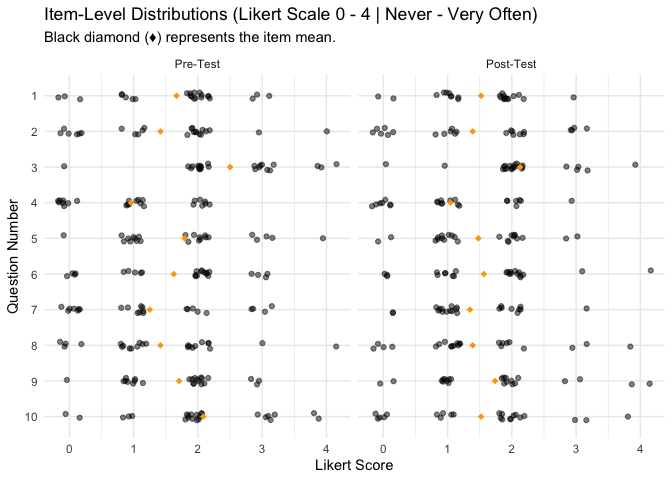
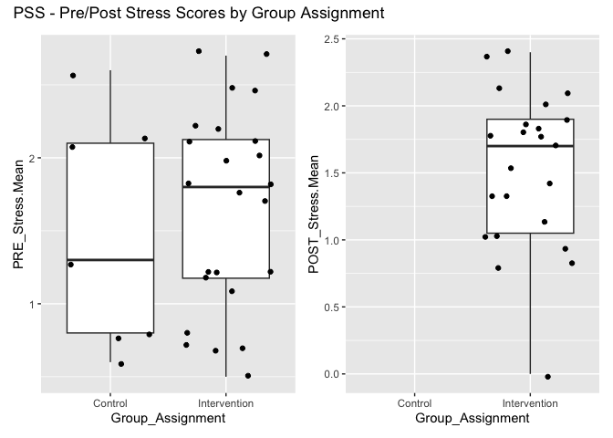
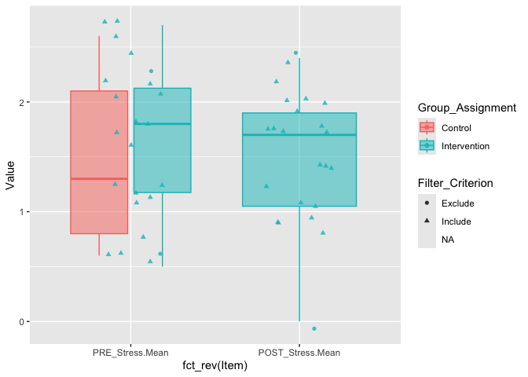
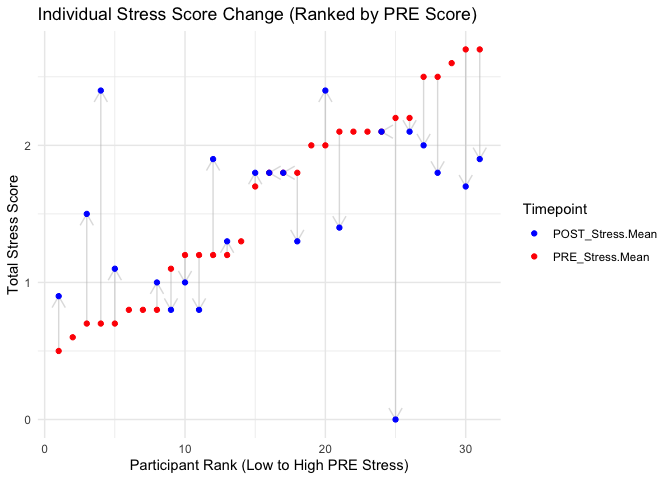

Updated Analysis: STRESS (Perceived Stress Scale)
================
2026-08-20

# 0. Setup & Data Ingestion

## 0.1 Libraries

``` r
library(dplyr)       # Data manipulation
library(stringr)     # String manipulation
library(tidyr)       # Data pivoting
library(readr)       # Reading data
library(kableExtra)  # HTML Table formatting
library(ggplot2)     # Visualizations
library(ggpubr)      # Publication-ready plots
library(rstatix)     # T-tests and effect sizes
library(broom)       # Tidy statistical outputs
library(forcats)     # Factor manipulation
library(effectsize)  # effect size & omega squared

#install.packages("skimr")
#install.packages("gtExtras") # testing: used for quick summaries and viz
```

## 0.2 Load Data

### 0.2.1 !! Updated Data File:

- **UPDATED DATA FILE** - SEFF_Updated…
  - Both Surveys are connected to a single participant ID (Pre and Post)
    and collated in one spreadsheet
  - Transformed to numeric, scored, and saved in
    [Autism_Doula_Study_data_ingestion.Rmd](SEFF_Updated_Data_File_08-2026.Rmd)
- **Structure**
  - Study_ID (Joined ID across pre and post, unique to participant)
  - Group Assignment (Control or Intervention)
  - Stress Scale: **PSS** - *Perceived Stress Scale* - 10 Questions
  - SEFF Scale: **EFF** - *Early Intervention Parent Self Efficacy* - 14
    Questions
  - Columns as Pre –\> Post

## 0.3 Load Analaysis Tables

``` r
analytic.files <- read_rds("../_output/analytic_files_scored_surveys.Rds")

EFF.scored <- analytic.files$EFF.scored
PSS.scored <- analytic.files$PSS.Scored
```

``` r
# library(gtExtras)
# 
# PSS.scored %>% 
#   mutate(StudyID = factor(StudyID), Group_Assignment = factor(Group_Assignment)) %>%  
#   select(StudyID, Group_Assignment, contains("PRE_S"), contains("POST_S")) %>% 
#   gt_plt_summary()
```

# 1. PSS

``` r
PSS.scored %>% select(StudyID, Group_Assignment, contains("PRE_S"), contains("POST_S")) %>%
  kable(caption="PSS - Calculated Columns") %>% 
  kable_styling(bootstrap_options = c("striped", "hover"), full_width = F) %>%    scroll_box(height = "400px", width = "100%")
```

<div style="border: 1px solid #ddd; padding: 0px; overflow-y: scroll; height:400px; overflow-x: scroll; width:100%; ">

<table class="table table-striped table-hover" style="color: black; width: auto !important; margin-left: auto; margin-right: auto;">

<caption>

PSS - Calculated Columns
</caption>

<thead>

<tr>

<th style="text-align:right;position: sticky; top:0; background-color: #FFFFFF;">

StudyID
</th>

<th style="text-align:left;position: sticky; top:0; background-color: #FFFFFF;">

Group_Assignment
</th>

<th style="text-align:right;position: sticky; top:0; background-color: #FFFFFF;">

PRE_Stress.Total
</th>

<th style="text-align:right;position: sticky; top:0; background-color: #FFFFFF;">

PRE_Stress.Mean
</th>

<th style="text-align:right;position: sticky; top:0; background-color: #FFFFFF;">

PRE_Stress.StDev
</th>

<th style="text-align:right;position: sticky; top:0; background-color: #FFFFFF;">

POST_Stress.Total
</th>

<th style="text-align:right;position: sticky; top:0; background-color: #FFFFFF;">

POST_Stress.Mean
</th>

<th style="text-align:right;position: sticky; top:0; background-color: #FFFFFF;">

POST_Stress.StDev
</th>

</tr>

</thead>

<tbody>

<tr>

<td style="text-align:right;">

1
</td>

<td style="text-align:left;">

Intervention
</td>

<td style="text-align:right;">

21
</td>

<td style="text-align:right;">

2.1
</td>

<td style="text-align:right;">

0.876
</td>

<td style="text-align:right;">

14
</td>

<td style="text-align:right;">

1.4
</td>

<td style="text-align:right;">

0.699
</td>

</tr>

<tr>

<td style="text-align:right;">

2
</td>

<td style="text-align:left;">

Intervention
</td>

<td style="text-align:right;">

20
</td>

<td style="text-align:right;">

2.0
</td>

<td style="text-align:right;">

0.816
</td>

<td style="text-align:right;">

NA
</td>

<td style="text-align:right;">

NA
</td>

<td style="text-align:right;">

NA
</td>

</tr>

<tr>

<td style="text-align:right;">

3
</td>

<td style="text-align:left;">

Intervention
</td>

<td style="text-align:right;">

22
</td>

<td style="text-align:right;">

2.2
</td>

<td style="text-align:right;">

0.422
</td>

<td style="text-align:right;">

0
</td>

<td style="text-align:right;">

0.0
</td>

<td style="text-align:right;">

0.000
</td>

</tr>

<tr>

<td style="text-align:right;">

4
</td>

<td style="text-align:left;">

Control
</td>

<td style="text-align:right;">

13
</td>

<td style="text-align:right;">

1.3
</td>

<td style="text-align:right;">

0.483
</td>

<td style="text-align:right;">

NA
</td>

<td style="text-align:right;">

NA
</td>

<td style="text-align:right;">

NA
</td>

</tr>

<tr>

<td style="text-align:right;">

6
</td>

<td style="text-align:left;">

Intervention
</td>

<td style="text-align:right;">

12
</td>

<td style="text-align:right;">

1.2
</td>

<td style="text-align:right;">

0.789
</td>

<td style="text-align:right;">

10
</td>

<td style="text-align:right;">

1.0
</td>

<td style="text-align:right;">

0.816
</td>

</tr>

<tr>

<td style="text-align:right;">

7
</td>

<td style="text-align:left;">

Control
</td>

<td style="text-align:right;">

21
</td>

<td style="text-align:right;">

2.1
</td>

<td style="text-align:right;">

0.316
</td>

<td style="text-align:right;">

NA
</td>

<td style="text-align:right;">

NA
</td>

<td style="text-align:right;">

NA
</td>

</tr>

<tr>

<td style="text-align:right;">

8
</td>

<td style="text-align:left;">

Intervention
</td>

<td style="text-align:right;">

18
</td>

<td style="text-align:right;">

1.8
</td>

<td style="text-align:right;">

0.632
</td>

<td style="text-align:right;">

18
</td>

<td style="text-align:right;">

1.8
</td>

<td style="text-align:right;">

0.632
</td>

</tr>

<tr>

<td style="text-align:right;">

9
</td>

<td style="text-align:left;">

Control
</td>

<td style="text-align:right;">

6
</td>

<td style="text-align:right;">

0.6
</td>

<td style="text-align:right;">

0.699
</td>

<td style="text-align:right;">

NA
</td>

<td style="text-align:right;">

NA
</td>

<td style="text-align:right;">

NA
</td>

</tr>

<tr>

<td style="text-align:right;">

10
</td>

<td style="text-align:left;">

Intervention
</td>

<td style="text-align:right;">

22
</td>

<td style="text-align:right;">

2.2
</td>

<td style="text-align:right;">

1.317
</td>

<td style="text-align:right;">

21
</td>

<td style="text-align:right;">

2.1
</td>

<td style="text-align:right;">

1.370
</td>

</tr>

<tr>

<td style="text-align:right;">

11
</td>

<td style="text-align:left;">

Control
</td>

<td style="text-align:right;">

21
</td>

<td style="text-align:right;">

2.1
</td>

<td style="text-align:right;">

0.738
</td>

<td style="text-align:right;">

NA
</td>

<td style="text-align:right;">

NA
</td>

<td style="text-align:right;">

NA
</td>

</tr>

<tr>

<td style="text-align:right;">

12
</td>

<td style="text-align:left;">

Control
</td>

<td style="text-align:right;">

8
</td>

<td style="text-align:right;">

0.8
</td>

<td style="text-align:right;">

0.632
</td>

<td style="text-align:right;">

NA
</td>

<td style="text-align:right;">

NA
</td>

<td style="text-align:right;">

NA
</td>

</tr>

<tr>

<td style="text-align:right;">

13
</td>

<td style="text-align:left;">

Control
</td>

<td style="text-align:right;">

8
</td>

<td style="text-align:right;">

0.8
</td>

<td style="text-align:right;">

0.632
</td>

<td style="text-align:right;">

NA
</td>

<td style="text-align:right;">

NA
</td>

<td style="text-align:right;">

NA
</td>

</tr>

<tr>

<td style="text-align:right;">

14
</td>

<td style="text-align:left;">

Intervention
</td>

<td style="text-align:right;">

11
</td>

<td style="text-align:right;">

1.1
</td>

<td style="text-align:right;">

0.876
</td>

<td style="text-align:right;">

8
</td>

<td style="text-align:right;">

0.8
</td>

<td style="text-align:right;">

0.632
</td>

</tr>

<tr>

<td style="text-align:right;">

16
</td>

<td style="text-align:left;">

Intervention
</td>

<td style="text-align:right;">

12
</td>

<td style="text-align:right;">

1.2
</td>

<td style="text-align:right;">

0.422
</td>

<td style="text-align:right;">

8
</td>

<td style="text-align:right;">

0.8
</td>

<td style="text-align:right;">

0.789
</td>

</tr>

<tr>

<td style="text-align:right;">

17
</td>

<td style="text-align:left;">

Intervention
</td>

<td style="text-align:right;">

21
</td>

<td style="text-align:right;">

2.1
</td>

<td style="text-align:right;">

0.568
</td>

<td style="text-align:right;">

21
</td>

<td style="text-align:right;">

2.1
</td>

<td style="text-align:right;">

0.568
</td>

</tr>

<tr>

<td style="text-align:right;">

22
</td>

<td style="text-align:left;">

Intervention
</td>

<td style="text-align:right;">

12
</td>

<td style="text-align:right;">

1.2
</td>

<td style="text-align:right;">

0.789
</td>

<td style="text-align:right;">

19
</td>

<td style="text-align:right;">

1.9
</td>

<td style="text-align:right;">

0.738
</td>

</tr>

<tr>

<td style="text-align:right;">

26
</td>

<td style="text-align:left;">

Intervention
</td>

<td style="text-align:right;">

12
</td>

<td style="text-align:right;">

1.2
</td>

<td style="text-align:right;">

1.033
</td>

<td style="text-align:right;">

13
</td>

<td style="text-align:right;">

1.3
</td>

<td style="text-align:right;">

0.483
</td>

</tr>

<tr>

<td style="text-align:right;">

28
</td>

<td style="text-align:left;">

Intervention
</td>

<td style="text-align:right;">

18
</td>

<td style="text-align:right;">

1.8
</td>

<td style="text-align:right;">

0.789
</td>

<td style="text-align:right;">

18
</td>

<td style="text-align:right;">

1.8
</td>

<td style="text-align:right;">

0.422
</td>

</tr>

<tr>

<td style="text-align:right;">

32
</td>

<td style="text-align:left;">

Intervention
</td>

<td style="text-align:right;">

5
</td>

<td style="text-align:right;">

0.5
</td>

<td style="text-align:right;">

0.707
</td>

<td style="text-align:right;">

9
</td>

<td style="text-align:right;">

0.9
</td>

<td style="text-align:right;">

0.568
</td>

</tr>

<tr>

<td style="text-align:right;">

39
</td>

<td style="text-align:left;">

Intervention
</td>

<td style="text-align:right;">

8
</td>

<td style="text-align:right;">

0.8
</td>

<td style="text-align:right;">

1.135
</td>

<td style="text-align:right;">

10
</td>

<td style="text-align:right;">

1.0
</td>

<td style="text-align:right;">

0.943
</td>

</tr>

<tr>

<td style="text-align:right;">

40
</td>

<td style="text-align:left;">

Intervention
</td>

<td style="text-align:right;">

18
</td>

<td style="text-align:right;">

1.8
</td>

<td style="text-align:right;">

0.632
</td>

<td style="text-align:right;">

13
</td>

<td style="text-align:right;">

1.3
</td>

<td style="text-align:right;">

0.483
</td>

</tr>

<tr>

<td style="text-align:right;">

42
</td>

<td style="text-align:left;">

Intervention
</td>

<td style="text-align:right;">

27
</td>

<td style="text-align:right;">

2.7
</td>

<td style="text-align:right;">

0.823
</td>

<td style="text-align:right;">

17
</td>

<td style="text-align:right;">

1.7
</td>

<td style="text-align:right;">

0.675
</td>

</tr>

<tr>

<td style="text-align:right;">

44
</td>

<td style="text-align:left;">

Intervention
</td>

<td style="text-align:right;">

25
</td>

<td style="text-align:right;">

2.5
</td>

<td style="text-align:right;">

0.707
</td>

<td style="text-align:right;">

20
</td>

<td style="text-align:right;">

2.0
</td>

<td style="text-align:right;">

1.491
</td>

</tr>

<tr>

<td style="text-align:right;">

45
</td>

<td style="text-align:left;">

Intervention
</td>

<td style="text-align:right;">

7
</td>

<td style="text-align:right;">

0.7
</td>

<td style="text-align:right;">

0.675
</td>

<td style="text-align:right;">

15
</td>

<td style="text-align:right;">

1.5
</td>

<td style="text-align:right;">

0.972
</td>

</tr>

<tr>

<td style="text-align:right;">

50
</td>

<td style="text-align:left;">

Intervention
</td>

<td style="text-align:right;">

25
</td>

<td style="text-align:right;">

2.5
</td>

<td style="text-align:right;">

0.707
</td>

<td style="text-align:right;">

18
</td>

<td style="text-align:right;">

1.8
</td>

<td style="text-align:right;">

0.632
</td>

</tr>

<tr>

<td style="text-align:right;">

51
</td>

<td style="text-align:left;">

Intervention
</td>

<td style="text-align:right;">

17
</td>

<td style="text-align:right;">

1.7
</td>

<td style="text-align:right;">

0.483
</td>

<td style="text-align:right;">

18
</td>

<td style="text-align:right;">

1.8
</td>

<td style="text-align:right;">

0.632
</td>

</tr>

<tr>

<td style="text-align:right;">

53
</td>

<td style="text-align:left;">

Intervention
</td>

<td style="text-align:right;">

7
</td>

<td style="text-align:right;">

0.7
</td>

<td style="text-align:right;">

0.949
</td>

<td style="text-align:right;">

24
</td>

<td style="text-align:right;">

2.4
</td>

<td style="text-align:right;">

0.843
</td>

</tr>

<tr>

<td style="text-align:right;">

56
</td>

<td style="text-align:left;">

Intervention
</td>

<td style="text-align:right;">

20
</td>

<td style="text-align:right;">

2.0
</td>

<td style="text-align:right;">

0.667
</td>

<td style="text-align:right;">

24
</td>

<td style="text-align:right;">

2.4
</td>

<td style="text-align:right;">

0.699
</td>

</tr>

<tr>

<td style="text-align:right;">

58
</td>

<td style="text-align:left;">

Intervention
</td>

<td style="text-align:right;">

27
</td>

<td style="text-align:right;">

2.7
</td>

<td style="text-align:right;">

0.823
</td>

<td style="text-align:right;">

19
</td>

<td style="text-align:right;">

1.9
</td>

<td style="text-align:right;">

0.568
</td>

</tr>

<tr>

<td style="text-align:right;">

59
</td>

<td style="text-align:left;">

Intervention
</td>

<td style="text-align:right;">

7
</td>

<td style="text-align:right;">

0.7
</td>

<td style="text-align:right;">

0.675
</td>

<td style="text-align:right;">

11
</td>

<td style="text-align:right;">

1.1
</td>

<td style="text-align:right;">

0.876
</td>

</tr>

<tr>

<td style="text-align:right;">

60
</td>

<td style="text-align:left;">

Control
</td>

<td style="text-align:right;">

26
</td>

<td style="text-align:right;">

2.6
</td>

<td style="text-align:right;">

1.265
</td>

<td style="text-align:right;">

NA
</td>

<td style="text-align:right;">

NA
</td>

<td style="text-align:right;">

NA
</td>

</tr>

</tbody>

</table>

</div>

## 1.1 Descriptiive Table

``` r
PSS.scored %>%
  summarise(.by = Group_Assignment, 
            N = n(),
            Mean_PRE = mean(PRE_Stress.Total, na.rm = TRUE),
            SD_PRE = sd(PRE_Stress.Total, na.rm = TRUE),
            Mean_POST = mean(POST_Stress.Total, na.rm = TRUE),
            SD_POST = sd(POST_Stress.Total, na.rm = TRUE)
            ) %>%
  kable(digits = 2,
        caption = "Summary Table - Group Means and St.Deviations") %>%
  kable_styling(full_width = F)
```

<table class="table" style="color: black; width: auto !important; margin-left: auto; margin-right: auto;">

<caption>

Summary Table - Group Means and St.Deviations
</caption>

<thead>

<tr>

<th style="text-align:left;">

Group_Assignment
</th>

<th style="text-align:right;">

N
</th>

<th style="text-align:right;">

Mean_PRE
</th>

<th style="text-align:right;">

SD_PRE
</th>

<th style="text-align:right;">

Mean_POST
</th>

<th style="text-align:right;">

SD_POST
</th>

</tr>

</thead>

<tbody>

<tr>

<td style="text-align:left;">

Intervention
</td>

<td style="text-align:right;">

24
</td>

<td style="text-align:right;">

16.4
</td>

<td style="text-align:right;">

6.86
</td>

<td style="text-align:right;">

15.1
</td>

<td style="text-align:right;">

5.9
</td>

</tr>

<tr>

<td style="text-align:left;">

Control
</td>

<td style="text-align:right;">

7
</td>

<td style="text-align:right;">

14.7
</td>

<td style="text-align:right;">

7.91
</td>

<td style="text-align:right;">

NaN
</td>

<td style="text-align:right;">

NA
</td>

</tr>

</tbody>

</table>

## 1.2 Norm Table from PSS Original Study Paper

- Taken from the Paper,
- Using **Total** Scores (Means for Demographic Groups)
- Compare
  - Study: Intervention (24) M = 16.4, SD = 6.86. (Pre Intervention)
  - Study: Control (7) M = 14.7, SD = 7.91
  - Race: Black (176) M = 14.7, SD = 7.2

| Category               | N    | Mean | S.D. |
|------------------------|------|------|------|
| Gender<br>Male         | 926  | 12.1 | 5.9  |
| Gender<br>Female       | 1406 | 13.7 | 6.6  |
| Age<br>18-29           | 645  | 14.2 | 6.2  |
| Age<br>30-44           | 750  | 13.0 | 6.2  |
| Age<br>45-54           | 285  | 12.6 | 6.1  |
| Age<br>55-64           | 282  | 11.9 | 6.9  |
| Age<br>65 & older      | 296  | 12.0 | 6.3  |
| Race<br>White          | 1924 | 12.8 | 6.2  |
| Race<br>Hispanic       | 98   | 14.0 | 6.9  |
| Race<br>Black          | 176  | 14.7 | 7.2  |
| Race<br>Other Minority | 50   | 14.1 | 5.0  |

## 1.2 PSS - Scale Validation

### 1.2 Item-Level Distribution (Dot Plot)

``` r
PSS.scored %>% 
  filter(Group_Assignment == "Intervention") %>% 
  pivot_longer(cols = contains("_Q"), names_to = "Item", values_to = "Value") %>% 
  mutate(
    Condition = if_else(str_detect(Item, "PRE_"), "Pre-Test", "Post-Test"),
    Condition = factor(Condition, levels = c("Pre-Test", "Post-Test")),
    Q_Num = as.numeric(str_extract(Item, "\\d+")),
    Q_Order = factor(Q_Num, levels = 1:10)
    #Composite = if_else(Q_Num %in% c(1, 2, 9, 14), "Parent Competence", "Outcome Expectations")
  ) %>% 
  filter(!is.na(Value)) %>% 
  ggplot(aes(x = Value, y = fct_rev(Q_Order)))+#, color = Composite)) +
  geom_jitter(position = position_jitter(width = 0.2, height = 0.1), alpha = 0.5) +
  stat_summary(fun = "mean", geom = "point", color = "orange", size = 2, shape = 18) +
  facet_wrap(~Condition) +
  scale_x_continuous(breaks = 0:4) +
  theme_minimal() +
  theme(legend.position = "top") +
  labs(
    title = "Item-Level Distributions (Likert Scale 0 - 4 | Never - Very Often)",
    subtitle = "Black diamond (♦) represents the item mean.",
    y = "Question Number",
    x = "Likert Score"
  )
```

<!-- -->

## 2. Test Internal Consistency (Cronbach’s Alpha)

- Here we will calculate Cronbach’s alpha for each scale to check for
  internal consistency.
- A general rule of thumb is that an alpha of \> 0.7 is acceptable.

``` r
pre_alpha <- 
  PSS.scored %>% 
  filter(Group_Assignment == "Intervention") %>% 
  select(contains("PRE_Q")) %>% 
  psych::alpha()

post_alpha <- 
  PSS.scored %>% 
  filter(Group_Assignment == "Intervention") %>% 
  select(contains("POST_Q")) %>% 
  psych::alpha()


## Dataframe of the Cronbach Alpha Tests and Values
alpha_values <- data.frame(
  Scale = c("PRE", "POST"),
  Cronbach_Alpha = c(pre_alpha$total$raw_alpha,
                     post_alpha$total$raw_alpha)
)

alpha_values %>% 
  kableExtra::kable(digits=3,
                    caption = "Intervention Group: Cronbach Alpha Values") %>%
  kableExtra::kable_styling(bootstrap_options = c("striped", "hover", "condensed"), 
                            full_width = F)
```

<table class="table table-striped table-hover table-condensed" style="color: black; width: auto !important; margin-left: auto; margin-right: auto;">

<caption>

Intervention Group: Cronbach Alpha Values
</caption>

<thead>

<tr>

<th style="text-align:left;">

Scale
</th>

<th style="text-align:right;">

Cronbach_Alpha
</th>

</tr>

</thead>

<tbody>

<tr>

<td style="text-align:left;">

PRE
</td>

<td style="text-align:right;">

0.903
</td>

</tr>

<tr>

<td style="text-align:left;">

POST
</td>

<td style="text-align:right;">

0.842
</td>

</tr>

</tbody>

</table>

\#3. Descriptive Statistics

## 3.1 Descriptive Table

``` r
PSS.scored %>%
  summarise(.by = Group_Assignment, 
            N = n(),
            Mean_PRE = mean(PRE_Stress.Total, na.rm = TRUE),
            SD_PRE = sd(PRE_Stress.Total, na.rm = TRUE),
            Mean_POST = mean(POST_Stress.Total, na.rm = TRUE),
            SD_POST = sd(POST_Stress.Total, na.rm = TRUE)
            ) %>%
  kable(digits = 2,
        caption = "Summary Table - Group Means and St.Deviations") %>%
  kable_styling(full_width = F)
```

<table class="table" style="color: black; width: auto !important; margin-left: auto; margin-right: auto;">

<caption>

Summary Table - Group Means and St.Deviations
</caption>

<thead>

<tr>

<th style="text-align:left;">

Group_Assignment
</th>

<th style="text-align:right;">

N
</th>

<th style="text-align:right;">

Mean_PRE
</th>

<th style="text-align:right;">

SD_PRE
</th>

<th style="text-align:right;">

Mean_POST
</th>

<th style="text-align:right;">

SD_POST
</th>

</tr>

</thead>

<tbody>

<tr>

<td style="text-align:left;">

Intervention
</td>

<td style="text-align:right;">

24
</td>

<td style="text-align:right;">

16.4
</td>

<td style="text-align:right;">

6.86
</td>

<td style="text-align:right;">

15.1
</td>

<td style="text-align:right;">

5.9
</td>

</tr>

<tr>

<td style="text-align:left;">

Control
</td>

<td style="text-align:right;">

7
</td>

<td style="text-align:right;">

14.7
</td>

<td style="text-align:right;">

7.91
</td>

<td style="text-align:right;">

NaN
</td>

<td style="text-align:right;">

NA
</td>

</tr>

</tbody>

</table>

### 3.2.1 Outlier Identification

``` r
PSS.check <- PSS.scored %>% mutate(Filter_Diff = POST_Stress.Mean - PRE_Stress.Mean)
#Control doesn't have POST scores, so they are ignored via NA-REMOVE  
f.mn <- mean(PSS.check$Filter_Diff, na.rm = TRUE)
f.sd <- sd(PSS.check$Filter_Diff, na.rm = TRUE)

PSS.check <- PSS.check %>% 
  mutate(
    Filter_Criterion = ifelse(Filter_Diff > (f.mn + 2*f.sd) | Filter_Diff < (f.mn - 2*f.sd), "Exclude", "Include")
  )

PSS.check %>% 
  filter(Group_Assignment == "Intervention") %>% 
  ggplot(aes(x=Filter_Diff, fill = Filter_Criterion)) + geom_histogram(bins=10, color="black") + 
  labs(title="Distribution of Pre/Post Differences in Overall SEFF Scores", x="Difference (Post - Pre)", y="Count") +
  theme_minimal()
```

<!-- -->

# 3.3 Run Paired T-Tests

## Are the groups different initially?

``` r
PSS.check %>% rstatix::t_test(PRE_Stress.Total ~ Group_Assignment, paired = FALSE, alternative = "two.sided", conf.level = 0.1)
```

    ## # A tibble: 1 × 8
    ##   .y.              group1  group2          n1    n2 statistic    df     p
    ## * <chr>            <chr>   <chr>        <int> <int>     <dbl> <dbl> <dbl>
    ## 1 PRE_Stress.Total Control Intervention     7    24    -0.516  8.81 0.619

## Does the intervention group change pre to post test?

``` r
PSS.long <- PSS.check %>% 
  #filter(Filter_Criterion == "Include") %>%
  select(StudyID, Group_Assignment, contains("Mean")) %>%  
  pivot_longer(cols = contains("Stress"), names_to = "Composite", values_to = "Score") %>% 
  mutate(
    Timepoint = if_else(str_detect(Composite, "PRE_"), "Pre-Test", "Post-Test"),
    Timepoint = factor(Timepoint, levels = c("Pre-Test", "Post-Test")),
  )

# Run Paired T-Tests
PSS.t_test_results <- PSS.long %>%
  rstatix::pairwise_t_test(Score ~ Timepoint, paired = TRUE, detailed = TRUE, conf.level = 0.1, alternative = "less", pool.sd=TRUE)
  #adjust_pvalue(method = "holm") %>%
  #add_significance("p.adj")

PSS.t_test_results
```

    ## # A tibble: 1 × 15
    ##   estimate .y.   group1   group2       n1    n2 statistic     p    df conf.low
    ## *    <dbl> <chr> <chr>    <chr>     <int> <int>     <dbl> <dbl> <dbl>    <dbl>
    ## 1    0.113 Score Pre-Test Post-Test    31    23     0.718  0.76    22     -Inf
    ## # ℹ 5 more variables: conf.high <dbl>, method <chr>, alternative <chr>,
    ## #   p.adj <dbl>, p.adj.signif <chr>

## One Sample Test (Against Control & Norm Mean)

- Control Group (7) is too small to use as a reference group for the
  T-Test (independent sample t-test, Intervention POST vs Control PRE)
- But Control mean (14.7) is identical to the Normed Mean for the Race:
  Black Demographic
- Can test with one sample t-test against the norm value for the group.
  $$ Post Stress Total_I == 14.7 $$

``` r
PSS.check %>% 
  #filter(Filter_Criterion == "Include") %>%
  select(StudyID, Group_Assignment, POST_Stress.Total) %>%  
  filter(Group_Assignment == "Intervention") %>% 
  rstatix::t_test(POST_Stress.Total ~ 1, mu = 14.7) 
```

    ## # A tibble: 1 × 7
    ##   .y.               group1 group2         n statistic    df     p
    ## * <chr>             <chr>  <chr>      <int>     <dbl> <dbl> <dbl>
    ## 1 POST_Stress.Total 1      null model    23     0.350    22  0.73

- Post Stress Sample is NOT significantly different from the normed
  (race group) or control.
- Indication that the intervention may have reduced scores to where they
  are at least close to normal, although not large enough to account for
  **starting differences** (paired test) for the individuals levels.

# 4. Plots

## Pre, Post and Control Boxplots

``` r
PSS.pre_boxplot <- 
  PSS.scored %>% 
  #select(StudyID, Group_Assignment, contains("Total"), contains("Mean")) %>% 
  ggplot(aes(x = Group_Assignment, y = PRE_Stress.Mean))+
  geom_boxplot()+
  geom_jitter()

PSS.post_boxplot <- 
  PSS.scored %>% 
  #select(StudyID, Group_Assignment, contains("Total"), contains("Mean")) %>% 
  ggplot(aes(x = Group_Assignment, y = POST_Stress.Mean))+
  geom_boxplot()+
  geom_jitter()

library(patchwork)

PSS.pre_boxplot + PSS.post_boxplot + plot_annotation(title = "PSS - Pre/Post Stress Scores by Group Assignment")
```

<!-- -->

``` r
PSS.check %>% 
  select(StudyID, Group_Assignment, contains("Mean"), Filter_Criterion) %>%  
  pivot_longer(cols = contains("Stress"), names_to = "Item", values_to = "Value") %>% 
  mutate(
    Condition = if_else(str_detect(Item, "PRE_"), "Pre-Test", "Post-Test"),
    Condition = factor(Condition, levels = c("Pre-Test", "Post-Test")),
  ) %>% 
  ggplot(aes(x = fct_rev(Item), y = Value, color = Group_Assignment, fill = Group_Assignment)) +
  geom_boxplot(alpha = .5) +
  geom_jitter(aes(shape = Filter_Criterion), position = position_jitter(width = 0.2, height = 0.1), alpha = 0.8)
```

<!-- -->

## 4.1 Change in Total Scores (Arrow Plot)

``` r
PSS.scored %>% 
  arrange(PRE_Stress.Mean) %>% 
  mutate(
    Rank_Order = seq_along(PRE_Stress.Mean),
    Pct_Order = percent_rank(PRE_Stress.Mean)
  ) %>% 
  ggplot(aes(x = Rank_Order)) +
  # 1. Add the arrows (vertical segments)
  geom_segment(aes(
    xend = Rank_Order, 
    y = PRE_Stress.Mean, 
    yend = POST_Stress.Mean
  ), 
  arrow = arrow(length = unit(.35, "cm")), # Adds the arrow head
  color = "gray", 
  alpha = 0.5) +
  
  # 2. Add the PRE points
  geom_point(aes(y = PRE_Stress.Mean, color = "PRE_Stress.Mean")) +
  
  # 3. Add the POST points
  geom_point(aes(y = POST_Stress.Mean, color = "POST_Stress.Mean")) +
  
  # Formatting
  scale_color_manual(values = c("PRE_Stress.Mean" = "red", "POST_Stress.Mean" = "blue")) +
  labs(
    title = "Individual Stress Score Change (Ranked by PRE Score)",
    x = "Participant Rank (Low to High PRE Stress)",
    y = "Total Stress Score",
    color = "Timepoint"
  ) +
  theme_minimal()
```

<!-- -->
