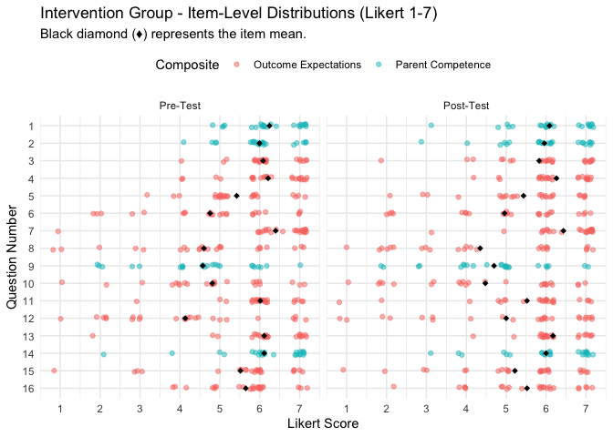
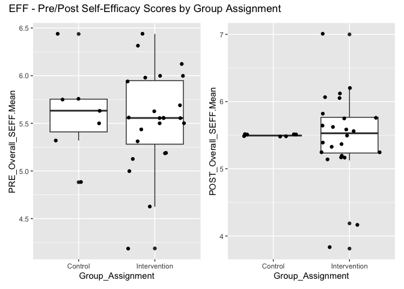
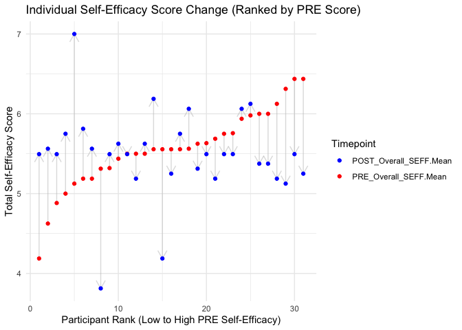

Updated_Analysis; Self-Efficacy (EIPSES)
================
2026-08-20

# 0. Setup & Data Ingestion

## 0.1 Libraries

``` r
library(dplyr)       # Data manipulation
library(stringr)     # String manipulation
library(tidyr)       # Data pivoting
library(readr)       # Reading data
library(kableExtra)  # HTML Table formatting
library(ggplot2)     # Visualizations
library(ggpubr)      # Publication-ready plots
library(rstatix)     # T-tests and effect sizes
library(broom)       # Tidy statistical outputs
library(forcats)     # Factor manipulation
library(effectsize)  # effect size & omega squared

#install.packages("skimr")
#install.packages("gtExtras") # testing: used for quick summaries and viz
```

## 0.2 Load Data

### 0.2.1 !! Updated Data File:

- **UPDATED DATA FILE** - SEFF_Updated…
  - Both Surveys are connected to a single participant ID (Pre and Post)
    and collated in one spreadsheet
  - Transformed to numeric, scored, and saved in
    [Autism_Doula_Study_data_ingestion.Rmd](SEFF_Updated_Data_File_08-2026.Rmd)
- **Structure**
  - Study_ID (Joined ID across pre and post, unique to participant)
  - Group Assignment (Control or Intervention)
  - Self-Efficacy Scale: **PSS** - *Perceived Self-Efficacy Scale* - 10
    Questions
  - SEFF Scale: **EFF** - *Early Intervention Parent Self Efficacy* - 14
    Questions
  - Columns as Pre –\> Post

## 0.3 Load Analaysis Tables

``` r
analytic.files <- read_rds("../_output/analytic_files_scored_surveys.Rds")

EFF.scored <- analytic.files$EFF.scored
PSS.scored <- analytic.files$PSS.Scored
```

``` r
library(gtExtras)


EFF.scored %>% 
  mutate(StudyID = factor(StudyID), Group_Assignment = factor(Group_Assignment)) %>%  
  select(StudyID, Group_Assignment, contains(c("Sum","Mean"))) %>% 
  gt_plt_summary()
```

<div id="edgatdivls" style="padding-left:0px;padding-right:0px;padding-top:10px;padding-bottom:10px;overflow-x:auto;overflow-y:auto;width:auto;height:auto;">
<style>@import url("https://fonts.googleapis.com/css2?family=Lato:ital,wght@0,100;0,200;0,300;0,400;0,500;0,600;0,700;0,800;0,900;1,100;1,200;1,300;1,400;1,500;1,600;1,700;1,800;1,900&display=swap");
#edgatdivls table {
  font-family: Lato, system-ui, 'Segoe UI', Roboto, Helvetica, Arial, sans-serif, 'Apple Color Emoji', 'Segoe UI Emoji', 'Segoe UI Symbol', 'Noto Color Emoji';
  -webkit-font-smoothing: antialiased;
  -moz-osx-font-smoothing: grayscale;
}
&#10;#edgatdivls thead, #edgatdivls tbody, #edgatdivls tfoot, #edgatdivls tr, #edgatdivls td, #edgatdivls th {
  border-style: none;
}
&#10;#edgatdivls p {
  margin: 0;
  padding: 0;
}
&#10;#edgatdivls .gt_table {
  display: table;
  border-collapse: collapse;
  line-height: normal;
  margin-left: auto;
  margin-right: auto;
  color: #333333;
  font-size: 16px;
  font-weight: normal;
  font-style: normal;
  background-color: #FFFFFF;
  width: auto;
  border-top-style: solid;
  border-top-width: 3px;
  border-top-color: #FFFFFF;
  border-right-style: none;
  border-right-width: 2px;
  border-right-color: #D3D3D3;
  border-bottom-style: solid;
  border-bottom-width: 2px;
  border-bottom-color: #A8A8A8;
  border-left-style: none;
  border-left-width: 2px;
  border-left-color: #D3D3D3;
}
&#10;#edgatdivls .gt_caption {
  padding-top: 4px;
  padding-bottom: 4px;
}
&#10;#edgatdivls .gt_title {
  color: #333333;
  font-size: 24px;
  font-weight: initial;
  padding-top: 4px;
  padding-bottom: 4px;
  padding-left: 5px;
  padding-right: 5px;
  border-bottom-color: #FFFFFF;
  border-bottom-width: 0;
}
&#10;#edgatdivls .gt_subtitle {
  color: #333333;
  font-size: 85%;
  font-weight: initial;
  padding-top: 3px;
  padding-bottom: 5px;
  padding-left: 5px;
  padding-right: 5px;
  border-top-color: #FFFFFF;
  border-top-width: 0;
}
&#10;#edgatdivls .gt_heading {
  background-color: #FFFFFF;
  text-align: left;
  border-bottom-color: #FFFFFF;
  border-left-style: none;
  border-left-width: 1px;
  border-left-color: #D3D3D3;
  border-right-style: none;
  border-right-width: 1px;
  border-right-color: #D3D3D3;
}
&#10;#edgatdivls .gt_bottom_border {
  border-bottom-style: solid;
  border-bottom-width: 0px;
  border-bottom-color: #D3D3D3;
}
&#10;#edgatdivls .gt_col_headings {
  border-top-style: solid;
  border-top-width: 0px;
  border-top-color: #D3D3D3;
  border-bottom-style: solid;
  border-bottom-width: 2px;
  border-bottom-color: #D3D3D3;
  border-left-style: none;
  border-left-width: 1px;
  border-left-color: #D3D3D3;
  border-right-style: none;
  border-right-width: 1px;
  border-right-color: #D3D3D3;
}
&#10;#edgatdivls .gt_col_heading {
  color: #333333;
  background-color: #FFFFFF;
  font-size: 80%;
  font-weight: bolder;
  text-transform: uppercase;
  border-left-style: none;
  border-left-width: 1px;
  border-left-color: #D3D3D3;
  border-right-style: none;
  border-right-width: 1px;
  border-right-color: #D3D3D3;
  vertical-align: bottom;
  padding-top: 5px;
  padding-bottom: 6px;
  padding-left: 5px;
  padding-right: 5px;
  overflow-x: hidden;
}
&#10;#edgatdivls .gt_column_spanner_outer {
  color: #333333;
  background-color: #FFFFFF;
  font-size: 80%;
  font-weight: bolder;
  text-transform: uppercase;
  padding-top: 0;
  padding-bottom: 0;
  padding-left: 4px;
  padding-right: 4px;
}
&#10;#edgatdivls .gt_column_spanner_outer:first-child {
  padding-left: 0;
}
&#10;#edgatdivls .gt_column_spanner_outer:last-child {
  padding-right: 0;
}
&#10;#edgatdivls .gt_column_spanner {
  border-bottom-style: solid;
  border-bottom-width: 2px;
  border-bottom-color: #D3D3D3;
  vertical-align: bottom;
  padding-top: 5px;
  padding-bottom: 5px;
  overflow-x: hidden;
  display: inline-block;
  width: 100%;
}
&#10;#edgatdivls .gt_spanner_row {
  border-bottom-style: hidden;
}
&#10;#edgatdivls .gt_group_heading {
  padding-top: 8px;
  padding-bottom: 8px;
  padding-left: 5px;
  padding-right: 5px;
  color: #333333;
  background-color: #FFFFFF;
  font-size: 80%;
  font-weight: bolder;
  text-transform: uppercase;
  border-top-style: solid;
  border-top-width: 2px;
  border-top-color: #D3D3D3;
  border-bottom-style: solid;
  border-bottom-width: 2px;
  border-bottom-color: #D3D3D3;
  border-left-style: none;
  border-left-width: 1px;
  border-left-color: #D3D3D3;
  border-right-style: none;
  border-right-width: 1px;
  border-right-color: #D3D3D3;
  vertical-align: middle;
  text-align: left;
}
&#10;#edgatdivls .gt_empty_group_heading {
  padding: 0.5px;
  color: #333333;
  background-color: #FFFFFF;
  font-size: 80%;
  font-weight: bolder;
  border-top-style: solid;
  border-top-width: 2px;
  border-top-color: #D3D3D3;
  border-bottom-style: solid;
  border-bottom-width: 2px;
  border-bottom-color: #D3D3D3;
  vertical-align: middle;
}
&#10;#edgatdivls .gt_from_md > :first-child {
  margin-top: 0;
}
&#10;#edgatdivls .gt_from_md > :last-child {
  margin-bottom: 0;
}
&#10;#edgatdivls .gt_row {
  padding-top: 7px;
  padding-bottom: 7px;
  padding-left: 5px;
  padding-right: 5px;
  margin: 10px;
  border-top-style: solid;
  border-top-width: 1px;
  border-top-color: #F6F7F7;
  border-left-style: none;
  border-left-width: 1px;
  border-left-color: #D3D3D3;
  border-right-style: none;
  border-right-width: 1px;
  border-right-color: #D3D3D3;
  vertical-align: middle;
  overflow-x: hidden;
}
&#10;#edgatdivls .gt_stub {
  color: #333333;
  background-color: #FFFFFF;
  font-size: 80%;
  font-weight: bolder;
  text-transform: uppercase;
  border-right-style: solid;
  border-right-width: 2px;
  border-right-color: #D3D3D3;
  padding-left: 5px;
  padding-right: 5px;
}
&#10;#edgatdivls .gt_stub_row_group {
  color: #333333;
  background-color: #FFFFFF;
  font-size: 100%;
  font-weight: initial;
  text-transform: inherit;
  border-right-style: solid;
  border-right-width: 2px;
  border-right-color: #D3D3D3;
  padding-left: 5px;
  padding-right: 5px;
  vertical-align: top;
}
&#10;#edgatdivls .gt_row_group_first td {
  border-top-width: 2px;
}
&#10;#edgatdivls .gt_row_group_first th {
  border-top-width: 2px;
}
&#10;#edgatdivls .gt_summary_row {
  color: #333333;
  background-color: #FFFFFF;
  text-transform: inherit;
  padding-top: 8px;
  padding-bottom: 8px;
  padding-left: 5px;
  padding-right: 5px;
}
&#10;#edgatdivls .gt_first_summary_row {
  border-top-style: solid;
  border-top-color: #D3D3D3;
}
&#10;#edgatdivls .gt_first_summary_row.thick {
  border-top-width: 2px;
}
&#10;#edgatdivls .gt_last_summary_row {
  padding-top: 8px;
  padding-bottom: 8px;
  padding-left: 5px;
  padding-right: 5px;
  border-bottom-style: solid;
  border-bottom-width: 2px;
  border-bottom-color: #D3D3D3;
}
&#10;#edgatdivls .gt_grand_summary_row {
  color: #333333;
  background-color: #FFFFFF;
  text-transform: inherit;
  padding-top: 8px;
  padding-bottom: 8px;
  padding-left: 5px;
  padding-right: 5px;
}
&#10;#edgatdivls .gt_first_grand_summary_row {
  padding-top: 8px;
  padding-bottom: 8px;
  padding-left: 5px;
  padding-right: 5px;
  border-top-style: double;
  border-top-width: 6px;
  border-top-color: #D3D3D3;
}
&#10;#edgatdivls .gt_last_grand_summary_row_top {
  padding-top: 8px;
  padding-bottom: 8px;
  padding-left: 5px;
  padding-right: 5px;
  border-bottom-style: double;
  border-bottom-width: 6px;
  border-bottom-color: #D3D3D3;
}
&#10;#edgatdivls .gt_striped {
  background-color: #FAFAFA;
}
&#10;#edgatdivls .gt_table_body {
  border-top-style: solid;
  border-top-width: 2px;
  border-top-color: #D3D3D3;
  border-bottom-style: solid;
  border-bottom-width: 2px;
  border-bottom-color: #D3D3D3;
}
&#10;#edgatdivls .gt_footnotes {
  color: #333333;
  background-color: #FFFFFF;
  border-bottom-style: none;
  border-bottom-width: 2px;
  border-bottom-color: #D3D3D3;
  border-left-style: none;
  border-left-width: 2px;
  border-left-color: #D3D3D3;
  border-right-style: none;
  border-right-width: 2px;
  border-right-color: #D3D3D3;
}
&#10;#edgatdivls .gt_footnote {
  margin: 0px;
  font-size: 90%;
  padding-top: 4px;
  padding-bottom: 4px;
  padding-left: 5px;
  padding-right: 5px;
}
&#10;#edgatdivls .gt_sourcenotes {
  color: #333333;
  background-color: #FFFFFF;
  border-bottom-style: none;
  border-bottom-width: 2px;
  border-bottom-color: #D3D3D3;
  border-left-style: none;
  border-left-width: 2px;
  border-left-color: #D3D3D3;
  border-right-style: none;
  border-right-width: 2px;
  border-right-color: #D3D3D3;
}
&#10;#edgatdivls .gt_sourcenote {
  font-size: 12px;
  padding-top: 4px;
  padding-bottom: 4px;
  padding-left: 5px;
  padding-right: 5px;
}
&#10;#edgatdivls .gt_left {
  text-align: left;
}
&#10;#edgatdivls .gt_center {
  text-align: center;
}
&#10;#edgatdivls .gt_right {
  text-align: right;
  font-variant-numeric: tabular-nums;
}
&#10;#edgatdivls .gt_font_normal {
  font-weight: normal;
}
&#10;#edgatdivls .gt_font_bold {
  font-weight: bold;
}
&#10;#edgatdivls .gt_font_italic {
  font-style: italic;
}
&#10;#edgatdivls .gt_super {
  font-size: 65%;
}
&#10;#edgatdivls .gt_footnote_marks {
  font-size: 75%;
  vertical-align: 0.4em;
  position: initial;
}
&#10;#edgatdivls .gt_asterisk {
  font-size: 100%;
  vertical-align: 0;
}
&#10;#edgatdivls .gt_indent_1 {
  text-indent: 5px;
}
&#10;#edgatdivls .gt_indent_2 {
  text-indent: 10px;
}
&#10;#edgatdivls .gt_indent_3 {
  text-indent: 15px;
}
&#10;#edgatdivls .gt_indent_4 {
  text-indent: 20px;
}
&#10;#edgatdivls .gt_indent_5 {
  text-indent: 25px;
}
&#10;#edgatdivls .katex-display {
  display: inline-flex !important;
  margin-bottom: 0.75em !important;
}
&#10;#edgatdivls div.Reactable > div.rt-table > div.rt-thead > div.rt-tr.rt-tr-group-header > div.rt-th-group:after {
  height: 0px !important;
}
</style>
<table class="gt_table" data-quarto-disable-processing="false" data-quarto-bootstrap="false">
  <thead>
    <tr class="gt_heading">
      <td colspan="7" class="gt_heading gt_title gt_font_normal" style>.</td>
    </tr>
    <tr class="gt_heading">
      <td colspan="7" class="gt_heading gt_subtitle gt_font_normal gt_bottom_border" style>31 rows x 14 cols</td>
    </tr>
    <tr class="gt_col_headings">
      <th class="gt_col_heading gt_columns_bottom_border gt_left" rowspan="1" colspan="1" scope="col" id="type"></th>
      <th class="gt_col_heading gt_columns_bottom_border gt_left" rowspan="1" colspan="1" scope="col" id="name">Column</th>
      <th class="gt_col_heading gt_columns_bottom_border gt_center" rowspan="1" colspan="1" scope="col" id="value">Plot Overview</th>
      <th class="gt_col_heading gt_columns_bottom_border gt_right" rowspan="1" colspan="1" scope="col" id="n_missing">Missing</th>
      <th class="gt_col_heading gt_columns_bottom_border gt_right" rowspan="1" colspan="1" scope="col" id="Mean">Mean</th>
      <th class="gt_col_heading gt_columns_bottom_border gt_right" rowspan="1" colspan="1" scope="col" id="Median">Median</th>
      <th class="gt_col_heading gt_columns_bottom_border gt_right" rowspan="1" colspan="1" scope="col" id="SD">SD</th>
    </tr>
  </thead>
  <tbody class="gt_table_body">
    <tr><td headers="type" class="gt_row gt_left"><svg aria-hidden="true" role="img" viewBox="0 0 512 512" style="height:20px;width:20px;vertical-align:-0.125em;margin-left:auto;margin-right:auto;font-size:inherit;fill:#4e79a7;overflow:visible;position:relative;"><path d="M40 48C26.7 48 16 58.7 16 72v48c0 13.3 10.7 24 24 24H88c13.3 0 24-10.7 24-24V72c0-13.3-10.7-24-24-24H40zM192 64c-17.7 0-32 14.3-32 32s14.3 32 32 32H480c17.7 0 32-14.3 32-32s-14.3-32-32-32H192zm0 160c-17.7 0-32 14.3-32 32s14.3 32 32 32H480c17.7 0 32-14.3 32-32s-14.3-32-32-32H192zm0 160c-17.7 0-32 14.3-32 32s14.3 32 32 32H480c17.7 0 32-14.3 32-32s-14.3-32-32-32H192zM16 232v48c0 13.3 10.7 24 24 24H88c13.3 0 24-10.7 24-24V232c0-13.3-10.7-24-24-24H40c-13.3 0-24 10.7-24 24zM40 368c-13.3 0-24 10.7-24 24v48c0 13.3 10.7 24 24 24H88c13.3 0 24-10.7 24-24V392c0-13.3-10.7-24-24-24H40z"/></svg></td>
<td headers="name" class="gt_row gt_left" style="font-weight: bold;"><div style='max-width: 150px;'>
    <details style='font-weight: normal !important;'>
    <summary style='font-weight: bold !important;'>StudyID</summary>
1, 2, 3, 4, 6, 7, 8, 9, 10, 11, 12, 13, 14, 16, 17, 22, 26, 28, 32, 39, 40, 42, 44, 45, 50, 51, 53, 56, 58, 59 and 60
</details></div></td>
<td headers="value" class="gt_row gt_center"><?xml version='1.0' encoding='UTF-8' ?><svg xmlns='http://www.w3.org/2000/svg' xmlns:xlink='http://www.w3.org/1999/xlink' width='141.73pt' height='34.02pt' viewBox='0 0 141.73 34.02'><g class='svglite'><defs>  <style type='text/css'><![CDATA[    .svglite line, .svglite polyline, .svglite polygon, .svglite path, .svglite rect, .svglite circle {      fill: none;      stroke: #000000;      stroke-linecap: round;      stroke-linejoin: round;      stroke-miterlimit: 10.00;    }    .svglite text {      white-space: pre;    }    .svglite g.glyphgroup path {      fill: inherit;      stroke: none;    }  ]]></style></defs><rect width='100%' height='100%' style='stroke: none; fill: none;'/><defs>  <clipPath id='cpMC4wMHwxNDEuNzN8MC4wMHwzNC4wMg=='>    <rect x='0.00' y='0.00' width='141.73' height='34.02' />  </clipPath></defs><g clip-path='url(#cpMC4wMHwxNDEuNzN8MC4wMHwzNC4wMg==)'><rect x='0.00' y='0.00' width='141.73' height='34.02' style='stroke-width: 0.00; stroke: none;' /></g><defs>  <clipPath id='cpMS4wMHwxNDAuNzR8Mi45OXwyMy42MQ=='>    <rect x='1.00' y='2.99' width='139.74' height='20.62' />  </clipPath></defs><g clip-path='url(#cpMS4wMHwxNDAuNzR8Mi45OXwyMy42MQ==)'><rect x='136.23' y='3.93' width='4.51' height='18.75' style='stroke-width: 1.07; stroke: none; stroke-linecap: butt; stroke-linejoin: miter; fill: #DDEAF7;' /><rect x='131.72' y='3.93' width='4.51' height='18.75' style='stroke-width: 1.07; stroke: none; stroke-linecap: butt; stroke-linejoin: miter; fill: #D8E6F5;' /><rect x='127.21' y='3.93' width='4.51' height='18.75' style='stroke-width: 1.07; stroke: none; stroke-linecap: butt; stroke-linejoin: miter; fill: #D3E3F3;' /><rect x='122.71' y='3.93' width='4.51' height='18.75' style='stroke-width: 1.07; stroke: none; stroke-linecap: butt; stroke-linejoin: miter; fill: #CEDFF1;' /><rect x='118.20' y='3.93' width='4.51' height='18.75' style='stroke-width: 1.07; stroke: none; stroke-linecap: butt; stroke-linejoin: miter; fill: #C9DBEF;' /><rect x='113.69' y='3.93' width='4.51' height='18.75' style='stroke-width: 1.07; stroke: none; stroke-linecap: butt; stroke-linejoin: miter; fill: #C4D8ED;' /><rect x='109.18' y='3.93' width='4.51' height='18.75' style='stroke-width: 1.07; stroke: none; stroke-linecap: butt; stroke-linejoin: miter; fill: #BFD4EB;' /><rect x='104.67' y='3.93' width='4.51' height='18.75' style='stroke-width: 1.07; stroke: none; stroke-linecap: butt; stroke-linejoin: miter; fill: #BAD0E9;' /><rect x='100.17' y='3.93' width='4.51' height='18.75' style='stroke-width: 1.07; stroke: none; stroke-linecap: butt; stroke-linejoin: miter; fill: #B5CDE8;' /><rect x='95.66' y='3.93' width='4.51' height='18.75' style='stroke-width: 1.07; stroke: none; stroke-linecap: butt; stroke-linejoin: miter; fill: #B0C9E6;' /><rect x='91.15' y='3.93' width='4.51' height='18.75' style='stroke-width: 1.07; stroke: none; stroke-linecap: butt; stroke-linejoin: miter; fill: #ABC6E4;' /><rect x='86.64' y='3.93' width='4.51' height='18.75' style='stroke-width: 1.07; stroke: none; stroke-linecap: butt; stroke-linejoin: miter; fill: #A5C2E2;' /><rect x='82.14' y='3.93' width='4.51' height='18.75' style='stroke-width: 1.07; stroke: none; stroke-linecap: butt; stroke-linejoin: miter; fill: #A0BEE0;' /><rect x='77.63' y='3.93' width='4.51' height='18.75' style='stroke-width: 1.07; stroke: none; stroke-linecap: butt; stroke-linejoin: miter; fill: #9BBBDE;' /><rect x='73.12' y='3.93' width='4.51' height='18.75' style='stroke-width: 1.07; stroke: none; stroke-linecap: butt; stroke-linejoin: miter; fill: #96B7DC;' /><rect x='68.61' y='3.93' width='4.51' height='18.75' style='stroke-width: 1.07; stroke: none; stroke-linecap: butt; stroke-linejoin: miter; fill: #91B4DA;' /><rect x='64.10' y='3.93' width='4.51' height='18.75' style='stroke-width: 1.07; stroke: none; stroke-linecap: butt; stroke-linejoin: miter; fill: #8BB0D8;' /><rect x='59.60' y='3.93' width='4.51' height='18.75' style='stroke-width: 1.07; stroke: none; stroke-linecap: butt; stroke-linejoin: miter; fill: #86ADD6;' /><rect x='55.09' y='3.93' width='4.51' height='18.75' style='stroke-width: 1.07; stroke: none; stroke-linecap: butt; stroke-linejoin: miter; fill: #80A9D4;' /><rect x='50.58' y='3.93' width='4.51' height='18.75' style='stroke-width: 1.07; stroke: none; stroke-linecap: butt; stroke-linejoin: miter; fill: #7BA6D2;' /><rect x='46.07' y='3.93' width='4.51' height='18.75' style='stroke-width: 1.07; stroke: none; stroke-linecap: butt; stroke-linejoin: miter; fill: #75A3D0;' /><rect x='41.57' y='3.93' width='4.51' height='18.75' style='stroke-width: 1.07; stroke: none; stroke-linecap: butt; stroke-linejoin: miter; fill: #709FCE;' /><rect x='37.06' y='3.93' width='4.51' height='18.75' style='stroke-width: 1.07; stroke: none; stroke-linecap: butt; stroke-linejoin: miter; fill: #6A9CCD;' /><rect x='32.55' y='3.93' width='4.51' height='18.75' style='stroke-width: 1.07; stroke: none; stroke-linecap: butt; stroke-linejoin: miter; fill: #6498CB;' /><rect x='28.04' y='3.93' width='4.51' height='18.75' style='stroke-width: 1.07; stroke: none; stroke-linecap: butt; stroke-linejoin: miter; fill: #5E95C9;' /><rect x='23.53' y='3.93' width='4.51' height='18.75' style='stroke-width: 1.07; stroke: none; stroke-linecap: butt; stroke-linejoin: miter; fill: #5792C7;' /><rect x='19.03' y='3.93' width='4.51' height='18.75' style='stroke-width: 1.07; stroke: none; stroke-linecap: butt; stroke-linejoin: miter; fill: #518EC5;' /><rect x='14.52' y='3.93' width='4.51' height='18.75' style='stroke-width: 1.07; stroke: none; stroke-linecap: butt; stroke-linejoin: miter; fill: #4A8BC3;' /><rect x='10.01' y='3.93' width='4.51' height='18.75' style='stroke-width: 1.07; stroke: none; stroke-linecap: butt; stroke-linejoin: miter; fill: #4288C1;' /><rect x='5.50' y='3.93' width='4.51' height='18.75' style='stroke-width: 1.07; stroke: none; stroke-linecap: butt; stroke-linejoin: miter; fill: #3A84BF;' /><rect x='1.00' y='3.93' width='4.51' height='18.75' style='stroke-width: 1.07; stroke: none; stroke-linecap: butt; stroke-linejoin: miter; fill: #3181BD;' /></g><g clip-path='url(#cpMC4wMHwxNDEuNzN8MC4wMHwzNC4wMg==)'><text x='1.00' y='30.18' style='font-size: 8.00px; font-family: "Arial";' textLength='48.06px' lengthAdjust='spacingAndGlyphs'>31 categories</text></g></g></svg></td>
<td headers="n_missing" class="gt_row gt_right">0.0%</td>
<td headers="Mean" class="gt_row gt_right">—</td>
<td headers="Median" class="gt_row gt_right">—</td>
<td headers="SD" class="gt_row gt_right">—</td></tr>
    <tr><td headers="type" class="gt_row gt_left gt_striped"><svg aria-hidden="true" role="img" viewBox="0 0 512 512" style="height:20px;width:20px;vertical-align:-0.125em;margin-left:auto;margin-right:auto;font-size:inherit;fill:#4e79a7;overflow:visible;position:relative;"><path d="M40 48C26.7 48 16 58.7 16 72v48c0 13.3 10.7 24 24 24H88c13.3 0 24-10.7 24-24V72c0-13.3-10.7-24-24-24H40zM192 64c-17.7 0-32 14.3-32 32s14.3 32 32 32H480c17.7 0 32-14.3 32-32s-14.3-32-32-32H192zm0 160c-17.7 0-32 14.3-32 32s14.3 32 32 32H480c17.7 0 32-14.3 32-32s-14.3-32-32-32H192zm0 160c-17.7 0-32 14.3-32 32s14.3 32 32 32H480c17.7 0 32-14.3 32-32s-14.3-32-32-32H192zM16 232v48c0 13.3 10.7 24 24 24H88c13.3 0 24-10.7 24-24V232c0-13.3-10.7-24-24-24H40c-13.3 0-24 10.7-24 24zM40 368c-13.3 0-24 10.7-24 24v48c0 13.3 10.7 24 24 24H88c13.3 0 24-10.7 24-24V392c0-13.3-10.7-24-24-24H40z"/></svg></td>
<td headers="name" class="gt_row gt_left gt_striped" style="font-weight: bold;"><div style='max-width: 150px;'>
    <details style='font-weight: normal !important;'>
    <summary style='font-weight: bold !important;'>Group_Assignment</summary>
Intervention and Control
</details></div></td>
<td headers="value" class="gt_row gt_center gt_striped"><?xml version='1.0' encoding='UTF-8' ?><svg xmlns='http://www.w3.org/2000/svg' xmlns:xlink='http://www.w3.org/1999/xlink' width='141.73pt' height='34.02pt' viewBox='0 0 141.73 34.02'><g class='svglite'><defs>  <style type='text/css'><![CDATA[    .svglite line, .svglite polyline, .svglite polygon, .svglite path, .svglite rect, .svglite circle {      fill: none;      stroke: #000000;      stroke-linecap: round;      stroke-linejoin: round;      stroke-miterlimit: 10.00;    }    .svglite text {      white-space: pre;    }    .svglite g.glyphgroup path {      fill: inherit;      stroke: none;    }  ]]></style></defs><rect width='100%' height='100%' style='stroke: none; fill: none;'/><defs>  <clipPath id='cpMC4wMHwxNDEuNzN8MC4wMHwzNC4wMg=='>    <rect x='0.00' y='0.00' width='141.73' height='34.02' />  </clipPath></defs><g clip-path='url(#cpMC4wMHwxNDEuNzN8MC4wMHwzNC4wMg==)'><rect x='0.00' y='0.00' width='141.73' height='34.02' style='stroke-width: 0.00; stroke: none;' /></g><defs>  <clipPath id='cpMS4wMHwxNDAuNzR8Mi45OXwyMy42MQ=='>    <rect x='1.00' y='2.99' width='139.74' height='20.62' />  </clipPath></defs><g clip-path='url(#cpMS4wMHwxNDAuNzR8Mi45OXwyMy42MQ==)'><rect x='109.18' y='3.93' width='31.55' height='18.75' style='stroke-width: 1.07; stroke: none; stroke-linecap: butt; stroke-linejoin: miter; fill: #DDEAF7;' /><rect x='1.00' y='3.93' width='108.19' height='18.75' style='stroke-width: 1.07; stroke: none; stroke-linecap: butt; stroke-linejoin: miter; fill: #3181BD;' /></g><g clip-path='url(#cpMC4wMHwxNDEuNzN8MC4wMHwzNC4wMg==)'><text x='1.00' y='30.18' style='font-size: 8.00px; font-family: "Arial";' textLength='43.61px' lengthAdjust='spacingAndGlyphs'>2 categories</text></g></g></svg></td>
<td headers="n_missing" class="gt_row gt_right gt_striped">0.0%</td>
<td headers="Mean" class="gt_row gt_right gt_striped">—</td>
<td headers="Median" class="gt_row gt_right gt_striped">—</td>
<td headers="SD" class="gt_row gt_right gt_striped">—</td></tr>
    <tr><td headers="type" class="gt_row gt_left"><svg aria-hidden="true" role="img" viewBox="0 0 640 512" style="height:20px;width:25px;vertical-align:-0.125em;margin-left:auto;margin-right:auto;font-size:inherit;fill:#f18e2c;overflow:visible;position:relative;"><path d="M576 0c17.7 0 32 14.3 32 32V480c0 17.7-14.3 32-32 32s-32-14.3-32-32V32c0-17.7 14.3-32 32-32zM448 96c17.7 0 32 14.3 32 32V480c0 17.7-14.3 32-32 32s-32-14.3-32-32V128c0-17.7 14.3-32 32-32zM352 224V480c0 17.7-14.3 32-32 32s-32-14.3-32-32V224c0-17.7 14.3-32 32-32s32 14.3 32 32zM192 288c17.7 0 32 14.3 32 32V480c0 17.7-14.3 32-32 32s-32-14.3-32-32V320c0-17.7 14.3-32 32-32zM96 416v64c0 17.7-14.3 32-32 32s-32-14.3-32-32V416c0-17.7 14.3-32 32-32s32 14.3 32 32z"/></svg></td>
<td headers="name" class="gt_row gt_left" style="font-weight: bold;">PRE_Parent_Outcome_Expectations.Sum</td>
<td headers="value" class="gt_row gt_center"><?xml version='1.0' encoding='UTF-8' ?><svg xmlns='http://www.w3.org/2000/svg' xmlns:xlink='http://www.w3.org/1999/xlink' width='141.73pt' height='34.02pt' viewBox='0 0 141.73 34.02'><g class='svglite'><defs>  <style type='text/css'><![CDATA[    .svglite line, .svglite polyline, .svglite polygon, .svglite path, .svglite rect, .svglite circle {      fill: none;      stroke: #000000;      stroke-linecap: round;      stroke-linejoin: round;      stroke-miterlimit: 10.00;    }    .svglite text {      white-space: pre;    }    .svglite g.glyphgroup path {      fill: inherit;      stroke: none;    }  ]]></style></defs><rect width='100%' height='100%' style='stroke: none; fill: none;'/><defs>  <clipPath id='cpMC4wMHwxNDEuNzN8MC4wMHwzNC4wMg=='>    <rect x='0.00' y='0.00' width='141.73' height='34.02' />  </clipPath></defs><g clip-path='url(#cpMC4wMHwxNDEuNzN8MC4wMHwzNC4wMg==)'><rect x='0.00' y='0.00' width='141.73' height='34.02' style='stroke-width: 0.00; stroke: none;' /></g><defs>  <clipPath id='cpMS4wMHwxNDAuNzR8MS4wMHwyMy41Ng=='>    <rect x='1.00' y='1.00' width='139.74' height='22.56' />  </clipPath></defs><g clip-path='url(#cpMS4wMHwxNDAuNzR8MS4wMHwyMy41Ng==)'><rect x='7.35' y='19.80' width='25.41' height='3.76' style='stroke-width: 1.07; stroke: #FFFFFF; stroke-linecap: butt; stroke-linejoin: miter; fill: #F8BB87;' /><rect x='32.76' y='16.04' width='25.41' height='7.52' style='stroke-width: 1.07; stroke: #FFFFFF; stroke-linecap: butt; stroke-linejoin: miter; fill: #F8BB87;' /><rect x='58.16' y='1.00' width='25.41' height='22.56' style='stroke-width: 1.07; stroke: #FFFFFF; stroke-linecap: butt; stroke-linejoin: miter; fill: #F8BB87;' /><rect x='83.57' y='8.52' width='25.41' height='15.04' style='stroke-width: 1.07; stroke: #FFFFFF; stroke-linecap: butt; stroke-linejoin: miter; fill: #F8BB87;' /><rect x='108.98' y='14.16' width='25.41' height='9.40' style='stroke-width: 1.07; stroke: #FFFFFF; stroke-linecap: butt; stroke-linejoin: miter; fill: #F8BB87;' /><circle cx='24.06' cy='21.68' r='0.46' style='stroke-width: 0.71; stroke: none;' /><circle cx='24.06' cy='21.68' r='0.46' style='stroke-width: 0.71; stroke: none;' /><line x1='82.68' y1='23.56' x2='82.68' y2='1.00' style='stroke-width: 1.07; stroke-linecap: butt;' /></g><g clip-path='url(#cpMC4wMHwxNDEuNzN8MC4wMHwzNC4wMg==)'><polyline points='1.00,23.56 140.74,23.56 ' style='stroke-width: 0.75;' /><polyline points='25.14,26.39 25.14,23.56 ' style='stroke-width: 0.75;' /><polyline points='133.87,26.39 133.87,23.56 ' style='stroke-width: 0.75;' /><text x='25.14' y='33.36' text-anchor='middle' style='font-size: 6.00px; font-weight: 0; font-family: "Courier";' textLength='25.16px' lengthAdjust='spacingAndGlyphs'>43 auto</text><text x='133.87' y='33.36' text-anchor='middle' style='font-size: 6.00px; font-weight: 0; font-family: "Courier";' textLength='25.16px' lengthAdjust='spacingAndGlyphs'>63 auto</text></g></g></svg></td>
<td headers="n_missing" class="gt_row gt_right">0.0%</td>
<td headers="Mean" class="gt_row gt_right">53.6</td>
<td headers="Median" class="gt_row gt_right">53.6</td>
<td headers="SD" class="gt_row gt_right">5.0</td></tr>
    <tr><td headers="type" class="gt_row gt_left gt_striped"><svg aria-hidden="true" role="img" viewBox="0 0 640 512" style="height:20px;width:25px;vertical-align:-0.125em;margin-left:auto;margin-right:auto;font-size:inherit;fill:#f18e2c;overflow:visible;position:relative;"><path d="M576 0c17.7 0 32 14.3 32 32V480c0 17.7-14.3 32-32 32s-32-14.3-32-32V32c0-17.7 14.3-32 32-32zM448 96c17.7 0 32 14.3 32 32V480c0 17.7-14.3 32-32 32s-32-14.3-32-32V128c0-17.7 14.3-32 32-32zM352 224V480c0 17.7-14.3 32-32 32s-32-14.3-32-32V224c0-17.7 14.3-32 32-32s32 14.3 32 32zM192 288c17.7 0 32 14.3 32 32V480c0 17.7-14.3 32-32 32s-32-14.3-32-32V320c0-17.7 14.3-32 32-32zM96 416v64c0 17.7-14.3 32-32 32s-32-14.3-32-32V416c0-17.7 14.3-32 32-32s32 14.3 32 32z"/></svg></td>
<td headers="name" class="gt_row gt_left gt_striped" style="font-weight: bold;">PRE_Parent_Competence.Sum</td>
<td headers="value" class="gt_row gt_center gt_striped"><?xml version='1.0' encoding='UTF-8' ?><svg xmlns='http://www.w3.org/2000/svg' xmlns:xlink='http://www.w3.org/1999/xlink' width='141.73pt' height='34.02pt' viewBox='0 0 141.73 34.02'><g class='svglite'><defs>  <style type='text/css'><![CDATA[    .svglite line, .svglite polyline, .svglite polygon, .svglite path, .svglite rect, .svglite circle {      fill: none;      stroke: #000000;      stroke-linecap: round;      stroke-linejoin: round;      stroke-miterlimit: 10.00;    }    .svglite text {      white-space: pre;    }    .svglite g.glyphgroup path {      fill: inherit;      stroke: none;    }  ]]></style></defs><rect width='100%' height='100%' style='stroke: none; fill: none;'/><defs>  <clipPath id='cpMC4wMHwxNDEuNzN8MC4wMHwzNC4wMg=='>    <rect x='0.00' y='0.00' width='141.73' height='34.02' />  </clipPath></defs><g clip-path='url(#cpMC4wMHwxNDEuNzN8MC4wMHwzNC4wMg==)'><rect x='0.00' y='0.00' width='141.73' height='34.02' style='stroke-width: 0.00; stroke: none;' /></g><defs>  <clipPath id='cpMS4wMHwxNDAuNzR8MS4wMHwyMy41Ng=='>    <rect x='1.00' y='1.00' width='139.74' height='22.56' />  </clipPath></defs><g clip-path='url(#cpMS4wMHwxNDAuNzR8MS4wMHwyMy41Ng==)'><rect x='7.35' y='19.04' width='21.17' height='4.51' style='stroke-width: 1.07; stroke: #FFFFFF; stroke-linecap: butt; stroke-linejoin: miter; fill: #F8BB87;' /><rect x='28.52' y='10.02' width='21.17' height='13.54' style='stroke-width: 1.07; stroke: #FFFFFF; stroke-linecap: butt; stroke-linejoin: miter; fill: #F8BB87;' /><rect x='49.69' y='5.51' width='21.17' height='18.05' style='stroke-width: 1.07; stroke: #FFFFFF; stroke-linecap: butt; stroke-linejoin: miter; fill: #F8BB87;' /><rect x='70.87' y='1.00' width='21.17' height='22.56' style='stroke-width: 1.07; stroke: #FFFFFF; stroke-linecap: butt; stroke-linejoin: miter; fill: #F8BB87;' /><rect x='92.04' y='14.53' width='21.17' height='9.02' style='stroke-width: 1.07; stroke: #FFFFFF; stroke-linecap: butt; stroke-linejoin: miter; fill: #F8BB87;' /><rect x='113.21' y='21.30' width='21.17' height='2.26' style='stroke-width: 1.07; stroke: #FFFFFF; stroke-linecap: butt; stroke-linejoin: miter; fill: #F8BB87;' /><circle cx='9.04' cy='21.30' r='0.46' style='stroke-width: 0.71; stroke: none;' /><circle cx='9.04' cy='21.30' r='0.46' style='stroke-width: 0.71; stroke: none;' /><line x1='67.92' y1='23.56' x2='67.92' y2='1.00' style='stroke-width: 1.07; stroke-linecap: butt;' /></g><g clip-path='url(#cpMC4wMHwxNDEuNzN8MC4wMHwzNC4wMg==)'><polyline points='1.00,23.56 140.74,23.56 ' style='stroke-width: 0.75;' /><polyline points='10.08,26.39 10.08,23.56 ' style='stroke-width: 0.75;' /><polyline points='114.60,26.39 114.60,23.56 ' style='stroke-width: 0.75;' /><text x='10.08' y='33.36' text-anchor='middle' style='font-size: 6.00px; font-weight: 0; font-family: "Courier";' textLength='25.16px' lengthAdjust='spacingAndGlyphs'>17 auto</text><text x='114.60' y='33.36' text-anchor='middle' style='font-size: 6.00px; font-weight: 0; font-family: "Courier";' textLength='25.16px' lengthAdjust='spacingAndGlyphs'>28 auto</text></g></g></svg></td>
<td headers="n_missing" class="gt_row gt_right gt_striped">0.0%</td>
<td headers="Mean" class="gt_row gt_right gt_striped">23.0</td>
<td headers="Median" class="gt_row gt_right gt_striped">23.1</td>
<td headers="SD" class="gt_row gt_right gt_striped">2.7</td></tr>
    <tr><td headers="type" class="gt_row gt_left"><svg aria-hidden="true" role="img" viewBox="0 0 640 512" style="height:20px;width:25px;vertical-align:-0.125em;margin-left:auto;margin-right:auto;font-size:inherit;fill:#f18e2c;overflow:visible;position:relative;"><path d="M576 0c17.7 0 32 14.3 32 32V480c0 17.7-14.3 32-32 32s-32-14.3-32-32V32c0-17.7 14.3-32 32-32zM448 96c17.7 0 32 14.3 32 32V480c0 17.7-14.3 32-32 32s-32-14.3-32-32V128c0-17.7 14.3-32 32-32zM352 224V480c0 17.7-14.3 32-32 32s-32-14.3-32-32V224c0-17.7 14.3-32 32-32s32 14.3 32 32zM192 288c17.7 0 32 14.3 32 32V480c0 17.7-14.3 32-32 32s-32-14.3-32-32V320c0-17.7 14.3-32 32-32zM96 416v64c0 17.7-14.3 32-32 32s-32-14.3-32-32V416c0-17.7 14.3-32 32-32s32 14.3 32 32z"/></svg></td>
<td headers="name" class="gt_row gt_left" style="font-weight: bold;">PRE_Overall_SEFF.Sum</td>
<td headers="value" class="gt_row gt_center"><?xml version='1.0' encoding='UTF-8' ?><svg xmlns='http://www.w3.org/2000/svg' xmlns:xlink='http://www.w3.org/1999/xlink' width='141.73pt' height='34.02pt' viewBox='0 0 141.73 34.02'><g class='svglite'><defs>  <style type='text/css'><![CDATA[    .svglite line, .svglite polyline, .svglite polygon, .svglite path, .svglite rect, .svglite circle {      fill: none;      stroke: #000000;      stroke-linecap: round;      stroke-linejoin: round;      stroke-miterlimit: 10.00;    }    .svglite text {      white-space: pre;    }    .svglite g.glyphgroup path {      fill: inherit;      stroke: none;    }  ]]></style></defs><rect width='100%' height='100%' style='stroke: none; fill: none;'/><defs>  <clipPath id='cpMC4wMHwxNDEuNzN8MC4wMHwzNC4wMg=='>    <rect x='0.00' y='0.00' width='141.73' height='34.02' />  </clipPath></defs><g clip-path='url(#cpMC4wMHwxNDEuNzN8MC4wMHwzNC4wMg==)'><rect x='0.00' y='0.00' width='141.73' height='34.02' style='stroke-width: 0.00; stroke: none;' /></g><defs>  <clipPath id='cpMS4wMHwxNDAuNzR8MS4wMHwyMy41Ng=='>    <rect x='1.00' y='1.00' width='139.74' height='22.56' />  </clipPath></defs><g clip-path='url(#cpMS4wMHwxNDAuNzR8MS4wMHwyMy41Ng==)'><rect x='7.35' y='21.50' width='15.88' height='2.05' style='stroke-width: 1.07; stroke: #FFFFFF; stroke-linecap: butt; stroke-linejoin: miter; fill: #F8BB87;' /><rect x='23.23' y='23.56' width='15.88' height='0.00' style='stroke-width: 1.07; stroke: #FFFFFF; stroke-linecap: butt; stroke-linejoin: miter; fill: #F8BB87;' /><rect x='39.11' y='19.45' width='15.88' height='4.10' style='stroke-width: 1.07; stroke: #FFFFFF; stroke-linecap: butt; stroke-linejoin: miter; fill: #F8BB87;' /><rect x='54.99' y='15.35' width='15.88' height='8.20' style='stroke-width: 1.07; stroke: #FFFFFF; stroke-linecap: butt; stroke-linejoin: miter; fill: #F8BB87;' /><rect x='70.87' y='1.00' width='15.88' height='22.56' style='stroke-width: 1.07; stroke: #FFFFFF; stroke-linecap: butt; stroke-linejoin: miter; fill: #F8BB87;' /><rect x='86.75' y='13.30' width='15.88' height='10.25' style='stroke-width: 1.07; stroke: #FFFFFF; stroke-linecap: butt; stroke-linejoin: miter; fill: #F8BB87;' /><rect x='102.63' y='13.30' width='15.88' height='10.25' style='stroke-width: 1.07; stroke: #FFFFFF; stroke-linecap: butt; stroke-linejoin: miter; fill: #F8BB87;' /><rect x='118.50' y='17.40' width='15.88' height='6.15' style='stroke-width: 1.07; stroke: #FFFFFF; stroke-linecap: butt; stroke-linejoin: miter; fill: #F8BB87;' /><circle cx='20.28' cy='21.50' r='0.46' style='stroke-width: 0.71; stroke: none;' /><circle cx='20.28' cy='21.50' r='0.46' style='stroke-width: 0.71; stroke: none;' /><line x1='85.58' y1='23.56' x2='85.58' y2='1.00' style='stroke-width: 1.07; stroke-linecap: butt;' /></g><g clip-path='url(#cpMC4wMHwxNDEuNzN8MC4wMHwzNC4wMg==)'><polyline points='1.00,23.56 140.74,23.56 ' style='stroke-width: 0.75;' /><polyline points='21.33,26.39 21.33,23.56 ' style='stroke-width: 0.75;' /><polyline points='126.97,26.39 126.97,23.56 ' style='stroke-width: 0.75;' /><text x='21.33' y='33.36' text-anchor='middle' style='font-size: 6.00px; font-weight: 0; font-family: "Courier";' textLength='25.16px' lengthAdjust='spacingAndGlyphs'>67 auto</text><text x='126.97' y='33.36' text-anchor='middle' style='font-size: 6.00px; font-weight: 0; font-family: "Courier";' textLength='28.75px' lengthAdjust='spacingAndGlyphs'>103 auto</text></g></g></svg></td>
<td headers="n_missing" class="gt_row gt_right">0.0%</td>
<td headers="Mean" class="gt_row gt_right">88.9</td>
<td headers="Median" class="gt_row gt_right">88.9</td>
<td headers="SD" class="gt_row gt_right">7.9</td></tr>
    <tr><td headers="type" class="gt_row gt_left gt_striped"><svg aria-hidden="true" role="img" viewBox="0 0 640 512" style="height:20px;width:25px;vertical-align:-0.125em;margin-left:auto;margin-right:auto;font-size:inherit;fill:#f18e2c;overflow:visible;position:relative;"><path d="M576 0c17.7 0 32 14.3 32 32V480c0 17.7-14.3 32-32 32s-32-14.3-32-32V32c0-17.7 14.3-32 32-32zM448 96c17.7 0 32 14.3 32 32V480c0 17.7-14.3 32-32 32s-32-14.3-32-32V128c0-17.7 14.3-32 32-32zM352 224V480c0 17.7-14.3 32-32 32s-32-14.3-32-32V224c0-17.7 14.3-32 32-32s32 14.3 32 32zM192 288c17.7 0 32 14.3 32 32V480c0 17.7-14.3 32-32 32s-32-14.3-32-32V320c0-17.7 14.3-32 32-32zM96 416v64c0 17.7-14.3 32-32 32s-32-14.3-32-32V416c0-17.7 14.3-32 32-32s32 14.3 32 32z"/></svg></td>
<td headers="name" class="gt_row gt_left gt_striped" style="font-weight: bold;">POST_Parent_Outcome_Expectations.Sum</td>
<td headers="value" class="gt_row gt_center gt_striped"><?xml version='1.0' encoding='UTF-8' ?><svg xmlns='http://www.w3.org/2000/svg' xmlns:xlink='http://www.w3.org/1999/xlink' width='141.73pt' height='34.02pt' viewBox='0 0 141.73 34.02'><g class='svglite'><defs>  <style type='text/css'><![CDATA[    .svglite line, .svglite polyline, .svglite polygon, .svglite path, .svglite rect, .svglite circle {      fill: none;      stroke: #000000;      stroke-linecap: round;      stroke-linejoin: round;      stroke-miterlimit: 10.00;    }    .svglite text {      white-space: pre;    }    .svglite g.glyphgroup path {      fill: inherit;      stroke: none;    }  ]]></style></defs><rect width='100%' height='100%' style='stroke: none; fill: none;'/><defs>  <clipPath id='cpMC4wMHwxNDEuNzN8MC4wMHwzNC4wMg=='>    <rect x='0.00' y='0.00' width='141.73' height='34.02' />  </clipPath></defs><g clip-path='url(#cpMC4wMHwxNDEuNzN8MC4wMHwzNC4wMg==)'><rect x='0.00' y='0.00' width='141.73' height='34.02' style='stroke-width: 0.00; stroke: none;' /></g><defs>  <clipPath id='cpMS4wMHwxNDAuNzR8MS4wMHwyMy41Ng=='>    <rect x='1.00' y='1.00' width='139.74' height='22.56' />  </clipPath></defs><g clip-path='url(#cpMS4wMHwxNDAuNzR8MS4wMHwyMy41Ng==)'><rect x='7.35' y='21.05' width='4.54' height='2.51' style='stroke-width: 1.07; stroke: #FFFFFF; stroke-linecap: butt; stroke-linejoin: miter; fill: #F8BB87;' /><rect x='11.89' y='23.56' width='4.54' height='0.00' style='stroke-width: 1.07; stroke: #FFFFFF; stroke-linecap: butt; stroke-linejoin: miter; fill: #F8BB87;' /><rect x='16.42' y='23.56' width='4.54' height='0.00' style='stroke-width: 1.07; stroke: #FFFFFF; stroke-linecap: butt; stroke-linejoin: miter; fill: #F8BB87;' /><rect x='20.96' y='23.56' width='4.54' height='0.00' style='stroke-width: 1.07; stroke: #FFFFFF; stroke-linecap: butt; stroke-linejoin: miter; fill: #F8BB87;' /><rect x='25.50' y='21.05' width='4.54' height='2.51' style='stroke-width: 1.07; stroke: #FFFFFF; stroke-linecap: butt; stroke-linejoin: miter; fill: #F8BB87;' /><rect x='30.03' y='23.56' width='4.54' height='0.00' style='stroke-width: 1.07; stroke: #FFFFFF; stroke-linecap: butt; stroke-linejoin: miter; fill: #F8BB87;' /><rect x='34.57' y='23.56' width='4.54' height='0.00' style='stroke-width: 1.07; stroke: #FFFFFF; stroke-linecap: butt; stroke-linejoin: miter; fill: #F8BB87;' /><rect x='39.11' y='23.56' width='4.54' height='0.00' style='stroke-width: 1.07; stroke: #FFFFFF; stroke-linecap: butt; stroke-linejoin: miter; fill: #F8BB87;' /><rect x='43.64' y='23.56' width='4.54' height='0.00' style='stroke-width: 1.07; stroke: #FFFFFF; stroke-linecap: butt; stroke-linejoin: miter; fill: #F8BB87;' /><rect x='48.18' y='23.56' width='4.54' height='0.00' style='stroke-width: 1.07; stroke: #FFFFFF; stroke-linecap: butt; stroke-linejoin: miter; fill: #F8BB87;' /><rect x='52.72' y='21.05' width='4.54' height='2.51' style='stroke-width: 1.07; stroke: #FFFFFF; stroke-linecap: butt; stroke-linejoin: miter; fill: #F8BB87;' /><rect x='57.26' y='23.56' width='4.54' height='0.00' style='stroke-width: 1.07; stroke: #FFFFFF; stroke-linecap: butt; stroke-linejoin: miter; fill: #F8BB87;' /><rect x='61.79' y='21.05' width='4.54' height='2.51' style='stroke-width: 1.07; stroke: #FFFFFF; stroke-linecap: butt; stroke-linejoin: miter; fill: #F8BB87;' /><rect x='66.33' y='21.05' width='4.54' height='2.51' style='stroke-width: 1.07; stroke: #FFFFFF; stroke-linecap: butt; stroke-linejoin: miter; fill: #F8BB87;' /><rect x='70.87' y='18.54' width='4.54' height='5.01' style='stroke-width: 1.07; stroke: #FFFFFF; stroke-linecap: butt; stroke-linejoin: miter; fill: #F8BB87;' /><rect x='75.40' y='1.00' width='4.54' height='22.56' style='stroke-width: 1.07; stroke: #FFFFFF; stroke-linecap: butt; stroke-linejoin: miter; fill: #F8BB87;' /><rect x='79.94' y='6.01' width='4.54' height='17.55' style='stroke-width: 1.07; stroke: #FFFFFF; stroke-linecap: butt; stroke-linejoin: miter; fill: #F8BB87;' /><rect x='84.48' y='16.04' width='4.54' height='7.52' style='stroke-width: 1.07; stroke: #FFFFFF; stroke-linecap: butt; stroke-linejoin: miter; fill: #F8BB87;' /><rect x='89.01' y='18.54' width='4.54' height='5.01' style='stroke-width: 1.07; stroke: #FFFFFF; stroke-linecap: butt; stroke-linejoin: miter; fill: #F8BB87;' /><rect x='93.55' y='23.56' width='4.54' height='0.00' style='stroke-width: 1.07; stroke: #FFFFFF; stroke-linecap: butt; stroke-linejoin: miter; fill: #F8BB87;' /><rect x='98.09' y='21.05' width='4.54' height='2.51' style='stroke-width: 1.07; stroke: #FFFFFF; stroke-linecap: butt; stroke-linejoin: miter; fill: #F8BB87;' /><rect x='102.63' y='23.56' width='4.54' height='0.00' style='stroke-width: 1.07; stroke: #FFFFFF; stroke-linecap: butt; stroke-linejoin: miter; fill: #F8BB87;' /><rect x='107.16' y='21.05' width='4.54' height='2.51' style='stroke-width: 1.07; stroke: #FFFFFF; stroke-linecap: butt; stroke-linejoin: miter; fill: #F8BB87;' /><rect x='111.70' y='23.56' width='4.54' height='0.00' style='stroke-width: 1.07; stroke: #FFFFFF; stroke-linecap: butt; stroke-linejoin: miter; fill: #F8BB87;' /><rect x='116.24' y='23.56' width='4.54' height='0.00' style='stroke-width: 1.07; stroke: #FFFFFF; stroke-linecap: butt; stroke-linejoin: miter; fill: #F8BB87;' /><rect x='120.77' y='23.56' width='4.54' height='0.00' style='stroke-width: 1.07; stroke: #FFFFFF; stroke-linecap: butt; stroke-linejoin: miter; fill: #F8BB87;' /><rect x='125.31' y='23.56' width='4.54' height='0.00' style='stroke-width: 1.07; stroke: #FFFFFF; stroke-linecap: butt; stroke-linejoin: miter; fill: #F8BB87;' /><rect x='129.85' y='21.05' width='4.54' height='2.51' style='stroke-width: 1.07; stroke: #FFFFFF; stroke-linecap: butt; stroke-linejoin: miter; fill: #F8BB87;' /><circle cx='9.47' cy='21.05' r='0.46' style='stroke-width: 0.71; stroke: none;' /><circle cx='9.47' cy='21.05' r='0.46' style='stroke-width: 0.71; stroke: none;' /><line x1='78.37' y1='23.56' x2='78.37' y2='1.00' style='stroke-width: 1.07; stroke-linecap: butt;' /></g><g clip-path='url(#cpMC4wMHwxNDEuNzN8MC4wMHwzNC4wMg==)'><polyline points='1.00,23.56 140.74,23.56 ' style='stroke-width: 0.75;' /><polyline points='10.67,26.39 10.67,23.56 ' style='stroke-width: 0.75;' /><polyline points='130.44,26.39 130.44,23.56 ' style='stroke-width: 0.75;' /><text x='10.67' y='33.36' text-anchor='middle' style='font-size: 6.00px; font-weight: 0; font-family: "Courier";' textLength='25.16px' lengthAdjust='spacingAndGlyphs'>32 auto</text><text x='130.44' y='33.36' text-anchor='middle' style='font-size: 6.00px; font-weight: 0; font-family: "Courier";' textLength='25.16px' lengthAdjust='spacingAndGlyphs'>70 auto</text></g></g></svg></td>
<td headers="n_missing" class="gt_row gt_right gt_striped">0.0%</td>
<td headers="Mean" class="gt_row gt_right gt_striped">53.5</td>
<td headers="Median" class="gt_row gt_right gt_striped">53.5</td>
<td headers="SD" class="gt_row gt_right gt_striped">6.5</td></tr>
    <tr><td headers="type" class="gt_row gt_left"><svg aria-hidden="true" role="img" viewBox="0 0 640 512" style="height:20px;width:25px;vertical-align:-0.125em;margin-left:auto;margin-right:auto;font-size:inherit;fill:#f18e2c;overflow:visible;position:relative;"><path d="M576 0c17.7 0 32 14.3 32 32V480c0 17.7-14.3 32-32 32s-32-14.3-32-32V32c0-17.7 14.3-32 32-32zM448 96c17.7 0 32 14.3 32 32V480c0 17.7-14.3 32-32 32s-32-14.3-32-32V128c0-17.7 14.3-32 32-32zM352 224V480c0 17.7-14.3 32-32 32s-32-14.3-32-32V224c0-17.7 14.3-32 32-32s32 14.3 32 32zM192 288c17.7 0 32 14.3 32 32V480c0 17.7-14.3 32-32 32s-32-14.3-32-32V320c0-17.7 14.3-32 32-32zM96 416v64c0 17.7-14.3 32-32 32s-32-14.3-32-32V416c0-17.7 14.3-32 32-32s32 14.3 32 32z"/></svg></td>
<td headers="name" class="gt_row gt_left" style="font-weight: bold;">POST_Parent_Competence.Sum</td>
<td headers="value" class="gt_row gt_center"><?xml version='1.0' encoding='UTF-8' ?><svg xmlns='http://www.w3.org/2000/svg' xmlns:xlink='http://www.w3.org/1999/xlink' width='141.73pt' height='34.02pt' viewBox='0 0 141.73 34.02'><g class='svglite'><defs>  <style type='text/css'><![CDATA[    .svglite line, .svglite polyline, .svglite polygon, .svglite path, .svglite rect, .svglite circle {      fill: none;      stroke: #000000;      stroke-linecap: round;      stroke-linejoin: round;      stroke-miterlimit: 10.00;    }    .svglite text {      white-space: pre;    }    .svglite g.glyphgroup path {      fill: inherit;      stroke: none;    }  ]]></style></defs><rect width='100%' height='100%' style='stroke: none; fill: none;'/><defs>  <clipPath id='cpMC4wMHwxNDEuNzN8MC4wMHwzNC4wMg=='>    <rect x='0.00' y='0.00' width='141.73' height='34.02' />  </clipPath></defs><g clip-path='url(#cpMC4wMHwxNDEuNzN8MC4wMHwzNC4wMg==)'><rect x='0.00' y='0.00' width='141.73' height='34.02' style='stroke-width: 0.00; stroke: none;' /></g><defs>  <clipPath id='cpMS4wMHwxNDAuNzR8MS4wMHwyMy41Ng=='>    <rect x='1.00' y='1.00' width='139.74' height='22.56' />  </clipPath></defs><g clip-path='url(#cpMS4wMHwxNDAuNzR8MS4wMHwyMy41Ng==)'><rect x='7.35' y='21.68' width='12.70' height='1.88' style='stroke-width: 1.07; stroke: #FFFFFF; stroke-linecap: butt; stroke-linejoin: miter; fill: #F8BB87;' /><rect x='20.05' y='19.80' width='12.70' height='3.76' style='stroke-width: 1.07; stroke: #FFFFFF; stroke-linecap: butt; stroke-linejoin: miter; fill: #F8BB87;' /><rect x='32.76' y='19.80' width='12.70' height='3.76' style='stroke-width: 1.07; stroke: #FFFFFF; stroke-linecap: butt; stroke-linejoin: miter; fill: #F8BB87;' /><rect x='45.46' y='19.80' width='12.70' height='3.76' style='stroke-width: 1.07; stroke: #FFFFFF; stroke-linecap: butt; stroke-linejoin: miter; fill: #F8BB87;' /><rect x='58.16' y='19.80' width='12.70' height='3.76' style='stroke-width: 1.07; stroke: #FFFFFF; stroke-linecap: butt; stroke-linejoin: miter; fill: #F8BB87;' /><rect x='70.87' y='1.00' width='12.70' height='22.56' style='stroke-width: 1.07; stroke: #FFFFFF; stroke-linecap: butt; stroke-linejoin: miter; fill: #F8BB87;' /><rect x='83.57' y='16.04' width='12.70' height='7.52' style='stroke-width: 1.07; stroke: #FFFFFF; stroke-linecap: butt; stroke-linejoin: miter; fill: #F8BB87;' /><rect x='96.27' y='17.92' width='12.70' height='5.64' style='stroke-width: 1.07; stroke: #FFFFFF; stroke-linecap: butt; stroke-linejoin: miter; fill: #F8BB87;' /><rect x='108.98' y='19.80' width='12.70' height='3.76' style='stroke-width: 1.07; stroke: #FFFFFF; stroke-linecap: butt; stroke-linejoin: miter; fill: #F8BB87;' /><rect x='121.68' y='21.68' width='12.70' height='1.88' style='stroke-width: 1.07; stroke: #FFFFFF; stroke-linecap: butt; stroke-linejoin: miter; fill: #F8BB87;' /><circle cx='17.06' cy='21.68' r='0.46' style='stroke-width: 0.71; stroke: none;' /><circle cx='17.06' cy='21.68' r='0.46' style='stroke-width: 0.71; stroke: none;' /><line x1='75.41' y1='23.56' x2='75.41' y2='1.00' style='stroke-width: 1.07; stroke-linecap: butt;' /></g><g clip-path='url(#cpMC4wMHwxNDEuNzN8MC4wMHwzNC4wMg==)'><polyline points='1.00,23.56 140.74,23.56 ' style='stroke-width: 0.75;' /><polyline points='18.16,26.39 18.16,23.56 ' style='stroke-width: 0.75;' /><polyline points='127.90,26.39 127.90,23.56 ' style='stroke-width: 0.75;' /><text x='18.16' y='33.36' text-anchor='middle' style='font-size: 6.00px; font-weight: 0; font-family: "Courier";' textLength='25.16px' lengthAdjust='spacingAndGlyphs'>17 auto</text><text x='127.90' y='33.36' text-anchor='middle' style='font-size: 6.00px; font-weight: 0; font-family: "Courier";' textLength='25.16px' lengthAdjust='spacingAndGlyphs'>28 auto</text></g></g></svg></td>
<td headers="n_missing" class="gt_row gt_right">0.0%</td>
<td headers="Mean" class="gt_row gt_right">22.7</td>
<td headers="Median" class="gt_row gt_right">22.7</td>
<td headers="SD" class="gt_row gt_right">2.7</td></tr>
    <tr><td headers="type" class="gt_row gt_left gt_striped"><svg aria-hidden="true" role="img" viewBox="0 0 640 512" style="height:20px;width:25px;vertical-align:-0.125em;margin-left:auto;margin-right:auto;font-size:inherit;fill:#f18e2c;overflow:visible;position:relative;"><path d="M576 0c17.7 0 32 14.3 32 32V480c0 17.7-14.3 32-32 32s-32-14.3-32-32V32c0-17.7 14.3-32 32-32zM448 96c17.7 0 32 14.3 32 32V480c0 17.7-14.3 32-32 32s-32-14.3-32-32V128c0-17.7 14.3-32 32-32zM352 224V480c0 17.7-14.3 32-32 32s-32-14.3-32-32V224c0-17.7 14.3-32 32-32s32 14.3 32 32zM192 288c17.7 0 32 14.3 32 32V480c0 17.7-14.3 32-32 32s-32-14.3-32-32V320c0-17.7 14.3-32 32-32zM96 416v64c0 17.7-14.3 32-32 32s-32-14.3-32-32V416c0-17.7 14.3-32 32-32s32 14.3 32 32z"/></svg></td>
<td headers="name" class="gt_row gt_left gt_striped" style="font-weight: bold;">POST_Overall_SEFF.Sum</td>
<td headers="value" class="gt_row gt_center gt_striped"><?xml version='1.0' encoding='UTF-8' ?><svg xmlns='http://www.w3.org/2000/svg' xmlns:xlink='http://www.w3.org/1999/xlink' width='141.73pt' height='34.02pt' viewBox='0 0 141.73 34.02'><g class='svglite'><defs>  <style type='text/css'><![CDATA[    .svglite line, .svglite polyline, .svglite polygon, .svglite path, .svglite rect, .svglite circle {      fill: none;      stroke: #000000;      stroke-linecap: round;      stroke-linejoin: round;      stroke-miterlimit: 10.00;    }    .svglite text {      white-space: pre;    }    .svglite g.glyphgroup path {      fill: inherit;      stroke: none;    }  ]]></style></defs><rect width='100%' height='100%' style='stroke: none; fill: none;'/><defs>  <clipPath id='cpMC4wMHwxNDEuNzN8MC4wMHwzNC4wMg=='>    <rect x='0.00' y='0.00' width='141.73' height='34.02' />  </clipPath></defs><g clip-path='url(#cpMC4wMHwxNDEuNzN8MC4wMHwzNC4wMg==)'><rect x='0.00' y='0.00' width='141.73' height='34.02' style='stroke-width: 0.00; stroke: none;' /></g><defs>  <clipPath id='cpMS4wMHwxNDAuNzR8MS4wMHwyMy41Ng=='>    <rect x='1.00' y='1.00' width='139.74' height='22.56' />  </clipPath></defs><g clip-path='url(#cpMS4wMHwxNDAuNzR8MS4wMHwyMy41Ng==)'><rect x='7.35' y='21.50' width='9.77' height='2.05' style='stroke-width: 1.07; stroke: #FFFFFF; stroke-linecap: butt; stroke-linejoin: miter; fill: #F8BB87;' /><rect x='17.12' y='21.50' width='9.77' height='2.05' style='stroke-width: 1.07; stroke: #FFFFFF; stroke-linecap: butt; stroke-linejoin: miter; fill: #F8BB87;' /><rect x='26.89' y='23.56' width='9.77' height='0.00' style='stroke-width: 1.07; stroke: #FFFFFF; stroke-linecap: butt; stroke-linejoin: miter; fill: #F8BB87;' /><rect x='36.66' y='23.56' width='9.77' height='0.00' style='stroke-width: 1.07; stroke: #FFFFFF; stroke-linecap: butt; stroke-linejoin: miter; fill: #F8BB87;' /><rect x='46.44' y='23.56' width='9.77' height='0.00' style='stroke-width: 1.07; stroke: #FFFFFF; stroke-linecap: butt; stroke-linejoin: miter; fill: #F8BB87;' /><rect x='56.21' y='11.25' width='9.77' height='12.31' style='stroke-width: 1.07; stroke: #FFFFFF; stroke-linecap: butt; stroke-linejoin: miter; fill: #F8BB87;' /><rect x='65.98' y='1.00' width='9.77' height='22.56' style='stroke-width: 1.07; stroke: #FFFFFF; stroke-linecap: butt; stroke-linejoin: miter; fill: #F8BB87;' /><rect x='75.75' y='9.20' width='9.77' height='14.36' style='stroke-width: 1.07; stroke: #FFFFFF; stroke-linecap: butt; stroke-linejoin: miter; fill: #F8BB87;' /><rect x='85.52' y='19.45' width='9.77' height='4.10' style='stroke-width: 1.07; stroke: #FFFFFF; stroke-linecap: butt; stroke-linejoin: miter; fill: #F8BB87;' /><rect x='95.30' y='19.45' width='9.77' height='4.10' style='stroke-width: 1.07; stroke: #FFFFFF; stroke-linecap: butt; stroke-linejoin: miter; fill: #F8BB87;' /><rect x='105.07' y='23.56' width='9.77' height='0.00' style='stroke-width: 1.07; stroke: #FFFFFF; stroke-linecap: butt; stroke-linejoin: miter; fill: #F8BB87;' /><rect x='114.84' y='23.56' width='9.77' height='0.00' style='stroke-width: 1.07; stroke: #FFFFFF; stroke-linecap: butt; stroke-linejoin: miter; fill: #F8BB87;' /><rect x='124.61' y='21.50' width='9.77' height='2.05' style='stroke-width: 1.07; stroke: #FFFFFF; stroke-linecap: butt; stroke-linejoin: miter; fill: #F8BB87;' /><circle cx='8.49' cy='21.50' r='0.46' style='stroke-width: 0.71; stroke: none;' /><circle cx='8.49' cy='21.50' r='0.46' style='stroke-width: 0.71; stroke: none;' /><line x1='73.25' y1='23.56' x2='73.25' y2='1.00' style='stroke-width: 1.07; stroke-linecap: butt;' /></g><g clip-path='url(#cpMC4wMHwxNDEuNzN8MC4wMHwzNC4wMg==)'><polyline points='1.00,23.56 140.74,23.56 ' style='stroke-width: 0.75;' /><polyline points='9.70,26.39 9.70,23.56 ' style='stroke-width: 0.75;' /><polyline points='130.13,26.39 130.13,23.56 ' style='stroke-width: 0.75;' /><text x='9.70' y='33.36' text-anchor='middle' style='font-size: 6.00px; font-weight: 0; font-family: "Courier";' textLength='25.16px' lengthAdjust='spacingAndGlyphs'>61 auto</text><text x='130.13' y='33.36' text-anchor='middle' style='font-size: 6.00px; font-weight: 0; font-family: "Courier";' textLength='28.75px' lengthAdjust='spacingAndGlyphs'>112 auto</text></g></g></svg></td>
<td headers="n_missing" class="gt_row gt_right gt_striped">0.0%</td>
<td headers="Mean" class="gt_row gt_right gt_striped">87.9</td>
<td headers="Median" class="gt_row gt_right gt_striped">87.9</td>
<td headers="SD" class="gt_row gt_right gt_striped">8.9</td></tr>
    <tr><td headers="type" class="gt_row gt_left"><svg aria-hidden="true" role="img" viewBox="0 0 640 512" style="height:20px;width:25px;vertical-align:-0.125em;margin-left:auto;margin-right:auto;font-size:inherit;fill:#f18e2c;overflow:visible;position:relative;"><path d="M576 0c17.7 0 32 14.3 32 32V480c0 17.7-14.3 32-32 32s-32-14.3-32-32V32c0-17.7 14.3-32 32-32zM448 96c17.7 0 32 14.3 32 32V480c0 17.7-14.3 32-32 32s-32-14.3-32-32V128c0-17.7 14.3-32 32-32zM352 224V480c0 17.7-14.3 32-32 32s-32-14.3-32-32V224c0-17.7 14.3-32 32-32s32 14.3 32 32zM192 288c17.7 0 32 14.3 32 32V480c0 17.7-14.3 32-32 32s-32-14.3-32-32V320c0-17.7 14.3-32 32-32zM96 416v64c0 17.7-14.3 32-32 32s-32-14.3-32-32V416c0-17.7 14.3-32 32-32s32 14.3 32 32z"/></svg></td>
<td headers="name" class="gt_row gt_left" style="font-weight: bold;">PRE_Parent_Outcome_Expectations.Mean</td>
<td headers="value" class="gt_row gt_center"><?xml version='1.0' encoding='UTF-8' ?><svg xmlns='http://www.w3.org/2000/svg' xmlns:xlink='http://www.w3.org/1999/xlink' width='141.73pt' height='34.02pt' viewBox='0 0 141.73 34.02'><g class='svglite'><defs>  <style type='text/css'><![CDATA[    .svglite line, .svglite polyline, .svglite polygon, .svglite path, .svglite rect, .svglite circle {      fill: none;      stroke: #000000;      stroke-linecap: round;      stroke-linejoin: round;      stroke-miterlimit: 10.00;    }    .svglite text {      white-space: pre;    }    .svglite g.glyphgroup path {      fill: inherit;      stroke: none;    }  ]]></style></defs><rect width='100%' height='100%' style='stroke: none; fill: none;'/><defs>  <clipPath id='cpMC4wMHwxNDEuNzN8MC4wMHwzNC4wMg=='>    <rect x='0.00' y='0.00' width='141.73' height='34.02' />  </clipPath></defs><g clip-path='url(#cpMC4wMHwxNDEuNzN8MC4wMHwzNC4wMg==)'><rect x='0.00' y='0.00' width='141.73' height='34.02' style='stroke-width: 0.00; stroke: none;' /></g><defs>  <clipPath id='cpMS4wMHwxNDAuNzR8MS4wMHwyMy41Ng=='>    <rect x='1.00' y='1.00' width='139.74' height='22.56' />  </clipPath></defs><g clip-path='url(#cpMS4wMHwxNDAuNzR8MS4wMHwyMy41Ng==)'><rect x='7.35' y='19.80' width='25.41' height='3.76' style='stroke-width: 1.07; stroke: #FFFFFF; stroke-linecap: butt; stroke-linejoin: miter; fill: #F8BB87;' /><rect x='32.76' y='16.04' width='25.41' height='7.52' style='stroke-width: 1.07; stroke: #FFFFFF; stroke-linecap: butt; stroke-linejoin: miter; fill: #F8BB87;' /><rect x='58.16' y='1.00' width='25.41' height='22.56' style='stroke-width: 1.07; stroke: #FFFFFF; stroke-linecap: butt; stroke-linejoin: miter; fill: #F8BB87;' /><rect x='83.57' y='8.52' width='25.41' height='15.04' style='stroke-width: 1.07; stroke: #FFFFFF; stroke-linecap: butt; stroke-linejoin: miter; fill: #F8BB87;' /><rect x='108.98' y='14.16' width='25.41' height='9.40' style='stroke-width: 1.07; stroke: #FFFFFF; stroke-linecap: butt; stroke-linejoin: miter; fill: #F8BB87;' /><circle cx='24.06' cy='21.68' r='0.46' style='stroke-width: 0.71; stroke: none;' /><circle cx='24.06' cy='21.68' r='0.46' style='stroke-width: 0.71; stroke: none;' /><line x1='82.68' y1='23.56' x2='82.68' y2='1.00' style='stroke-width: 1.07; stroke-linecap: butt;' /></g><g clip-path='url(#cpMC4wMHwxNDEuNzN8MC4wMHwzNC4wMg==)'><polyline points='1.00,23.56 140.74,23.56 ' style='stroke-width: 0.75;' /><polyline points='25.14,26.39 25.14,23.56 ' style='stroke-width: 0.75;' /><polyline points='133.87,26.39 133.87,23.56 ' style='stroke-width: 0.75;' /><text x='25.14' y='33.36' text-anchor='middle' style='font-size: 6.00px; font-weight: 0; font-family: "Courier";' textLength='28.75px' lengthAdjust='spacingAndGlyphs'>4.3 auto</text><text x='133.87' y='33.36' text-anchor='middle' style='font-size: 6.00px; font-weight: 0; font-family: "Courier";' textLength='28.75px' lengthAdjust='spacingAndGlyphs'>6.3 auto</text></g></g></svg></td>
<td headers="n_missing" class="gt_row gt_right">0.0%</td>
<td headers="Mean" class="gt_row gt_right">5.4</td>
<td headers="Median" class="gt_row gt_right">5.4</td>
<td headers="SD" class="gt_row gt_right">0.5</td></tr>
    <tr><td headers="type" class="gt_row gt_left gt_striped"><svg aria-hidden="true" role="img" viewBox="0 0 640 512" style="height:20px;width:25px;vertical-align:-0.125em;margin-left:auto;margin-right:auto;font-size:inherit;fill:#f18e2c;overflow:visible;position:relative;"><path d="M576 0c17.7 0 32 14.3 32 32V480c0 17.7-14.3 32-32 32s-32-14.3-32-32V32c0-17.7 14.3-32 32-32zM448 96c17.7 0 32 14.3 32 32V480c0 17.7-14.3 32-32 32s-32-14.3-32-32V128c0-17.7 14.3-32 32-32zM352 224V480c0 17.7-14.3 32-32 32s-32-14.3-32-32V224c0-17.7 14.3-32 32-32s32 14.3 32 32zM192 288c17.7 0 32 14.3 32 32V480c0 17.7-14.3 32-32 32s-32-14.3-32-32V320c0-17.7 14.3-32 32-32zM96 416v64c0 17.7-14.3 32-32 32s-32-14.3-32-32V416c0-17.7 14.3-32 32-32s32 14.3 32 32z"/></svg></td>
<td headers="name" class="gt_row gt_left gt_striped" style="font-weight: bold;">PRE_Parent_Competence.Mean</td>
<td headers="value" class="gt_row gt_center gt_striped"><?xml version='1.0' encoding='UTF-8' ?><svg xmlns='http://www.w3.org/2000/svg' xmlns:xlink='http://www.w3.org/1999/xlink' width='141.73pt' height='34.02pt' viewBox='0 0 141.73 34.02'><g class='svglite'><defs>  <style type='text/css'><![CDATA[    .svglite line, .svglite polyline, .svglite polygon, .svglite path, .svglite rect, .svglite circle {      fill: none;      stroke: #000000;      stroke-linecap: round;      stroke-linejoin: round;      stroke-miterlimit: 10.00;    }    .svglite text {      white-space: pre;    }    .svglite g.glyphgroup path {      fill: inherit;      stroke: none;    }  ]]></style></defs><rect width='100%' height='100%' style='stroke: none; fill: none;'/><defs>  <clipPath id='cpMC4wMHwxNDEuNzN8MC4wMHwzNC4wMg=='>    <rect x='0.00' y='0.00' width='141.73' height='34.02' />  </clipPath></defs><g clip-path='url(#cpMC4wMHwxNDEuNzN8MC4wMHwzNC4wMg==)'><rect x='0.00' y='0.00' width='141.73' height='34.02' style='stroke-width: 0.00; stroke: none;' /></g><defs>  <clipPath id='cpMS4wMHwxNDAuNzR8MS4wMHwyMy41Ng=='>    <rect x='1.00' y='1.00' width='139.74' height='22.56' />  </clipPath></defs><g clip-path='url(#cpMS4wMHwxNDAuNzR8MS4wMHwyMy41Ng==)'><rect x='7.35' y='19.04' width='21.17' height='4.51' style='stroke-width: 1.07; stroke: #FFFFFF; stroke-linecap: butt; stroke-linejoin: miter; fill: #F8BB87;' /><rect x='28.52' y='10.02' width='21.17' height='13.54' style='stroke-width: 1.07; stroke: #FFFFFF; stroke-linecap: butt; stroke-linejoin: miter; fill: #F8BB87;' /><rect x='49.69' y='5.51' width='21.17' height='18.05' style='stroke-width: 1.07; stroke: #FFFFFF; stroke-linecap: butt; stroke-linejoin: miter; fill: #F8BB87;' /><rect x='70.87' y='1.00' width='21.17' height='22.56' style='stroke-width: 1.07; stroke: #FFFFFF; stroke-linecap: butt; stroke-linejoin: miter; fill: #F8BB87;' /><rect x='92.04' y='14.53' width='21.17' height='9.02' style='stroke-width: 1.07; stroke: #FFFFFF; stroke-linecap: butt; stroke-linejoin: miter; fill: #F8BB87;' /><rect x='113.21' y='21.30' width='21.17' height='2.26' style='stroke-width: 1.07; stroke: #FFFFFF; stroke-linecap: butt; stroke-linejoin: miter; fill: #F8BB87;' /><circle cx='9.04' cy='21.30' r='0.46' style='stroke-width: 0.71; stroke: none;' /><circle cx='9.04' cy='21.30' r='0.46' style='stroke-width: 0.71; stroke: none;' /><line x1='67.92' y1='23.56' x2='67.92' y2='1.00' style='stroke-width: 1.07; stroke-linecap: butt;' /></g><g clip-path='url(#cpMC4wMHwxNDEuNzN8MC4wMHwzNC4wMg==)'><polyline points='1.00,23.56 140.74,23.56 ' style='stroke-width: 0.75;' /><polyline points='10.08,26.39 10.08,23.56 ' style='stroke-width: 0.75;' /><polyline points='114.60,26.39 114.60,23.56 ' style='stroke-width: 0.75;' /><text x='10.08' y='33.36' text-anchor='middle' style='font-size: 6.00px; font-weight: 0; font-family: "Courier";' textLength='28.75px' lengthAdjust='spacingAndGlyphs'>4.2 auto</text><text x='114.60' y='33.36' text-anchor='middle' style='font-size: 6.00px; font-weight: 0; font-family: "Courier";' textLength='28.75px' lengthAdjust='spacingAndGlyphs'>7.0 auto</text></g></g></svg></td>
<td headers="n_missing" class="gt_row gt_right gt_striped">0.0%</td>
<td headers="Mean" class="gt_row gt_right gt_striped">5.8</td>
<td headers="Median" class="gt_row gt_right gt_striped">5.8</td>
<td headers="SD" class="gt_row gt_right gt_striped">0.7</td></tr>
    <tr><td headers="type" class="gt_row gt_left"><svg aria-hidden="true" role="img" viewBox="0 0 640 512" style="height:20px;width:25px;vertical-align:-0.125em;margin-left:auto;margin-right:auto;font-size:inherit;fill:#f18e2c;overflow:visible;position:relative;"><path d="M576 0c17.7 0 32 14.3 32 32V480c0 17.7-14.3 32-32 32s-32-14.3-32-32V32c0-17.7 14.3-32 32-32zM448 96c17.7 0 32 14.3 32 32V480c0 17.7-14.3 32-32 32s-32-14.3-32-32V128c0-17.7 14.3-32 32-32zM352 224V480c0 17.7-14.3 32-32 32s-32-14.3-32-32V224c0-17.7 14.3-32 32-32s32 14.3 32 32zM192 288c17.7 0 32 14.3 32 32V480c0 17.7-14.3 32-32 32s-32-14.3-32-32V320c0-17.7 14.3-32 32-32zM96 416v64c0 17.7-14.3 32-32 32s-32-14.3-32-32V416c0-17.7 14.3-32 32-32s32 14.3 32 32z"/></svg></td>
<td headers="name" class="gt_row gt_left" style="font-weight: bold;">PRE_Overall_SEFF.Mean</td>
<td headers="value" class="gt_row gt_center"><?xml version='1.0' encoding='UTF-8' ?><svg xmlns='http://www.w3.org/2000/svg' xmlns:xlink='http://www.w3.org/1999/xlink' width='141.73pt' height='34.02pt' viewBox='0 0 141.73 34.02'><g class='svglite'><defs>  <style type='text/css'><![CDATA[    .svglite line, .svglite polyline, .svglite polygon, .svglite path, .svglite rect, .svglite circle {      fill: none;      stroke: #000000;      stroke-linecap: round;      stroke-linejoin: round;      stroke-miterlimit: 10.00;    }    .svglite text {      white-space: pre;    }    .svglite g.glyphgroup path {      fill: inherit;      stroke: none;    }  ]]></style></defs><rect width='100%' height='100%' style='stroke: none; fill: none;'/><defs>  <clipPath id='cpMC4wMHwxNDEuNzN8MC4wMHwzNC4wMg=='>    <rect x='0.00' y='0.00' width='141.73' height='34.02' />  </clipPath></defs><g clip-path='url(#cpMC4wMHwxNDEuNzN8MC4wMHwzNC4wMg==)'><rect x='0.00' y='0.00' width='141.73' height='34.02' style='stroke-width: 0.00; stroke: none;' /></g><defs>  <clipPath id='cpMS4wMHwxNDAuNzR8MS4wMHwyMy41Ng=='>    <rect x='1.00' y='1.00' width='139.74' height='22.56' />  </clipPath></defs><g clip-path='url(#cpMS4wMHwxNDAuNzR8MS4wMHwyMy41Ng==)'><rect x='7.35' y='21.50' width='15.88' height='2.05' style='stroke-width: 1.07; stroke: #FFFFFF; stroke-linecap: butt; stroke-linejoin: miter; fill: #F8BB87;' /><rect x='23.23' y='23.56' width='15.88' height='0.00' style='stroke-width: 1.07; stroke: #FFFFFF; stroke-linecap: butt; stroke-linejoin: miter; fill: #F8BB87;' /><rect x='39.11' y='19.45' width='15.88' height='4.10' style='stroke-width: 1.07; stroke: #FFFFFF; stroke-linecap: butt; stroke-linejoin: miter; fill: #F8BB87;' /><rect x='54.99' y='15.35' width='15.88' height='8.20' style='stroke-width: 1.07; stroke: #FFFFFF; stroke-linecap: butt; stroke-linejoin: miter; fill: #F8BB87;' /><rect x='70.87' y='1.00' width='15.88' height='22.56' style='stroke-width: 1.07; stroke: #FFFFFF; stroke-linecap: butt; stroke-linejoin: miter; fill: #F8BB87;' /><rect x='86.75' y='13.30' width='15.88' height='10.25' style='stroke-width: 1.07; stroke: #FFFFFF; stroke-linecap: butt; stroke-linejoin: miter; fill: #F8BB87;' /><rect x='102.63' y='13.30' width='15.88' height='10.25' style='stroke-width: 1.07; stroke: #FFFFFF; stroke-linecap: butt; stroke-linejoin: miter; fill: #F8BB87;' /><rect x='118.50' y='17.40' width='15.88' height='6.15' style='stroke-width: 1.07; stroke: #FFFFFF; stroke-linecap: butt; stroke-linejoin: miter; fill: #F8BB87;' /><circle cx='20.28' cy='21.50' r='0.46' style='stroke-width: 0.71; stroke: none;' /><circle cx='20.28' cy='21.50' r='0.46' style='stroke-width: 0.71; stroke: none;' /><line x1='85.58' y1='23.56' x2='85.58' y2='1.00' style='stroke-width: 1.07; stroke-linecap: butt;' /></g><g clip-path='url(#cpMC4wMHwxNDEuNzN8MC4wMHwzNC4wMg==)'><polyline points='1.00,23.56 140.74,23.56 ' style='stroke-width: 0.75;' /><polyline points='21.33,26.39 21.33,23.56 ' style='stroke-width: 0.75;' /><polyline points='126.97,26.39 126.97,23.56 ' style='stroke-width: 0.75;' /><text x='21.33' y='33.36' text-anchor='middle' style='font-size: 6.00px; font-weight: 0; font-family: "Courier";' textLength='28.75px' lengthAdjust='spacingAndGlyphs'>4.2 auto</text><text x='126.97' y='33.36' text-anchor='middle' style='font-size: 6.00px; font-weight: 0; font-family: "Courier";' textLength='28.75px' lengthAdjust='spacingAndGlyphs'>6.4 auto</text></g></g></svg></td>
<td headers="n_missing" class="gt_row gt_right">0.0%</td>
<td headers="Mean" class="gt_row gt_right">5.6</td>
<td headers="Median" class="gt_row gt_right">5.6</td>
<td headers="SD" class="gt_row gt_right">0.5</td></tr>
    <tr><td headers="type" class="gt_row gt_left gt_striped"><svg aria-hidden="true" role="img" viewBox="0 0 640 512" style="height:20px;width:25px;vertical-align:-0.125em;margin-left:auto;margin-right:auto;font-size:inherit;fill:#f18e2c;overflow:visible;position:relative;"><path d="M576 0c17.7 0 32 14.3 32 32V480c0 17.7-14.3 32-32 32s-32-14.3-32-32V32c0-17.7 14.3-32 32-32zM448 96c17.7 0 32 14.3 32 32V480c0 17.7-14.3 32-32 32s-32-14.3-32-32V128c0-17.7 14.3-32 32-32zM352 224V480c0 17.7-14.3 32-32 32s-32-14.3-32-32V224c0-17.7 14.3-32 32-32s32 14.3 32 32zM192 288c17.7 0 32 14.3 32 32V480c0 17.7-14.3 32-32 32s-32-14.3-32-32V320c0-17.7 14.3-32 32-32zM96 416v64c0 17.7-14.3 32-32 32s-32-14.3-32-32V416c0-17.7 14.3-32 32-32s32 14.3 32 32z"/></svg></td>
<td headers="name" class="gt_row gt_left gt_striped" style="font-weight: bold;">POST_Parent_Outcome_Expectations.Mean</td>
<td headers="value" class="gt_row gt_center gt_striped"><?xml version='1.0' encoding='UTF-8' ?><svg xmlns='http://www.w3.org/2000/svg' xmlns:xlink='http://www.w3.org/1999/xlink' width='141.73pt' height='34.02pt' viewBox='0 0 141.73 34.02'><g class='svglite'><defs>  <style type='text/css'><![CDATA[    .svglite line, .svglite polyline, .svglite polygon, .svglite path, .svglite rect, .svglite circle {      fill: none;      stroke: #000000;      stroke-linecap: round;      stroke-linejoin: round;      stroke-miterlimit: 10.00;    }    .svglite text {      white-space: pre;    }    .svglite g.glyphgroup path {      fill: inherit;      stroke: none;    }  ]]></style></defs><rect width='100%' height='100%' style='stroke: none; fill: none;'/><defs>  <clipPath id='cpMC4wMHwxNDEuNzN8MC4wMHwzNC4wMg=='>    <rect x='0.00' y='0.00' width='141.73' height='34.02' />  </clipPath></defs><g clip-path='url(#cpMC4wMHwxNDEuNzN8MC4wMHwzNC4wMg==)'><rect x='0.00' y='0.00' width='141.73' height='34.02' style='stroke-width: 0.00; stroke: none;' /></g><defs>  <clipPath id='cpMS4wMHwxNDAuNzR8MS4wMHwyMy41Ng=='>    <rect x='1.00' y='1.00' width='139.74' height='22.56' />  </clipPath></defs><g clip-path='url(#cpMS4wMHwxNDAuNzR8MS4wMHwyMy41Ng==)'><rect x='7.35' y='21.05' width='4.54' height='2.51' style='stroke-width: 1.07; stroke: #FFFFFF; stroke-linecap: butt; stroke-linejoin: miter; fill: #F8BB87;' /><rect x='11.89' y='23.56' width='4.54' height='0.00' style='stroke-width: 1.07; stroke: #FFFFFF; stroke-linecap: butt; stroke-linejoin: miter; fill: #F8BB87;' /><rect x='16.42' y='23.56' width='4.54' height='0.00' style='stroke-width: 1.07; stroke: #FFFFFF; stroke-linecap: butt; stroke-linejoin: miter; fill: #F8BB87;' /><rect x='20.96' y='23.56' width='4.54' height='0.00' style='stroke-width: 1.07; stroke: #FFFFFF; stroke-linecap: butt; stroke-linejoin: miter; fill: #F8BB87;' /><rect x='25.50' y='21.05' width='4.54' height='2.51' style='stroke-width: 1.07; stroke: #FFFFFF; stroke-linecap: butt; stroke-linejoin: miter; fill: #F8BB87;' /><rect x='30.03' y='23.56' width='4.54' height='0.00' style='stroke-width: 1.07; stroke: #FFFFFF; stroke-linecap: butt; stroke-linejoin: miter; fill: #F8BB87;' /><rect x='34.57' y='23.56' width='4.54' height='0.00' style='stroke-width: 1.07; stroke: #FFFFFF; stroke-linecap: butt; stroke-linejoin: miter; fill: #F8BB87;' /><rect x='39.11' y='23.56' width='4.54' height='0.00' style='stroke-width: 1.07; stroke: #FFFFFF; stroke-linecap: butt; stroke-linejoin: miter; fill: #F8BB87;' /><rect x='43.64' y='23.56' width='4.54' height='0.00' style='stroke-width: 1.07; stroke: #FFFFFF; stroke-linecap: butt; stroke-linejoin: miter; fill: #F8BB87;' /><rect x='48.18' y='23.56' width='4.54' height='0.00' style='stroke-width: 1.07; stroke: #FFFFFF; stroke-linecap: butt; stroke-linejoin: miter; fill: #F8BB87;' /><rect x='52.72' y='21.05' width='4.54' height='2.51' style='stroke-width: 1.07; stroke: #FFFFFF; stroke-linecap: butt; stroke-linejoin: miter; fill: #F8BB87;' /><rect x='57.26' y='23.56' width='4.54' height='0.00' style='stroke-width: 1.07; stroke: #FFFFFF; stroke-linecap: butt; stroke-linejoin: miter; fill: #F8BB87;' /><rect x='61.79' y='21.05' width='4.54' height='2.51' style='stroke-width: 1.07; stroke: #FFFFFF; stroke-linecap: butt; stroke-linejoin: miter; fill: #F8BB87;' /><rect x='66.33' y='21.05' width='4.54' height='2.51' style='stroke-width: 1.07; stroke: #FFFFFF; stroke-linecap: butt; stroke-linejoin: miter; fill: #F8BB87;' /><rect x='70.87' y='18.54' width='4.54' height='5.01' style='stroke-width: 1.07; stroke: #FFFFFF; stroke-linecap: butt; stroke-linejoin: miter; fill: #F8BB87;' /><rect x='75.40' y='1.00' width='4.54' height='22.56' style='stroke-width: 1.07; stroke: #FFFFFF; stroke-linecap: butt; stroke-linejoin: miter; fill: #F8BB87;' /><rect x='79.94' y='6.01' width='4.54' height='17.55' style='stroke-width: 1.07; stroke: #FFFFFF; stroke-linecap: butt; stroke-linejoin: miter; fill: #F8BB87;' /><rect x='84.48' y='16.04' width='4.54' height='7.52' style='stroke-width: 1.07; stroke: #FFFFFF; stroke-linecap: butt; stroke-linejoin: miter; fill: #F8BB87;' /><rect x='89.01' y='18.54' width='4.54' height='5.01' style='stroke-width: 1.07; stroke: #FFFFFF; stroke-linecap: butt; stroke-linejoin: miter; fill: #F8BB87;' /><rect x='93.55' y='23.56' width='4.54' height='0.00' style='stroke-width: 1.07; stroke: #FFFFFF; stroke-linecap: butt; stroke-linejoin: miter; fill: #F8BB87;' /><rect x='98.09' y='21.05' width='4.54' height='2.51' style='stroke-width: 1.07; stroke: #FFFFFF; stroke-linecap: butt; stroke-linejoin: miter; fill: #F8BB87;' /><rect x='102.63' y='23.56' width='4.54' height='0.00' style='stroke-width: 1.07; stroke: #FFFFFF; stroke-linecap: butt; stroke-linejoin: miter; fill: #F8BB87;' /><rect x='107.16' y='21.05' width='4.54' height='2.51' style='stroke-width: 1.07; stroke: #FFFFFF; stroke-linecap: butt; stroke-linejoin: miter; fill: #F8BB87;' /><rect x='111.70' y='23.56' width='4.54' height='0.00' style='stroke-width: 1.07; stroke: #FFFFFF; stroke-linecap: butt; stroke-linejoin: miter; fill: #F8BB87;' /><rect x='116.24' y='23.56' width='4.54' height='0.00' style='stroke-width: 1.07; stroke: #FFFFFF; stroke-linecap: butt; stroke-linejoin: miter; fill: #F8BB87;' /><rect x='120.77' y='23.56' width='4.54' height='0.00' style='stroke-width: 1.07; stroke: #FFFFFF; stroke-linecap: butt; stroke-linejoin: miter; fill: #F8BB87;' /><rect x='125.31' y='23.56' width='4.54' height='0.00' style='stroke-width: 1.07; stroke: #FFFFFF; stroke-linecap: butt; stroke-linejoin: miter; fill: #F8BB87;' /><rect x='129.85' y='21.05' width='4.54' height='2.51' style='stroke-width: 1.07; stroke: #FFFFFF; stroke-linecap: butt; stroke-linejoin: miter; fill: #F8BB87;' /><circle cx='9.47' cy='21.05' r='0.46' style='stroke-width: 0.71; stroke: none;' /><circle cx='9.47' cy='21.05' r='0.46' style='stroke-width: 0.71; stroke: none;' /><line x1='78.37' y1='23.56' x2='78.37' y2='1.00' style='stroke-width: 1.07; stroke-linecap: butt;' /></g><g clip-path='url(#cpMC4wMHwxNDEuNzN8MC4wMHwzNC4wMg==)'><polyline points='1.00,23.56 140.74,23.56 ' style='stroke-width: 0.75;' /><polyline points='10.67,26.39 10.67,23.56 ' style='stroke-width: 0.75;' /><polyline points='130.44,26.39 130.44,23.56 ' style='stroke-width: 0.75;' /><text x='10.67' y='33.36' text-anchor='middle' style='font-size: 6.00px; font-weight: 0; font-family: "Courier";' textLength='28.75px' lengthAdjust='spacingAndGlyphs'>3.2 auto</text><text x='130.44' y='33.36' text-anchor='middle' style='font-size: 6.00px; font-weight: 0; font-family: "Courier";' textLength='28.75px' lengthAdjust='spacingAndGlyphs'>7.0 auto</text></g></g></svg></td>
<td headers="n_missing" class="gt_row gt_right gt_striped">0.0%</td>
<td headers="Mean" class="gt_row gt_right gt_striped">5.3</td>
<td headers="Median" class="gt_row gt_right gt_striped">5.3</td>
<td headers="SD" class="gt_row gt_right gt_striped">0.7</td></tr>
    <tr><td headers="type" class="gt_row gt_left"><svg aria-hidden="true" role="img" viewBox="0 0 640 512" style="height:20px;width:25px;vertical-align:-0.125em;margin-left:auto;margin-right:auto;font-size:inherit;fill:#f18e2c;overflow:visible;position:relative;"><path d="M576 0c17.7 0 32 14.3 32 32V480c0 17.7-14.3 32-32 32s-32-14.3-32-32V32c0-17.7 14.3-32 32-32zM448 96c17.7 0 32 14.3 32 32V480c0 17.7-14.3 32-32 32s-32-14.3-32-32V128c0-17.7 14.3-32 32-32zM352 224V480c0 17.7-14.3 32-32 32s-32-14.3-32-32V224c0-17.7 14.3-32 32-32s32 14.3 32 32zM192 288c17.7 0 32 14.3 32 32V480c0 17.7-14.3 32-32 32s-32-14.3-32-32V320c0-17.7 14.3-32 32-32zM96 416v64c0 17.7-14.3 32-32 32s-32-14.3-32-32V416c0-17.7 14.3-32 32-32s32 14.3 32 32z"/></svg></td>
<td headers="name" class="gt_row gt_left" style="font-weight: bold;">POST_Parent_Competence.Mean</td>
<td headers="value" class="gt_row gt_center"><?xml version='1.0' encoding='UTF-8' ?><svg xmlns='http://www.w3.org/2000/svg' xmlns:xlink='http://www.w3.org/1999/xlink' width='141.73pt' height='34.02pt' viewBox='0 0 141.73 34.02'><g class='svglite'><defs>  <style type='text/css'><![CDATA[    .svglite line, .svglite polyline, .svglite polygon, .svglite path, .svglite rect, .svglite circle {      fill: none;      stroke: #000000;      stroke-linecap: round;      stroke-linejoin: round;      stroke-miterlimit: 10.00;    }    .svglite text {      white-space: pre;    }    .svglite g.glyphgroup path {      fill: inherit;      stroke: none;    }  ]]></style></defs><rect width='100%' height='100%' style='stroke: none; fill: none;'/><defs>  <clipPath id='cpMC4wMHwxNDEuNzN8MC4wMHwzNC4wMg=='>    <rect x='0.00' y='0.00' width='141.73' height='34.02' />  </clipPath></defs><g clip-path='url(#cpMC4wMHwxNDEuNzN8MC4wMHwzNC4wMg==)'><rect x='0.00' y='0.00' width='141.73' height='34.02' style='stroke-width: 0.00; stroke: none;' /></g><defs>  <clipPath id='cpMS4wMHwxNDAuNzR8MS4wMHwyMy41Ng=='>    <rect x='1.00' y='1.00' width='139.74' height='22.56' />  </clipPath></defs><g clip-path='url(#cpMS4wMHwxNDAuNzR8MS4wMHwyMy41Ng==)'><rect x='7.35' y='21.68' width='12.70' height='1.88' style='stroke-width: 1.07; stroke: #FFFFFF; stroke-linecap: butt; stroke-linejoin: miter; fill: #F8BB87;' /><rect x='20.05' y='19.80' width='12.70' height='3.76' style='stroke-width: 1.07; stroke: #FFFFFF; stroke-linecap: butt; stroke-linejoin: miter; fill: #F8BB87;' /><rect x='32.76' y='19.80' width='12.70' height='3.76' style='stroke-width: 1.07; stroke: #FFFFFF; stroke-linecap: butt; stroke-linejoin: miter; fill: #F8BB87;' /><rect x='45.46' y='19.80' width='12.70' height='3.76' style='stroke-width: 1.07; stroke: #FFFFFF; stroke-linecap: butt; stroke-linejoin: miter; fill: #F8BB87;' /><rect x='58.16' y='19.80' width='12.70' height='3.76' style='stroke-width: 1.07; stroke: #FFFFFF; stroke-linecap: butt; stroke-linejoin: miter; fill: #F8BB87;' /><rect x='70.87' y='1.00' width='12.70' height='22.56' style='stroke-width: 1.07; stroke: #FFFFFF; stroke-linecap: butt; stroke-linejoin: miter; fill: #F8BB87;' /><rect x='83.57' y='16.04' width='12.70' height='7.52' style='stroke-width: 1.07; stroke: #FFFFFF; stroke-linecap: butt; stroke-linejoin: miter; fill: #F8BB87;' /><rect x='96.27' y='17.92' width='12.70' height='5.64' style='stroke-width: 1.07; stroke: #FFFFFF; stroke-linecap: butt; stroke-linejoin: miter; fill: #F8BB87;' /><rect x='108.98' y='19.80' width='12.70' height='3.76' style='stroke-width: 1.07; stroke: #FFFFFF; stroke-linecap: butt; stroke-linejoin: miter; fill: #F8BB87;' /><rect x='121.68' y='21.68' width='12.70' height='1.88' style='stroke-width: 1.07; stroke: #FFFFFF; stroke-linecap: butt; stroke-linejoin: miter; fill: #F8BB87;' /><circle cx='17.06' cy='21.68' r='0.46' style='stroke-width: 0.71; stroke: none;' /><circle cx='17.06' cy='21.68' r='0.46' style='stroke-width: 0.71; stroke: none;' /><line x1='75.41' y1='23.56' x2='75.41' y2='1.00' style='stroke-width: 1.07; stroke-linecap: butt;' /></g><g clip-path='url(#cpMC4wMHwxNDEuNzN8MC4wMHwzNC4wMg==)'><polyline points='1.00,23.56 140.74,23.56 ' style='stroke-width: 0.75;' /><polyline points='18.16,26.39 18.16,23.56 ' style='stroke-width: 0.75;' /><polyline points='127.90,26.39 127.90,23.56 ' style='stroke-width: 0.75;' /><text x='18.16' y='33.36' text-anchor='middle' style='font-size: 6.00px; font-weight: 0; font-family: "Courier";' textLength='28.75px' lengthAdjust='spacingAndGlyphs'>4.2 auto</text><text x='127.90' y='33.36' text-anchor='middle' style='font-size: 6.00px; font-weight: 0; font-family: "Courier";' textLength='28.75px' lengthAdjust='spacingAndGlyphs'>7.0 auto</text></g></g></svg></td>
<td headers="n_missing" class="gt_row gt_right">0.0%</td>
<td headers="Mean" class="gt_row gt_right">5.7</td>
<td headers="Median" class="gt_row gt_right">5.7</td>
<td headers="SD" class="gt_row gt_right">0.7</td></tr>
    <tr><td headers="type" class="gt_row gt_left gt_striped"><svg aria-hidden="true" role="img" viewBox="0 0 640 512" style="height:20px;width:25px;vertical-align:-0.125em;margin-left:auto;margin-right:auto;font-size:inherit;fill:#f18e2c;overflow:visible;position:relative;"><path d="M576 0c17.7 0 32 14.3 32 32V480c0 17.7-14.3 32-32 32s-32-14.3-32-32V32c0-17.7 14.3-32 32-32zM448 96c17.7 0 32 14.3 32 32V480c0 17.7-14.3 32-32 32s-32-14.3-32-32V128c0-17.7 14.3-32 32-32zM352 224V480c0 17.7-14.3 32-32 32s-32-14.3-32-32V224c0-17.7 14.3-32 32-32s32 14.3 32 32zM192 288c17.7 0 32 14.3 32 32V480c0 17.7-14.3 32-32 32s-32-14.3-32-32V320c0-17.7 14.3-32 32-32zM96 416v64c0 17.7-14.3 32-32 32s-32-14.3-32-32V416c0-17.7 14.3-32 32-32s32 14.3 32 32z"/></svg></td>
<td headers="name" class="gt_row gt_left gt_striped" style="font-weight: bold;">POST_Overall_SEFF.Mean</td>
<td headers="value" class="gt_row gt_center gt_striped"><?xml version='1.0' encoding='UTF-8' ?><svg xmlns='http://www.w3.org/2000/svg' xmlns:xlink='http://www.w3.org/1999/xlink' width='141.73pt' height='34.02pt' viewBox='0 0 141.73 34.02'><g class='svglite'><defs>  <style type='text/css'><![CDATA[    .svglite line, .svglite polyline, .svglite polygon, .svglite path, .svglite rect, .svglite circle {      fill: none;      stroke: #000000;      stroke-linecap: round;      stroke-linejoin: round;      stroke-miterlimit: 10.00;    }    .svglite text {      white-space: pre;    }    .svglite g.glyphgroup path {      fill: inherit;      stroke: none;    }  ]]></style></defs><rect width='100%' height='100%' style='stroke: none; fill: none;'/><defs>  <clipPath id='cpMC4wMHwxNDEuNzN8MC4wMHwzNC4wMg=='>    <rect x='0.00' y='0.00' width='141.73' height='34.02' />  </clipPath></defs><g clip-path='url(#cpMC4wMHwxNDEuNzN8MC4wMHwzNC4wMg==)'><rect x='0.00' y='0.00' width='141.73' height='34.02' style='stroke-width: 0.00; stroke: none;' /></g><defs>  <clipPath id='cpMS4wMHwxNDAuNzR8MS4wMHwyMy41Ng=='>    <rect x='1.00' y='1.00' width='139.74' height='22.56' />  </clipPath></defs><g clip-path='url(#cpMS4wMHwxNDAuNzR8MS4wMHwyMy41Ng==)'><rect x='7.35' y='21.50' width='9.77' height='2.05' style='stroke-width: 1.07; stroke: #FFFFFF; stroke-linecap: butt; stroke-linejoin: miter; fill: #F8BB87;' /><rect x='17.12' y='21.50' width='9.77' height='2.05' style='stroke-width: 1.07; stroke: #FFFFFF; stroke-linecap: butt; stroke-linejoin: miter; fill: #F8BB87;' /><rect x='26.89' y='23.56' width='9.77' height='0.00' style='stroke-width: 1.07; stroke: #FFFFFF; stroke-linecap: butt; stroke-linejoin: miter; fill: #F8BB87;' /><rect x='36.66' y='23.56' width='9.77' height='0.00' style='stroke-width: 1.07; stroke: #FFFFFF; stroke-linecap: butt; stroke-linejoin: miter; fill: #F8BB87;' /><rect x='46.44' y='23.56' width='9.77' height='0.00' style='stroke-width: 1.07; stroke: #FFFFFF; stroke-linecap: butt; stroke-linejoin: miter; fill: #F8BB87;' /><rect x='56.21' y='11.25' width='9.77' height='12.31' style='stroke-width: 1.07; stroke: #FFFFFF; stroke-linecap: butt; stroke-linejoin: miter; fill: #F8BB87;' /><rect x='65.98' y='1.00' width='9.77' height='22.56' style='stroke-width: 1.07; stroke: #FFFFFF; stroke-linecap: butt; stroke-linejoin: miter; fill: #F8BB87;' /><rect x='75.75' y='9.20' width='9.77' height='14.36' style='stroke-width: 1.07; stroke: #FFFFFF; stroke-linecap: butt; stroke-linejoin: miter; fill: #F8BB87;' /><rect x='85.52' y='19.45' width='9.77' height='4.10' style='stroke-width: 1.07; stroke: #FFFFFF; stroke-linecap: butt; stroke-linejoin: miter; fill: #F8BB87;' /><rect x='95.30' y='19.45' width='9.77' height='4.10' style='stroke-width: 1.07; stroke: #FFFFFF; stroke-linecap: butt; stroke-linejoin: miter; fill: #F8BB87;' /><rect x='105.07' y='23.56' width='9.77' height='0.00' style='stroke-width: 1.07; stroke: #FFFFFF; stroke-linecap: butt; stroke-linejoin: miter; fill: #F8BB87;' /><rect x='114.84' y='23.56' width='9.77' height='0.00' style='stroke-width: 1.07; stroke: #FFFFFF; stroke-linecap: butt; stroke-linejoin: miter; fill: #F8BB87;' /><rect x='124.61' y='21.50' width='9.77' height='2.05' style='stroke-width: 1.07; stroke: #FFFFFF; stroke-linecap: butt; stroke-linejoin: miter; fill: #F8BB87;' /><circle cx='8.49' cy='21.50' r='0.46' style='stroke-width: 0.71; stroke: none;' /><circle cx='8.49' cy='21.50' r='0.46' style='stroke-width: 0.71; stroke: none;' /><line x1='73.25' y1='23.56' x2='73.25' y2='1.00' style='stroke-width: 1.07; stroke-linecap: butt;' /></g><g clip-path='url(#cpMC4wMHwxNDEuNzN8MC4wMHwzNC4wMg==)'><polyline points='1.00,23.56 140.74,23.56 ' style='stroke-width: 0.75;' /><polyline points='9.70,26.39 9.70,23.56 ' style='stroke-width: 0.75;' /><polyline points='130.13,26.39 130.13,23.56 ' style='stroke-width: 0.75;' /><text x='9.70' y='33.36' text-anchor='middle' style='font-size: 6.00px; font-weight: 0; font-family: "Courier";' textLength='28.75px' lengthAdjust='spacingAndGlyphs'>3.8 auto</text><text x='130.13' y='33.36' text-anchor='middle' style='font-size: 6.00px; font-weight: 0; font-family: "Courier";' textLength='28.75px' lengthAdjust='spacingAndGlyphs'>7.0 auto</text></g></g></svg></td>
<td headers="n_missing" class="gt_row gt_right gt_striped">0.0%</td>
<td headers="Mean" class="gt_row gt_right gt_striped">5.5</td>
<td headers="Median" class="gt_row gt_right gt_striped">5.5</td>
<td headers="SD" class="gt_row gt_right gt_striped">0.6</td></tr>
  </tbody>
  &#10;</table>
</div>

— OUTLINE — Descriptive and Participant Checks (Missing Data / NAs)
Basic Histo/Frequency Etc… Difference Scores Dot Plots

— Stats — Scale Validation

— Tests — Pre & Post

— Models — Pre/Post Linear Mixed Models Etc…

# 1. EFF

``` r
EFF.scored %>% select(StudyID, Group_Assignment, contains(c("Sum","Mean"))) %>%
  kable(caption="EFF - Calculated Columns") %>% 
  kable_styling(bootstrap_options = c("striped", "hover"), full_width = F) %>%    scroll_box(height = "400px", width = "100%")
```

<div style="border: 1px solid #ddd; padding: 0px; overflow-y: scroll; height:400px; overflow-x: scroll; width:100%; ">

<table class="table table-striped table-hover" style="color: black; width: auto !important; margin-left: auto; margin-right: auto;">

<caption>

EFF - Calculated Columns
</caption>

<thead>

<tr>

<th style="text-align:right;position: sticky; top:0; background-color: #FFFFFF;">

StudyID
</th>

<th style="text-align:left;position: sticky; top:0; background-color: #FFFFFF;">

Group_Assignment
</th>

<th style="text-align:right;position: sticky; top:0; background-color: #FFFFFF;">

PRE_Parent_Outcome_Expectations.Sum
</th>

<th style="text-align:right;position: sticky; top:0; background-color: #FFFFFF;">

PRE_Parent_Competence.Sum
</th>

<th style="text-align:right;position: sticky; top:0; background-color: #FFFFFF;">

PRE_Overall_SEFF.Sum
</th>

<th style="text-align:right;position: sticky; top:0; background-color: #FFFFFF;">

POST_Parent_Outcome_Expectations.Sum
</th>

<th style="text-align:right;position: sticky; top:0; background-color: #FFFFFF;">

POST_Parent_Competence.Sum
</th>

<th style="text-align:right;position: sticky; top:0; background-color: #FFFFFF;">

POST_Overall_SEFF.Sum
</th>

<th style="text-align:right;position: sticky; top:0; background-color: #FFFFFF;">

PRE_Parent_Outcome_Expectations.Mean
</th>

<th style="text-align:right;position: sticky; top:0; background-color: #FFFFFF;">

PRE_Parent_Competence.Mean
</th>

<th style="text-align:right;position: sticky; top:0; background-color: #FFFFFF;">

PRE_Overall_SEFF.Mean
</th>

<th style="text-align:right;position: sticky; top:0; background-color: #FFFFFF;">

POST_Parent_Outcome_Expectations.Mean
</th>

<th style="text-align:right;position: sticky; top:0; background-color: #FFFFFF;">

POST_Parent_Competence.Mean
</th>

<th style="text-align:right;position: sticky; top:0; background-color: #FFFFFF;">

POST_Overall_SEFF.Mean
</th>

</tr>

</thead>

<tbody>

<tr>

<td style="text-align:right;">

1
</td>

<td style="text-align:left;">

Intervention
</td>

<td style="text-align:right;">

53.6
</td>

<td style="text-align:right;">

23.1
</td>

<td style="text-align:right;">

88.9
</td>

<td style="text-align:right;">

63.0
</td>

<td style="text-align:right;">

24.0
</td>

<td style="text-align:right;">

99.0
</td>

<td style="text-align:right;">

5.36
</td>

<td style="text-align:right;">

5.76
</td>

<td style="text-align:right;">

5.56
</td>

<td style="text-align:right;">

6.30
</td>

<td style="text-align:right;">

6.00
</td>

<td style="text-align:right;">

6.19
</td>

</tr>

<tr>

<td style="text-align:right;">

2
</td>

<td style="text-align:left;">

Intervention
</td>

<td style="text-align:right;">

43.0
</td>

<td style="text-align:right;">

19.0
</td>

<td style="text-align:right;">

67.0
</td>

<td style="text-align:right;">

53.5
</td>

<td style="text-align:right;">

22.7
</td>

<td style="text-align:right;">

87.9
</td>

<td style="text-align:right;">

4.30
</td>

<td style="text-align:right;">

4.75
</td>

<td style="text-align:right;">

4.19
</td>

<td style="text-align:right;">

5.35
</td>

<td style="text-align:right;">

5.68
</td>

<td style="text-align:right;">

5.50
</td>

</tr>

<tr>

<td style="text-align:right;">

3
</td>

<td style="text-align:left;">

Intervention
</td>

<td style="text-align:right;">

52.0
</td>

<td style="text-align:right;">

25.0
</td>

<td style="text-align:right;">

89.0
</td>

<td style="text-align:right;">

56.0
</td>

<td style="text-align:right;">

27.0
</td>

<td style="text-align:right;">

97.0
</td>

<td style="text-align:right;">

5.20
</td>

<td style="text-align:right;">

6.25
</td>

<td style="text-align:right;">

5.56
</td>

<td style="text-align:right;">

5.60
</td>

<td style="text-align:right;">

6.75
</td>

<td style="text-align:right;">

6.06
</td>

</tr>

<tr>

<td style="text-align:right;">

4
</td>

<td style="text-align:left;">

Control
</td>

<td style="text-align:right;">

47.8
</td>

<td style="text-align:right;">

18.1
</td>

<td style="text-align:right;">

78.1
</td>

<td style="text-align:right;">

53.5
</td>

<td style="text-align:right;">

22.7
</td>

<td style="text-align:right;">

87.9
</td>

<td style="text-align:right;">

4.78
</td>

<td style="text-align:right;">

4.52
</td>

<td style="text-align:right;">

4.88
</td>

<td style="text-align:right;">

5.35
</td>

<td style="text-align:right;">

5.68
</td>

<td style="text-align:right;">

5.50
</td>

</tr>

<tr>

<td style="text-align:right;">

6
</td>

<td style="text-align:left;">

Intervention
</td>

<td style="text-align:right;">

51.0
</td>

<td style="text-align:right;">

23.0
</td>

<td style="text-align:right;">

87.0
</td>

<td style="text-align:right;">

58.0
</td>

<td style="text-align:right;">

24.0
</td>

<td style="text-align:right;">

90.0
</td>

<td style="text-align:right;">

5.10
</td>

<td style="text-align:right;">

5.75
</td>

<td style="text-align:right;">

5.44
</td>

<td style="text-align:right;">

5.80
</td>

<td style="text-align:right;">

6.00
</td>

<td style="text-align:right;">

5.62
</td>

</tr>

<tr>

<td style="text-align:right;">

7
</td>

<td style="text-align:left;">

Control
</td>

<td style="text-align:right;">

48.8
</td>

<td style="text-align:right;">

24.1
</td>

<td style="text-align:right;">

85.1
</td>

<td style="text-align:right;">

53.5
</td>

<td style="text-align:right;">

22.7
</td>

<td style="text-align:right;">

87.9
</td>

<td style="text-align:right;">

4.88
</td>

<td style="text-align:right;">

6.02
</td>

<td style="text-align:right;">

5.32
</td>

<td style="text-align:right;">

5.35
</td>

<td style="text-align:right;">

5.68
</td>

<td style="text-align:right;">

5.50
</td>

</tr>

<tr>

<td style="text-align:right;">

8
</td>

<td style="text-align:left;">

Intervention
</td>

<td style="text-align:right;">

53.6
</td>

<td style="text-align:right;">

23.1
</td>

<td style="text-align:right;">

88.9
</td>

<td style="text-align:right;">

32.0
</td>

<td style="text-align:right;">

23.0
</td>

<td style="text-align:right;">

67.0
</td>

<td style="text-align:right;">

5.36
</td>

<td style="text-align:right;">

5.76
</td>

<td style="text-align:right;">

5.56
</td>

<td style="text-align:right;">

3.20
</td>

<td style="text-align:right;">

5.75
</td>

<td style="text-align:right;">

4.19
</td>

</tr>

<tr>

<td style="text-align:right;">

9
</td>

<td style="text-align:left;">

Control
</td>

<td style="text-align:right;">

56.8
</td>

<td style="text-align:right;">

23.1
</td>

<td style="text-align:right;">

92.1
</td>

<td style="text-align:right;">

53.5
</td>

<td style="text-align:right;">

22.7
</td>

<td style="text-align:right;">

87.9
</td>

<td style="text-align:right;">

5.68
</td>

<td style="text-align:right;">

5.77
</td>

<td style="text-align:right;">

5.76
</td>

<td style="text-align:right;">

5.35
</td>

<td style="text-align:right;">

5.68
</td>

<td style="text-align:right;">

5.50
</td>

</tr>

<tr>

<td style="text-align:right;">

10
</td>

<td style="text-align:left;">

Intervention
</td>

<td style="text-align:right;">

51.0
</td>

<td style="text-align:right;">

22.0
</td>

<td style="text-align:right;">

85.0
</td>

<td style="text-align:right;">

38.0
</td>

<td style="text-align:right;">

17.0
</td>

<td style="text-align:right;">

61.0
</td>

<td style="text-align:right;">

5.10
</td>

<td style="text-align:right;">

5.50
</td>

<td style="text-align:right;">

5.31
</td>

<td style="text-align:right;">

3.80
</td>

<td style="text-align:right;">

4.25
</td>

<td style="text-align:right;">

3.81
</td>

</tr>

<tr>

<td style="text-align:right;">

11
</td>

<td style="text-align:left;">

Control
</td>

<td style="text-align:right;">

56.0
</td>

<td style="text-align:right;">

24.0
</td>

<td style="text-align:right;">

92.0
</td>

<td style="text-align:right;">

53.5
</td>

<td style="text-align:right;">

22.7
</td>

<td style="text-align:right;">

87.9
</td>

<td style="text-align:right;">

5.60
</td>

<td style="text-align:right;">

6.00
</td>

<td style="text-align:right;">

5.75
</td>

<td style="text-align:right;">

5.35
</td>

<td style="text-align:right;">

5.68
</td>

<td style="text-align:right;">

5.50
</td>

</tr>

<tr>

<td style="text-align:right;">

12
</td>

<td style="text-align:left;">

Control
</td>

<td style="text-align:right;">

63.0
</td>

<td style="text-align:right;">

26.0
</td>

<td style="text-align:right;">

103.0
</td>

<td style="text-align:right;">

53.5
</td>

<td style="text-align:right;">

22.7
</td>

<td style="text-align:right;">

87.9
</td>

<td style="text-align:right;">

6.30
</td>

<td style="text-align:right;">

6.50
</td>

<td style="text-align:right;">

6.44
</td>

<td style="text-align:right;">

5.35
</td>

<td style="text-align:right;">

5.68
</td>

<td style="text-align:right;">

5.50
</td>

</tr>

<tr>

<td style="text-align:right;">

13
</td>

<td style="text-align:left;">

Control
</td>

<td style="text-align:right;">

49.0
</td>

<td style="text-align:right;">

25.0
</td>

<td style="text-align:right;">

88.0
</td>

<td style="text-align:right;">

53.5
</td>

<td style="text-align:right;">

22.7
</td>

<td style="text-align:right;">

87.9
</td>

<td style="text-align:right;">

4.90
</td>

<td style="text-align:right;">

6.25
</td>

<td style="text-align:right;">

5.50
</td>

<td style="text-align:right;">

5.35
</td>

<td style="text-align:right;">

5.68
</td>

<td style="text-align:right;">

5.50
</td>

</tr>

<tr>

<td style="text-align:right;">

14
</td>

<td style="text-align:left;">

Intervention
</td>

<td style="text-align:right;">

57.0
</td>

<td style="text-align:right;">

19.0
</td>

<td style="text-align:right;">

90.0
</td>

<td style="text-align:right;">

55.0
</td>

<td style="text-align:right;">

20.0
</td>

<td style="text-align:right;">

85.0
</td>

<td style="text-align:right;">

5.70
</td>

<td style="text-align:right;">

4.75
</td>

<td style="text-align:right;">

5.62
</td>

<td style="text-align:right;">

5.50
</td>

<td style="text-align:right;">

5.00
</td>

<td style="text-align:right;">

5.31
</td>

</tr>

<tr>

<td style="text-align:right;">

16
</td>

<td style="text-align:left;">

Intervention
</td>

<td style="text-align:right;">

50.0
</td>

<td style="text-align:right;">

25.0
</td>

<td style="text-align:right;">

88.0
</td>

<td style="text-align:right;">

49.0
</td>

<td style="text-align:right;">

22.0
</td>

<td style="text-align:right;">

83.0
</td>

<td style="text-align:right;">

5.00
</td>

<td style="text-align:right;">

6.25
</td>

<td style="text-align:right;">

5.50
</td>

<td style="text-align:right;">

4.90
</td>

<td style="text-align:right;">

5.50
</td>

<td style="text-align:right;">

5.19
</td>

</tr>

<tr>

<td style="text-align:right;">

17
</td>

<td style="text-align:left;">

Intervention
</td>

<td style="text-align:right;">

52.0
</td>

<td style="text-align:right;">

24.0
</td>

<td style="text-align:right;">

88.0
</td>

<td style="text-align:right;">

55.0
</td>

<td style="text-align:right;">

23.0
</td>

<td style="text-align:right;">

90.0
</td>

<td style="text-align:right;">

5.20
</td>

<td style="text-align:right;">

6.00
</td>

<td style="text-align:right;">

5.50
</td>

<td style="text-align:right;">

5.50
</td>

<td style="text-align:right;">

5.75
</td>

<td style="text-align:right;">

5.62
</td>

</tr>

<tr>

<td style="text-align:right;">

22
</td>

<td style="text-align:left;">

Intervention
</td>

<td style="text-align:right;">

62.0
</td>

<td style="text-align:right;">

27.0
</td>

<td style="text-align:right;">

103.0
</td>

<td style="text-align:right;">

46.0
</td>

<td style="text-align:right;">

26.0
</td>

<td style="text-align:right;">

84.0
</td>

<td style="text-align:right;">

6.20
</td>

<td style="text-align:right;">

6.75
</td>

<td style="text-align:right;">

6.44
</td>

<td style="text-align:right;">

4.60
</td>

<td style="text-align:right;">

6.50
</td>

<td style="text-align:right;">

5.25
</td>

</tr>

<tr>

<td style="text-align:right;">

26
</td>

<td style="text-align:left;">

Intervention
</td>

<td style="text-align:right;">

57.7
</td>

<td style="text-align:right;">

25.0
</td>

<td style="text-align:right;">

95.7
</td>

<td style="text-align:right;">

60.0
</td>

<td style="text-align:right;">

24.0
</td>

<td style="text-align:right;">

98.0
</td>

<td style="text-align:right;">

5.77
</td>

<td style="text-align:right;">

6.25
</td>

<td style="text-align:right;">

5.98
</td>

<td style="text-align:right;">

6.00
</td>

<td style="text-align:right;">

6.00
</td>

<td style="text-align:right;">

6.12
</td>

</tr>

<tr>

<td style="text-align:right;">

28
</td>

<td style="text-align:left;">

Intervention
</td>

<td style="text-align:right;">

59.0
</td>

<td style="text-align:right;">

26.0
</td>

<td style="text-align:right;">

96.0
</td>

<td style="text-align:right;">

50.0
</td>

<td style="text-align:right;">

24.0
</td>

<td style="text-align:right;">

86.0
</td>

<td style="text-align:right;">

5.90
</td>

<td style="text-align:right;">

6.50
</td>

<td style="text-align:right;">

6.00
</td>

<td style="text-align:right;">

5.00
</td>

<td style="text-align:right;">

6.00
</td>

<td style="text-align:right;">

5.38
</td>

</tr>

<tr>

<td style="text-align:right;">

32
</td>

<td style="text-align:left;">

Intervention
</td>

<td style="text-align:right;">

53.0
</td>

<td style="text-align:right;">

17.0
</td>

<td style="text-align:right;">

82.0
</td>

<td style="text-align:right;">

70.0
</td>

<td style="text-align:right;">

28.0
</td>

<td style="text-align:right;">

112.0
</td>

<td style="text-align:right;">

5.30
</td>

<td style="text-align:right;">

4.25
</td>

<td style="text-align:right;">

5.12
</td>

<td style="text-align:right;">

7.00
</td>

<td style="text-align:right;">

7.00
</td>

<td style="text-align:right;">

7.00
</td>

</tr>

<tr>

<td style="text-align:right;">

39
</td>

<td style="text-align:left;">

Intervention
</td>

<td style="text-align:right;">

49.0
</td>

<td style="text-align:right;">

20.0
</td>

<td style="text-align:right;">

80.0
</td>

<td style="text-align:right;">

56.0
</td>

<td style="text-align:right;">

25.0
</td>

<td style="text-align:right;">

92.0
</td>

<td style="text-align:right;">

4.90
</td>

<td style="text-align:right;">

5.00
</td>

<td style="text-align:right;">

5.00
</td>

<td style="text-align:right;">

5.60
</td>

<td style="text-align:right;">

6.25
</td>

<td style="text-align:right;">

5.75
</td>

</tr>

<tr>

<td style="text-align:right;">

40
</td>

<td style="text-align:left;">

Intervention
</td>

<td style="text-align:right;">

53.6
</td>

<td style="text-align:right;">

23.1
</td>

<td style="text-align:right;">

88.9
</td>

<td style="text-align:right;">

54.0
</td>

<td style="text-align:right;">

18.0
</td>

<td style="text-align:right;">

84.0
</td>

<td style="text-align:right;">

5.36
</td>

<td style="text-align:right;">

5.76
</td>

<td style="text-align:right;">

5.56
</td>

<td style="text-align:right;">

5.40
</td>

<td style="text-align:right;">

4.50
</td>

<td style="text-align:right;">

5.25
</td>

</tr>

<tr>

<td style="text-align:right;">

42
</td>

<td style="text-align:left;">

Intervention
</td>

<td style="text-align:right;">

58.0
</td>

<td style="text-align:right;">

24.0
</td>

<td style="text-align:right;">

95.0
</td>

<td style="text-align:right;">

58.0
</td>

<td style="text-align:right;">

27.0
</td>

<td style="text-align:right;">

97.0
</td>

<td style="text-align:right;">

5.80
</td>

<td style="text-align:right;">

6.00
</td>

<td style="text-align:right;">

5.94
</td>

<td style="text-align:right;">

5.80
</td>

<td style="text-align:right;">

6.75
</td>

<td style="text-align:right;">

6.06
</td>

</tr>

<tr>

<td style="text-align:right;">

44
</td>

<td style="text-align:left;">

Intervention
</td>

<td style="text-align:right;">

50.0
</td>

<td style="text-align:right;">

21.0
</td>

<td style="text-align:right;">

83.0
</td>

<td style="text-align:right;">

54.0
</td>

<td style="text-align:right;">

26.0
</td>

<td style="text-align:right;">

93.0
</td>

<td style="text-align:right;">

5.00
</td>

<td style="text-align:right;">

5.25
</td>

<td style="text-align:right;">

5.19
</td>

<td style="text-align:right;">

5.40
</td>

<td style="text-align:right;">

6.50
</td>

<td style="text-align:right;">

5.81
</td>

</tr>

<tr>

<td style="text-align:right;">

45
</td>

<td style="text-align:left;">

Intervention
</td>

<td style="text-align:right;">

58.0
</td>

<td style="text-align:right;">

26.0
</td>

<td style="text-align:right;">

98.0
</td>

<td style="text-align:right;">

53.0
</td>

<td style="text-align:right;">

19.0
</td>

<td style="text-align:right;">

83.0
</td>

<td style="text-align:right;">

5.80
</td>

<td style="text-align:right;">

6.50
</td>

<td style="text-align:right;">

6.12
</td>

<td style="text-align:right;">

5.30
</td>

<td style="text-align:right;">

4.75
</td>

<td style="text-align:right;">

5.19
</td>

</tr>

<tr>

<td style="text-align:right;">

50
</td>

<td style="text-align:left;">

Intervention
</td>

<td style="text-align:right;">

53.6
</td>

<td style="text-align:right;">

23.1
</td>

<td style="text-align:right;">

88.9
</td>

<td style="text-align:right;">

56.0
</td>

<td style="text-align:right;">

23.0
</td>

<td style="text-align:right;">

92.0
</td>

<td style="text-align:right;">

5.36
</td>

<td style="text-align:right;">

5.76
</td>

<td style="text-align:right;">

5.56
</td>

<td style="text-align:right;">

5.60
</td>

<td style="text-align:right;">

5.75
</td>

<td style="text-align:right;">

5.75
</td>

</tr>

<tr>

<td style="text-align:right;">

51
</td>

<td style="text-align:left;">

Intervention
</td>

<td style="text-align:right;">

43.0
</td>

<td style="text-align:right;">

19.0
</td>

<td style="text-align:right;">

74.0
</td>

<td style="text-align:right;">

54.0
</td>

<td style="text-align:right;">

22.0
</td>

<td style="text-align:right;">

89.0
</td>

<td style="text-align:right;">

4.30
</td>

<td style="text-align:right;">

4.75
</td>

<td style="text-align:right;">

4.62
</td>

<td style="text-align:right;">

5.40
</td>

<td style="text-align:right;">

5.50
</td>

<td style="text-align:right;">

5.56
</td>

</tr>

<tr>

<td style="text-align:right;">

53
</td>

<td style="text-align:left;">

Intervention
</td>

<td style="text-align:right;">

60.0
</td>

<td style="text-align:right;">

25.0
</td>

<td style="text-align:right;">

96.0
</td>

<td style="text-align:right;">

55.0
</td>

<td style="text-align:right;">

21.0
</td>

<td style="text-align:right;">

86.0
</td>

<td style="text-align:right;">

6.00
</td>

<td style="text-align:right;">

6.25
</td>

<td style="text-align:right;">

6.00
</td>

<td style="text-align:right;">

5.50
</td>

<td style="text-align:right;">

5.25
</td>

<td style="text-align:right;">

5.38
</td>

</tr>

<tr>

<td style="text-align:right;">

56
</td>

<td style="text-align:left;">

Intervention
</td>

<td style="text-align:right;">

60.0
</td>

<td style="text-align:right;">

28.0
</td>

<td style="text-align:right;">

101.0
</td>

<td style="text-align:right;">

52.0
</td>

<td style="text-align:right;">

19.0
</td>

<td style="text-align:right;">

82.0
</td>

<td style="text-align:right;">

6.00
</td>

<td style="text-align:right;">

7.00
</td>

<td style="text-align:right;">

6.31
</td>

<td style="text-align:right;">

5.20
</td>

<td style="text-align:right;">

4.75
</td>

<td style="text-align:right;">

5.12
</td>

</tr>

<tr>

<td style="text-align:right;">

58
</td>

<td style="text-align:left;">

Intervention
</td>

<td style="text-align:right;">

56.0
</td>

<td style="text-align:right;">

23.0
</td>

<td style="text-align:right;">

91.0
</td>

<td style="text-align:right;">

52.0
</td>

<td style="text-align:right;">

18.0
</td>

<td style="text-align:right;">

83.0
</td>

<td style="text-align:right;">

5.60
</td>

<td style="text-align:right;">

5.75
</td>

<td style="text-align:right;">

5.69
</td>

<td style="text-align:right;">

5.20
</td>

<td style="text-align:right;">

4.50
</td>

<td style="text-align:right;">

5.19
</td>

</tr>

<tr>

<td style="text-align:right;">

59
</td>

<td style="text-align:left;">

Intervention
</td>

<td style="text-align:right;">

50.0
</td>

<td style="text-align:right;">

20.0
</td>

<td style="text-align:right;">

83.0
</td>

<td style="text-align:right;">

54.0
</td>

<td style="text-align:right;">

23.0
</td>

<td style="text-align:right;">

89.0
</td>

<td style="text-align:right;">

5.00
</td>

<td style="text-align:right;">

5.00
</td>

<td style="text-align:right;">

5.19
</td>

<td style="text-align:right;">

5.40
</td>

<td style="text-align:right;">

5.75
</td>

<td style="text-align:right;">

5.56
</td>

</tr>

<tr>

<td style="text-align:right;">

60
</td>

<td style="text-align:left;">

Control
</td>

<td style="text-align:right;">

53.8
</td>

<td style="text-align:right;">

24.1
</td>

<td style="text-align:right;">

90.1
</td>

<td style="text-align:right;">

53.5
</td>

<td style="text-align:right;">

22.7
</td>

<td style="text-align:right;">

87.9
</td>

<td style="text-align:right;">

5.38
</td>

<td style="text-align:right;">

6.02
</td>

<td style="text-align:right;">

5.63
</td>

<td style="text-align:right;">

5.35
</td>

<td style="text-align:right;">

5.68
</td>

<td style="text-align:right;">

5.50
</td>

</tr>

</tbody>

</table>

</div>

## 1.1 Descriptive Table

``` r
library(tableone)
EFF.t1 <- 
tableone::CreateTableOne(
  data = EFF.scored,
  vars = c("PRE_Overall_SEFF.Mean", "POST_Overall_SEFF.Mean","PRE_Parent_Outcome_Expectations.Mean", "POST_Parent_Outcome_Expectations.Mean","PRE_Parent_Competence.Mean", "POST_Parent_Competence.Mean"),
  strata = "Group_Assignment",
  factorVars = c("Group_Assignment"),
  testNormal = "oneway.test"
) 
EFF.t1 %>%   print(showAllLevels = TRUE, quote = FALSE, noSpaces = TRUE) %>% 
  kable(caption="EFF - Descriptive Table") %>% 
  kable_styling(bootstrap_options = c("striped", "hover"), full_width = F) %>%    scroll_box(height = "400px", width = "100%")
```

    ##                                                    Stratified by Group_Assignment
    ##                                                     level Control    
    ##   n                                                       7          
    ##   PRE_Overall_SEFF.Mean (mean (SD))                       5.61 (0.47)
    ##   POST_Overall_SEFF.Mean (mean (SD))                      5.49 (0.00)
    ##   PRE_Parent_Outcome_Expectations.Mean (mean (SD))        5.36 (0.55)
    ##   POST_Parent_Outcome_Expectations.Mean (mean (SD))       5.35 (0.00)
    ##   PRE_Parent_Competence.Mean (mean (SD))                  5.87 (0.64)
    ##   POST_Parent_Competence.Mean (mean (SD))                 5.68 (0.00)
    ##                                                    Stratified by Group_Assignment
    ##                                                     Intervention p     test
    ##   n                                                 24                     
    ##   PRE_Overall_SEFF.Mean (mean (SD))                 5.54 (0.51)  0.743     
    ##   POST_Overall_SEFF.Mean (mean (SD))                5.49 (0.63)  1.000     
    ##   PRE_Parent_Outcome_Expectations.Mean (mean (SD))  5.36 (0.49)  0.999     
    ##   POST_Parent_Outcome_Expectations.Mean (mean (SD)) 5.35 (0.74)  1.000     
    ##   PRE_Parent_Competence.Mean (mean (SD))            5.73 (0.71)  0.646     
    ##   POST_Parent_Competence.Mean (mean (SD))           5.68 (0.76)  1.000

<div style="border: 1px solid #ddd; padding: 0px; overflow-y: scroll; height:400px; overflow-x: scroll; width:100%; ">

<table class="table table-striped table-hover" style="color: black; width: auto !important; margin-left: auto; margin-right: auto;">

<caption>

EFF - Descriptive Table
</caption>

<thead>

<tr>

<th style="text-align:left;position: sticky; top:0; background-color: #FFFFFF;">

</th>

<th style="text-align:left;position: sticky; top:0; background-color: #FFFFFF;">

level
</th>

<th style="text-align:left;position: sticky; top:0; background-color: #FFFFFF;">

Control
</th>

<th style="text-align:left;position: sticky; top:0; background-color: #FFFFFF;">

Intervention
</th>

<th style="text-align:left;position: sticky; top:0; background-color: #FFFFFF;">

p
</th>

<th style="text-align:left;position: sticky; top:0; background-color: #FFFFFF;">

test
</th>

</tr>

</thead>

<tbody>

<tr>

<td style="text-align:left;">

n
</td>

<td style="text-align:left;">

</td>

<td style="text-align:left;">

7
</td>

<td style="text-align:left;">

24
</td>

<td style="text-align:left;">

</td>

<td style="text-align:left;">

</td>

</tr>

<tr>

<td style="text-align:left;">

PRE_Overall_SEFF.Mean (mean (SD))
</td>

<td style="text-align:left;">

</td>

<td style="text-align:left;">

5.61 (0.47)
</td>

<td style="text-align:left;">

5.54 (0.51)
</td>

<td style="text-align:left;">

0.743
</td>

<td style="text-align:left;">

</td>

</tr>

<tr>

<td style="text-align:left;">

POST_Overall_SEFF.Mean (mean (SD))
</td>

<td style="text-align:left;">

</td>

<td style="text-align:left;">

5.49 (0.00)
</td>

<td style="text-align:left;">

5.49 (0.63)
</td>

<td style="text-align:left;">

1.000
</td>

<td style="text-align:left;">

</td>

</tr>

<tr>

<td style="text-align:left;">

PRE_Parent_Outcome_Expectations.Mean (mean (SD))
</td>

<td style="text-align:left;">

</td>

<td style="text-align:left;">

5.36 (0.55)
</td>

<td style="text-align:left;">

5.36 (0.49)
</td>

<td style="text-align:left;">

0.999
</td>

<td style="text-align:left;">

</td>

</tr>

<tr>

<td style="text-align:left;">

POST_Parent_Outcome_Expectations.Mean (mean (SD))
</td>

<td style="text-align:left;">

</td>

<td style="text-align:left;">

5.35 (0.00)
</td>

<td style="text-align:left;">

5.35 (0.74)
</td>

<td style="text-align:left;">

1.000
</td>

<td style="text-align:left;">

</td>

</tr>

<tr>

<td style="text-align:left;">

PRE_Parent_Competence.Mean (mean (SD))
</td>

<td style="text-align:left;">

</td>

<td style="text-align:left;">

5.87 (0.64)
</td>

<td style="text-align:left;">

5.73 (0.71)
</td>

<td style="text-align:left;">

0.646
</td>

<td style="text-align:left;">

</td>

</tr>

<tr>

<td style="text-align:left;">

POST_Parent_Competence.Mean (mean (SD))
</td>

<td style="text-align:left;">

</td>

<td style="text-align:left;">

5.68 (0.00)
</td>

<td style="text-align:left;">

5.68 (0.76)
</td>

<td style="text-align:left;">

1.000
</td>

<td style="text-align:left;">

</td>

</tr>

</tbody>

</table>

</div>

``` r
EFF.long <- EFF.scored %>%
  select(StudyID, Group_Assignment, ends_with(c(".Sum",".Mean"))) %>%
  pivot_longer(cols = ends_with(c(".Sum",".Mean")), names_to = "Variable", values_to = "Score") %>%
  separate(Variable, into = c("Condition", "Composite_Type"), sep = "_", extra = "merge") %>%
  separate(Composite_Type, into = c("Composite_Type", "Calculation"), sep = "\\.", extra = "merge")


EFF.int.desc <- 
  EFF.long %>% 
    filter(Group_Assignment == "Intervention") %>%
    filter(Calculation == "Mean") %>%
    group_by(Group_Assignment, Condition, Composite_Type) %>% 
    summarize(
    N = n(),
    Missing = sum(Score==0),
    Mean = mean(Score, na.rm=TRUE),
    SD = sd(Score, na.rm=TRUE),
    Min = min(Score, na.rm=TRUE),
    Max = max(Score, na.rm=TRUE),
    .groups = "drop"
  )

  
EFF.int.desc %>%
 kable(digits = 2,
       caption = "Summary Table - Group Means and St.Deviations") %>%
 kable_styling(full_width = F)
```

<table class="table" style="color: black; width: auto !important; margin-left: auto; margin-right: auto;">

<caption>

Summary Table - Group Means and St.Deviations
</caption>

<thead>

<tr>

<th style="text-align:left;">

Group_Assignment
</th>

<th style="text-align:left;">

Condition
</th>

<th style="text-align:left;">

Composite_Type
</th>

<th style="text-align:right;">

N
</th>

<th style="text-align:right;">

Missing
</th>

<th style="text-align:right;">

Mean
</th>

<th style="text-align:right;">

SD
</th>

<th style="text-align:right;">

Min
</th>

<th style="text-align:right;">

Max
</th>

</tr>

</thead>

<tbody>

<tr>

<td style="text-align:left;">

Intervention
</td>

<td style="text-align:left;">

POST
</td>

<td style="text-align:left;">

Overall_SEFF
</td>

<td style="text-align:right;">

24
</td>

<td style="text-align:right;">

0
</td>

<td style="text-align:right;">

5.49
</td>

<td style="text-align:right;">

0.63
</td>

<td style="text-align:right;">

3.81
</td>

<td style="text-align:right;">

7.00
</td>

</tr>

<tr>

<td style="text-align:left;">

Intervention
</td>

<td style="text-align:left;">

POST
</td>

<td style="text-align:left;">

Parent_Competence
</td>

<td style="text-align:right;">

24
</td>

<td style="text-align:right;">

0
</td>

<td style="text-align:right;">

5.68
</td>

<td style="text-align:right;">

0.76
</td>

<td style="text-align:right;">

4.25
</td>

<td style="text-align:right;">

7.00
</td>

</tr>

<tr>

<td style="text-align:left;">

Intervention
</td>

<td style="text-align:left;">

POST
</td>

<td style="text-align:left;">

Parent_Outcome_Expectations
</td>

<td style="text-align:right;">

24
</td>

<td style="text-align:right;">

0
</td>

<td style="text-align:right;">

5.35
</td>

<td style="text-align:right;">

0.74
</td>

<td style="text-align:right;">

3.20
</td>

<td style="text-align:right;">

7.00
</td>

</tr>

<tr>

<td style="text-align:left;">

Intervention
</td>

<td style="text-align:left;">

PRE
</td>

<td style="text-align:left;">

Overall_SEFF
</td>

<td style="text-align:right;">

24
</td>

<td style="text-align:right;">

0
</td>

<td style="text-align:right;">

5.54
</td>

<td style="text-align:right;">

0.51
</td>

<td style="text-align:right;">

4.19
</td>

<td style="text-align:right;">

6.44
</td>

</tr>

<tr>

<td style="text-align:left;">

Intervention
</td>

<td style="text-align:left;">

PRE
</td>

<td style="text-align:left;">

Parent_Competence
</td>

<td style="text-align:right;">

24
</td>

<td style="text-align:right;">

0
</td>

<td style="text-align:right;">

5.73
</td>

<td style="text-align:right;">

0.71
</td>

<td style="text-align:right;">

4.25
</td>

<td style="text-align:right;">

7.00
</td>

</tr>

<tr>

<td style="text-align:left;">

Intervention
</td>

<td style="text-align:left;">

PRE
</td>

<td style="text-align:left;">

Parent_Outcome_Expectations
</td>

<td style="text-align:right;">

24
</td>

<td style="text-align:right;">

0
</td>

<td style="text-align:right;">

5.36
</td>

<td style="text-align:right;">

0.49
</td>

<td style="text-align:right;">

4.30
</td>

<td style="text-align:right;">

6.20
</td>

</tr>

</tbody>

</table>

## 1.2 Norm Table from EFF Original Study Paper

- Excerpted Rows from Guimond et al. 2008
- Using **Mean** Scores (Means for Demographic Groups)
- Grouped by Child demographic, Parents are still the survey subject.

| Group | N | Total EIPSES (M, SD) | Parent Outcome Expectations (M, SD) | Parent Competence (M, SD) |
|----|----|----|----|----|
| Child gender<br>Boys | 72 | 5.75 (.64) | 5.68 (.79) | 5.90 (.79) |
| Child gender<br>Girls | 45 | 5.94 (.65) | 5.91 (.73) | 6.02 (.73) |
| Ethnicity<br>White | 77 | 5.92 (.59) | 5.93 (.64) | 5.89 (.74) |
| Ethnicity<br>Hispanic | 27 | 5.65 (.79) | 5.44 (1.03) | 6.07 (.74) |
| Ethnicity<br>Other | 13 | 5.65 (.55) | 5.51 (.64) | 6.02 (.69) |
| Child disorder severity<br>Mild | 46 | 5.97 (.63) | 5.92 (.75) | 6.11 (.70) |
| Child disorder severity<br>Modereate | 44 | 5.76 (.64) | 5.71 (.75) | 5.89 (.79) |
| Child disorder severity<br>Severe | 11 | 6.05 (.54) | 6.05 (.56) | 6.05 (.76) |

## 1.2 EFF - Scale Validation

## 2. Test Internal Consistency (Cronbach’s Alpha)

- Here we will calculate Cronbach’s alpha for each scale to check for
  internal consistency.
- A general rule of thumb is that an alpha of \> 0.7 is acceptable.
- **PRE Group** is just under .7 ~ should check for
  consistency/outliers.

``` r
pre_alpha <- 
  EFF.scored %>% 
  filter(Group_Assignment == "Intervention") %>% 
  select(contains("EFF.PRE_Q")) %>% 
  psych::alpha()
```

    ## Some items ( EFF.PRE_Q7 EFF.PRE_Q8 ) were negatively correlated with the first principal component and 
    ## probably should be reversed.  
    ## To do this, run the function again with the 'check.keys=TRUE' option

``` r
post_alpha <- 
  EFF.scored %>% 
  filter(Group_Assignment == "Intervention") %>% 
  select(contains("EFF.POST_Q")) %>% 
  psych::alpha()
```

    ## Some items ( EFF.POST_Q5 EFF.POST_Q10 ) were negatively correlated with the first principal component and 
    ## probably should be reversed.  
    ## To do this, run the function again with the 'check.keys=TRUE' option

``` r
## Dataframe of the Cronbach Alpha Tests and Values
alpha_values <- data.frame(
  Scale = c("PRE", "POST"),
  Cronbach_Alpha = c(pre_alpha$total$raw_alpha,
                     post_alpha$total$raw_alpha)
)

alpha_values %>% 
  kableExtra::kable(digits=3,
                    caption = "Intervention Group: Cronbach Alpha Values") %>%
  kableExtra::kable_styling(bootstrap_options = c("striped", "hover", "condensed"), 
                            full_width = F)
```

<table class="table table-striped table-hover table-condensed" style="color: black; width: auto !important; margin-left: auto; margin-right: auto;">

<caption>

Intervention Group: Cronbach Alpha Values
</caption>

<thead>

<tr>

<th style="text-align:left;">

Scale
</th>

<th style="text-align:right;">

Cronbach_Alpha
</th>

</tr>

</thead>

<tbody>

<tr>

<td style="text-align:left;">

PRE
</td>

<td style="text-align:right;">

0.689
</td>

</tr>

<tr>

<td style="text-align:left;">

POST
</td>

<td style="text-align:right;">

0.744
</td>

</tr>

</tbody>

</table>

### 1.2 Item-Level Distribution (Dot Plot)

``` r
EFF.scored %>% 
  filter(Group_Assignment == "Intervention") %>% 
pivot_longer(cols = contains("_Q"), names_to = "Item", values_to = "Value") %>% 
  mutate(
    Condition = if_else(str_detect(Item, "PRE_"), "Pre-Test", "Post-Test"),
    Condition = factor(Condition, levels = c("Pre-Test", "Post-Test")),
    Q_Num = as.numeric(str_extract(Item, "\\d+")),
    Q_Order = factor(Q_Num, levels = 1:16),
    Composite = if_else(Q_Num %in% c(1, 2, 9, 14), "Parent Competence", "Outcome Expectations")
  ) %>% 
  filter(!is.na(Value)) %>% 
  ggplot(aes(x = Value, y = fct_rev(Q_Order), color = Composite)) +
  geom_jitter(position = position_jitter(width = 0.2, height = 0.1), alpha = 0.5) +
  stat_summary(fun = "mean", geom = "point", color = "black", size = 2, shape = 18) +
  facet_wrap(~Condition) +
  scale_x_continuous(breaks = 1:7) +
  theme_minimal() +
  theme(legend.position = "top") +
  labs(
    title = "Intervention Group - Item-Level Distributions (Likert 1-7)",
    subtitle = "Black diamond (♦) represents the item mean.",
    y = "Question Number",
    x = "Likert Score"
  )
```

<!-- -->

\#2. Descriptive Statistics

## 2.1 Descriptive Table

``` r
EFF.scored %>%
  summarise(.by = Group_Assignment, 
            N = n(),
            Mean_PRE = mean(PRE_Overall_SEFF.Sum, na.rm = TRUE),
            SD_PRE = sd(PRE_Overall_SEFF.Sum, na.rm = TRUE),
            Mean_POST = mean(POST_Overall_SEFF.Sum, na.rm = TRUE),
            SD_POST = sd(POST_Overall_SEFF.Sum, na.rm = TRUE)
            ) %>%
  kable(digits = 2,
        caption = "Summary Table - Group Totals and St.Deviations") %>%
  kable_styling(full_width = F)
```

<table class="table" style="color: black; width: auto !important; margin-left: auto; margin-right: auto;">

<caption>

Summary Table - Group Totals and St.Deviations
</caption>

<thead>

<tr>

<th style="text-align:left;">

Group_Assignment
</th>

<th style="text-align:right;">

N
</th>

<th style="text-align:right;">

Mean_PRE
</th>

<th style="text-align:right;">

SD_PRE
</th>

<th style="text-align:right;">

Mean_POST
</th>

<th style="text-align:right;">

SD_POST
</th>

</tr>

</thead>

<tbody>

<tr>

<td style="text-align:left;">

Intervention
</td>

<td style="text-align:right;">

24
</td>

<td style="text-align:right;">

88.6
</td>

<td style="text-align:right;">

8.17
</td>

<td style="text-align:right;">

87.9
</td>

<td style="text-align:right;">

10.1
</td>

</tr>

<tr>

<td style="text-align:left;">

Control
</td>

<td style="text-align:right;">

7
</td>

<td style="text-align:right;">

89.8
</td>

<td style="text-align:right;">

7.60
</td>

<td style="text-align:right;">

87.9
</td>

<td style="text-align:right;">

0.0
</td>

</tr>

</tbody>

</table>

### 2.2 Outlier Identification

``` r
EFF.check <- EFF.scored %>% mutate(Filter_Diff = POST_Overall_SEFF.Mean - PRE_Overall_SEFF.Mean,
                                   Filter_Diff = ifelse(Group_Assignment == "Control", NA, Filter_Diff))
#Control scores changed to NA and then ignored
f.mn <- mean(EFF.check$Filter_Diff, na.rm = TRUE)
f.sd <- sd(EFF.check$Filter_Diff, na.rm = TRUE)

EFF.check <- EFF.check %>% 
  mutate(
    Filter_Criterion = ifelse(Filter_Diff > (f.mn + 2*f.sd) | Filter_Diff < (f.mn - 2*f.sd), "Exclude", "Include")
  )

EFF.check %>% 
  filter(Group_Assignment == "Intervention") %>% 
  ggplot(aes(x=Filter_Diff, fill = Filter_Criterion)) + geom_histogram(bins=10, color="black") + 
  labs(title="Distribution of Pre/Post Differences in Overall SEFF Scores", x="Difference (Post - Pre)", y="Count") +
  theme_minimal()
```

<!-- -->

# 3. Statistical Tests

## 3.1 Equal Variances

- Standard assumption checks; given the small sample size, these aren’t
  too meaningful, especially as we are going to be running **pairwise**
  tests (same participants in the intervention group).
- Check the assumptions first: normality (shapiro_test()
- Paired Tests (Student test) equal variances (levene_test() /
  var.test()).
- If normality fails, switch to the Wilcoxon test, adjust variance,
  check outliers…

``` r
EFF.check %>% filter(Group_Assignment == "Intervention") %>% rstatix::shapiro_test(PRE_Overall_SEFF.Mean, POST_Overall_SEFF.Mean) %>% 
  mutate("Normality" = ifelse(p < 0.05, "Reject Null (Non-Normal)", "Fail to Reject Null (Normal)"))
```

    ## # A tibble: 2 × 4
    ##   variable               statistic      p Normality                   
    ##   <chr>                      <dbl>  <dbl> <chr>                       
    ## 1 POST_Overall_SEFF.Mean     0.916 0.0482 Reject Null (Non-Normal)    
    ## 2 PRE_Overall_SEFF.Mean      0.954 0.335  Fail to Reject Null (Normal)

``` r
EFF.check %>% 
  filter(Group_Assignment == "Control") %>% 
  rstatix::shapiro_test(PRE_Overall_SEFF.Mean) %>% 
  mutate("Normality" = ifelse(p < 0.05, "Reject Null (Non-Normal)", "Fail to Reject Null (Normal)"))
```

    ## # A tibble: 1 × 4
    ##   variable              statistic     p Normality                   
    ##   <chr>                     <dbl> <dbl> <chr>                       
    ## 1 PRE_Overall_SEFF.Mean     0.956 0.782 Fail to Reject Null (Normal)

``` r
EFF.check %>% rstatix::levene_test(PRE_Overall_SEFF.Mean ~ Group_Assignment) %>% 
  mutate("Equal Variance" = ifelse(p < 0.05, "Reject Null (Adjust Test)", "Fail to Reject Null (Standard Test)"))
```

    ## # A tibble: 1 × 5
    ##     df1   df2 statistic     p `Equal Variance`                   
    ##   <int> <int>     <dbl> <dbl> <chr>                              
    ## 1     1    29    0.0644 0.801 Fail to Reject Null (Standard Test)

**fail to reject null; standard t-test is fine**

``` r
EFF.check %>% rstatix::levene_test(POST_Overall_SEFF.Mean ~ Group_Assignment) %>% 
  mutate("Equal Variance" = ifelse(p < 0.05, "Reject Null (Adjust Test)", "Fail to Reject Null (Standard Test)"))
```

    ## # A tibble: 1 × 5
    ##     df1   df2 statistic      p `Equal Variance`         
    ##   <int> <int>     <dbl>  <dbl> <chr>                    
    ## 1     1    29      6.20 0.0187 Reject Null (Adjust Test)

``` r
## reject null: use POOLED variance (or Welch's) ; likely to be the case given that Inervention POST was non-normal. 
```

# 3.3 Run Paired T-Tests

## Are the groups different initially?

``` r
EFF.check %>% 
  rstatix::t_test(PRE_Overall_SEFF.Mean ~ Group_Assignment, 
                  paired = FALSE, # Intervention v Control
                  alternative = "two.sided", #any difference 
                  conf.level = 0.1, 
                  var.equal = TRUE #levene reject null
                  ) %>% 
  mutate("Inference" = ifelse(p < 0.05, "Reject Null - Groups are diff", "Fail to Reject Null (groups same)"))
```

    ## # A tibble: 1 × 9
    ##   .y.                  group1 group2    n1    n2 statistic    df     p Inference
    ##   <chr>                <chr>  <chr>  <int> <int>     <dbl> <dbl> <dbl> <chr>    
    ## 1 PRE_Overall_SEFF.Me… Contr… Inter…     7    24     0.331    29 0.743 Fail to …

- Not reading too much in yet as control sample is so small; (n=7).
- With no difference here, we will see if Pre –\> Post Intervention
  makes a difference *greater Efficacy*
- Compare Changes in intervention group.
- Compare Post Intervention to Control (if size allows…)
- `rstatix` used; mirrors the calculations for SPSS

## T-Test - Intervention Group, Pre v Post

``` r
EFF.long <- EFF.check %>%
  select(StudyID, Group_Assignment, Filter_Criterion, ends_with(c(".Sum",".Mean"))) %>%
  pivot_longer(cols = ends_with(c(".Sum",".Mean")), names_to = "Variable", values_to = "Score") %>%
  separate(Variable, into = c("Condition", "Composite_Type"), sep = "_", extra = "merge") %>%
  separate(Composite_Type, into = c("Composite_Type", "Calculation"), sep = "\\.", extra = "merge") %>% 
  mutate(Condition.f = factor(Condition, levels = c("PRE", "POST")))

library(rstatix)

# Run Paired T-Tests
t_test_results <- EFF.long %>%
  filter(Group_Assignment == "Intervention") %>% 
  filter(Calculation == "Mean") %>%
  group_by(Composite_Type) %>%
  rstatix::pairwise_t_test(Score ~ Condition.f, paired = TRUE, detailed = TRUE, conf.level = 0.1, alternative = "greater", pool.sd=TRUE)
  #adjust_pvalue(method = "holm") %>%
  #add_significance("p.adj")

t_test_results
```

    ## # A tibble: 3 × 16
    ##   Composite_Type  estimate .y.   group1 group2    n1    n2 statistic     p    df
    ## * <chr>              <dbl> <chr> <chr>  <chr>  <int> <int>     <dbl> <dbl> <dbl>
    ## 1 Overall_SEFF      0.0452 Score PRE    POST      24    24    0.257  0.4      23
    ## 2 Parent_Compete…   0.0465 Score PRE    POST      24    24    0.205  0.42     23
    ## 3 Parent_Outcome…   0.0106 Score PRE    POST      24    24    0.0573 0.477    23
    ## # ℹ 6 more variables: conf.low <dbl>, conf.high <dbl>, method <chr>,
    ## #   alternative <chr>, p.adj <dbl>, p.adj.signif <chr>

## Wilcox Test

``` r
EFF.long %>% 
  filter(Group_Assignment == "Intervention") %>% 
  filter(Calculation == "Mean") %>%
  group_by(Composite_Type) %>% 
  rstatix::wilcox_test(Score ~ Condition.f, paired = TRUE, alternative = "greater", conf.level = 0.1)
```

    ## # A tibble: 3 × 8
    ##   Composite_Type              .y.   group1 group2    n1    n2 statistic     p
    ## * <chr>                       <chr> <chr>  <chr>  <int> <int>     <dbl> <dbl>
    ## 1 Overall_SEFF                Score PRE    POST      24    24      159  0.404
    ## 2 Parent_Competence           Score PRE    POST      24    24      162  0.371
    ## 3 Parent_Outcome_Expectations Score PRE    POST      24    24      130. 0.596

## Interpretation

- Groups scores (Control & Intervention) are the same
  **PRE-INTERVENTION**
- Intervention Group scores do NOT significantly increase (from Pre to
  Post intervention)

``` r
# # Calculate Cohen's d for Effect Size
# cohens_d_results <- EFF.long %>%
#   filter(Group_Assignment == "Intervention") %>% 
#   filter(Calculation == "Mean") %>%
#   group_by(Composite_Type) %>%
#   rstatix::cohens_d(Score ~ Condition, paired = TRUE)
# 
# # Combine for final table
# t_test_final <- t_test_results %>%
#   left_join(select(cohens_d_results, Composite_Type, effsize, magnitude), by = "Composite_Type") %>%
#   select(Composite_Type, statistic, df, p, p.adj, p.adj.signif, effsize, magnitude)
# 
# t_test_final %>% 
#   kable(caption = "Paired T-Test Results (Mean: Pre vs. Post)", digits = 3) %>% 
#   kable_styling(bootstrap_options = c("striped", "hover"), full_width = T)
```

``` r
## Does the intervention group change pre to post test?
# EFF.test.long <- EFF.check %>% 
#   filter(Filter_Criterion == "Include") %>%
#   filter(Group_Assignment == "Intervention") %>% 
#   select(StudyID, contains("Overall_SEFF.Mean")) %>%  
#   pivot_longer(cols = contains(c("Overall", "Parent")), names_to = "Composite", values_to = "Score") %>% 
#   mutate(
#     Timepoint = if_else(str_detect(Composite, "PRE_"), "Pre-Test", "Post-Test"),
#     Timepoint = factor(Timepoint, levels = c("Pre-Test", "Post-Test")),
#   )
# 
# EFF.test.long
# 
# # Run Paired T-Tests
# EFF.t_test_results <- EFF.test.long %>%
#   rstatix::pairwise_t_test(Score ~ Timepoint, paired = TRUE, detailed = TRUE, conf.level = 0.1, alternative = "greater", pool.sd=TRUE)
#   #adjust_pvalue(method = "holm") %>%
#   #add_significance("p.adj")
# 
# EFF.t_test_results
```

``` r
# EFF.check %>% 
#   filter(Filter_Criterion == "Include") %>%
#   filter(Group_Assignment == "Intervention") %>% 
#   select(StudyID, contains("Parent_Competence.Mean")) %>%  
#   pivot_longer(cols = contains(c("Overall", "Parent")), names_to = "Composite", values_to = "Score") %>% 
#   mutate(
#     Timepoint = if_else(str_detect(Composite, "PRE_"), "Pre-Test", "Post-Test"),
#     Timepoint = factor(Timepoint, levels = c("Pre-Test", "Post-Test")),
#   ) %>% 
# 
# # Run Paired T-Tests
# #EFF.t_test_results <- EFF.test.long %>%
#   rstatix::pairwise_t_test(Score ~ Timepoint, paired = TRUE, detailed = TRUE, conf.level = 0.1, alternative = "greater", pool.sd=TRUE)
#   #adjust_pvalue(method = "holm") %>%
#   #add_significance("p.adj")
# 
# EFF.t_test_results
```

## One Sample Test (Against Control & Normed Mean)

- Normed Mean from EIPSES table, 5.47 (Race: Other)

``` r
EFF.check %>% 
  #filter(Filter_Criterion == "Include") %>%
  select(StudyID, Group_Assignment, POST_Overall_SEFF.Mean) %>%  
  filter(Group_Assignment == "Intervention") %>% 
  rstatix::t_test(POST_Overall_SEFF.Mean ~ 1, mu = 5.47) 
```

    ## # A tibble: 1 × 7
    ##   .y.                    group1 group2         n statistic    df     p
    ## * <chr>                  <chr>  <chr>      <int>     <dbl> <dbl> <dbl>
    ## 1 POST_Overall_SEFF.Mean 1      null model    24     0.190    23 0.851

- Post Self-Efficacy Sample is NOT significantly different from the
  normed (race group) or control.
- Indication that the intervention may have increase knowledge, but
  requires longer term work to demonstrate changes in efficacy, and may
  not be able to adequately account for **starting differences** (paired
  test)
- Especially given potential differences in Autism severity, and other
  factors noted as significantly different on the EIPSES paper.

# 4. Plots

## 4.0 Pre, Post and Control Boxplots

``` r
EFF.pre_boxplot <- 
  EFF.scored %>% 
  #select(StudyID, Group_Assignment, contains("Total"), contains("Mean")) %>% 
  ggplot(aes(x = Group_Assignment, y = PRE_Overall_SEFF.Mean))+
  geom_boxplot()+
  geom_jitter()

EFF.post_boxplot <- 
  EFF.scored %>% 
  #select(StudyID, Group_Assignment, contains("Total"), contains("Mean")) %>% 
  ggplot(aes(x = Group_Assignment, y = POST_Overall_SEFF.Mean))+
  geom_boxplot()+
  geom_jitter()

library(patchwork)

EFF.pre_boxplot + EFF.post_boxplot + plot_annotation(title = "EFF - Pre/Post Self-Efficacy Scores by Group Assignment")
```

<!-- -->

## 4.1 Change in Total Scores (Arrow Plot)

``` r
EFF.scored %>% 
  arrange(PRE_Overall_SEFF.Mean) %>% 
  mutate(
    Rank_Order = seq_along(PRE_Overall_SEFF.Mean),
    Pct_Order = percent_rank(PRE_Overall_SEFF.Mean)
  ) %>% 
  ggplot(aes(x = Rank_Order)) +
  # 1. Add the arrows (vertical segments)
  geom_segment(aes(
    xend = Rank_Order, 
    y = PRE_Overall_SEFF.Mean, 
    yend = POST_Overall_SEFF.Mean
  ), 
  arrow = arrow(length = unit(.35, "cm")), # Adds the arrow head
  color = "gray", 
  alpha = 0.5) +
  
  # 2. Add the PRE points
  geom_point(aes(y = PRE_Overall_SEFF.Mean, color = "PRE_Overall_SEFF.Mean")) +
  
  # 3. Add the POST points
  geom_point(aes(y = POST_Overall_SEFF.Mean, color = "POST_Overall_SEFF.Mean")) +
  
  # Formatting
  scale_color_manual(values = c("PRE_Overall_SEFF.Mean" = "red", "POST_Overall_SEFF.Mean" = "blue")) +
  labs(
    title = "Individual Self-Efficacy Score Change (Ranked by PRE Score)",
    x = "Participant Rank (Low to High PRE Self-Efficacy)",
    y = "Total Self-Efficacy Score",
    color = "Timepoint"
  ) +
  theme_minimal()
```

<!-- -->

### Interpretation

- This chart is interesting to me; because there seems to be an inverted
  effect, after sorting by rank.
- Participants that **STARTED** at low efficacy generally increased.
- Participants that **STARTED** at high efficacy, generally decreased.
- Inverse effect of gaining more knowledge?
- Could this be followed up on, by examining **qualitative interview**
  feedback
  - Suggests further interactive effects, maybe explorable via
    structural equation modeling.
